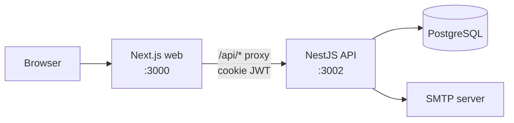
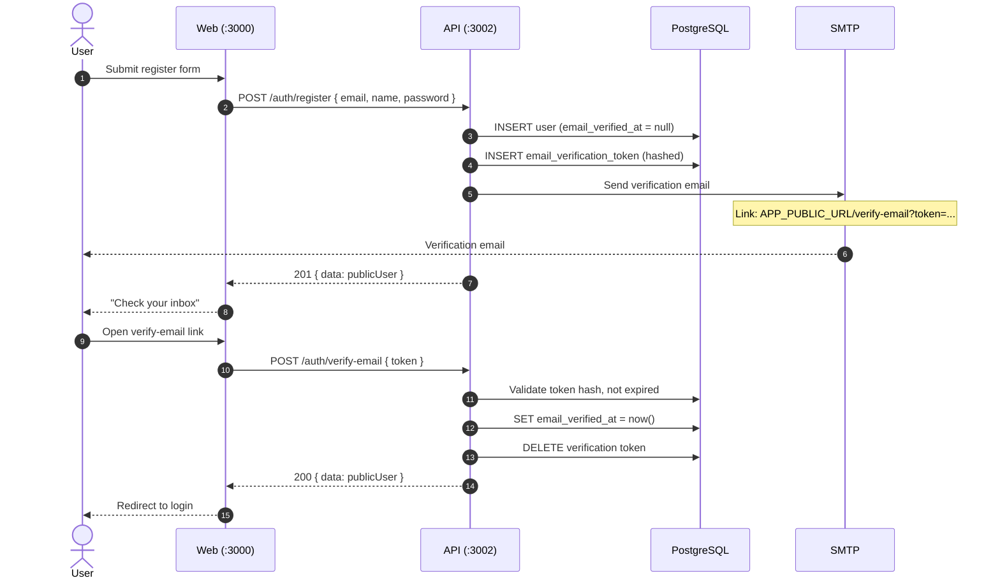
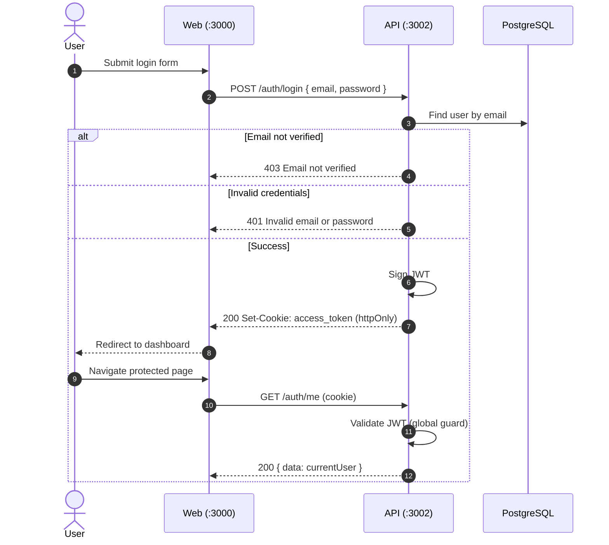
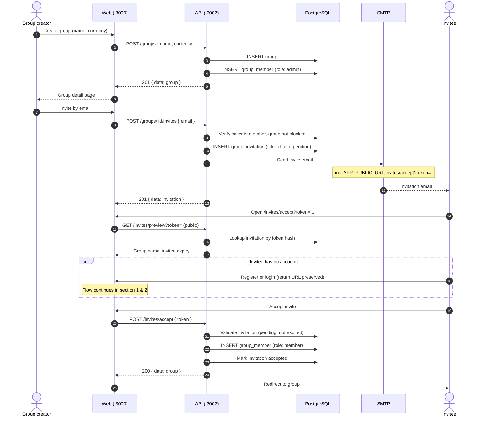
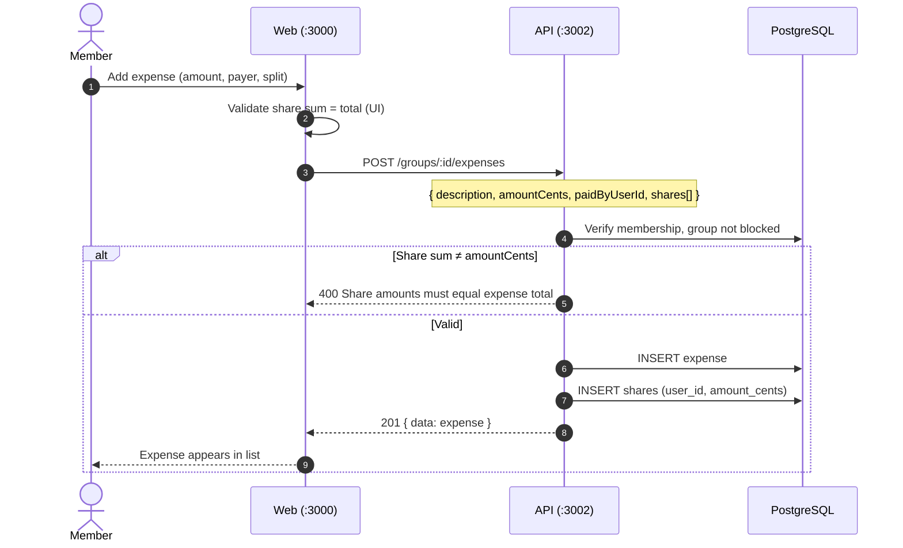
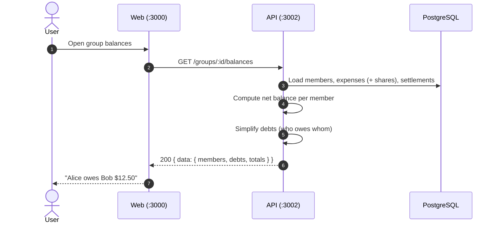
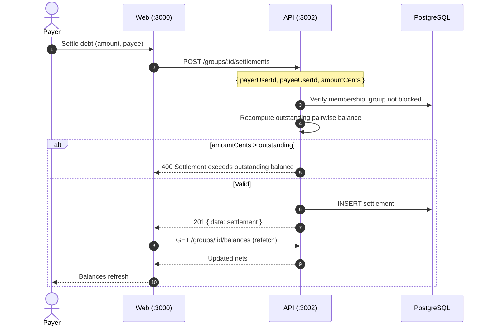
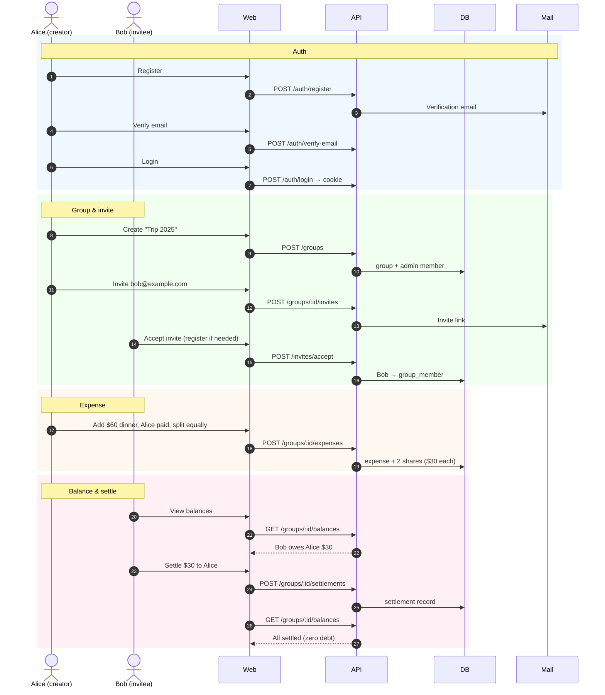
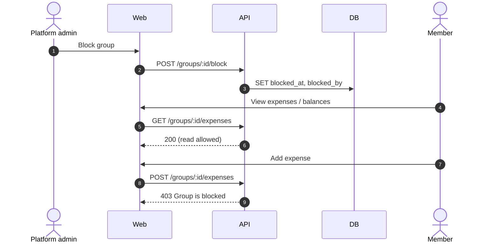
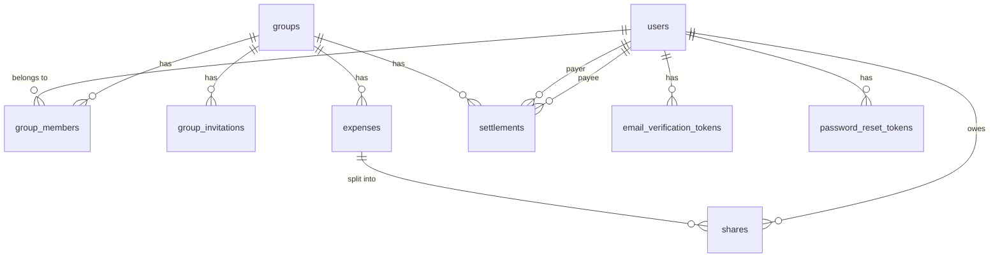

# Splitter — Application Flow

End-to-end sequence diagrams for the Splitter backend (`apps/api`). These show how the browser, web app, API, database, and mail service interact from first registration through settling a debt.

For setup instructions, see the [API README](../README.md).

---

## High-level architecture

---

## 1. Registration and email verification

New users must verify email before they can log in.

**Resend verification:** `POST /auth/resend-verification { email }` — same mail path, new token.

---

## 2. Login and session

Auth uses an httpOnly `access_token` cookie. Subsequent requests include it automatically when `credentials: 'include'`.

**Logout:** `POST /auth/logout` clears the cookie.

**Forgot password:** `POST /auth/forgot-password` → email with reset link → `POST /auth/reset-password { token, password }`.

---

## 3. Create group and invite members

Any authenticated user can create a group. Any group member can send invites.

---

## 4. Add expense and split shares

Expenses store an total in **integer cents**. Shares must sum exactly to `amountCents`.

**Equal split:** API applies largest-remainder rounding (e.g. $100 ÷ 3 → 3334, 3333, 3333 cents).

**Edit / delete:** Group admin only — `PATCH` / `DELETE /groups/:id/expenses/:expenseId`. Soft-delete keeps audit trail.

---

## 5. View balances (computed at read time)

Balances are **not stored** in a ledger table. They are derived from non-deleted expenses minus settlements.

**Global balances page:** Web loads accessible groups, then fetches per-group balances.

---

## 6. Record settlement

A settlement records that one member paid another, reducing outstanding debt.

**Settlement history:** `GET /groups/:id/settlements` (per group) or `GET /settlements` (all groups, paginated).

---

## 7. End-to-end happy path

Combined flow from new user to settled group — the primary demo script.

---

## 8. Blocked group (read-only)

Platform admins can block a group. Members retain read access; mutations return **403**.

---

## Entity relationships (reference)

---

## Key invariants

| Rule                                 | Enforcement                  |
| ------------------------------------ | ---------------------------- |
| Share sum = expense total            | 400 on mismatch              |
| Settlement ≤ outstanding debt        | 400 on exceed                |
| Verified email required to login     | 403 until verified           |
| Invite tokens stored as SHA-256 hash | Raw token only in email      |
| Blocked group = no mutations         | 403 on POST/PATCH/DELETE     |
| Money in integer cents               | Never use floats for amounts |

See [docs/architecture.md](../../../docs/architecture.md) for full domain rules.
