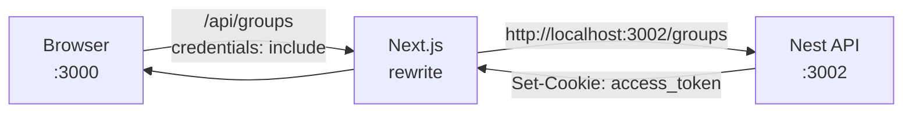

# Splitter Web (`apps/web`)

Next.js 15 frontend for **Splitter** — expense sharing with groups, invites, balances, and settlements. Runs on **http://localhost:3000**.

The browser never calls the Nest API port directly. All API traffic goes to same-origin **`/api/*`**, which Next rewrites to **`apps/api`** on `:3002`.

---

## Prerequisites

| Requirement | Version                                                         |
| ----------- | --------------------------------------------------------------- |
| Node.js     | ≥ 20                                                            |
| pnpm        | 10.18.1 (see root `packageManager`)                             |
| Backend API | `apps/api` running on `:3002` (required for full functionality) |

Install dependencies once from the **monorepo root**:

```bash
pnpm install
```

> The web app depends on workspace packages (`@shared/api-client`, `@shared/ui`, `@shared/types`). Always install from the repo root — not inside `apps/web` alone.

---

## Quick start (4 steps)

Run from the **repository root** unless noted.

### 1. Start the backend

The frontend proxies to the API. Set up and run the backend first:

```bash
pnpm docker:db              # Postgres (if not already running)
pnpm migration:run:api      # first time only
pnpm seed:api               # optional demo data
pnpm dev:api                # http://localhost:3002
```

See **[apps/api/README.md](../api/README.md)** for full backend setup (`.env`, SMTP, database).

### 2. Configure environment

```bash
cp apps/web/.env.local.example apps/web/.env.local
```

Default values work for local development:

```env
NEXT_PUBLIC_API_URL=/api
API_URL=http://localhost:3002
```

### 3. Start the web dev server

```bash
pnpm dev:web
```

Open [http://localhost:3000](http://localhost:3000).

### 4. Log in with demo data (optional)

If you ran `pnpm seed:api`, use:

| Email              | Password      |
| ------------------ | ------------- |
| `staff@demo.local` | `password123` |
| `user@demo.local`  | `password123` |

---

## Environment variables

Copy from [`.env.local.example`](./.env.local.example).

| Variable              | Default                 | Scope            | Description                                                                                  |
| --------------------- | ----------------------- | ---------------- | -------------------------------------------------------------------------------------------- |
| `NEXT_PUBLIC_API_URL` | `/api`                  | Browser + server | Base path the **browser** uses for API calls. Keep as `/api` for same-origin proxying.       |
| `API_URL`             | `http://localhost:3002` | Server only      | Nest API origin used by **Next.js rewrites** (`next.config.ts`). Not exposed to the browser. |

### Local development (default)

```env
NEXT_PUBLIC_API_URL=/api
API_URL=http://localhost:3002
```

### Production / staging

Point `API_URL` at your deployed API origin. Keep `NEXT_PUBLIC_API_URL=/api` if the Next server still rewrites `/api/*` to the backend:

```env
NEXT_PUBLIC_API_URL=/api
API_URL=https://api.yourdomain.com
```

If the API is on a different public origin (cross-origin), you must also configure CORS and cookies on `apps/api` (`CORS_ORIGIN`, `COOKIE_SECURE`).

---

## How API proxying works



1. React code calls `@shared/api-client` with base URL `/api` (see `lib/api-base-url.ts`).
2. `next.config.ts` rewrites `/api/:path*` → `${API_URL}/:path*`.
3. Axios sends requests with `withCredentials: true` so the httpOnly `access_token` cookie is included.
4. On **401**, the client redirects to `/login?returnUrl=…` (see `lib/api.ts`).

**Rule:** Never hardcode `http://localhost:3002` in client components. Always use `/api`.

---

## Scripts

Run from **repo root** unless inside `apps/web`.

| Command              | Description                       |
| -------------------- | --------------------------------- |
| `pnpm dev:web`       | Dev server with Turbopack `:3000` |
| `pnpm build:web`     | Production build                  |
| `pnpm start:web`     | Serve production build `:3000`    |
| `pnpm typecheck:web` | TypeScript check                  |
| `pnpm lint`          | ESLint (all apps)                 |
| `pnpm test`          | Includes `apps/web/lib` tests     |

From `apps/web` directly:

```bash
pnpm dev
pnpm build
pnpm start
```

### Run frontend + backend together

```bash
# Terminal 1
pnpm dev:api

# Terminal 2
pnpm dev:web
```

Or start everything (includes gateway — not required for Splitter):

```bash
pnpm dev
```

For Splitter, **`pnpm dev:api` + `pnpm dev:web`** is enough.

---

## Project structure

```text
apps/web/
├── app/
│   ├── (app)/                  # Authenticated routes (sidebar shell)
│   │   ├── dashboard/
│   │   ├── groups/             # List + [id] detail, balances, expenses
│   │   ├── expenses/           # Cross-group expense list
│   │   ├── balances/
│   │   ├── settlements/
│   │   ├── friends/
│   │   ├── activity/
│   │   ├── account/
│   │   └── help/
│   ├── (auth)/                 # Login, register, verify, invites
│   │   ├── login/
│   │   ├── register/
│   │   ├── verify-email/
│   │   ├── verify-pending/
│   │   ├── forgot-password/
│   │   ├── reset-password/
│   │   └── invites/accept/
│   ├── ui/                     # Component gallery
│   ├── layout.tsx              # Root layout + providers
│   └── page.tsx                # Landing redirect
├── components/
│   ├── auth/                   # AuthProvider, useAuth
│   ├── providers/              # React Query + Redux + Auth
│   └── splitter/               # App shell, panels, expense editor, etc.
├── lib/
│   ├── api.ts                  # apiClient, authApi, splitterApi
│   ├── api-base-url.ts         # NEXT_PUBLIC_API_URL resolver
│   ├── store/                  # Redux (expense filter drafts)
│   ├── split.ts                # Client-side split math
│   ├── format-money.ts
│   └── return-url.ts           # Safe post-login redirects
├── styles/
│   ├── globals.css             # Tailwind + shared theme
│   ├── base.css
│   └── splitter-theme.css      # Splitter-specific tokens
├── middleware.ts               # Auth gate for protected routes
├── next.config.ts              # /api rewrites + security headers
├── .env.local.example
└── README.md                   # This file
```

---

## Routes

| Path                                  | Auth      | Description                                 |
| ------------------------------------- | --------- | ------------------------------------------- |
| `/`                                   | —         | Redirects to dashboard or login             |
| `/login`, `/register`                 | Public    | Auth forms (redirect if already logged in)  |
| `/verify-email`, `/verify-pending`    | Public    | Email verification flow                     |
| `/forgot-password`, `/reset-password` | Public    | Password reset                              |
| `/invites/accept`                     | Public    | Accept group invite (register/login → join) |
| `/dashboard`                          | Protected | Overview                                    |
| `/groups`                             | Protected | Group list + create                         |
| `/groups/[id]`                        | Protected | Group detail (expenses, members)            |
| `/groups/[id]/balances`               | Protected | Group balances + settle                     |
| `/groups/[id]/expenses/[expenseId]`   | Protected | Expense detail                              |
| `/expenses`                           | Protected | All expenses across groups                  |
| `/balances`                           | Protected | Balances across groups                      |
| `/settlements`                        | Protected | Settlement history                          |
| `/friends`                            | Protected | People you've split with                    |
| `/activity`                           | Protected | Recent activity                             |
| `/account`                            | Protected | Profile / settings                          |
| `/help`                               | Protected | Help page                                   |
| `/ui`                                 | Public    | Shared UI component gallery                 |

Protected routes are enforced in `middleware.ts` by checking the `access_token` cookie.

---

## State management

| Layer              | Used for                                                       | Location                               |
| ------------------ | -------------------------------------------------------------- | -------------------------------------- |
| **TanStack Query** | Server data — groups, expenses, balances, settlements, invites | Page components + `@shared/api-client` |
| **Redux Toolkit**  | Client-only UI drafts — expense list filters                   | `lib/store/`                           |
| **AuthProvider**   | Current user session                                           | `components/auth/auth-provider.tsx`    |

Fetch pattern:

```tsx
import { useQuery } from '@tanstack/react-query';
import { splitterApi } from '@/lib/api';

const { data, isLoading } = useQuery({
  queryKey: ['groups'],
  queryFn: () => splitterApi.listGroups(),
});
```

---

## Styling & UI kit

| Piece             | Location                                                   |
| ----------------- | ---------------------------------------------------------- |
| CSS entry         | `styles/globals.css` → Tailwind 4 + `@shared/ui/theme.css` |
| Splitter theme    | `styles/splitter-theme.css`                                |
| Shared components | `@shared/ui/components`                                    |
| Component gallery | [http://localhost:3000/ui](http://localhost:3000/ui)       |

Prefer shared UI primitives and theme tokens over one-off colors. Full guide: [docs/frontend.md](../../docs/frontend.md).

---

## Verify setup

1. **API reachable via proxy**

   ```bash
   curl -s http://localhost:3000/api/ready
   ```

   Should return a JSON health response from the backend.

2. **Login flow**

   Open [http://localhost:3000/login](http://localhost:3000/login), sign in with a seeded user, and confirm redirect to `/dashboard`.

3. **React Query Devtools**

   Bottom-left icon in dev mode — inspect cached queries after navigating groups/expenses.

---

## Troubleshooting

### Blank page or API errors in network tab

- Confirm `pnpm dev:api` is running on `:3002`.
- Check `apps/web/.env.local` — `API_URL` must match the API origin.
- Restart `pnpm dev:web` after changing `.env.local`.

### 401 on every request / instant redirect to login

- Log in again — JWT may have expired (`AUTH_JWT_TOKEN_EXPIRES_IN` on the API).
- Ensure cookies are sent: API client uses `withCredentials: true` (already configured).
- Check API `CORS_ORIGIN` includes `http://localhost:3000`.

### `/api/*` returns 404 or connection refused

- `API_URL` in `.env.local` is wrong or the API is not running.
- Test directly: `curl http://localhost:3002/ready`.

### Middleware redirect loop

- Clear site cookies for `localhost:3000` and log in fresh.
- Check that `access_token` cookie is set after `POST /auth/login` (browser DevTools → Application → Cookies).

### Styles missing or `@shared/ui` import errors

- Run `pnpm install` from repo root (builds `@shared/env` and `@shared/http` via `postinstall`).
- `@shared/ui` is transpiled via `transpilePackages` in `next.config.ts`.

### Turbopack / port conflicts

- Port 3000 in use: `pnpm dev:web -- --port 3001` (update `CORS_ORIGIN` on API if needed).
- Build without Turbopack: edit `package.json` dev script or run `next dev --port 3000`.

### Email verification blocks login

- Complete verification via the link sent on register, or use seeded users (`pnpm seed:api`) which are pre-verified.

---

## Development conventions

1. **No Route Handlers for product CRUD** — all domain logic lives in `apps/api`.
2. **Browser calls `/api` only** — never `localhost:3002` from client code.
3. **Use `@shared/api-client`** — add new endpoints there + `libs/shared-types` first.
4. **Protected pages** go under `app/(app)/`; auth pages under `app/(auth)/`.
5. **Add new protected routes** to `PROTECTED_PREFIXES` and `middleware.ts` matcher.

---

## Related documentation

- [apps/api/README.md](../api/README.md) — backend setup (database, SMTP, migrations)
- [apps/api/docs/APPLICATION_FLOW.md](../api/docs/APPLICATION_FLOW.md) — end-to-end sequence diagrams
- [docs/architecture.md](../../docs/architecture.md) — system overview
- [docs/frontend.md](../../docs/frontend.md) — UI kit and styling guide
- [docs/stack.md](../../docs/stack.md) — monorepo commands
