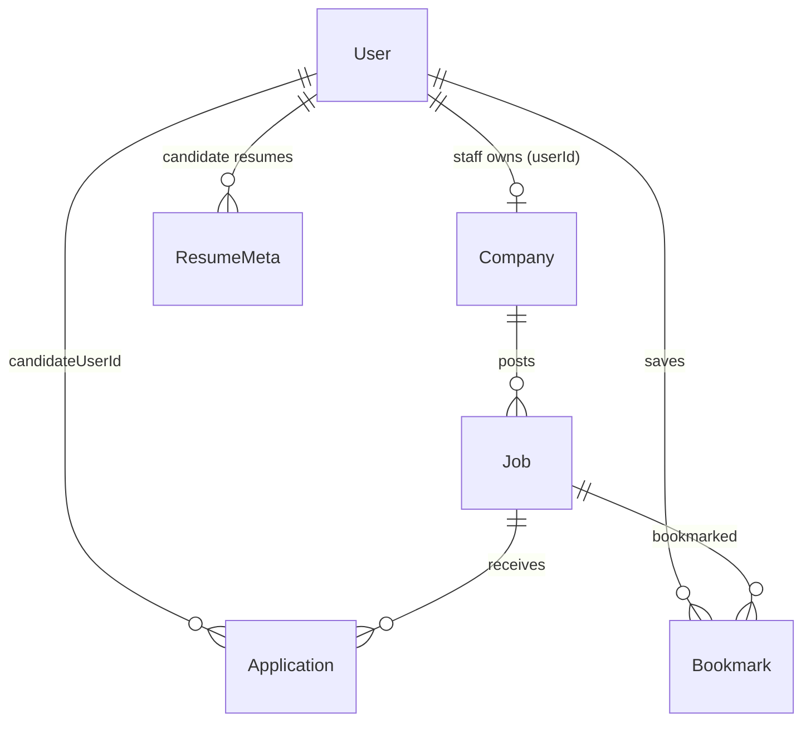

# Architecture — Job Portal

## Request flow (BFF)

```text
Browser → web :3000
            /api/*  (Next rewrite)
              ↓
         gateway :3001   cookie JWT, /auth/*, POST /admin/staff
              ↓
         api :3002       domain modules (companies, jobs, applications, …)
              ↓
         Postgres :5434  (shared DATABASE_URL; users table owned by gateway)
```

### Why the split

| Layer              | Owns                                                                                            | Why                                                                               |
| ------------------ | ----------------------------------------------------------------------------------------------- | --------------------------------------------------------------------------------- |
| `apps/web`         | Pages, TanStack Query lists/mutations, Zustand session UI                                       | Browser never talks to `:3002` directly                                           |
| `apps/api-gateway` | Users, bcrypt passwords, httpOnly cookie JWT, CORS, proxy hop, `mustChangePassword` enforcement | Auth boundary stays out of the domain API                                         |
| `apps/api`         | Company / Job / Application / Bookmark / ResumeMeta + domain invariants                         | Domain rules without cookie/session concerns                                      |
| Postgres           | Schema + unique constraints                                                                     | Shared DB; gateway owns `users`, api owns domain tables keyed by `userId` strings |

Cookie → Bearer hop: `apps/api-gateway/src/common/proxy-hop.ts` strips the browser cookie and forwards `Authorization: Bearer` so the domain API never sees cookies.

## Entity list and relationships



| Entity        | Service | Notes                                                          |
| ------------- | ------- | -------------------------------------------------------------- |
| `User`        | gateway | Roles `admin` \| `staff` \| `user`; `mustChangePassword`       |
| `Company`     | api     | One per staff `userId`; `suspended` flag                       |
| `Job`         | api     | Soft-delete (`deletedAt`); status `open` \| `closed`           |
| `Application` | api     | Unique `(jobId, candidateUserId)`; resume URL snapshot         |
| `Bookmark`    | api     | Unique `(userId, jobId)`                                       |
| `ResumeMeta`  | api     | Cloudinary `public_id` optional; URL stored for apply snapshot |

Gateway users are **not** FK-constrained from api tables (cross-service trust boundary — see below).

## Design decisions

### Native Postgres enums

Job status, application status, and user role use TypeORM `enum` columns mapped to Postgres enum types. Invalid values fail at the DB/DTO boundary instead of drifting as free-form strings.

### Cross-service `userId` trust boundary

`apps/api` never recreates users. Controllers take `userId` / role from the JWT validated by the domain `JwtAuthGuard`. The gateway is the source of truth for identity; domain tables store opaque UUID strings. Seed scripts resolve staff/candidate IDs by email from the shared `users` table.

### Snapshot pattern for resumes

On `POST /jobs/:jobId/applications`, if `resumeMetaId` is provided, the service copies `ResumeMeta.url` onto `Application.resumeUrl` at apply time (`applications.service.ts`). Later edits or deletes of `ResumeMeta` do not rewrite historical applications.

### Ownership-in-service pattern

Ownership checks live in services (`findOwnedByUser`, `findByUserIdOrThrow`, `findOwnedOrThrow`), not only in controllers. Controllers pass `@CurrentUser()`; services throw `ForbiddenException` / `NotFoundException` so every code path (including internal calls) enforces the same rule.

### Close-job transaction

`JobsService.runCloseTransaction` updates the job to `closed` and bulk-rejects non-terminal applications in one TypeORM transaction (`rejectOpenForJob`). Staff `POST /jobs/:id/close` and admin force-close / company suspend all reuse this path.

### Cloudinary signed-upload flow

1. Authenticated candidate calls `POST /resumes/upload-signature`.
2. API returns `{ signature, timestamp, apiKey, cloudName, folder }` — secret never leaves the server.
3. Browser uploads the file **directly** to Cloudinary (`resource_type=raw`).
4. Browser `POST /resumes` with `url` + optional `cloudinaryPublicId`.
5. On resume delete, API destroys the Cloudinary asset when `public_id` is present.

Details: [job-portal-cloudinary-resume-upload-report.md](./job-portal-cloudinary-resume-upload-report.md).

### `mustChangePassword` enforcement

- Column on gateway `users` (`must_change_password`, default `false`).
- `POST /admin/staff` (gateway) creates staff with a cryptographically random temp password (bcrypt cost 12); plaintext returned **once** in the response only.
- `POST /auth/change-password` verifies `currentPassword`, hashes `newPassword`, sets `mustChangePassword: false`.
- Login and `GET /auth/me` include `mustChangePassword`.
- Express middleware in `apps/api-gateway/src/main.ts` (`createMustChangePasswordMiddleware`) runs **before** the domain proxy. When the flag is true, every route except `POST /auth/change-password`, `GET /auth/me`, and `POST /auth/logout` returns **403** with message `must change password before continuing`. This covers both Nest gateway routes and proxied domain routes in one place (Nest `APP_GUARD` alone would miss the proxy).

### Company suspend → public hide + force-close

`CompaniesService.suspend` sets `suspended = true`, then force-closes every open job. Public job list/detail (`findAllPublic` / `findOnePublic` / `findOpenOrThrow`) exclude suspended companies so listings vanish immediately.

### Companies ↔ Jobs circular dependency

`CompaniesModule` imports `forwardRef(() => JobsModule)` and Jobs imports Companies (and Applications) the same way — required because suspend closes jobs while job create needs the company owner.

## Who owns what (frontend data)

| Concern                  | Library                                       |
| ------------------------ | --------------------------------------------- |
| Server lists / mutations | TanStack Query + Axios (`apps/web/lib/api/*`) |
| Auth session UI state    | Zustand (`apps/web/lib/store/auth-store.ts`)  |
| Route gates              | Next middleware + `evaluateRouteAccess`       |

**Frontend stack deviation (deliberate):** The shared project brief and grading bar call for TanStack Query for server data and Redux Toolkit (RTK) for drafts/filters. This Job Portal frontend instead uses **TanStack Query + Zustand + Axios** for server lists/mutations and client session/UI state. That was an explicit team choice during frontend scaffolding (RTK packages were removed and Zustand/Axios installed), not an accidental omission — no `@reduxjs/toolkit` / `react-redux` dependency remains in `apps/web/package.json`. Reviewers should treat this as a documented deviation from the starter brief, not a Must-tier regression to “fix back to RTK.”

## What's intentionally out of scope

Stretch items skipped by choice:

- **Email notifications** on application status change
- **Full-text search / Elasticsearch** (list filters use `ILIKE` on title/location only)
- Extra Nest microservice beyond gateway + api

## Demo script (≤5 minutes) — for PR body

1. **Role tour** — Login `admin@demo.local` / `password123` → admin companies. Logout. Login `staff@demo.local` → staff dashboard. Logout. Login `user@demo.local` → jobs list.
2. **Company posts a job** — As staff: `/company/jobs/new` → create an OPEN job; confirm it appears on `/jobs`.
3. **Candidate applies** — As user: open the job → apply with cover letter (optional resume). Confirm under `/my/applications`.
4. **Double-apply rejected (409)** — Apply again to the same job → expect 409 Conflict.
5. **Status transitions** — As staff: `/company/applications` → move `submitted → reviewing`. Try illegal jump `submitted → hired` (or `reviewing → submitted`) → expect 400. Then `reviewing → hired` (or reject).
6. **Close-job transaction** — As staff: close the job → status `closed`; any remaining open applications become `rejected` in the same transaction.
7. **Admin suspend** — As admin: suspend that staff company → company's jobs vanish from public `/jobs`; open jobs force-closed to `closed`.
8. **Staff provisioning + forced password change** — As admin: `/admin/staff/new` → create staff (email + name) → copy one-time `tempPassword`. Logout. Login as new staff with temp password → redirected to `/change-password`. Call any other API while flagged → 403. Change password → land on staff home; flag cleared.

## Folders (starter map)

| Path                             | Role                          |
| -------------------------------- | ----------------------------- |
| `apps/web`                       | Next UI (`:3000`)             |
| `apps/api-gateway`               | Auth + BFF (`:3001`)          |
| `apps/api`                       | Domain Nest API (`:3002`)     |
| `libs/*`                         | Shared packages (`@shared/*`) |
| `docker/`                        | Compose Postgres              |
| `docs/projects/01-job-portal.md` | Capstone brief                |

## Conventions

- Responses: `{ data: T }` via `@shared/http` envelope
- Errors: `{ statusCode, error, message, details? }`
- Browser auth: httpOnly `access_token` cookie from gateway
- Domain auth: Bearer JWT
- Migrations: gateway users via `pnpm migration:run`; domain via `pnpm migration:run:api`
- Seeds: `pnpm seed` then `pnpm seed:api`
