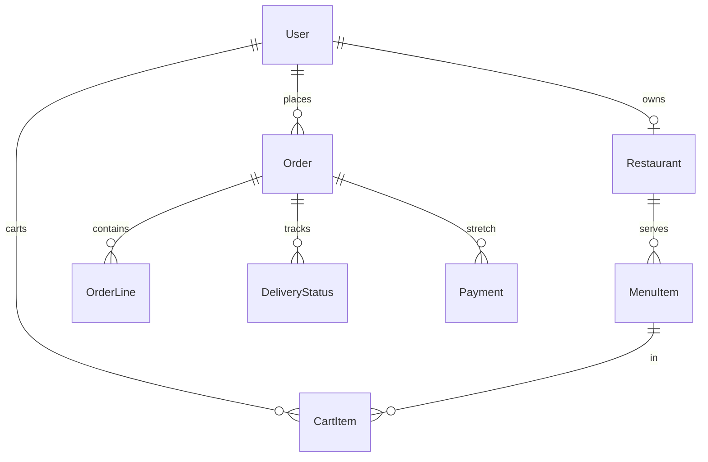

# Architecture

TastyGo food delivery — Must work lives in `apps/api` + `apps/web`. Auth stays on `apps/api-gateway`.

## Request flow

```text
Browser → web :3000
            /api/*  (Next rewrite)
              ↓
         gateway :3001   cookie JWT, /auth/*
              ↓
         api :3002       restaurants, menu, cart, orders
              ↓
         Postgres :5434
```

## Who owns what

| Layer          | Owns                        | Does not own       |
| -------------- | --------------------------- | ------------------ |
| Next UI        | Pages, layout, forms        | Product CRUD APIs  |
| TanStack Query | Server lists and mutations  | Form drafts        |
| Redux Toolkit  | Drafts, filters, selection  | Nest entity arrays |
| API gateway    | Login cookies, CORS, proxy  | Domain tables      |
| Domain API     | Entities, rules, migrations | Browser cookies    |
| Postgres       | Data + constraints          | —                  |

## Folders

| Path               | Role                                                                                  |
| ------------------ | ------------------------------------------------------------------------------------- |
| `apps/web`         | Next UI (`:3000`) — `@app/web`                                                        |
| `apps/api-gateway` | Auth + BFF (`:3001`) — `@app/api-gateway`                                             |
| `apps/api`         | Domain Nest API (`:3002`) — `@app/api` (**your Must work**)                           |
| `libs/ui`          | Shared UI kit + theme — prefer `@shared/ui/components` ([frontend.md](./frontend.md)) |
| `libs/*`           | Other shared packages (`@shared/*`) — folder subpaths when folders exist              |
| `docker/`          | Compose: Postgres only · deploy stubs: `Dockerfile.{gateway,api,web}`                 |
| `docs/projects/`   | Capstone briefs                                                                       |

Optional Stretch microservice: [adding-a-service.md](./adding-a-service.md).

## Conventions

- Responses: `{ data: T }` — `@shared/http` envelope (`@shared/http/filters`, `@shared/http/interceptors`) + `@shared/api-client`
- Errors: `{ statusCode, error, message, details? }` via shared `AllExceptionsFilter`
- Browser auth: httpOnly cookie from the gateway (`@Public()` for anonymous routes)
- Domain API auth: Bearer JWT (gateway forwards the cookie as `Authorization`)
- Shared auth: `@shared/http/auth` (`JwtAuthGuard`, `RolesGuard`, `@Public` / `@Roles`) — apps re-export via `common/auth`
- Cookie→Bearer hop: `apps/api-gateway/src/common/proxy-hop.ts` (unit-tested)
- OpenAPI: `/docs` on gateway (cookie) and domain API (Bearer) via `@shared/http/swagger` — local/dev only
- UI: `@shared/ui/components` + `@shared/ui/theme.css` — [frontend.md](./frontend.md); gallery at `/ui`
- Imports: prefer folder subpaths (`@shared/pkg/folder`); Nest apps use folder `index.ts` barrels (`./config`, `./common/auth`, `./modules/auth`); flat packages stay on the package root until a folder exists
- Entities: `*.entity.ts` under `apps/api/src/modules/`
- Users migration/seed: gateway · domain migrations: `apps/api`
- Smoke: `pnpm doctor` (per-hop) or `http://localhost:3000/api/ready`
- Scripts: see root [README](../README.md) (`pnpm dev`, `pnpm doctor`, `pnpm dev:api`, …)

## Domain notes

Food delivery: one restaurant per cart; place order creates order lines and clears the cart atomically; status moves one-way (`placed → preparing → out_for_delivery → delivered | cancelled`). Soft-deleted menu items are hidden from the public menu.



| Invariant | Enforcement |
| --- | --- |
| One restaurant per cart | `CartService.addItem` + unique `(userId, menuItemId)` |
| Place order is atomic | Transaction: lock cart rows → Order + lines + `placed` status → clear cart |
| Status is one-way | `canMoveStatus` inside a locked `updateStatus` transaction |
| Soft-deleted dishes stay off the public menu | `MenuItemsService.list` / `getById` |

### Must vs Stretch

| Tier | What reviewers should see without extra env |
| --- | --- |
| **Must** | Browse restaurants/menus, single-restaurant cart, place order (`placed`), staff status workflow, order list/filter, soft-delete menu |
| **Should** | Dashboards, delivery timeline, ETA, cuisine/search |
| **Stretch** | Razorpay sandbox (`RAZORPAY_*`), Cloudinary uploads (`CLOUDINARY_*`). Optional extra Nest app: [adding-a-service.md](./adding-a-service.md) |

Payment and image hosting are **not** gates on Must resources. An unpaid `placed` order is visible to the customer and the restaurant kitchen. Cloudinary is unused unless keys are set — seed/emoji images still render.

## Cold start (reviewers)

```bash
pnpm install
cp .env.example .env
cp apps/api-gateway/.env.example apps/api-gateway/.env
cp apps/api/.env.example apps/api/.env
cp apps/web/.env.local.example apps/web/.env.local

pnpm docker:db
pnpm migration:run
pnpm migration:run:api
pnpm seed:all
pnpm dev
```

`NEXT_PUBLIC_USE_MOCK` stays `false`. Do not set Razorpay or Cloudinary keys for the Must demo.

After `pnpm seed:all`:

| Role | Email | Password | First screen |
| --- | --- | --- | --- |
| customer | `customer@tastygo.com` | `User@1234` | `/restaurants` · cart already has 6 Hasty Tasty items |
| staff | `hasty@tastygo.com` | `Hasty@12` | `/restaurant/dashboard` · incoming `placed` order |
| admin | `admin@tastygo.com` | `Admin@123` | `/admin/restaurants` |

Seeded domain data: 5 restaurants, 18 menu items, 6 cart lines, 3 orders (`placed` unpaid, `preparing` paid, `delivered` paid).

## Demo script

1. **Roles (30s):** Sign in as `hasty@tastygo.com` → `/restaurant/menu`. Sign out. Sign in as `customer@tastygo.com` → `/restaurants`.
2. **Must happy path (2m):** Customer cart is pre-filled (or add from Hasty Tasty) → Place order (no payment required) → order appears on `/orders` as `placed`. Switch to Hasty staff → `/restaurant/dashboard` shows the unpaid placed order → advance `placed → preparing → out_for_delivery → delivered`.
3. **Invariant (30s):** From the customer, open Burger Barn and add an item → API returns **400** (mixed-restaurant cart).
4. **Lists (1m):** `/orders` filter Active / Delivered. On the menu editor, delete a dish → it disappears from the public restaurant menu.
5. **Stretch (optional):** On an unpaid order, **Pay now (optional · Stretch)** uses mock checkout unless `RAZORPAY_*` is set. Cloudinary upload on the menu editor is the same — skip it if keys are unset.
