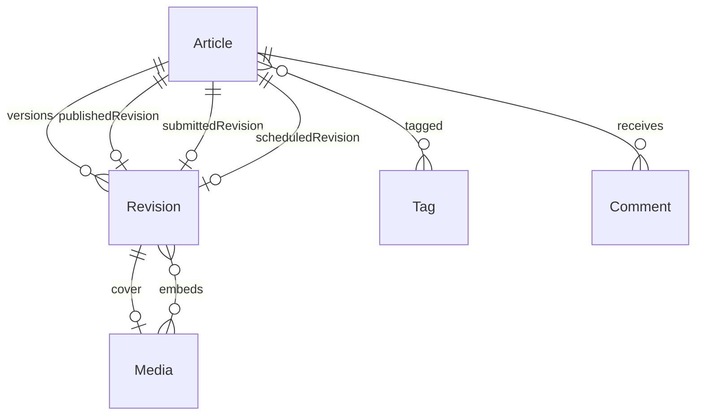

# Architecture

## Request flow

```text
Browser → web :3000
            /api/*  (Next rewrite)
              ↓
         gateway :3001   cookie JWT, /auth/*
              ↓
         api :3002       your domain modules
              ↓
         Postgres :5434
```

Browser calls same-origin `/api/*` with the httpOnly `access_token` cookie (`withCredentials`). Next rewrites to `API_GATEWAY_URL` (default `:3001`) and strips the `/api` prefix.

Gateway-owned paths stay on the gateway: `/auth/*`, `/admin/*`, `/health`, `/docs`. Everything else is proxied to the domain API (`:3002`). The hop copies the cookie into `Authorization: Bearer` and strips `Cookie` (`apps/api-gateway/src/common/proxy-hop.ts`).

The domain API has no User table and no cookie parser. Global `JwtAuthGuard` + `RolesGuard` validate the Bearer JWT, then reload `users.is_active` from the shared database so a deactivated account cannot keep calling `:3002`. The process binds to `LISTEN_HOST` (default `127.0.0.1`). Public blog slug pages also fetch the gateway from the Next server for RSC + metadata.

## Who owns what

| Layer          | Owns                        | Does not own       |
| -------------- | --------------------------- | ------------------ |
| Next UI        | Pages, layout, forms        | Product CRUD APIs  |
| TanStack Query | Server lists and mutations  | Form drafts        |
| Redux Toolkit  | Drafts, filters, selection  | Nest entity arrays |
| API gateway    | Login cookies, CORS, proxy  | Domain tables      |
| Domain API     | Entities, rules, migrations | Browser cookies    |
| Postgres       | Data + constraints          | —                  |

In this CMS: TanStack Query owns auth/lists/mutations. The TipTap document and list filters live in component state and URL params. Redux Toolkit is not wired — that is intentional, not an unfinished store. Gateway owns `users` and editor-admin APIs. Domain API owns articles, revisions, tags, comments, media. Cloudinary stores file bytes plus width/height/duration when the upload response includes them.

## Folders

| Path               | Role                                                                                  |
| ------------------ | ------------------------------------------------------------------------------------- |
| `apps/web`         | Next UI (`:3000`) — `@app/web`                                                        |
| `apps/api-gateway` | Auth + BFF (`:3001`) — `@app/api-gateway`                                             |
| `apps/api`         | Domain Nest API (`:3002`) — `@app/api`                                                |
| `libs/ui`          | Shared UI kit + theme — prefer `@shared/ui/components` ([frontend.md](./frontend.md)) |
| `libs/*`           | Other shared packages (`@shared/*`) — folder subpaths when folders exist              |
| `docker/`          | Compose: Postgres only · deploy stubs: `Dockerfile.{gateway,api,web}`                 |
| `docs/projects/`   | Capstone briefs                                                                       |

Optional Stretch microservice: [adding-a-service.md](./adding-a-service.md).

Present libs: `@shared/http`, `@shared/env`, `@shared/types`, `@shared/database`, `@shared/utils`, `@shared/config`. There is no `@shared/ui` or `@shared/api-client` package; web uses `apps/web/components/ui` and `apps/web/lib/api`. Domain seed: `apps/api/src/database/seed.ts` (`pnpm seed:api`). Gateway seed: `apps/api-gateway/src/database/seed.ts` (`pnpm seed`).

## Conventions

- Responses: `{ data: T }` — `@shared/http` envelope (`@shared/http/filters`, `@shared/http/interceptors`). List endpoints keep pagination beside `data` (`{ data: items, page, limit, total, totalPages }`) rather than the starter `{ data: { items, total, page, limit } }` — the web client only unwraps `{ data }` when that is the sole key.
- TanStack Query owns auth, lists, and mutations. Blog/studio filters live in URL params or component state.
- Errors: `{ statusCode, error, message, details? }` via shared `AllExceptionsFilter`. `DELETE /comments/:id` uses the same `{ data }` envelope (`{ data: { message } }`). `DELETE /tags/:id` is 204 with no body.
- Browser auth: httpOnly cookie from the gateway (`@Public()` for anonymous routes)
- Domain API auth: Bearer JWT (gateway forwards the cookie as `Authorization`)
- Shared auth: `@shared/http/auth` (`JwtAuthGuard`, `RolesGuard`, `@Public` / `@Roles`) — apps re-export via `common/auth`
- Cookie→Bearer hop: `apps/api-gateway/src/common/proxy-hop.ts` (unit-tested)
- OpenAPI: `/docs` on gateway (cookie) and domain API (Bearer) via `@shared/http/swagger` — local/dev only
- UI: `@shared/ui/components` + `@shared/ui/theme.css` — [frontend.md](./frontend.md); gallery at `/ui`
- Imports: prefer folder subpaths (`@shared/pkg/folder`); Nest apps use folder `index.ts` barrels (`./config`, `./common/auth`, `./modules/auth`); flat packages stay on the package root until a folder exists
- Entities: `*.entity.ts` under `apps/api/src/modules/`
- Users migration/seed: gateway · domain migrations: `apps/api`
- Smoke: `pnpm doctor` (per-hop) or `http://localhost:3000/api/ready`
- Scripts: see root [README](../README.md) (`pnpm dev`, `pnpm doctor`, `pnpm dev:api`, …)

Cookie name is `access_token`. Persistence is TypeORM (`synchronize: false`), not Prisma. Gateway migrations use the default ledger; domain migrations use `migrations_api`. Web Axios uses `withCredentials` against `/api` (local client, not `@shared/api-client`). UI is local components, not `@shared/ui`.

## Domain notes

CMS / blogging. Auth `User` lives on the **gateway** only. Domain rows store opaque UUIDs (`authorId`, `createdBy`, `userId`, `uploaderId`) — `apps/api` does not recreate users.

### Roles

| Domain | Gateway | Can                                                              |
| ------ | ------- | ---------------------------------------------------------------- |
| Author | `user`  | Own drafts and revisions; submit for review; cannot publish      |
| Editor | `staff` | Tags, review queue, publish **another person's** article         |
| Admin  | `admin` | Moderate articles, tags, comments, editors; may publish own work |

`apps/web/middleware.ts` redirects unauthenticated `/studio`, `/editor`, and `/admin` traffic to login and wrong-role traffic to that role’s dashboard, using the gateway `GET /auth/me` cookie. Client guards still render Access Denied if needed. The API enforces every mutation. Registration always creates `user`.

### ERD

Gateway `User` is not a domain table.



Join tables: `article_tags`, `revision_media`. Publication is **not** a status enum.

Entities: `Article`, `Revision` (insert-only JSONB `content`, `coverMediaId`), `Tag` (`normalized_name` unique), `ArticleTag`, `Comment` (soft-delete), `Media` (Cloudinary metadata), `RevisionMedia`.

### Pointers on `articles`

| Pair                                  | Meaning                               |
| ------------------------------------- | ------------------------------------- |
| `publishedRevisionId` + `publishedAt` | Live on `/blog`                       |
| `submittedRevisionId` + `submittedAt` | In the editor review queue            |
| `scheduledRevisionId` + `scheduledAt` | Stretch: publish later; still private |

The three pairs are independent. Each pair is both-null or both-set (CHECK). Only the published pair makes an article public.

Saving body content **inserts** a revision. Optional title, slug, and tags on `POST /articles/:id/revisions` commit in that same transaction. `PATCH /articles/:id` still updates metadata only (SEO fields). `POST /articles/:id/submit-review` points review at the latest revision and does not publish. `POST /articles/:id/publish` `{ revisionId }` sets the published pair in one transaction (clears schedule; clears submit when that review is done). Authors get 403. An Editor cannot publish an article they authored.

Scheduled publish reuses that same `publishRevision` path. `ArticleScheduleTicker` is an in-process `setInterval` every 30s in the domain API process (not OS cron). Until due, the article stays private. Publish Later sends a local-offset ISO timestamp.

Media: browser `POST /media` → gateway proxy → `StorageService` → Cloudinary; Postgres stores public id, URL, type, `uploaderId`.

### Hard invariants

- Public list and `/blog/[slug]` require `publishedRevisionId IS NOT NULL` and `deletedAt IS NULL`. Unpublished, scheduled-only, or trashed slugs are **404**, not 403. Body is the published revision, not latest.
- `POST /articles/:id/publish` sets `publishedRevisionId` + `publishedAt` in a transaction. Authors get **403**. An editor cannot publish an article they authored.
- Comments attach only to published articles (else 404).
- `UNIQUE(articles.slug)`; tags uniquely keyed by lowercase `normalized_name`; `UNIQUE(article_tags.articleId, tagId)`. Tags on a published article cannot be renamed or deleted (409).
- Soft-delete on articles and comments; public queries exclude `deletedAt`. Studio Trash lists deleted articles; no restore API.
- Revision `content` must be a non-empty JSON array. Revisions have no update path.

### Web surfaces

| Route                                    | Auth | Who                 |
| ---------------------------------------- | ---- | ------------------- |
| `/blog`, `/blog/[slug]`                  | No   | Readers             |
| `/studio`, `/studio/new`, `/studio/[id]` | Yes  | Author + editor     |
| `/editor`                                | Yes  | Editor review queue |
| `/editor/tags`                           | Yes  | Editor tag catalog  |
| `/admin/*`                               | Yes  | Admin               |

Also: `/` public home; `/login` `/register`; `/write` redirects by role; `/studio/[id]/preview`; `/editor/articles/[id]` publish/schedule; `/admin/articles`, `/admin/comments`, `/admin/tags`, `/admin/editors`.

Public APIs: `GET /articles/public`, `GET /articles/public/:slug`, public comments, `/health` `/ready`. Studio APIs are cookie-proxied Bearer. Tag filter on `/blog` uses `?tag=` against public articles (`GET /tags` is authenticated). The public tag parameter is lowercased before compare, so seeded display names such as `Generative AI` still match.

## Demo script

Demo logins (after `pnpm seed` then `pnpm seed:api`): `user@demo.local` / `staff@demo.local` / `admin@demo.local` — password `password123`. `/blog` should show the two published Generative AI articles. Seeded unpublished slug: `designing-empty-states-ai-copilots`.

### 1. Roles — Author vs Editor vs Public

- Log in as **author**. Open `/studio`. Show drafts/revisions. There is **Request Review**, not Publish.
- Log out. Open `/blog` — published articles are visible without a session.
- Log in as **editor**. Open `/editor` — review queue (submitted, not yet the live revision).

### 2. Happy Path — Create Revision → Review → Publish

- As **author**, `/studio/new`: title, body, save draft (creates article + revision 1).
- **Request Review**.
- As **editor**, open it from `/editor`. Select that revision. **Publish** (immediate). Do not substitute Publish Later for this step.
- Log out. The article is on `/blog` and `/blog/[slug]`.

Optional stretch (after immediate publish): editor **Publish Later**; stays off `/blog` until `scheduledAt`. Needs `pnpm dev:api` so the 30s ticker can run.

### 3. Public Visibility Invariant

- Logged out, open `/blog/designing-empty-states-ai-copilots`.
- Real **HTTP 404** (not a gated 403 page).
- Confirm it is absent from `/blog`.

### 4. Lists — Tag Filtering + Soft Delete

- `/blog` → filter tag **Generative AI** → matching published articles.
- Log in as **editor** (or admin). Soft-delete one published article from `/studio` or `/admin/articles`.
- Log out. `/blog` no longer lists it. Its `/blog/[slug]` is **404**.
