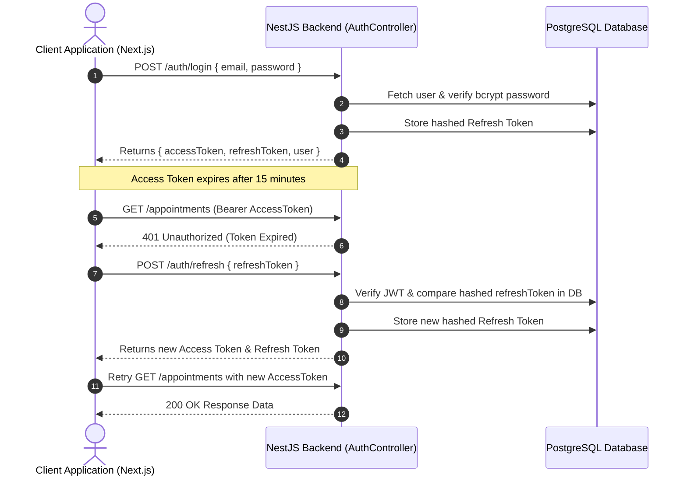

# Hospital Appointment System - Authentication Architecture

## Overview

The Hospital Appointment Platform implements a high-security, scalable, production-ready authentication and authorization system based on **JWT Token Rotation**, **Bcrypt Password Hashing**, **Passport Strategies**, and **NestJS Global Guards**.

---

## Technical Security Standards

- **Password Hashing**: Bcrypt with **12 salt rounds** (OWASP benchmark). Plain passwords are never stored or serialized in responses.
- **Access Tokens**: Short-lived (15 minutes), passed via `Authorization: Bearer <token>` header.
- **Refresh Tokens**: Long-lived (7 days), stored **hashed with bcrypt** in the database (`users.refreshToken` column) to support session rotation and remote logout.
- **Payload Minimization**: JWT payloads contain only essential fields (`sub`, `email`, `role`). Never include passwords or secrets.

---

## Authentication Endpoints API

| Method | Endpoint | Access Level | Description |
| :--- | :--- | :--- | :--- |
| `POST` | `/api/v1/auth/register` | Public | Registers a new patient account |
| `POST` | `/api/v1/auth/login` | Public | Authenticates user & returns Access + Refresh Tokens |
| `POST` | `/api/v1/auth/refresh` | Public | Refreshes Access Token using valid Refresh Token |
| `POST` | `/api/v1/auth/logout` | Protected | Revokes Refresh Token & invalidates DB session |
| `GET` | `/api/v1/auth/profile` | Protected | Returns current authenticated user details |

---

## Refresh Token Rotation & Retries Flow

---

## Default Seeded Accounts

| Role | Email | Password |
| :--- | :--- | :--- |
| **ADMIN** | `doctor@hospital.com` | `Doctor@123` |
| **DOCTOR** | `doctor2@hospital.com` | `Doctor@123` |
| **PATIENT** | `patient@hospital.com` | `Patient@123` |
