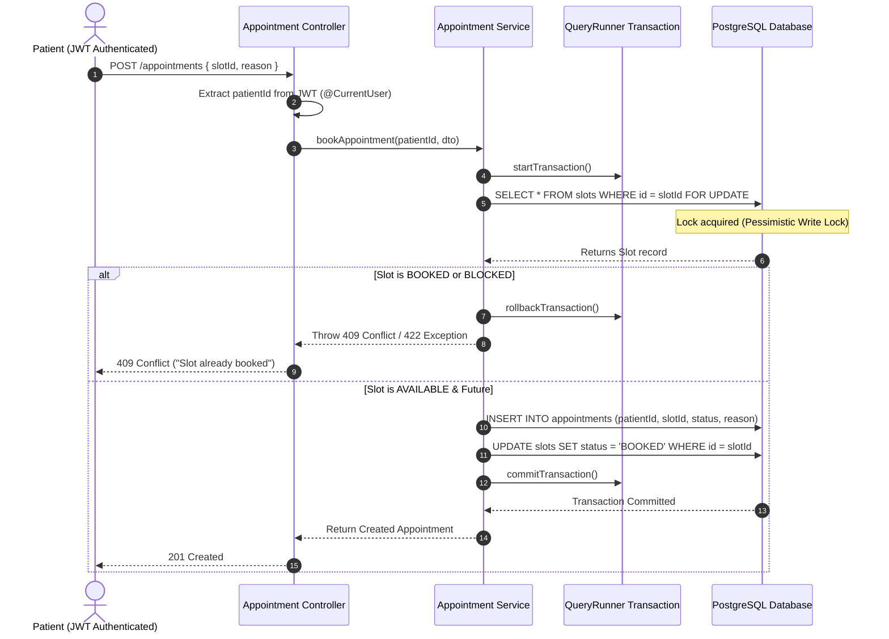
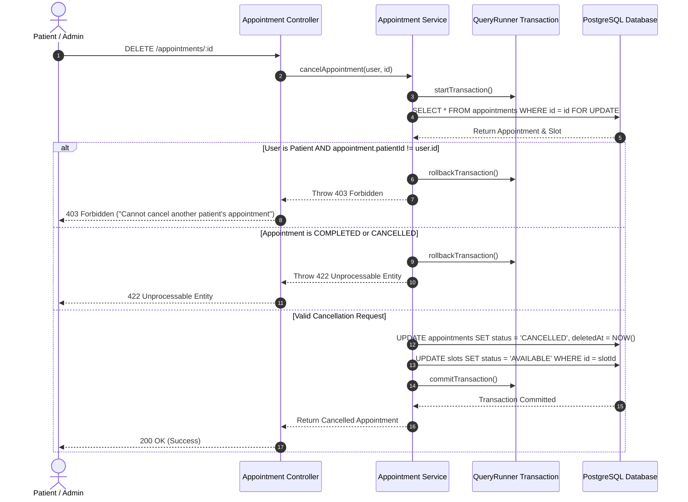
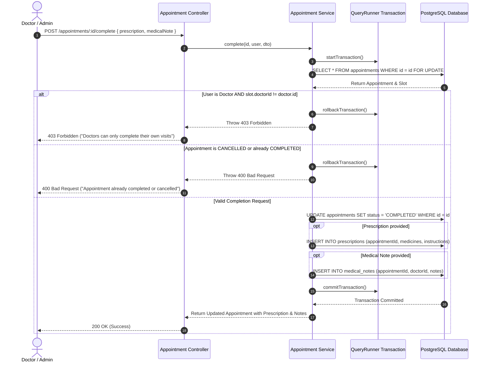

# Architecture Documentation — Hospital Appointment System

## Architectural Principles & Philosophy

The **Hospital Appointment System** is designed using Clean Architecture & Domain-Driven Design (DDD) principles. This architecture decouples core business domain logic from infrastructure dependencies (database engines, framework specifics, HTTP controllers).

```
+-------------------------------------------------------------+
|                      Presentation Layer                     |
|            (NestJS Controllers / Next.js Pages)            |
+-------------------------------------------------------------+
                              |
                              v
+-------------------------------------------------------------+
|                      Application Layer                      |
|          (Services, DTOs, Auth Guards, Pipelines)          |
+-------------------------------------------------------------+
                              |
                              v
+-------------------------------------------------------------+
|                        Domain Layer                         |
|         (Entities, Value Objects, Domain Interfaces)        |
+-------------------------------------------------------------+
                              |
                              v
+-------------------------------------------------------------+
|                     Infrastructure Layer                    |
|          (TypeORM PostgreSQL, Redis Cache, Passport)         |
+-------------------------------------------------------------+
```

---

## Transactional Booking Flow & Concurrency Sequence Diagram



---

## Transactional Cancellation Sequence Diagram



---

## Transactional Clinical Completion Sequence Diagram (Day 5)



---

## Modular Backend Architecture (NestJS)

Each domain feature is encapsulated in a dedicated NestJS module. The `api-gateway` handles auth and user identity; `api` handles all clinical domain logic.

### `api-gateway` modules

1. **Users Module (`src/modules/users/`)**:
   - Manages `users` table (every role) and `hospital_admins` table.
   - `users` holds auth credentials; `hospital_admins` holds admin-specific profile fields (hospital name, department, job title).

2. **Auth Module (`src/modules/auth/`)**:
   - Handles Passport JWT strategies, refresh token rotation, bcrypt password hashing (12 salt rounds), and `@Roles()` / `@CurrentUser()` guards and decorators.

### `api` domain modules

3. **Doctor Module (`src/modules/doctor/`)**:
   - Manages `doctor_profiles` table: specialization, consultation fees, approval status, credential documents.
   - Auto-syncs a profile row whenever a new `DOCTOR` user registers.

4. **Patient Module (`src/modules/patient/`)** _(added Aug 2026)_:
   - Manages `patient_profiles` table: blood group, date of birth, allergies, medical history.
   - Auto-syncs a profile row whenever a new `PATIENT` user registers.
   - Provides `GET /patients`, `GET /patients/:id`, `GET /patients/by-user/:userId`, `PATCH /patients/:id`.

5. **Slot Module (`src/modules/slot/`)**:
   - Handles doctor time-slot creation (bulk generation, overlap detection, future-date validation), status updates (`BLOCKED` / `AVAILABLE`), and available slot queries.

6. **Appointment Module (`src/modules/appointment/`)**:
   - Core transactional booking and cancellation engine.
   - Leverages TypeORM `QueryRunner` with pessimistic write locking (`SELECT FOR UPDATE`) to guarantee concurrency safety.
   - Enforces ownership rules (patients can only book/view/cancel their own appointments).
   - Provides optimized query-builder pagination and date filtering.

7. **Prescription Module (`src/modules/prescription/`)**:
   - Clinical prescription generation (medicines JSONB array) linked directly to completed appointments.

8. **Medical Note Module (`src/modules/medical-note/`)**:
   - Clinical consultation notes (EHR) attached to appointments, authored by doctors.

---

## Role ↔ Profile Table Mapping

```
users.role = 'ADMIN'    ──1:1──▶  hospital_admins   (api-gateway)
users.role = 'DOCTOR'   ──1:1──▶  doctor_profiles   (api)
users.role = 'PATIENT'  ──1:1──▶  patient_profiles  (api)
```

Profile tables are **optional** — a user can exist without one. Profiles are auto-created lazily when needed.
