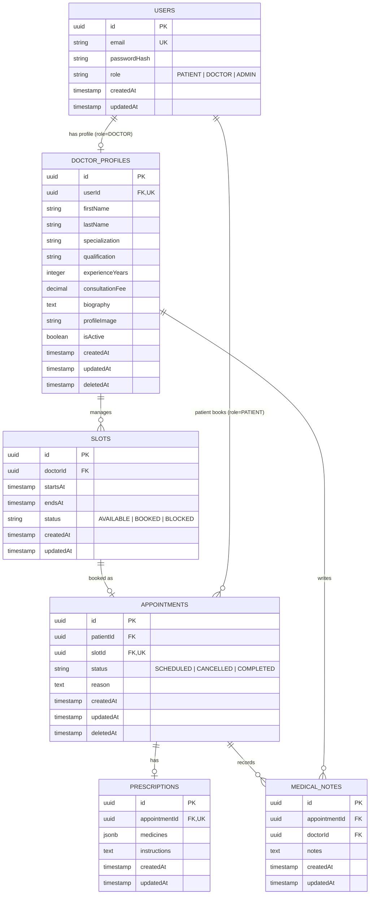

# Entity Relationship Diagram (ERD) — Hospital Appointment System

```mermaid
erDiagram
    USERS ||--o| DOCTOR_PROFILES : "has profile (role=DOCTOR)"
    DOCTOR_PROFILES ||--o{ SLOTS : "manages"
    SLOTS ||--o| APPOINTMENTS : "booked as"
    USERS ||--o{ APPOINTMENTS : "patient books (role=PATIENT)"
    APPOINTMENTS ||--o| PRESCRIPTIONS : "has"
    APPOINTMENTS ||--o{ MEDICAL_NOTES : "records"
    DOCTOR_PROFILES ||--o{ MEDICAL_NOTES : "writes"

    USERS {
        uuid id PK
        string email UK
        string passwordHash
        string role "PATIENT | DOCTOR | ADMIN"
        timestamp createdAt
        timestamp updatedAt
    }

    DOCTOR_PROFILES {
        uuid id PK
        uuid userId FK, UK
        string firstName
        string lastName
        string specialization
        string qualification
        integer experienceYears
        decimal consultationFee
        text biography
        string profileImage
        boolean isActive
        timestamp createdAt
        timestamp updatedAt
        timestamp deletedAt
    }

    SLOTS {
        uuid id PK
        uuid doctorId FK
        timestamp startsAt
        timestamp endsAt
        string status "AVAILABLE | BOOKED | BLOCKED"
        timestamp createdAt
        timestamp updatedAt
    }

    APPOINTMENTS {
        uuid id PK
        uuid patientId FK
        uuid slotId FK, UK
        string status "SCHEDULED | CANCELLED | COMPLETED"
        text reason
        timestamp createdAt
        timestamp updatedAt
        timestamp deletedAt
    }

    PRESCRIPTIONS {
        uuid id PK
        uuid appointmentId FK, UK
        jsonb medicines
        text instructions
        timestamp createdAt
        timestamp updatedAt
    }

    MEDICAL_NOTES {
        uuid id PK
        uuid appointmentId FK
        uuid doctorId FK
        text notes
        timestamp createdAt
        timestamp updatedAt
    }
```
