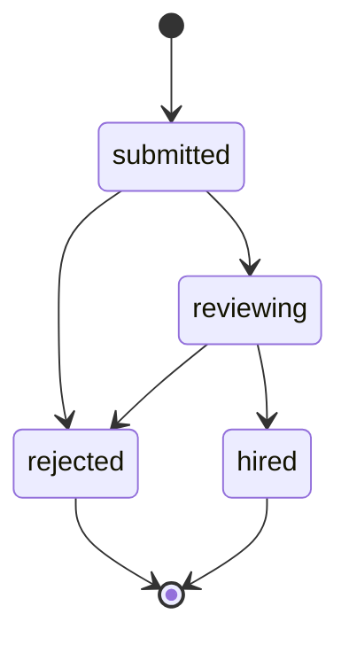
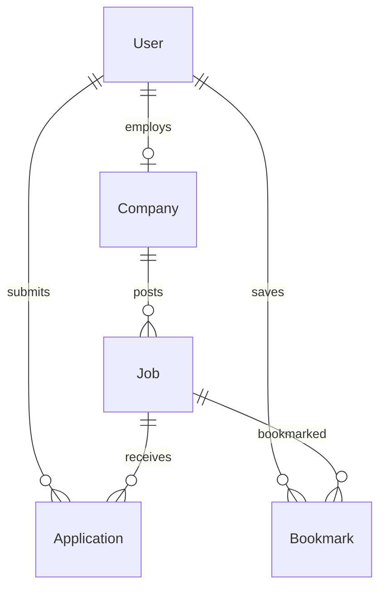

# Job Portal

[← Back to Projects Index](README.md)

|                  |                                                                                          |
| ---------------- | ---------------------------------------------------------------------------------------- |
| **Slug**         | `job-portal`                                                                             |
| **Implement in** | `apps/api/` + `apps/web/` (auth on `apps/api-gateway`) on branch `<dev-name>/job-portal` |

## Problem

Hiring is slow and opaque when companies and candidates use scattered tools. Companies need one place to publish openings and review applicants; candidates need to discover roles, apply once, and see where they stand. Platform operators must keep the marketplace fair — bad listings or suspended employers should not mislead job seekers.

**Who uses this system**

| Actor                         | Goal                                                                               |
| ----------------------------- | ---------------------------------------------------------------------------------- |
| **Company (employer)**        | Post jobs, manage applications, move candidates through a clear pipeline           |
| **Candidate (job seeker)**    | Find relevant roles, apply without duplicate submissions, track application status |
| **Admin (platform operator)** | Oversee marketplace health, suspend abusive companies, force-close stale jobs      |

**Pain points you are solving**

- Candidates apply twice to the same role because nothing prevents duplicates.
- Companies lose track of applicants when status is informal (email, spreadsheets).
- Closed jobs leave applications in limbo instead of being resolved in bulk.
- There is no searchable catalog with filters (title, location) for discovery.

**What you are building**

A job marketplace web app: companies own profiles and job posts; candidates search and apply; applications follow a defined status workflow (`submitted` → `reviewing` → `rejected` | `hired`). Admins can intervene when needed. The system must enforce business rules (no double-apply, valid status transitions, atomic close-and-reject) — not just store data.

## Application flow (end-to-end)

```text
1. Company (staff) logs in → creates/links Company profile
2. Company posts Job listings (title, location, description)
3. Candidate (user) browses paginated job catalog with filters
4. Candidate views job detail → submits Application (status: submitted)
5. Company reviews applications on dashboard → status: reviewing → rejected | hired
6. Company closes Job → all open applications rejected atomically (transaction)
7. Admin (optional Should) suspends company or force-closes jobs
```

Soft-deleted jobs disappear from the public catalog but remain in the database for audit.

## Roles in detail

| Domain role   | Gateway role | Purpose                                               |
| ------------- | ------------ | ----------------------------------------------------- |
| **admin**     | `admin`      | Platform moderation and marketplace health            |
| **company**   | `staff`      | Hire — manage company profile, jobs, and applications |
| **candidate** | `user`       | Find work — search, apply, track status               |

### admin

- **Can:** View all companies, jobs, and applications; suspend companies; force-close jobs; access admin-only routes.
- **Cannot:** Impersonate a candidate application without switching accounts (keep roles separate in demo).
- **Typical screens:** Admin dashboard, company list with suspend/activate actions.

### company (maps to `staff`)

- **Can:** CRUD own company profile; CRUD own jobs; list and update application status for own jobs; close jobs (triggering bulk reject transaction).
- **Cannot:** Apply to jobs; edit other companies' jobs or applications; see candidates who applied elsewhere.
- **Typical screens:** Company dashboard (counts by status), job create/edit, application inbox with filters.

### candidate (maps to `user`)

- **Can:** Search and browse jobs; apply once per job; view own application history; bookmark jobs (Should tier).
- **Cannot:** Create or edit jobs; change application status; view other users' applications.
- **Typical screens:** Job search with filters, job detail + apply form, my applications list.

Enforce with `@Roles('staff')` on company endpoints, `@Roles('user')` on apply, and ownership checks (`company.userId === currentUser.id`).

## User journeys

These journeys describe how people actually use the app — in plain language. Read them to understand the experience you are building, then walk through them during implementation and before your demo.

**Technical details** (API paths, status codes, database columns) live in **Backend expectations**, **Enums and state machines**, and **Edge cases**. These journeys explain _what should happen_ from the user's point of view.

### Everyone

#### Signing in to reach a private page _(Must)_

**Who:** Anyone who is not logged in

**Goal:** Private areas require login first.

1. Someone opens a link to a private page (for example the dashboard or their personal list) without being logged in.
2. The app sends them to the login screen instead of showing empty or broken content.
3. After they sign in with a valid account, they land on the page they originally wanted.
4. If they refresh the browser, they stay signed in and the page still loads correctly.

#### Each role sees only their part of the app _(Must)_

**Who:** Regular user vs Company (staff)

**Goal:** Users and company (staff) accounts must not share the same screens or powers.

1. A regular user signs in and uses the app. Menus and buttons for company (staff) work are hidden or disabled.
2. If they manually open a company (staff) URL (such as /company/jobs), they see an access denied message — not another person's data.
3. When they sign out and sign in as Company (staff), those pages open normally and they can create and manage records.

#### When there is nothing to show in the job catalog _(Must)_

**Who:** Anyone browsing a list

**Goal:** The job catalog should feel intentional even when empty or still loading.

1. While the job catalog is loading, the user sees a skeleton or spinner — not a flash of wrong data or a blank white screen.
2. If filters or search return no jobs, a friendly empty state explains that nothing matched and offers to clear filters.
3. Clearing filters brings back the normal list when matching jobs exist.
4. Slow network: loading state stays visible until real data or a genuine empty result arrives.

#### Removing a job from public view _(Must)_

**Who:** Company (staff)

**Goal:** Deleted jobs should disappear for everyone except the owner reviewing history.

1. The company (staff) creates a job that appears in the public job board.
2. They delete it using the normal delete action and confirm in a dialog.
3. The job no longer appears in the public job board or in search results.
4. Opening an old bookmark to that job shows a polite “no longer available” message.
5. The owner can still find it in the company job list with a deleted badge if the brief includes an audit or trash view (Should).

### Company (employer)

#### Company sets up their profile _(Must)_

**Who:** Alex, hiring manager (gateway role: `staff`)

**Goal:** Register the employer on the platform before posting jobs.

1. Alex signs in and sees a prompt to create a company profile because none exists yet.
2. They enter the company name, website, and a short description, then save.
3. The dashboard now shows the company name and zero open jobs.
4. If Alex tries to create a second company profile, the app refuses — one company per account.

#### Company posts and manages job listings _(Must)_

**Who:** Alex, hiring manager

**Goal:** Publish openings and keep listings up to date.

1. Alex clicks **New job**, enters title, location, and description, and publishes.
2. The job appears on the public job board where candidates can find it.
3. Alex edits the title later; the updated text shows on the public listing.
4. Alex can remove a job; it disappears from public search but remains in the company history.
5. Alex cannot edit or delete another company's jobs — only their own.

#### Company reviews applications through hiring stages _(Must)_

**Who:** Alex, hiring manager

**Goal:** Move each applicant through a clear pipeline.

1. Alex opens the applications inbox and selects a candidate who just applied.
2. The application starts as **Submitted**. Alex moves it to **Reviewing**.
3. After evaluation, Alex marks the candidate **Rejected** or **Hired**.
4. The app only allows sensible status changes — for example, you cannot jump straight from **Submitted** to **Hired** without going through **Reviewing**.
5. Alex filters the inbox by status to focus on candidates still in **Reviewing**.

#### Company closes a job and resolves open applications _(Must)_

**Who:** Alex, hiring manager

**Goal:** When hiring ends, no application should stay in limbo.

1. Alex opens a job that still has pending applications.
2. They click **Close job** and confirm the warning that open applications will be rejected.
3. Every pending application moves to **Rejected** in one action.
4. The job no longer accepts new applications — the Apply button is disabled for candidates.
5. The job is hidden or clearly marked closed on the public board.

#### Company dashboard at a glance _(Should)_

**Who:** Alex, hiring manager

**Goal:** See hiring activity without digging through every list.

1. The dashboard shows counts such as open jobs and applications by status.
2. Clicking a count opens the filtered list behind that number.
3. When a new application arrives, refreshing the dashboard updates the totals.
4. Another company's dashboard never shows Alex's numbers.

### Candidate (job seeker)

#### Candidate searches for jobs _(Must)_

**Who:** Maya, job seeker (gateway role: `user`)

**Goal:** Find relevant roles quickly.

1. Maya opens the job board and browses open positions.
2. She searches by keyword and filters by location to narrow results.
3. She moves to page 2 of results when many jobs match.
4. If nothing matches her filters, she sees a clear empty message and can reset filters.

#### Candidate applies to a job _(Must)_

**Who:** Maya, job seeker

**Goal:** Submit one application and track it.

1. Maya opens a job she likes and clicks **Apply**.
2. She adds a short cover letter and submits.
3. The job detail page now shows that she has already applied.
4. Her application appears on **My applications** with status **Submitted**.
5. As the company updates status, Maya sees **Reviewing**, **Rejected**, or **Hired** on her list.

#### Candidate cannot apply to the same job twice _(Must)_

**Who:** Maya, job seeker

**Goal:** Prevent duplicate applications.

1. After Maya applies once, the Apply button is gone or disabled on that job.
2. If she somehow tries again, the app blocks it and explains she already applied.
3. She can still apply to other jobs normally.

#### Candidate saves jobs and adds a resume link _(Should)_

**Who:** Maya, job seeker

**Goal:** Keep track of interesting roles (optional enhancements).

1. Maya bookmarks a job from the detail page and finds it later under **Bookmarks**.
2. When applying, she can paste a link to her resume (for example a PDF URL).
3. The company sees that link when reviewing her application.

### Admin

#### Admin keeps the marketplace healthy _(Should)_

**Who:** Platform admin (gateway role: `admin`)

**Goal:** Intervene when a company misbehaves.

1. Admin suspends a company that posts misleading jobs.
2. That company's jobs disappear from public search while suspended.
3. Admin can force-close stale jobs; pending applications are rejected.
4. Reactivating the company restores normal visibility.

## What is expected

### Must — required to pass

| Requirement                | What it means for you                                                                    |
| -------------------------- | ---------------------------------------------------------------------------------------- |
| Auth with 3 roles          | Company, candidate, and admin see different capabilities; guards on API + conditional UI |
| Company profile + job CRUD | Company-owned resources keyed by `userId`; only owner (or admin) can mutate              |
| Application workflow       | Status enum with allowed transitions only (no skipping straight to `hired`)              |
| Paginated job search       | `GET /jobs?page=&limit=&title=&location=`; soft-deleted jobs excluded                    |
| No double-apply            | DB unique constraint + service check before insert                                       |
| Shared Must bar            | See [grading.md](../grading.md) — migrations, transaction, Query/RTK split, etc.         |

### Should — strong / distinction

| Requirement                 | What it means for you                                                              |
| --------------------------- | ---------------------------------------------------------------------------------- |
| Dashboards                  | Company: application counts by status; candidate: my apps summary                  |
| Bookmarks                   | Candidate saves jobs; list at `/bookmarks` (Should route)                          |
| Resume field                | Optional `resumeUrl` on Application (Should) — see the enums and constraints above |
| Admin suspend / force-close | Admin actions with visible effect on catalog                                       |
| Filter applications         | Company inbox filterable by status                                                 |

### Stretch — bonus only

Real S3 resumes, email on status change, Elasticsearch — only after Must + Should are solid.

## Frontend expectations

> Shared UI bar for all projects: [Frontend expectations](README.md#frontend-expectations-all-projects) · [frontend.md](../frontend.md)

### Domain screens

| Route             | Role(s)           | UI expectations                                                                                                              |
| ----------------- | ----------------- | ---------------------------------------------------------------------------------------------------------------------------- |
| `/`               | All               | Landing or role-based redirect (company → dashboard, candidate → jobs)                                                       |
| `/jobs`           | Candidate, guest  | `PageHeader` + search/filter bar (title, location in RTK); paginated `Table` of jobs; `EmptyState` when no results           |
| `/jobs/[id]`      | Candidate         | Job detail card (title, location, description, company); **Apply** `Button` hidden/disabled if already applied or wrong role |
| `/dashboard`      | Company (`staff`) | Stat cards or summary for application counts by status; links to manage jobs and inbox                                       |
| `/company/jobs`   | Company           | Own jobs list with create/edit/delete; status badge on closed jobs                                                           |
| `/applications`   | Company           | Filterable inbox (`Table` + status filter in RTK); row actions to move status (submitted → reviewing → hired/rejected)       |
| `/admin` (Should) | Admin             | Company list with suspend/force-close actions; confirm dialog before destructive actions                                     |

### UI behaviour

- **Apply flow:** Modal or inline form on job detail; on 409/400 show `Alert` with server message (duplicate apply).
- **Status changes:** Use `Select` or button group on application row; disable illegal transitions in UI to match API.
- **Close job:** Confirm dialog explaining open applications will be rejected.
- **Nav:** Company sees Dashboard + My jobs + Applications; candidate sees Browse jobs + My applications; admin sees Admin link.

## Backend expectations

> Shared API bar for all projects: [Backend expectations](README.md#backend-expectations-all-projects) · [architecture.md](../architecture.md)

### Modules

| Module               | Entity(ies)   | Responsibility                                                                    |
| -------------------- | ------------- | --------------------------------------------------------------------------------- |
| `companies`          | `Company`     | Profile CRUD; `@Roles('staff')`; owner = `userId`                                 |
| `jobs`               | `Job`         | CRUD + paginated list; soft-delete; filters: `title`, `location`, `page`, `limit` |
| `applications`       | `Application` | Create (user), update status (staff owner of job); unique `(jobId, candidateId)`  |
| `bookmarks` (Should) | `Bookmark`    | Candidate-only CRUD                                                               |

### Key endpoints

| Method  | Path                       | Role           | Notes                                                 |
| ------- | -------------------------- | -------------- | ----------------------------------------------------- |
| `POST`  | `/companies`               | staff          | One company per staff user (UNIQUE userId)            |
| `GET`   | `/jobs`                    | public or user | Paginated; exclude soft-deleted                       |
| `POST`  | `/jobs/:id/applications`   | user           | Invariant: no duplicate; job must be open             |
| `PATCH` | `/applications/:id/status` | staff          | Validate transition graph in service                  |
| `POST`  | `/jobs/:id/close`          | staff          | **Transaction:** close job + reject open applications |

### Service rules

- `ApplicationsService.create`: check unique constraint before insert; return `409 Conflict` on duplicate.
- `JobsService.close`: `@Transactional()` reject all non-terminal applications.
- List queries: `WHERE deletedAt IS NULL` by default on jobs.

### Enums and state machines

**Job.status:** `open`, `closed`

**Application.status:** `submitted`, `reviewing`, `rejected`, `hired`

| From        | Allowed to              |
| ----------- | ----------------------- |
| `submitted` | `reviewing`, `rejected` |
| `reviewing` | `rejected`, `hired`     |
| `rejected`  | _(terminal)_            |
| `hired`     | _(terminal)_            |



### Database constraints

- `UNIQUE(companies.userId)`
- `UNIQUE(applications.jobId, applications.candidateId)`
- `UNIQUE(bookmarks.userId, bookmarks.jobId)`
- `FK jobs.companyId → companies.id` ON DELETE RESTRICT
- `FK applications.jobId → jobs.id` ON DELETE RESTRICT
- `CHECK jobs.status IN ('open', 'closed')`
- `CHECK applications.status IN ('submitted', 'reviewing', 'rejected', 'hired')`
- Index on `jobs(location)`, `jobs(status)`, `jobs.deletedAt`

### Domain seed (minimum)

Seed **≥12 domain rows** tied to gateway users from `pnpm seed`:

| Entity      | Count | Notes                                                  |
| ----------- | ----- | ------------------------------------------------------ |
| Company     | 2     | One per staff demo user                                |
| Job         | 5     | 4 `open`, 1 `closed`; mix locations                    |
| Application | 4     | Mix statuses; one duplicate-candidate pair across jobs |
| Bookmark    | 2     | Candidate bookmarks                                    |

Relationships: each job belongs to a company; applications link candidate user to open jobs; at least one job with 2+ applications for inbox demo.

### Web routes auth

| Route                      | Auth required | Roles                  |
| -------------------------- | ------------- | ---------------------- |
| /                          | No            | All (redirect by role) |
| /jobs                      | No            | All (@Public catalog)  |
| /jobs/[id]                 | No            | All (@Public detail)   |
| /my/applications           | Yes           | user (candidate)       |
| /bookmarks                 | Yes           | user (Should)          |
| /dashboard                 | Yes           | staff (company)        |
| /company/jobs              | Yes           | staff                  |
| /company/jobs/new          | Yes           | staff                  |
| /company/jobs/[id]/edit    | Yes           | staff (owner)          |
| /company/applications      | Yes           | staff                  |
| /company/applications/[id] | Yes           | staff (job owner)      |
| /admin                     | Yes           | admin (Should)         |
| /admin/companies           | Yes           | admin (Should)         |

## Suggested entities

- Auth `User` is on the gateway — use `userId` FKs; do **not** recreate users/auth in `apps/api`
- `Company`
- `Job`
- `Application`
- `Bookmark`

## ERD (starter)



## Hard invariant

Application status transitions only along allowed edges; cannot apply twice to the same job.

## Required transaction

Close job + reject all open applications atomically.

## Must (pass)

- [ ] Auth with admin / company / candidate roles
- [ ] Company profile + job CRUD (company-owned)
- [ ] Applications with status workflow (submitted → reviewing → rejected|hired)
- [ ] Paginated job search (title, location) + soft-delete jobs
- [ ] Candidate cannot double-apply (unique jobId+candidateId)

Plus the shared Must bar in [grading.md](../grading.md).

## Should (distinction)

- [ ] Company and candidate dashboards (counts by status)
- [ ] Bookmarks for candidates
- [ ] Resume URL on application (`resumeUrl` string; paste URL or stub upload — no S3 required)
- [ ] Admin can suspend companies / force-close jobs
- [ ] Filter applications by status on company dashboard

## Stretch (bonus)

- [ ] Real object storage (S3) for resumes
- [ ] Email notifications on status change
- [ ] Full-text search / Elasticsearch

## API outline (indicative)

- `POST /companies`
- `CRUD /jobs`
- `POST /jobs/:id/applications`
- `PATCH /applications/:id/status`
- `GET /bookmarks`

## FE routes (indicative)

- `/`
- `/jobs`
- `/jobs/[id]`
- `/dashboard`
- `/login`

> Shared: [FAQ & edge cases](README.md#faq--read-before-you-ask) · [grading](../grading.md)

## Edge cases and negative scenarios

### Domain — applications and jobs

| Scenario                                                                                   | Expected API                                                                                      | UI hint                                    |
| ------------------------------------------------------------------------------------------ | ------------------------------------------------------------------------------------------------- | ------------------------------------------ |
| Candidate applies twice to same job                                                        | **409** (unique `jobId` + `candidateId`)                                                          | Disable Apply; show “Already applied”      |
| Apply to soft-deleted or closed job                                                        | **400/404** “Job not accepting applications”                                                      | Hide Apply on closed jobs                  |
| Company updates application on another company’s job                                       | **403/404**                                                                                       | No access to other companies’ inboxes      |
| Invalid status jump (e.g. `submitted` → `hired` skipping `reviewing` if you enforce steps) | **400**                                                                                           | Dropdown only shows allowed next statuses  |
| Candidate tries to PATCH application status                                                | **403**                                                                                           | No status controls for candidate           |
| Close job with 0 applications                                                              | **200** — still valid                                                                             | Confirm dialog anyway                      |
| Close job with mix of hired/rejected/submitted                                             | Only **non-terminal** (`submitted`, `reviewing`) → `rejected`; leave `hired`/`rejected` unchanged | Show count in confirm message              |
| Search with no matches                                                                     | **200** empty list                                                                                | `EmptyState` “No jobs match filters”       |
| Company with no profile tries to post job                                                  | **400** “Create company profile first”                                                            | Block create job + link to profile         |
| Admin suspends company with open jobs                                                      | **Should:** force-close open jobs + hide company jobs from public catalog                         | Public search excludes suspended companies |
| Bookmark same job twice                                                                    | **409** on duplicate POST                                                                         | Toggle favourite off via DELETE            |
| Pagination on filtered list                                                                | Filters apply **before** pagination                                                               | Reset to page 1 when filters change        |

### Demo 4xx cases (pick ≥2 in PR demo)

1. Double-apply → **409**
2. Illegal status transition → **400**
3. Apply to closed job → **400/404**

## FAQ — decisions already made

| Question                                    | Answer                                                                                  |
| ------------------------------------------- | --------------------------------------------------------------------------------------- |
| One company per staff user?                 | **Yes** — UNIQUE `companies.userId`; see the enums and constraints above.               |
| Can candidates browse jobs without login?   | **Yes** — `GET /jobs` and `GET /jobs/:id` are `@Public()`; apply requires auth.         |
| Application statuses — exact enum?          | **Must:** `submitted`, `reviewing`, `rejected`, `hired`. Terminal: `rejected`, `hired`. |
| Can company reopen a closed job?            | **Optional Should** — not required for Must.                                            |
| Resume required to apply?                   | **No** — `coverLetter` enough; `resumeUrl` optional (Should).                           |
| Who can soft-delete a job?                  | **Company owner** of job (or admin). Hidden from public catalog immediately.            |
| `location` filter — exact or partial match? | **Partial ILIKE** — see the enums and constraints above.                                |
| Company user applies to a job as candidate? | **Allowed** if they use a `user`-role account — keep roles separate in demo.            |

## Definition of done

- Domain migrations (`pnpm migration:run:api`) + domain seed (≥8 realistic rows); gateway users via `pnpm seed`
- Compose Postgres + root `.env` + `apps/api-gateway/.env` + `apps/api/.env` + `apps/web/.env.local`
- Next + Query + RTK ownership respected; UI uses `@shared/ui/components` + theme ([frontend.md](../frontend.md))
- `docs/architecture.md` completed
- 5-minute demo script in the PR body (and notes in `docs/architecture.md`)

## Demo script (suggested — adapt for your PR)

1. **Roles (30s):** Login as company → show dashboard; logout → candidate → job search; logout → admin → moderation view.
2. **Happy path (2m):** Company posts job → candidate applies → company hires → candidate sees hired status.
3. **Invariant (30s):** Candidate double-applies → show 4xx error in network tab or toast.
4. **Lists (1m):** Filter jobs by location; soft-delete a job → confirm it disappears from catalog but admin/history still references it.
5. **Transaction (30s):** Close job with pending applications → all rejected in one action.
