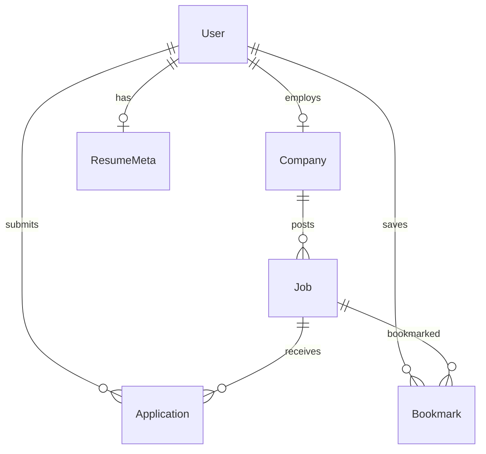

# Job Portal

|                  |                                                                                          |
| ---------------- | ---------------------------------------------------------------------------------------- |
| **Slug**         | `job-portal`                                                                             |
| **Implement in** | `apps/api/` + `apps/web/` (auth on `apps/api-gateway`) on branch `<dev-name>/job-portal` |

## Problem

Companies post jobs; candidates apply, track status, and manage profiles. Admins oversee the marketplace.

## Personas / roles

- admin
- company (staff)
- candidate (user)

## Suggested entities

- Auth `User` is on the gateway — use `userId` FKs; do **not** recreate users/auth in `apps/api`
- `Company`
- `Job`
- `Application`
- `Bookmark`
- `ResumeMeta`

## ERD (starter)

## Hard invariant

Application status transitions only along allowed edges; cannot apply twice to the same job.

## Required transaction

Close job + reject all open applications atomically.

## Must (pass)

- [ ] Auth with admin / company / candidate roles
- [ ] Company profile + job CRUD (company-owned)
- [ ] Applications with status workflow (submitted → reviewing → rejected|hired)
- [ ] Paginated job search (title, location) + soft-delete jobs
- [ ] Candidate cannot double-apply (unique jobId+candidateId)

Plus the shared Must bar in [grading.md](../grading.md).

## Should (distinction)

- [ ] Company and candidate dashboards (counts by status)
- [ ] Bookmarks for candidates
- [ ] Resume upload as local file or stored URL field (document approach)
- [ ] Admin can suspend companies / force-close jobs
- [ ] Filter applications by status on company dashboard

## Stretch (bonus)

- [ ] Real object storage (S3) for resumes
- [ ] Email notifications on status change
- [ ] Full-text search / Elasticsearch

## API outline (indicative)

- `POST /companies`
- `CRUD /jobs`
- `POST /jobs/:id/applications`
- `PATCH /applications/:id/status`
- `GET /bookmarks`

## FE routes (indicative)

- `/`
- `/jobs`
- `/jobs/[id]`
- `/dashboard`
- `/login`

## Definition of done

- Domain migrations (`pnpm migration:run:api`) + domain seed (≥8 realistic rows); gateway users via `pnpm seed`
- Compose Postgres + root `.env` + `apps/api-gateway/.env` + `apps/api/.env` + `apps/web/.env.local`
- Next + Query + RTK ownership respected; UI uses `@shared/ui/components` + theme ([frontend.md](../frontend.md))
- `docs/architecture.md` completed
- 5-minute demo script in the PR body (and notes in `docs/architecture.md`)

## Demo script (fill in)

1. Login as each role
2. Happy path for core workflow
3. Show invariant failure (expect 4xx)
4. Show list filters + soft-delete behaviour
