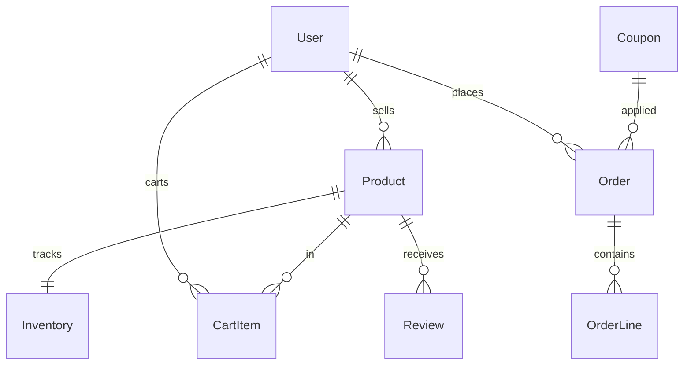

# E-commerce Marketplace

[← Back to Projects Index](README.md)

|                  |                                                                                                     |
| ---------------- | --------------------------------------------------------------------------------------------------- |
| **Slug**         | `ecommerce-marketplace`                                                                             |
| **Implement in** | `apps/api/` + `apps/web/` (auth on `apps/api-gateway`) on branch `<dev-name>/ecommerce-marketplace` |

## Problem

Online selling breaks down when inventory is wrong, carts are confusing, or buyers cannot trust stock levels at checkout. A marketplace needs sellers to list products with accurate quantity, buyers to browse and purchase reliably, and operators to keep the catalog healthy.

**Who uses this system**

| Actor      | Goal                                                                                  |
| ---------- | ------------------------------------------------------------------------------------- |
| **Seller** | List products, track inventory, see orders for their items                            |
| **Buyer**  | Discover products, manage a cart, checkout, track orders, optionally review purchases |
| **Admin**  | Moderate the platform and remove problematic listings                                 |

**Pain points you are solving**

- Overselling: two buyers checkout the last unit because stock is not updated atomically.
- Sellers and buyers have no shared view of order state after purchase.
- Catalogs without search and price filters are hard to use at scale.
- Removed products still appear in browse if soft-delete is not handled.

**What you are building**

A multi-seller storefront: sellers CRUD products with inventory counts; buyers add to cart and checkout in one transaction that decrements stock; orders are visible to the buyer and relevant seller. Reviews, coupons, and order status workflows are stretch goals for a richer experience.

## Application flow (end-to-end)

```text
1. Seller (staff) logs in → creates Product listings with Inventory quantity
2. Buyer (user) browses catalog with pagination + filters (q, min/max price)
3. Buyer adds items to Cart → updates quantities
4. Buyer checks out → transaction: Order + OrderLines + decrement stock (reject if oversell)
5. Buyer views order history; seller sees orders containing their products
6. Buyer leaves Review after purchase (Should — one per buyer per product)
7. Admin monitors catalog; soft-deleted products hidden from browse
```

## Roles in detail

| Domain role | Gateway role | Purpose                                                   |
| ----------- | ------------ | --------------------------------------------------------- |
| **admin**   | `admin`      | Catalog moderation, platform oversight                    |
| **seller**  | `staff`      | List and manage products, inventory, and order visibility |
| **buyer**   | `user`       | Browse, cart, checkout, track orders, review              |

### admin

- **Can:** View all products/orders; remove abusive listings; access admin routes.
- **Cannot:** Checkout on behalf of buyers without role switch.
- **Typical screens:** Admin product list, flagged content (if implemented).

### seller (maps to `staff`)

- **Can:** CRUD own products; set inventory quantity; view orders that include their products; soft-delete own products.
- **Cannot:** Modify other sellers' products; bypass stock checks at checkout.
- **Typical screens:** Seller dashboard (revenue/units — Should), product CRUD, order list filtered to own SKUs.

### buyer (maps to `user`)

- **Can:** Browse catalog; manage cart; checkout; view own orders; post one review per product (Should).
- **Cannot:** Edit product prices; see other buyers' carts or orders.
- **Typical screens:** Product grid with filters, product detail, cart, checkout, my orders.

## User journeys

These journeys describe how people actually use the app — in plain language. Read them to understand the experience you are building, then walk through them during implementation and before your demo.

**Technical details** (API paths, status codes, database columns) live in **Backend expectations**, **Enums and state machines**, and **Edge cases**. These journeys explain _what should happen_ from the user's point of view.

### Everyone

#### Signing in to reach a private page _(Must)_

**Who:** Anyone who is not logged in

**Goal:** Private areas require login first.

1. Someone opens a link to a private page (for example the dashboard or their personal list) without being logged in.
2. The app sends them to the login screen instead of showing empty or broken content.
3. After they sign in with a valid account, they land on the page they originally wanted.
4. If they refresh the browser, they stay signed in and the page still loads correctly.

#### Each role sees only their part of the app _(Must)_

**Who:** Regular user vs Seller (staff)

**Goal:** Users and seller (staff) accounts must not share the same screens or powers.

1. A regular user signs in and uses the app. Menus and buttons for seller (staff) work are hidden or disabled.
2. If they manually open a seller (staff) URL (such as /seller/products), they see an access denied message — not another person's data.
3. When they sign out and sign in as Seller (staff), those pages open normally and they can create and manage records.

#### When there is nothing to show in the product catalog _(Must)_

**Who:** Anyone browsing a list

**Goal:** The product catalog should feel intentional even when empty or still loading.

1. While the product catalog is loading, the user sees a skeleton or spinner — not a flash of wrong data or a blank white screen.
2. If filters or search return no products, a friendly empty state explains that nothing matched and offers to clear filters.
3. Clearing filters brings back the normal list when matching products exist.
4. Slow network: loading state stays visible until real data or a genuine empty result arrives.

#### Removing a product from public view _(Must)_

**Who:** Seller (staff)

**Goal:** Deleted products should disappear for everyone except the owner reviewing history.

1. The seller (staff) creates a product that appears in the shop catalog.
2. They delete it using the normal delete action and confirm in a dialog.
3. The product no longer appears in the shop catalog or in search results.
4. Opening an old bookmark to that product shows a polite “no longer available” message.
5. The owner can still find it in the seller product list with a deleted badge if the brief includes an audit or trash view (Should).

### Seller

#### Seller lists products and updates stock _(Must)_

**Who:** Riya, shop owner (gateway role: `staff`)

**Goal:** Keep the catalog accurate.

1. Riya adds a product with SKU, title, price, and stock quantity.
2. The product appears in the public catalog when published.
3. Riya edits stock after a shipment arrives.
4. Riya cannot change another seller's products.
5. Removing a product hides it from shoppers but keeps it in seller history.

#### Seller fulfills orders for their items _(Must)_

**Who:** Riya, shop owner

**Goal:** See only orders that include their products.

1. Riya opens **Orders** and sees orders containing her SKUs only.
2. Opening an order shows line items for her shop, not other sellers' lines.
3. If seller-specific status updates exist, Riya advances them one step at a time.

### Buyer

#### Buyer builds a personal cart _(Must)_

**Who:** Chris, shopper (gateway role: `user`)

**Goal:** Cart belongs to one signed-in buyer.

1. Chris adds items from product pages to the cart.
2. Chris changes quantities on the cart page.
3. After signing out and back in as someone else, that person sees their own cart — not Chris's.
4. Removing the last item shows an empty cart message.

#### Checkout reserves stock atomically _(Must)_

**Who:** Chris, shopper

**Goal:** No overselling when two buyers want the last unit.

1. Chris checks out with items that are in stock.
2. He sees an order confirmation and the cart clears.
3. Stock on the product page drops by the quantity ordered.
4. If another buyer tries to buy the last unit at the same time, only one checkout succeeds; the other sees that stock ran out.

#### Buyer browses and tracks orders _(Must)_

**Who:** Chris, shopper

**Goal:** Shop confidently and review past purchases.

1. Chris searches and filters products by price range on the catalog.
2. After purchasing, **My orders** lists only Chris's orders.
3. Chris cannot open another buyer's order by guessing an ID.

#### Reviews, coupons, and order tracking _(Should)_

**Who:** Chris, shopper

**Goal:** Optional polish features.

1. Chris leaves one review per product after buying.
2. A valid coupon reduces the checkout total; an expired code shows an error.
3. Order status moves through placed → processing → shipped as the seller updates it.

## What is expected

### Must — required to pass

| Requirement                     | What it means for you                                                  |
| ------------------------------- | ---------------------------------------------------------------------- |
| Seller product CRUD + inventory | Products owned by seller `userId`; quantity on Inventory entity        |
| Cart operations                 | Add/update/remove; cart scoped to logged-in buyer                      |
| Checkout transaction            | Order + lines + stock decrement atomically; fail if insufficient stock |
| Order visibility                | Buyer sees own orders; seller sees relevant subset                     |
| Paginated catalog               | Filters: search q, min/max price; soft-deleted hidden                  |
| Shared Must bar                 | [grading.md](../grading.md)                                            |

### Should — distinction

Coupons with expiry; one review per buyer per product; seller dashboard; order status workflow (placed → paid_mock → shipped → cancelled).

### Stretch — bonus

Real payment gateway, multi-currency, shipment webhooks.

## Frontend expectations

> Shared UI bar for all projects: [Frontend expectations](README.md#frontend-expectations-all-projects) · [frontend.md](../frontend.md)

### Domain screens

| Route                           | Role(s)          | UI expectations                                                                                   |
| ------------------------------- | ---------------- | ------------------------------------------------------------------------------------------------- |
| `/products`                     | Buyer            | Grid or `Table` with image placeholder, title, price; filters (search, min/max price); pagination |
| `/products/[id]`                | Buyer            | Detail + **Add to cart** with quantity stepper                                                    |
| `/cart`                         | Buyer            | Line items table; update qty; remove row; subtotal; **Checkout** button                           |
| `/orders`                       | Buyer            | Own orders list with status badge                                                                 |
| `/seller` or `/seller/products` | Seller (`staff`) | Product CRUD list; inventory qty column; create/edit form                                         |
| `/seller/orders`                | Seller           | Orders containing seller's products (filtered view)                                               |

### UI behaviour

- **Checkout:** Loading on button during transaction; redirect to order confirmation on success; show stock error from API.
- **Cart:** Show empty cart `EmptyState` with link back to catalog.
- **Seller nav:** Separate seller section visible only to `staff` role.
- **Soft-deleted products:** Removed from buyer catalog immediately after delete.

## Backend expectations

> Shared API bar for all projects: [Backend expectations](README.md#backend-expectations-all-projects) · [architecture.md](../architecture.md)

### Modules

| Module             | Entity(ies)            | Responsibility                                |
| ------------------ | ---------------------- | --------------------------------------------- |
| `products`         | `Product`, `Inventory` | Seller CRUD; stock quantity; soft-delete      |
| `cart`             | `CartItem`             | Buyer scoped; add/update/remove               |
| `orders`           | `Order`, `OrderLine`   | Checkout transaction; buyer/seller list views |
| `reviews` (Should) | `Review`               | One per buyer per product                     |

### Key endpoints

| Method | Path          | Role       | Notes                                            |
| ------ | ------------- | ---------- | ------------------------------------------------ |
| `GET`  | `/products`   | all        | Filters: `q`, `minPrice`, `maxPrice`, pagination |
| `POST` | `/cart/items` | user       | Upsert line                                      |
| `POST` | `/checkout`   | user       | Transaction: order + lines + decrement stock     |
| `GET`  | `/orders`     | user/staff | Scoped by role                                   |

### Service rules

- `CheckoutService.execute`: lock/check inventory inside transaction; `409` if insufficient stock.
- Product list excludes `deletedAt IS NOT NULL`.

### Enums and state machines

**Order.status (Should):** `placed`, `paid_mock`, `shipped`, `cancelled`

| From        | Allowed to               |
| ----------- | ------------------------ |
| `placed`    | `paid_mock`, `cancelled` |
| `paid_mock` | `shipped`, `cancelled`   |
| `shipped`   | _(terminal)_             |
| `cancelled` | _(terminal)_             |

### Database constraints

- `UNIQUE(inventory.productId)`
- `UNIQUE(reviews.productId, reviews.buyerId)`
- `UNIQUE(coupons.code)`
- `CHECK inventory.quantity >= 0`
- `CHECK products.priceCents >= 0`

### Domain seed (minimum)

2 sellers (staff users), 6 products with inventory, 3 cart items, 2 completed orders with lines, 1 review.

### Web routes auth

| Route            | Auth required | Roles |
| ---------------- | ------------- | ----- |
| /products        | No            | All   |
| /products/[id]   | No            | All   |
| /cart            | Yes           | user  |
| /orders          | Yes           | user  |
| /seller/products | Yes           | staff |
| /seller/orders   | Yes           | staff |

## Suggested entities

- Auth `User` is on the gateway — use `userId` FKs; do **not** recreate users/auth in `apps/api`
- `Product`
- `Inventory`
- `CartItem`
- `Order`
- `OrderLine`
- `Coupon`
- `Review`

## ERD (starter)



## Hard invariant

Checkout must not oversell — stock decremented in a transaction; reject if insufficient.

## Required transaction

Create Order + OrderLines + decrement inventory (+ apply coupon) in one transaction.

## Must (pass)

- [ ] Seller product CRUD + inventory quantity
- [ ] Cart add/update/remove
- [ ] Checkout creating order + lines + stock decrement
- [ ] Order list for buyer; seller sees orders containing their products
- [ ] Pagination + filters on product catalog (q, min/max price)
- [ ] Soft-delete products hide from catalog

Plus the shared Must bar in [grading.md](../grading.md).

## Should (distinction)

- [ ] Coupons (percent or fixed) with expiry
- [ ] Reviews (one per buyer per product; service must verify buyer has a completed order for that product before allowing review — **403** otherwise)
- [ ] Seller dashboard (revenue / units sold)
- [ ] Order status workflow (placed → paid_mock → shipped → cancelled)

## Stretch (bonus)

- [ ] Real payment gateway
- [ ] Multi-currency
- [ ] Shipment tracking webhooks

## API outline (indicative)

- `CRUD /products`
- `CRUD /cart`
- `POST /checkout`
- `GET /orders`
- `POST /reviews`
- `POST /coupons`

## FE routes (indicative)

- `/`
- `/products`
- `/products/[id]`
- `/cart`
- `/orders`
- `/seller`

> Shared: [FAQ & edge cases](README.md#faq--read-before-you-ask) · [grading](../grading.md)

## Edge cases and negative scenarios

### Domain — cart, stock, checkout

| Scenario                              | Expected API                              | UI hint                                      |
| ------------------------------------- | ----------------------------------------- | -------------------------------------------- |
| Checkout with empty cart              | **400**                                   | Disable checkout button                      |
| Checkout quantity > available stock   | **409** “Insufficient stock”              | Show stock on product detail                 |
| Two checkouts race on last item       | One **201**, one **409**                  | Transaction + lock/check stock inside txn    |
| Add negative or zero quantity to cart | **400** validation                        | Min qty = 1 in UI                            |
| Buyer edits seller’s product          | **403/404**                               | Seller routes staff-only                     |
| Seller views unrelated buyer’s order  | **403/404**                               | Scope order list by buyer or seller products |
| Soft-deleted product in cart          | **400** on checkout “Product unavailable” | Remove stale line or show warning            |
| Coupon expired or over limit          | **400** at checkout                       | Show coupon error message                    |
| Review without purchase (Should)      | **403** “Must purchase first”             | Hide review form                             |
| Second review same product (Should)   | **409**                                   | One review per buyer per product             |
| Filter minPrice > maxPrice            | **400** — reject invalid range            | Validate in UI before submit                 |
| Order after checkout                  | Cart must be **empty**                    | Redirect to order confirmation               |

### Demo 4xx cases

1. Checkout overselling stock → **409**
2. Empty cart checkout → **400**
3. Invalid coupon → **400** (Should)

## FAQ — decisions already made

| Question                   | Answer                                                                                                                                                   |
| -------------------------- | -------------------------------------------------------------------------------------------------------------------------------------------------------- |
| One cart per user?         | **Yes.** Single cart scoped to `userId`.                                                                                                                 |
| Mixed sellers in one cart? | **Allowed for Must.** One checkout creates one order; lines may reference products from different sellers. Seller order view filters to their SKUs only. |
| Payment integration?       | **Mock** for Must — order status `placed` is enough. Should: `paid_mock` → `shipped` workflow.                                                           |
| Inventory can go negative? | **Never** — invariant at checkout.                                                                                                                       |
| Who soft-deletes products? | **Seller owner** or admin.                                                                                                                               |
| Product list public?       | **Yes (typical)** — `@Public()` GET catalog OK.                                                                                                          |
| Price storage?             | **Integer cents** (locked).                                                                                                                              |

## Definition of done

- Domain migrations (`pnpm migration:run:api`) + domain seed (≥8 realistic rows); gateway users via `pnpm seed`
- Compose Postgres + root `.env` + `apps/api-gateway/.env` + `apps/api/.env` + `apps/web/.env.local`
- Next + Query + RTK ownership respected; UI uses `@shared/ui/components` + theme ([frontend.md](../frontend.md))
- `docs/architecture.md` completed
- 5-minute demo script in the PR body (and notes in `docs/architecture.md`)

## Demo script (suggested — adapt for your PR)

1. **Roles (30s):** Seller product list → buyer catalog → admin view.
2. **Happy path (2m):** Add to cart → checkout → show order + inventory decrement.
3. **Invariant (30s):** Checkout exceeding stock → 4xx.
4. **Lists (1m):** Price + search filters; soft-delete product → gone from catalog.
