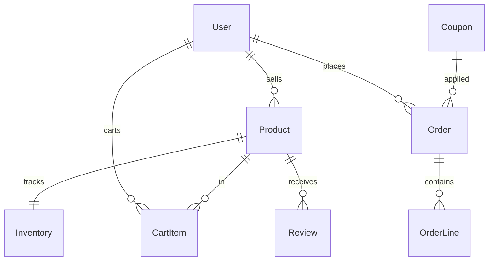

# E-commerce Marketplace

|                  |                                                                                                     |
| ---------------- | --------------------------------------------------------------------------------------------------- |
| **Slug**         | `ecommerce-marketplace`                                                                             |
| **Implement in** | `apps/api/` + `apps/web/` (auth on `apps/api-gateway`) on branch `<dev-name>/ecommerce-marketplace` |

## Problem

Sellers list products; buyers cart, checkout, and leave reviews. Admins manage catalog health.

## Personas / roles

- admin
- seller (staff)
- buyer (user)

## Suggested entities

- Auth `User` is on the gateway — use `userId` FKs; do **not** recreate users/auth in `apps/api`
- `Product`
- `Inventory`
- `CartItem`
- `Order`
- `OrderLine`
- `Coupon`
- `Review`

## ERD (starter)

## Hard invariant

Checkout must not oversell — stock decremented in a transaction; reject if insufficient.

## Required transaction

Create Order + OrderLines + decrement inventory (+ apply coupon) in one transaction.

## Must (pass)

- [ ] Seller product CRUD + inventory quantity
- [ ] Cart add/update/remove
- [ ] Checkout creating order + lines + stock decrement
- [ ] Order list for buyer; seller sees orders containing their products
- [ ] Pagination + filters on product catalog (q, min/max price)
- [ ] Soft-delete products hide from catalog

Plus the shared Must bar in [grading.md](../grading.md).

## Should (distinction)

- [ ] Coupons (percent or fixed) with expiry
- [ ] Reviews (one per buyer per product)
- [ ] Seller dashboard (revenue / units sold)
- [ ] Order status workflow (placed → paid_mock → shipped → cancelled)

## Stretch (bonus)

- [ ] Real payment gateway
- [ ] Multi-currency
- [ ] Shipment tracking webhooks

## API outline (indicative)

- `CRUD /products`
- `CRUD /cart`
- `POST /checkout`
- `GET /orders`
- `POST /reviews`
- `POST /coupons`

## FE routes (indicative)

- `/`
- `/products`
- `/products/[id]`
- `/cart`
- `/orders`
- `/seller`

## Definition of done

- Domain migrations (`pnpm migration:run:api`) + domain seed (≥8 realistic rows); gateway users via `pnpm seed`
- Compose Postgres + root `.env` + `apps/api-gateway/.env` + `apps/api/.env` + `apps/web/.env.local`
- Next + Query + RTK ownership respected; UI uses `@shared/ui/components` + theme ([frontend.md](../frontend.md))
- `docs/architecture.md` completed
- 5-minute demo script in the PR body (and notes in `docs/architecture.md`)

## Demo script (fill in)

1. Login as each role
2. Happy path for core workflow
3. Show invariant failure (expect 4xx)
4. Show list filters + soft-delete behaviour
