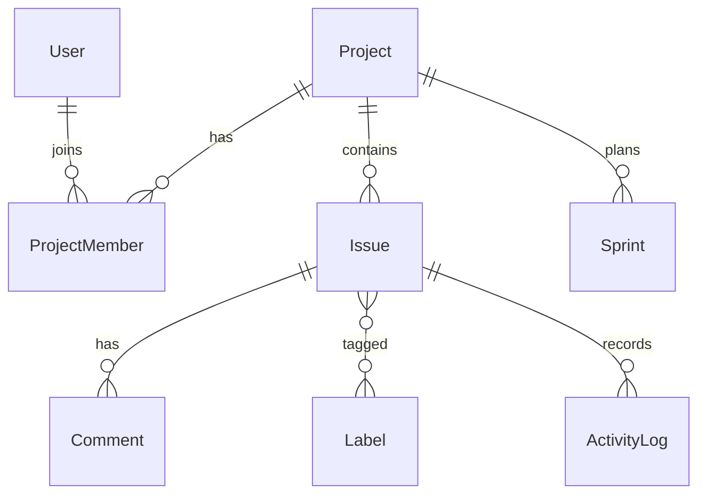

# Project Management (Jira-style)

|                  |                                                                     |
| ---------------- | ------------------------------------------------------------------- |
| **Slug**         | `project-management`                                                |
| **Implement in** | `apps/api/` + `apps/web/` on branch `<dev-name>/project-management` |

## Problem

Teams track work on boards with issues, sprints, labels, comments, and permissions.

## Personas / roles

- admin
- project_lead (staff)
- member (user)

## Suggested entities

- `User`
- `Project`
- `ProjectMember`
- `Issue`
- `Label`
- `IssueLabel`
- `Comment`
- `Sprint`
- `ActivityLog`

## ERD (starter)

## Hard invariant

Only project members can mutate issues; status changes write an activity log row.

## Required transaction

Create issue + attach labels + activity log in one transaction.

## Must (pass)

- [ ] Projects + membership
- [ ] Issues with status (todo/in_progress/done) and assignee
- [ ] Comments on issues
- [ ] Labels N:N + filter by status/label/assignee
- [ ] Soft-delete issues

Plus the shared Must bar in [grading.md](../grading.md).

## Should (distinction)

- [ ] Sprints (assign issues to sprint)
- [ ] Board UI grouped by status (drag-and-drop optional; buttons OK)
- [ ] Activity log timeline per issue
- [ ] Project-level role permissions (lead vs member)
- [ ] Dashboard of my open issues

## Stretch (bonus)

- [ ] True HTML5 drag-and-drop board
- [ ] WebSocket live updates
- [ ] Git integration

## API outline (indicative)

- `CRUD /projects`
- `CRUD /issues`
- `POST /issues/:id/comments`
- `CRUD /labels`
- `CRUD /sprints`

## FE routes (indicative)

- `/`
- `/projects`
- `/projects/[id]`
- `/projects/[id]/board`
- `/issues/[id]`

## Definition of done

- Migrations + seed (≥8 realistic rows across core tables)
- Compose Postgres + project `.env`
- Next + Query + RTK ownership respected
- `docs/architecture.md` completed
- 5-minute demo script in the PR body (and notes in `docs/architecture.md`)

## Demo script (fill in)

1. Login as each role
2. Happy path for core workflow
3. Show invariant failure (expect 4xx)
4. Show list filters + soft-delete behaviour
