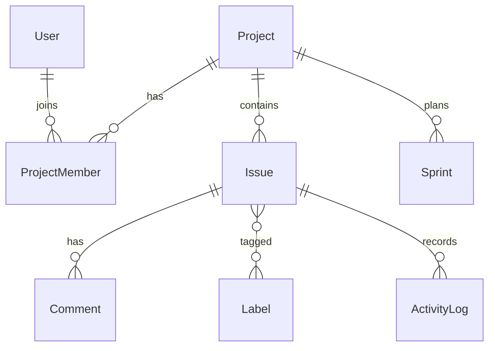

# Project Management (Jira-style)

[← Back to Projects Index](README.md)

|                  |                                                                                                  |
| ---------------- | ------------------------------------------------------------------------------------------------ |
| **Slug**         | `project-management`                                                                             |
| **Implement in** | `apps/api/` + `apps/web/` (auth on `apps/api-gateway`) on branch `<dev-name>/project-management` |

## Problem

Teams lose coordination when work lives in chat threads and spreadsheets. A project tool needs shared projects, trackable issues, comments, and permissions so only the right people can change work items.

**Who uses this system**

| Actor            | Goal                                                    |
| ---------------- | ------------------------------------------------------- |
| **Project lead** | Create projects, add members, manage issues and sprints |
| **Member**       | View and update issues on projects they belong to       |
| **Admin**        | Optional cross-project oversight                        |

**Pain points you are solving**

- Outsiders changing issues they should not access.
- No audit trail when status changes.
- Issues scattered without labels, assignees, or filters.
- Boards that cannot group work by status (todo / in progress / done).

**What you are building**

A lightweight Jira-style app: projects with membership, issues with status and assignee, comments, labels, and filters. Only project members may mutate issues; status changes should log activity. Sprints and drag-and-drop boards are optional enhancements.

## Application flow (end-to-end)

```text
1. Project lead (staff) creates Project → adds members
2. Members create Issues (todo → in_progress → done) with assignee and labels
3. Members comment on issues; status changes write ActivityLog rows
4. Lead assigns issues to sprints (Should); board groups by status
5. Filters: status, label, assignee on issue list
6. Soft-deleted issues hidden from board but retained for audit
7. Admin can access all projects (optional oversight)
```

## Roles in detail

| Domain role      | Gateway role | Purpose                                                |
| ---------------- | ------------ | ------------------------------------------------------ |
| **admin**        | `admin`      | Cross-project oversight (optional)                     |
| **project_lead** | `staff`      | Create projects, manage membership, full issue control |
| **member**       | `user`       | Work on assigned issues within joined projects         |

### admin

- **Can:** View/manage all projects if you implement admin scope; configure global settings.
- **Typical screens:** All-projects list (optional).

### project_lead (maps to `staff`)

- **Can:** Create projects; add/remove members; CRUD all issues in project; manage sprints and labels (Should).
- **Cannot:** Mutate issues in projects they are not a member of (unless admin).
- **Typical screens:** Project settings, member management, board view.

### member (maps to `user`)

- **Can:** View joined projects; create/edit issues if member; comment; update status on assigned issues (define lead vs member rules in Should).
- **Cannot:** Mutate issues in projects they have not joined — **hard invariant**.
- **Typical screens:** My open issues dashboard (Should), project board, issue detail with comments.

Only project members may mutate issues. Enforce via `ProjectMember` check in service layer.

## User journeys

These journeys describe how people actually use the app — in plain language. Read them to understand the experience you are building, then walk through them during implementation and before your demo.

**Technical details** (API paths, status codes, database columns) live in **Backend expectations**, **Enums and state machines**, and **Edge cases**. These journeys explain _what should happen_ from the user's point of view.

### Everyone

#### Signing in to reach a private page _(Must)_

**Who:** Anyone who is not logged in

**Goal:** Private areas require login first.

1. Someone opens a link to a private page (for example the dashboard or their personal list) without being logged in.
2. The app sends them to the login screen instead of showing empty or broken content.
3. After they sign in with a valid account, they land on the page they originally wanted.
4. If they refresh the browser, they stay signed in and the page still loads correctly.

#### Each role sees only their part of the app _(Must)_

**Who:** Regular user vs Project lead (staff)

**Goal:** Users and project lead (staff) accounts must not share the same screens or powers.

1. A regular user signs in and uses the app. Menus and buttons for project lead (staff) work are hidden or disabled.
2. If they manually open a project lead (staff) URL (such as /projects/1/settings), they see an access denied message — not another person's data.
3. When they sign out and sign in as Project lead (staff), those pages open normally and they can create and manage records.

#### When there is nothing to show in the issue list _(Must)_

**Who:** Anyone browsing a list

**Goal:** The issue list should feel intentional even when empty or still loading.

1. While the issue list is loading, the user sees a skeleton or spinner — not a flash of wrong data or a blank white screen.
2. If filters or search return no issues, a friendly empty state explains that nothing matched and offers to clear filters.
3. Clearing filters brings back the normal list when matching issues exist.
4. Slow network: loading state stays visible until real data or a genuine empty result arrives.

#### Removing an issue from public view _(Must)_

**Who:** Project lead (staff)

**Goal:** Deleted issues should disappear for everyone except the owner reviewing history.

1. The project lead (staff) creates an issue that appears in the project board.
2. They delete it using the normal delete action and confirm in a dialog.
3. The issue no longer appears in the project board or in search results.
4. Opening an old bookmark to that issue shows a polite “no longer available” message.
5. The owner can still find it in the issue list with a deleted badge if the brief includes an audit or trash view (Should).

### Project lead

#### Project lead creates a project and adds members _(Must)_

**Who:** Jordan, team lead (gateway role: `staff`)

**Goal:** Start a workspace and invite the team.

1. Jordan creates a new project with a name and short key.
2. Jordan opens **Members**, invites a colleague by email, and assigns them the **Member** role.
3. The colleague appears in the member list and can open the project.
4. Jordan removes a member who should no longer have access.
5. Someone who was never invited cannot open the project's issues — they see access denied.

#### Team moves work through Todo → In Progress → Done _(Must)_

**Who:** Jordan or any project member

**Goal:** Track issue progress on a board or list.

1. A new issue starts in **Todo**.
2. Jordan drags it (or changes status) to **In Progress** when work begins.
3. Team members add comments on the issue to discuss details.
4. When finished, the issue moves to **Done**.
5. Jumping straight from **Todo** to **Done** is not allowed — issues must pass through **In Progress** first. Moving back from **Done** to **In Progress** is allowed (e.g. to reopen a task).

#### Labels and filters organize the backlog _(Must)_

**Who:** Jordan, team lead

**Goal:** Find the right issues quickly.

1. Jordan creates a label such as **bug** with a color.
2. They attach that label to relevant issues.
3. On the issue list, Jordan filters by label and status together.
4. Clearing filters shows the full backlog again.

#### Kanban board view _(Should)_

**Who:** Jordan, team lead

**Goal:** See all columns at once.

1. The board shows three columns: **Todo**, **In Progress**, and **Done**.
2. Dragging a card between columns updates its status.
3. New issues can be created directly into **Todo**.
4. The list view shows the same statuses as badges.

#### Sprints and activity history _(Should)_

**Who:** Jordan, team lead

**Goal:** Plan iterations and see what changed.

1. Jordan creates a sprint with a name and date range.
2. Open issues are assigned to that sprint for planning.
3. The issue activity feed shows status changes and new comments over time.
4. Closing a sprint keeps completed issues linked for history.

### Team member

#### Member works inside their project _(Must)_

**Who:** Sam, developer (gateway role: `user`)

**Goal:** Contribute without admin powers.

1. Sam creates an issue assigned to themselves.
2. Sam updates status and adds comments on their own and teammates' issues.
3. Sam cannot open a project they were never added to.

#### Member sees their open work _(Should)_

**Who:** Sam, developer

**Goal:** Focus on assigned tasks.

1. Sam opens **My issues** and sees everything assigned to them that is not done.
2. Marking an issue **Done** removes it from the open list.
3. When everything is complete, a friendly empty state appears.

## What is expected

### Must — required to pass

| Requirement           | What it means for you                         |
| --------------------- | --------------------------------------------- |
| Projects + membership | Join table links users to projects            |
| Issues with status    | Enum todo/in_progress/done; assignee optional |
| Comments              | Thread on issue detail                        |
| Labels N:N + filters  | Filter list by status, label, assignee        |
| Soft-delete issues    | Excluded from default board/list              |
| Member-only mutations | Service guard + 403 for outsiders             |
| Shared Must bar       | [grading.md](../grading.md)                   |

### Should — distinction

Sprints; board UI by status; activity timeline; lead vs member permissions; my open issues dashboard.

### Stretch — bonus

HTML5 drag-and-drop, WebSocket updates, Git integration.

## Frontend expectations

> Shared UI bar for all projects: [Frontend expectations](README.md#frontend-expectations-all-projects) · [frontend.md](../frontend.md)

### Domain screens

| Route                  | Role(s) | UI expectations                                                                                   |
| ---------------------- | ------- | ------------------------------------------------------------------------------------------------- |
| `/projects`            | Member+ | Card or table of joined projects; create project (lead only)                                      |
| `/projects/[id]`       | Member  | Project overview; member list; link to board/issues                                               |
| `/projects/[id]/board` | Member  | Issues grouped by status columns (todo / in progress / done); buttons to move status OK if no DnD |
| `/issues/[id]`         | Member  | Title, description, assignee, labels (`Badge`), comment thread, activity log (Should)             |
| `/dashboard` (Should)  | Member  | My open issues table                                                                              |

### UI behaviour

- **Membership:** Hide create issue / edit if user not in project (match API 403).
- **Comments:** Textarea + submit at bottom of issue detail; append to thread on success.
- **Filters:** Status, label, assignee on issue list — filter state in RTK, fetch via Query.

## Backend expectations

> Shared API bar for all projects: [Backend expectations](README.md#backend-expectations-all-projects) · [architecture.md](../architecture.md)

### Modules

| Module             | Entity(ies)                       | Responsibility               |
| ------------------ | --------------------------------- | ---------------------------- |
| `projects`         | `Project`, `ProjectMember`        | CRUD; add/remove members     |
| `issues`           | `Issue`, `Comment`, `ActivityLog` | CRUD; comments; status + log |
| `labels`           | `Label`, `IssueLabel`             | N:N tags                     |
| `sprints` (Should) | `Sprint`                          | Assign issues to sprint      |

### Key endpoints

| Method  | Path                   | Role   | Notes                                      |
| ------- | ---------------------- | ------ | ------------------------------------------ |
| `POST`  | `/projects/:id/issues` | member | Transaction: issue + labels + activity log |
| `PATCH` | `/issues/:id/status`   | member | Log transition; verify membership          |
| `POST`  | `/issues/:id/comments` | member | Append comment                             |

### Service rules

- Every issue mutation: verify `ProjectMember` exists for `currentUser.id`.
- Status change writes `ActivityLog` row in same transaction as update.

### Enums and state machines

**Issue.status:** `todo`, `in_progress`, `done`

| From          | Allowed to     |
| ------------- | -------------- |
| `todo`        | `in_progress`  |
| `in_progress` | `todo`, `done` |
| `done`        | `in_progress`  |

### Database constraints

- `UNIQUE(project_members.projectId, project_members.userId)`
- `UNIQUE(labels.projectId, labels.name)`
- `UNIQUE(issue_labels.issueId, issue_labels.labelId)`
- `CHECK issues.status IN ('todo', 'in_progress', 'done')`

### Domain seed (minimum)

2 projects, 4 members, 6 issues (mixed status), 3 labels, 4 comments, 2 activity logs.

### Web routes auth

| Route                | Auth required | Roles                |
| -------------------- | ------------- | -------------------- |
| /projects            | Yes           | staff, user (member) |
| /projects/[id]       | Yes           | member               |
| /projects/[id]/board | Yes           | member (Should)      |
| /issues/[id]         | Yes           | member               |

## Suggested entities

- Auth `User` is on the gateway — use `userId` FKs; do **not** recreate users/auth in `apps/api`
- `Project`
- `ProjectMember`
- `Issue`
- `Label`
- `IssueLabel`
- `Comment`
- `Sprint`
- `ActivityLog`

## ERD (starter)



## Hard invariant

Only project members can mutate issues; status changes write an activity log row.

## Required transaction

Create issue + attach labels + activity log in one transaction.

## Must (pass)

- [ ] Projects + membership
- [ ] Issues with status (todo/in_progress/done) and assignee
- [ ] Comments on issues
- [ ] Labels N:N + filter by status/label/assignee
- [ ] Soft-delete issues

Plus the shared Must bar in [grading.md](../grading.md).

## Should (distinction)

- [ ] Sprints (assign issues to sprint)
- [ ] Board UI grouped by status (drag-and-drop optional; buttons OK)
- [ ] Activity log timeline per issue
- [ ] Project-level role permissions (lead vs member)
- [ ] Dashboard of my open issues

## Stretch (bonus)

- [ ] True HTML5 drag-and-drop board
- [ ] WebSocket live updates
- [ ] Git integration

## API outline (indicative)

- `CRUD /projects`
- `CRUD /issues`
- `POST /issues/:id/comments`
- `CRUD /labels`
- `CRUD /sprints`

## FE routes (indicative)

- `/`
- `/projects`
- `/projects/[id]`
- `/projects/[id]/board`
- `/issues/[id]`

> Shared: [FAQ & edge cases](README.md#faq--read-before-you-ask) · [grading](../grading.md)

## Edge cases and negative scenarios

### Domain — membership and issues

| Scenario                              | Expected API                                                              | UI hint                              |
| ------------------------------------- | ------------------------------------------------------------------------- | ------------------------------------ |
| Non-member creates/edits issue        | **403**                                                                   | Hide edit outside project            |
| Member removed mid-session            | Next API call **403**                                                     | Redirect or toast                    |
| Assign issue to user not in project   | **400**                                                                   | Assignee dropdown = members only     |
| Invalid status transition             | **400**                                                                   | Board buttons for allowed moves only |
| Comment on soft-deleted issue         | **404**                                                                   | —                                    |
| Delete project with open issues       | **Soft-delete project**; issues remain linked with `deletedAt` on project | Owner trash view optional            |
| Empty project issue list              | **200** []                                                                | `EmptyState`                         |
| Label filter + status filter combined | **AND** logic                                                             | Show active filters                  |
| Lead removes self from project        | **400** if last `project_lead` member                                     | Cannot orphan project without lead   |
| Duplicate project name                | **Allowed** — no unique constraint on name                                | —                                    |

### Demo 4xx cases

1. Non-member edits issue → **403**
2. Invalid status transition → **400**

## FAQ — decisions already made

| Question                                      | Answer                                                                         |
| --------------------------------------------- | ------------------------------------------------------------------------------ |
| Who creates projects?                         | **`staff` (project_lead)** only creates projects; adds members via invite flow |
| Can member create issues?                     | **Yes** if member of project.                                                  |
| Drag-and-drop board required?                 | **No** — buttons to change status are enough for Must.                         |
| Activity log on create or only status change? | **Must:** at least on **status change**; logging create is Should.             |
| Issue assignee optional?                      | **Yes** — nullable assigneeId.                                                 |

## Definition of done

- Domain migrations (`pnpm migration:run:api`) + domain seed (≥8 realistic rows); gateway users via `pnpm seed`
- Compose Postgres + root `.env` + `apps/api-gateway/.env` + `apps/api/.env` + `apps/web/.env.local`
- Next + Query + RTK ownership respected; UI uses `@shared/ui/components` + theme ([frontend.md](../frontend.md))
- `docs/architecture.md` completed
- 5-minute demo script in the PR body (and notes in `docs/architecture.md`)

## Demo script (suggested — adapt for your PR)

1. **Roles (30s):** Lead creates project → member board view.
2. **Happy path (2m):** Create issue → comment → status to done → activity log visible.
3. **Invariant (30s):** Non-member edit attempt → 4xx.
4. **Lists (1m):** Filter by label/status; soft-delete issue → removed from board.
