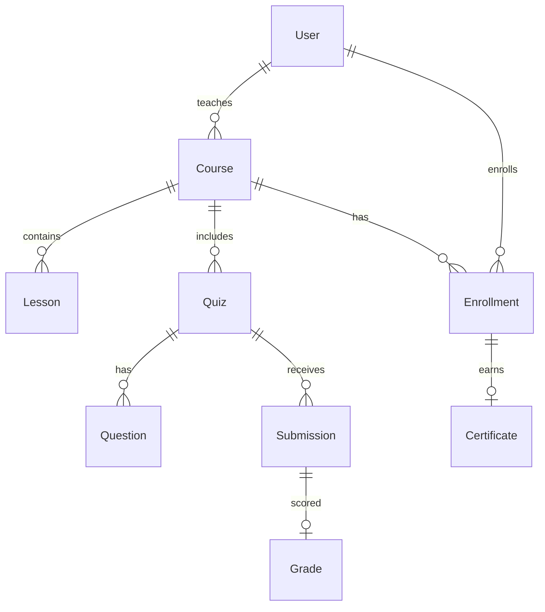

# Learning Management System

[← Back to Projects Index](README.md)

|                  |                                                                                   |
| ---------------- | --------------------------------------------------------------------------------- |
| **Slug**         | `lms`                                                                             |
| **Implement in** | `apps/api/` + `apps/web/` (auth on `apps/api-gateway`) on branch `<dev-name>/lms` |

## Problem

Training content is ineffective when courses, enrollment, and assessment are disconnected. Instructors need to publish structured material; students need a clear path to enroll, learn, submit work, and receive grades.

**Who uses this system**

| Actor          | Goal                                                                  |
| -------------- | --------------------------------------------------------------------- |
| **Instructor** | Create courses with ordered lessons and quizzes; grade submissions    |
| **Student**    | Browse courses, enroll, complete lessons, submit quizzes, view grades |
| **Admin**      | Platform-level administration                                         |

**Pain points you are solving**

- Students enrolling multiple times in the same course.
- Submissions accepted after a due date has passed.
- Unpublished drafts appearing in the public catalog.
- Quizzes created piecemeal without atomic question setup.

**What you are building**

An LMS: courses contain ordered lessons and quizzes; students enroll once per course; instructors grade submissions; the catalog lists only published, non-deleted courses. Progress tracking and certificates are enhancements for a complete learning experience.

## Application flow (end-to-end)

```text
1. Instructor (staff) creates Course → adds ordered Lessons → creates Quiz with Questions
2. Student (user) browses published courses (filter: published, search q)
3. Student enrolls → one enrollment per student per course (invariant)
4. Student views lessons → submits Quiz before due date (Should)
5. Instructor grades Submission → Grade record; optional Certificate on pass (Should)
6. Soft-deleted courses hidden from catalog
7. Admin oversees platform (optional)
```

Create quiz + questions atomically. Grading may write Grade + Certificate in one transaction.

## Roles in detail

| Domain role    | Gateway role | Purpose                                             |
| -------------- | ------------ | --------------------------------------------------- |
| **admin**      | `admin`      | Platform administration                             |
| **instructor** | `staff`      | Create courses, lessons, quizzes; grade submissions |
| **student**    | `user`       | Enroll, learn, submit quizzes, view grades          |

### admin

- **Can:** View all courses and enrollments; moderate content if implemented.
- **Typical screens:** Admin course list (optional).

### instructor (maps to `staff`)

- **Can:** CRUD own courses, lessons, quizzes; publish/unpublish; grade submissions for own courses.
- **Cannot:** Enroll as student in own course for grading bypass; edit other instructors' courses.
- **Typical screens:** Instructor dashboard (ungraded count — Should), course editor, grading queue.

### student (maps to `user`)

- **Can:** Browse catalog; enroll once per course; view lessons; submit quiz answers; view own grades.
- **Cannot:** Submit after due date; create courses; grade others' work.
- **Typical screens:** Course catalog, course detail, learning view `/learn/[courseId]`, my enrollments.

## User journeys

These journeys describe how people actually use the app — in plain language. Read them to understand the experience you are building, then walk through them during implementation and before your demo.

**Technical details** (API paths, status codes, database columns) live in **Backend expectations**, **Enums and state machines**, and **Edge cases**. These journeys explain _what should happen_ from the user's point of view.

### Everyone

#### Signing in to reach a private page _(Must)_

**Who:** Anyone who is not logged in

**Goal:** Private areas require login first.

1. Someone opens a link to a private page (for example the dashboard or their personal list) without being logged in.
2. The app sends them to the login screen instead of showing empty or broken content.
3. After they sign in with a valid account, they land on the page they originally wanted.
4. If they refresh the browser, they stay signed in and the page still loads correctly.

#### Each role sees only their part of the app _(Must)_

**Who:** Regular user vs Instructor (staff)

**Goal:** Users and instructor (staff) accounts must not share the same screens or powers.

1. A regular user signs in and uses the app. Menus and buttons for instructor (staff) work are hidden or disabled.
2. If they manually open a instructor (staff) URL (such as /instructor/courses), they see an access denied message — not another person's data.
3. When they sign out and sign in as Instructor (staff), those pages open normally and they can create and manage records.

#### When there is nothing to show in the course catalog _(Must)_

**Who:** Anyone browsing a list

**Goal:** The course catalog should feel intentional even when empty or still loading.

1. While the course catalog is loading, the user sees a skeleton or spinner — not a flash of wrong data or a blank white screen.
2. If filters or search return no courses, a friendly empty state explains that nothing matched and offers to clear filters.
3. Clearing filters brings back the normal list when matching courses exist.
4. Slow network: loading state stays visible until real data or a genuine empty result arrives.

#### Removing a course from public view _(Must)_

**Who:** Instructor (staff)

**Goal:** Deleted courses should disappear for everyone except the owner reviewing history.

1. The instructor (staff) creates a course that appears in the public course catalog.
2. They delete it using the normal delete action and confirm in a dialog.
3. The course no longer appears in the public course catalog or in search results.
4. Opening an old bookmark to that course shows a polite “no longer available” message.
5. The owner can still find it in instructor studio with a deleted badge if the brief includes an audit or trash view (Should).

### Instructor

#### Instructor builds a course with ordered lessons _(Must)_

**Who:** Dr. Lee, instructor (gateway role: `staff`)

**Goal:** Publish structured learning content.

1. Dr. Lee creates a course with title and description.
2. They add lessons in order — lesson 1 before lesson 2.
3. Lessons can be reordered before publishing.
4. Publishing makes the course visible on the public catalog.

#### Instructor creates a quiz and grades submissions _(Must)_

**Who:** Dr. Lee, instructor

**Goal:** Assess student work.

1. Dr. Lee adds a quiz with several questions to the course.
2. After a student submits, the submission appears in the grading queue.
3. Dr. Lee enters a score and feedback; the student sees the grade on their result page.

### Student

#### Student enrolls in a course _(Must)_

**Who:** Priya, student (gateway role: `user`)

**Goal:** Join a course once.

1. Priya opens a published course and clicks **Enroll**.
2. The button changes to show she is enrolled; the course appears under **My courses**.
3. Enrolling a second time is blocked.

#### Student takes a quiz _(Must)_

**Who:** Priya, student

**Goal:** Submit answers and receive a grade.

1. Priya completes all quiz questions and submits.
2. She sees confirmation that the quiz was received.
3. After the instructor grades it, her score appears when she returns to the quiz.
4. Submitting after the due date is not allowed.

#### Student browses the catalog _(Must)_

**Who:** Priya, student

**Goal:** Discover published courses.

1. Priya searches and filters the course catalog.
2. Only published courses appear — drafts stay in the instructor studio.
3. Pagination works when many courses match.

#### Lesson progress and certificate _(Should)_

**Who:** Priya, student

**Goal:** Track completion (optional enhancements).

1. Priya marks lessons complete as she reads them; the course sidebar shows checkmarks.
2. When all lessons and quizzes are done, she can download or view a certificate.
3. Incomplete courses do not offer a certificate.

## What is expected

### Must — required to pass

| Requirement               | What it means for you                          |
| ------------------------- | ---------------------------------------------- |
| Courses + ordered lessons | `order` or `position` field on Lesson          |
| Enrollments               | Unique student+course                          |
| Quiz + submission         | Questions nested; student answers stored       |
| Instructor grading        | Grade linked to submission                     |
| List/filter courses       | Published filter + search; soft-deleted hidden |
| Shared Must bar           | [grading.md](../grading.md)                    |

### Should — distinction

Instructor dashboard; lesson progress tracking; certificates; quiz due dates.

### Stretch — bonus

Video streaming, proctored exams, SCORM import.

## Frontend expectations

> Shared UI bar for all projects: [Frontend expectations](README.md#frontend-expectations-all-projects) · [frontend.md](../frontend.md)

### Domain screens

| Route                         | Role(s)              | UI expectations                                                                    |
| ----------------------------- | -------------------- | ---------------------------------------------------------------------------------- |
| `/courses`                    | Student              | Published course catalog; search/filter bar; card grid with title, instructor      |
| `/courses/[id]`               | Student              | Syllabus (ordered lessons); **Enroll** button; hide if already enrolled            |
| `/learn/[courseId]`           | Student              | Lesson list with progress indicator (Should); quiz link per lesson/course          |
| `/learn/[courseId]/quiz/[id]` | Student              | Question form; submit before due date; show locked state after due                 |
| `/instructor`                 | Instructor (`staff`) | Course list owned by instructor; create course; ungraded submission count (Should) |
| `/instructor/courses/[id]`    | Instructor           | Edit lessons order; quiz builder; grading queue                                    |

### UI behaviour

- **Catalog vs studio:** Students never see draft/unpublished courses in `/courses`.
- **Grading:** Instructor sees submission list; grade form sets score/feedback; student sees grade on return visit.
- **Enrollment:** Disable enroll button + show message if already enrolled.

## Backend expectations

> Shared API bar for all projects: [Backend expectations](README.md#backend-expectations-all-projects) · [architecture.md](../architecture.md)

### Modules

| Module        | Entity(ies)                               | Responsibility                                              |
| ------------- | ----------------------------------------- | ----------------------------------------------------------- |
| `courses`     | `Course`, `Lesson`                        | Instructor CRUD; ordered lessons; publish flag; soft-delete |
| `enrollments` | `Enrollment`                              | Student enroll; unique per course                           |
| `quizzes`     | `Quiz`, `Question`, `Submission`, `Grade` | Nested create; submit; grade                                |

### Key endpoints

| Method | Path           | Role  | Notes                                    |
| ------ | -------------- | ----- | ---------------------------------------- |
| `GET`  | `/courses`     | all   | Filter `published=true`; exclude deleted |
| `POST` | `/enrollments` | user  | Unique student+course                    |
| `POST` | `/quizzes`     | staff | Transaction: quiz + questions            |
| `POST` | `/submissions` | user  | Reject if past `dueAt`                   |
| `POST` | `/grades`      | staff | Link to submission                       |

### Service rules

- `EnrollmentsService.create`: unique constraint → `409` on duplicate.
- `SubmissionsService.create`: compare `now` to quiz `dueAt`.
- Publish list: `publishedAt IS NOT NULL AND deletedAt IS NULL`.

### Enums and state machines

**Question.type:** `mcq`, `short_answer`

**Course visibility:** draft (`publishedAt IS NULL`) vs published (`publishedAt IS NOT NULL`)

No status enum on submissions — graded when Grade row exists.

### Database constraints

- `UNIQUE(enrollments.courseId, enrollments.studentId)`
- `UNIQUE(submissions.quizId, submissions.studentId)`
- `UNIQUE(grades.submissionId)`
- `UNIQUE(lessons.courseId, lessons.position)`
- `UNIQUE(courses.slug)`
- `CHECK questions.type IN ('mcq', 'short_answer')`

### Domain seed (minimum)

2 courses (1 published, 1 draft), 5 lessons, 2 quizzes with 3 questions each, 3 enrollments, 2 submissions (1 graded), 1 certificate.

### Web routes auth

| Route                       | Auth required | Roles                   |
| --------------------------- | ------------- | ----------------------- |
| /courses                    | No            | All (published catalog) |
| /courses/[id]               | No            | All (published detail)  |
| /learn/[courseId]           | Yes           | user (enrolled)         |
| /learn/[courseId]/quiz/[id] | Yes           | user (enrolled)         |
| /my/courses                 | Yes           | user                    |
| /instructor                 | Yes           | staff                   |
| /instructor/courses/[id]    | Yes           | staff (owner)           |

## Suggested entities

- Auth `User` is on the gateway — use `userId` FKs; do **not** recreate users/auth in `apps/api`
- `Course`
- `Enrollment`
- `Lesson`
- `Quiz`
- `Question`
- `Submission`
- `Grade`
- `Certificate`

## ERD (starter)



## Hard invariant

One enrollment per student per course; cannot submit after due date.

## Required transaction

Create quiz + questions atomically; grading writes Grade + optional Certificate.

## Must (pass)

- [ ] Courses + lessons (ordered)
- [ ] Enrollments
- [ ] Quiz with questions + student submission
- [ ] Instructor grading
- [ ] List/filter courses (published, q)
- [ ] Soft-delete courses hide from catalog

Plus the shared Must bar in [grading.md](../grading.md).

## Should (distinction)

- [ ] Instructor dashboard (enrollment counts, ungraded submissions)
- [ ] Student progress (% lessons viewed — track LessonProgress)
- [ ] Certificates issued when course completed + final quiz passed
- [ ] Due dates on quizzes

## Stretch (bonus)

- [ ] Video streaming
- [ ] Proctored exams
- [ ] SCORM import

## API outline (indicative)

- `CRUD /courses`
- `CRUD /lessons`
- `POST /enrollments`
- `CRUD /quizzes`
- `POST /submissions`
- `POST /grades`

## FE routes (indicative)

- `/`
- `/courses`
- `/courses/[id]`
- `/learn/[courseId]`
- `/instructor`

> Shared: [FAQ & edge cases](README.md#faq--read-before-you-ask) · [grading](../grading.md)

## Edge cases and negative scenarios

### Domain — enrollment, quizzes, publish

| Scenario                                     | Expected API                                                       | UI hint                          |
| -------------------------------------------- | ------------------------------------------------------------------ | -------------------------------- |
| Second enrollment same course                | **409**                                                            | Disabled Enroll button           |
| Enroll in unpublished course                 | **400/404**                                                        | Catalog excludes unpublished     |
| Submit quiz after `dueAt`                    | **400**                                                            | Show locked quiz UI              |
| Submit without enrollment                    | **403**                                                            | Require enrollment before quiz   |
| Student grades own submission                | **403**                                                            | Grading staff-only               |
| Instructor edits another instructor’s course | **403/404**                                                        | Scope by `course.instructorId`   |
| Quiz create with 0 questions                 | **400**                                                            | Require ≥1 question              |
| Partial quiz create failure (transaction)    | **Rollback** — no orphan quiz                                      | —                                |
| GET unpublished course by slug/id as student | **404**                                                            | —                                |
| Soft-deleted course in catalog               | **Must not list**                                                  | —                                |
| Re-submit same quiz                          | **409** on second submission — one submission per student per quiz | Disable after submit             |
| Grade before submission exists               | **404**                                                            | —                                |
| Filter `published=false` as student          | **200** empty or **403** — catalog defaults published only         | —                                |
| Lesson order duplicate positions             | **400** — `position` must be unique per course                     | Drag order or integer `position` |

### Demo 4xx cases

1. Double enrollment → **409**
2. Late quiz submission → **400**
3. Student accesses draft course → **404**

## FAQ — decisions already made

| Question                                      | Answer                                                                                |
| --------------------------------------------- | ------------------------------------------------------------------------------------- |
| Publish = separate field or action?           | **`publishedAt` timestamptz** — set via `PATCH /courses/:id/publish`.                 |
| Can student see other students’ grades?       | **No** — own submissions only.                                                        |
| Instructor must enroll to preview as student? | **No** — instructor preview via instructor routes; don’t bypass enrollment invariant. |
| Certificate on Must?                          | **No** — Should tier.                                                                 |
| Quiz due date on Must?                        | **No** — Should; if not built, omit due date checks from Must demo.                   |
| Video lessons?                                | **Stretch** — text/markdown lesson body is enough.                                    |
| One instructor per course?                    | **Yes** — `course.instructorId` on create; see the enums and constraints above.       |

## Definition of done

- Domain migrations (`pnpm migration:run:api`) + domain seed (≥8 realistic rows); gateway users via `pnpm seed`
- Compose Postgres + root `.env` + `apps/api-gateway/.env` + `apps/api/.env` + `apps/web/.env.local`
- Next + Query + RTK ownership respected; UI uses `@shared/ui/components` + theme ([frontend.md](../frontend.md))
- `docs/architecture.md` completed
- 5-minute demo script in the PR body (and notes in `docs/architecture.md`)

## Demo script (suggested — adapt for your PR)

1. **Roles (30s):** Instructor course editor → student catalog → instructor grading queue.
2. **Happy path (2m):** Publish course → enroll → submit quiz → grade.
3. **Invariant (30s):** Double enrollment or late submission → 4xx.
4. **Lists (1m):** Filter published courses; soft-delete → hidden from catalog.
