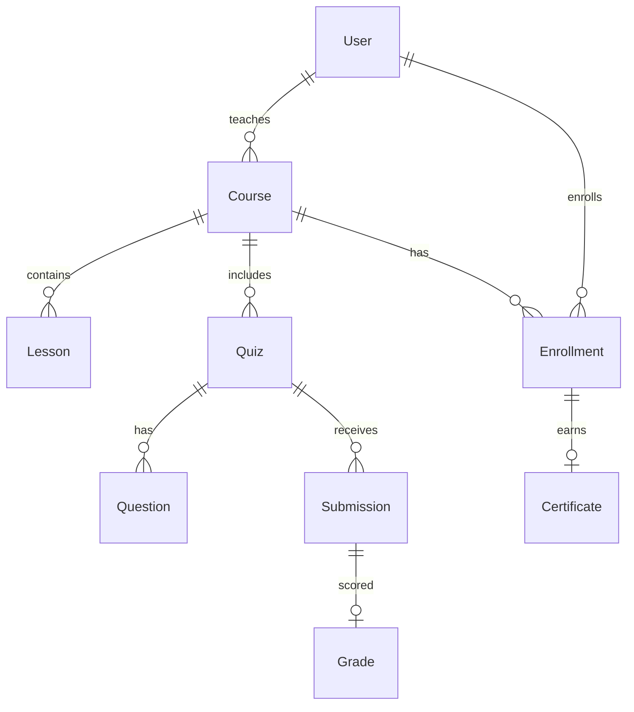

# Learning Management System

|                  |                                                      |
| ---------------- | ---------------------------------------------------- |
| **Slug**         | `lms`                                                |
| **Implement in** | `apps/api/` + `apps/web/` on branch `<dev-name>/lms` |

## Problem

Instructors publish courses with lessons and quizzes; students enroll, submit work, and get graded.

## Personas / roles

- admin
- instructor (staff)
- student (user)

## Suggested entities

- `User`
- `Course`
- `Enrollment`
- `Lesson`
- `Quiz`
- `Question`
- `Submission`
- `Grade`
- `Certificate`

## ERD (starter)

## Hard invariant

One enrollment per student per course; cannot submit after due date.

## Required transaction

Create quiz + questions atomically; grading writes Grade + optional Certificate.

## Must (pass)

- [ ] Courses + lessons (ordered)
- [ ] Enrollments
- [ ] Quiz with questions + student submission
- [ ] Instructor grading
- [ ] List/filter courses (published, q)
- [ ] Soft-delete courses hide from catalog

Plus the shared Must bar in [grading.md](../grading.md).

## Should (distinction)

- [ ] Instructor dashboard (enrollment counts, ungraded submissions)
- [ ] Student progress (% lessons viewed — track LessonProgress)
- [ ] Certificates issued when course completed + final quiz passed
- [ ] Due dates on quizzes

## Stretch (bonus)

- [ ] Video streaming
- [ ] Proctored exams
- [ ] SCORM import

## API outline (indicative)

- `CRUD /courses`
- `CRUD /lessons`
- `POST /enrollments`
- `CRUD /quizzes`
- `POST /submissions`
- `POST /grades`

## FE routes (indicative)

- `/`
- `/courses`
- `/courses/[id]`
- `/learn/[courseId]`
- `/instructor`

## Definition of done

- Migrations + seed (≥8 realistic rows across core tables)
- Compose Postgres + project `.env`
- Next + Query + RTK ownership respected
- `docs/architecture.md` completed
- 5-minute demo script in the PR body (and notes in `docs/architecture.md`)

## Demo script (fill in)

1. Login as each role
2. Happy path for core workflow
3. Show invariant failure (expect 4xx)
4. Show list filters + soft-delete behaviour
