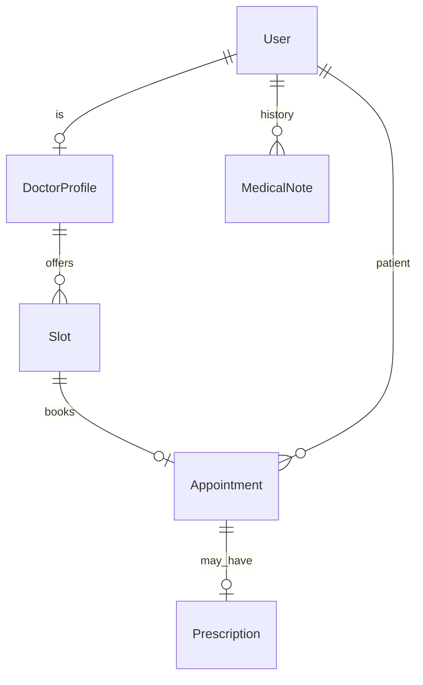

# Hospital Appointment System

|                  |                                                                        |
| ---------------- | ---------------------------------------------------------------------- |
| **Slug**         | `hospital-appointments`                                                |
| **Implement in** | `apps/api/` + `apps/web/` on branch `<dev-name>/hospital-appointments` |

## Problem

Patients book doctor slots; doctors manage schedules; staff maintain prescriptions and history notes.

## Personas / roles

- admin
- doctor (staff)
- patient (user)

## Suggested entities

- `User`
- `DoctorProfile`
- `Slot`
- `Appointment`
- `Prescription`
- `MedicalNote`

## ERD (starter)

## Hard invariant

No double-booking a slot; cancel soft-deletes appointment and frees slot in one transaction.

## Required transaction

Book: mark slot reserved + create appointment; Cancel: free slot + soft-delete appointment.

## Must (pass)

- [ ] Doctor profiles + generated/seeded slots
- [ ] Patient books available slot
- [ ] Cancel frees slot
- [ ] List appointments filtered by date + status
- [ ] Roles enforced (patients book self only)
- [ ] Soft-delete doctors deactivate future slots

Plus the shared Must bar in [grading.md](../grading.md).

## Should (distinction)

- [ ] Doctor schedule management (create/block slots)
- [ ] Prescriptions attached to completed appointments
- [ ] Medical history notes (patient-scoped, doctor-authored)
- [ ] Admin hospital-wide appointment search

## Stretch (bonus)

- [ ] HL7/FHIR export
- [ ] SMS reminders
- [ ] Insurance claims

## API outline (indicative)

- `CRUD /doctors`
- `CRUD /slots`
- `POST /appointments`
- `DELETE /appointments/:id`
- `CRUD /prescriptions`

## FE routes (indicative)

- `/`
- `/doctors`
- `/doctors/[id]`
- `/appointments`
- `/doctor/schedule`

## Definition of done

- Migrations + seed (≥8 realistic rows across core tables)
- Compose Postgres + project `.env`
- Next + Query + RTK ownership respected
- `docs/architecture.md` completed
- 5-minute demo script in the PR body (and notes in `docs/architecture.md`)

## Demo script (fill in)

1. Login as each role
2. Happy path for core workflow
3. Show invariant failure (expect 4xx)
4. Show list filters + soft-delete behaviour
