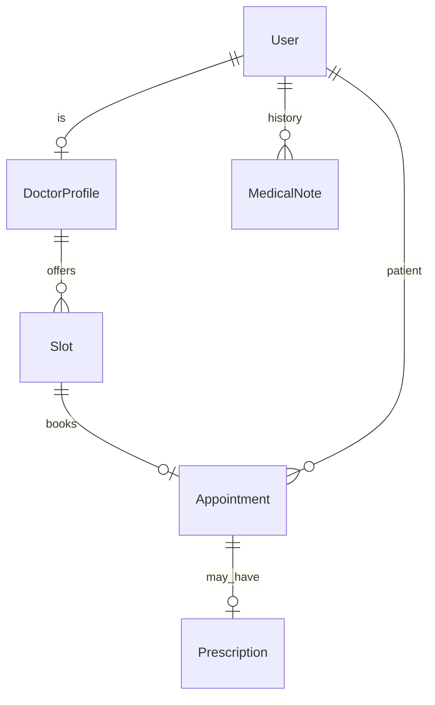

# Hospital Appointment System

[← Back to Projects Index](README.md)

|                  |                                                                                                     |
| ---------------- | --------------------------------------------------------------------------------------------------- |
| **Slug**         | `hospital-appointments`                                                                             |
| **Implement in** | `apps/api/` + `apps/web/` (auth on `apps/api-gateway`) on branch `<dev-name>/hospital-appointments` |

## Problem

Scheduling medical appointments by phone is error-prone: slots get double-booked, cancellations do not free capacity, and patients lack a self-service view of their visits.

**Who uses this system**

| Actor       | Goal                                                                           |
| ----------- | ------------------------------------------------------------------------------ |
| **Doctor**  | Manage availability, view appointments, document visits (prescriptions, notes) |
| **Patient** | Find doctors, book available slots, cancel when needed, view own history       |
| **Admin**   | Hospital-wide visibility and configuration                                     |

**Pain points you are solving**

- Two patients booked into the same slot.
- Cancelled appointments leaving slots permanently blocked.
- Patients booking on behalf of others without authorization.
- No filtered list of appointments by date or status.

**What you are building**

An appointment system: doctors have profiles and time slots; patients book only for themselves; booking and cancellation update slot availability in transactions. Prescriptions and medical notes extend the visit workflow.

## Application flow (end-to-end)

```text
1. Doctor (staff) has DoctorProfile → system or doctor creates available Slots
2. Patient (user) browses doctors → views available slots by date
3. Patient books slot → transaction: slot reserved + Appointment created (no double-book)
4. Patient lists own appointments; filters by date + status
5. Cancel appointment → transaction: free slot + soft-delete appointment
6. Doctor completes visit → attaches Prescription (Should); adds MedicalNote (Should)
7. Admin searches all appointments hospital-wide (Should)
8. Soft-deleted doctors → future slots deactivated
```

## Roles in detail

| Domain role | Gateway role | Purpose                                                           |
| ----------- | ------------ | ----------------------------------------------------------------- |
| **admin**   | `admin`      | Hospital-wide visibility and configuration                        |
| **doctor**  | `staff`      | Manage schedule, view own appointments, write prescriptions/notes |
| **patient** | `user`       | Book and cancel own appointments only                             |

### admin

- **Can:** Search all appointments; manage doctor profiles; deactivate doctors.
- **Typical screens:** Hospital appointment search (Should).

### doctor (maps to `staff`)

- **Can:** Manage own slots (Should); view appointments for own slots; add prescriptions and notes for own patients.
- **Cannot:** Book appointments as a patient for someone else.
- **Typical screens:** Schedule management `/doctor/schedule`, appointment list, prescription form.

### patient (maps to `user`)

- **Can:** Browse doctors; book available slots for self; cancel own appointments; view own history.
- **Cannot:** Book for another userId; book already-reserved slots.
- **Typical screens:** Doctor directory, slot picker, my appointments.

Patients book **self only** — enforce `appointment.patientId === currentUser.id`.

## User journeys

These journeys describe how people actually use the app — in plain language. Read them to understand the experience you are building, then walk through them during implementation and before your demo.

**Technical details** (API paths, status codes, database columns) live in **Backend expectations**, **Enums and state machines**, and **Edge cases**. These journeys explain _what should happen_ from the user's point of view.

### Everyone

#### Signing in to reach a private page _(Must)_

**Who:** Anyone who is not logged in

**Goal:** Private areas require login first.

1. Someone opens a link to a private page (for example the dashboard or their personal list) without being logged in.
2. The app sends them to the login screen instead of showing empty or broken content.
3. After they sign in with a valid account, they land on the page they originally wanted.
4. If they refresh the browser, they stay signed in and the page still loads correctly.

#### Each role sees only their part of the app _(Must)_

**Who:** Regular user vs Doctor (staff)

**Goal:** Users and doctor (staff) accounts must not share the same screens or powers.

1. A regular user signs in and uses the app. Menus and buttons for doctor (staff) work are hidden or disabled.
2. If they manually open a doctor (staff) URL (such as /doctor/schedule), they see an access denied message — not another person's data.
3. When they sign out and sign in as Doctor (staff), those pages open normally and they can create and manage records.

#### When there is nothing to show in the appointment list _(Must)_

**Who:** Anyone browsing a list

**Goal:** The appointment list should feel intentional even when empty or still loading.

1. While the appointment list is loading, the user sees a skeleton or spinner — not a flash of wrong data or a blank white screen.
2. If filters or search return no appointments, a friendly empty state explains that nothing matched and offers to clear filters.
3. Clearing filters brings back the normal list when matching appointments exist.
4. Slow network: loading state stays visible until real data or a genuine empty result arrives.

#### Removing a doctor profile from public view _(Must)_

**Who:** Admin

**Goal:** Deleted doctor profiles should disappear for everyone except the owner reviewing history.

1. The admin creates a doctor profile that appears in public doctor directory.
2. They delete it using the normal delete action and confirm in a dialog.
3. The doctor profile no longer appears in public doctor directory or in search results.
4. Opening an old bookmark to that doctor profile shows a polite “no longer available” message.
5. The owner can still find it in admin doctor list with a deleted badge if the brief includes an audit or trash view (Should).

### Doctor

#### Doctor views their schedule _(Must)_

**Who:** Dr. Patel, physician (gateway role: `staff`)

**Goal:** See when they are available and booked.

1. Dr. Patel opens the weekly schedule and sees open slots versus booked appointments.
2. Moving to the next week loads that week's availability.

#### Doctor manages availability _(Should)_

**Who:** Dr. Patel, physician

**Goal:** Add or change slots patients can book.

1. Dr. Patel adds a new 30-minute slot on a future date.
2. The slot appears on the public booking page for that doctor.
3. Deleting an unused slot removes it from booking.
4. A slot that already has an appointment cannot be deleted until the appointment is handled.

#### Doctor documents a visit _(Should)_

**Who:** Dr. Patel, physician

**Goal:** Record notes and prescriptions after an appointment.

1. After a completed visit, Dr. Patel adds clinical notes and a prescription.
2. The patient sees appropriate summary information on their appointment — not internal-only fields.

### Patient

#### Patient books an available slot _(Must)_

**Who:** Jamie, patient (gateway role: `user`)

**Goal:** Reserve a time without double-booking.

1. Jamie picks a doctor, chooses an open slot, and confirms the booking.
2. A confirmation screen shows date, time, and doctor.
3. That slot disappears for other patients.
4. If two patients try the same slot at once, only one booking succeeds.

#### Patient cancels and frees the slot _(Must)_

**Who:** Jamie, patient

**Goal:** Release a time they cannot use.

1. Jamie opens an upcoming appointment and cancels it.
2. It leaves the upcoming list and the slot becomes bookable again for others.

#### Patient filters their appointments _(Must)_

**Who:** Jamie, patient

**Goal:** Find past and upcoming visits.

1. Jamie filters by date range and status (confirmed, cancelled, completed).
2. Clearing filters shows the full history again.

## What is expected

### Must — required to pass

| Requirement             | What it means for you                  |
| ----------------------- | -------------------------------------- |
| Doctor profiles + slots | Seeded or CRUD slots with availability |
| Patient booking         | Self-only; atomic slot reservation     |
| Cancel frees slot       | Paired transaction                     |
| List + filters          | Date range and status on appointments  |
| Role enforcement        | `@Roles` + ownership on book/cancel    |
| Soft-delete doctors     | Future slots deactivated               |
| Shared Must bar         | [grading.md](../grading.md)            |

### Should — distinction

Doctor schedule CRUD; prescriptions; medical notes; admin search.

### Stretch — bonus

HL7/FHIR export, SMS reminders, insurance claims.

## Frontend expectations

> Shared UI bar for all projects: [Frontend expectations](README.md#frontend-expectations-all-projects) · [frontend.md](../frontend.md)

### Domain screens

| Route                          | Role(s)          | UI expectations                                                       |
| ------------------------------ | ---------------- | --------------------------------------------------------------------- |
| `/doctors`                     | Patient          | Directory table/cards; specialty, name; link to detail                |
| `/doctors/[id]`                | Patient          | Available slots by date (calendar or slot list); **Book** per slot    |
| `/appointments`                | Patient          | My appointments with date, doctor, status; cancel action              |
| `/doctor/schedule`             | Doctor (`staff`) | Slot management (Should): create/block slots; view day's appointments |
| `/admin/appointments` (Should) | Admin            | Hospital-wide searchable appointment list                             |

### UI behaviour

- **Booking:** Confirm slot time before submit; refresh slots after cancel.
- **Cancel:** Confirm dialog; slot becomes available in UI after success.
- **Patient-only:** No booking UI for other patients' appointments.

## Backend expectations

> Shared API bar for all projects: [Backend expectations](README.md#backend-expectations-all-projects) · [architecture.md](../architecture.md)

### Modules

| Module                   | Entity(ies)                   | Responsibility                   |
| ------------------------ | ----------------------------- | -------------------------------- |
| `doctors`                | `DoctorProfile`, `Slot`       | Profiles; slot availability      |
| `appointments`           | `Appointment`                 | Book/cancel; link patient + slot |
| `prescriptions` (Should) | `Prescription`, `MedicalNote` | Post-visit documentation         |

### Key endpoints

| Method   | Path                 | Role             | Notes                                           |
| -------- | -------------------- | ---------------- | ----------------------------------------------- |
| `GET`    | `/doctors/:id/slots` | user             | Available slots only                            |
| `POST`   | `/appointments`      | user             | Transaction: reserve slot + create appointment  |
| `DELETE` | `/appointments/:id`  | user             | Transaction: free slot + soft-delete; self only |
| `GET`    | `/appointments`      | user/staff/admin | Filters: date, status                           |

### Service rules

- Booking: slot must be `available`; patientId must equal current user.
- Cancel + book: atomic slot status updates.

### Enums and state machines

**Slot.status:** `available`, `booked`, `blocked`

**Appointment.status:** `scheduled`, `cancelled`, `completed`

### Database constraints

- `UNIQUE(doctor_profiles.userId)`
- `UNIQUE(appointments.slotId)` WHERE status='scheduled'
- `CHECK slots.endsAt > slots.startsAt`

### Domain seed (minimum)

3 doctors, 8 slots (5 available), 4 appointments, 2 prescriptions.

### Web routes auth

| Route            | Auth required | Roles |
| ---------------- | ------------- | ----- |
| /doctors         | No            | All   |
| /doctors/[id]    | No            | All   |
| /appointments    | Yes           | user  |
| /doctor/schedule | Yes           | staff |

## Suggested entities

- Auth `User` is on the gateway — use `userId` FKs; do **not** recreate users/auth in `apps/api`
- `DoctorProfile`
- `Slot`
- `Appointment`
- `Prescription`
- `MedicalNote`

## ERD (starter)



## Hard invariant

No double-booking a slot; cancel soft-deletes appointment and frees slot in one transaction.

## Required transaction

Book: mark slot reserved + create appointment; Cancel: free slot + soft-delete appointment.

## Must (pass)

- [ ] Doctor profiles + generated/seeded slots
- [ ] Patient books available slot
- [ ] Cancel frees slot
- [ ] List appointments filtered by date + status
- [ ] Roles enforced (patients book self only)
- [ ] Soft-delete doctors deactivate future slots

Plus the shared Must bar in [grading.md](../grading.md).

## Should (distinction)

- [ ] Doctor schedule management (create/block slots)
- [ ] Prescriptions attached to completed appointments
- [ ] Medical history notes (patient-scoped, doctor-authored)
- [ ] Admin hospital-wide appointment search

## Stretch (bonus)

- [ ] HL7/FHIR export
- [ ] SMS reminders
- [ ] Insurance claims

## API outline (indicative)

- `CRUD /doctors`
- `CRUD /slots`
- `POST /appointments`
- `DELETE /appointments/:id`
- `CRUD /prescriptions`

## FE routes (indicative)

- `/`
- `/doctors`
- `/doctors/[id]`
- `/appointments`
- `/doctor/schedule`

> Shared: [FAQ & edge cases](README.md#faq--read-before-you-ask) · [grading](../grading.md)

## Edge cases and negative scenarios

### Domain — slots and booking

| Scenario                               | Expected API                                       | UI hint                     |
| -------------------------------------- | -------------------------------------------------- | --------------------------- |
| Double-book same slot                  | **409** on second book                             | Slot disappears when taken  |
| Book cancelled slot                    | **409/400**                                        | Refresh availability        |
| Patient books for another userId       | **403** — force `patientId = currentUser`          | No patient picker for users |
| Cancel another patient’s appointment   | **403/404**                                        | My appointments only        |
| Cancel already cancelled               | **400** — appointment already cancelled            | —                           |
| Book slot in the past                  | **400**                                            | Filter past slots from UI   |
| Doctor double-book overlapping slots   | **Allowed** if different slots — same slot **409** | —                           |
| Soft-deleted doctor                    | Future slots **not bookable**                      | Remove from directory       |
| Prescription on incomplete appointment | **400** (Should)                                   | Complete visit first        |
| List appointments for doctor           | Doctor sees **own** slots’ appointments only       | —                           |
| Admin views all                        | **admin** role route                               | —                           |

### Demo 4xx cases

1. Two patients one slot → second **409**
2. Patient cancels someone else’s appointment → **403**

## FAQ — decisions already made

| Question                           | Answer                                                              |
| ---------------------------------- | ------------------------------------------------------------------- |
| Who creates slots?                 | **Seed + Should:** doctor creates; Must can be **seed-only** slots. |
| Slot duration?                     | **30 minutes fixed**; store `startsAt`/`endsAt` as timestamptz UTC. |
| Telehealth / video?                | **Out of scope** — in-person slot booking only.                     |
| Medical records portability (HL7)? | **Stretch** only.                                                   |
| Patient register vs seed?          | Register creates `user` — patients can self-register.               |

## Definition of done

- Domain migrations (`pnpm migration:run:api`) + domain seed (≥8 realistic rows); gateway users via `pnpm seed`
- Compose Postgres + root `.env` + `apps/api-gateway/.env` + `apps/api/.env` + `apps/web/.env.local`
- Next + Query + RTK ownership respected; UI uses `@shared/ui/components` + theme ([frontend.md](../frontend.md))
- `docs/architecture.md` completed
- 5-minute demo script in the PR body (and notes in `docs/architecture.md`)

## Demo script (suggested — adapt for your PR)

1. **Roles (30s):** Doctor schedule → patient doctor list → admin search (if built).
2. **Happy path (2m):** Book slot → show appointment → cancel → slot available again.
3. **Invariant (30s):** Two patients same slot → second gets 4xx.
4. **Lists (1m):** Filter appointments by date/status.
