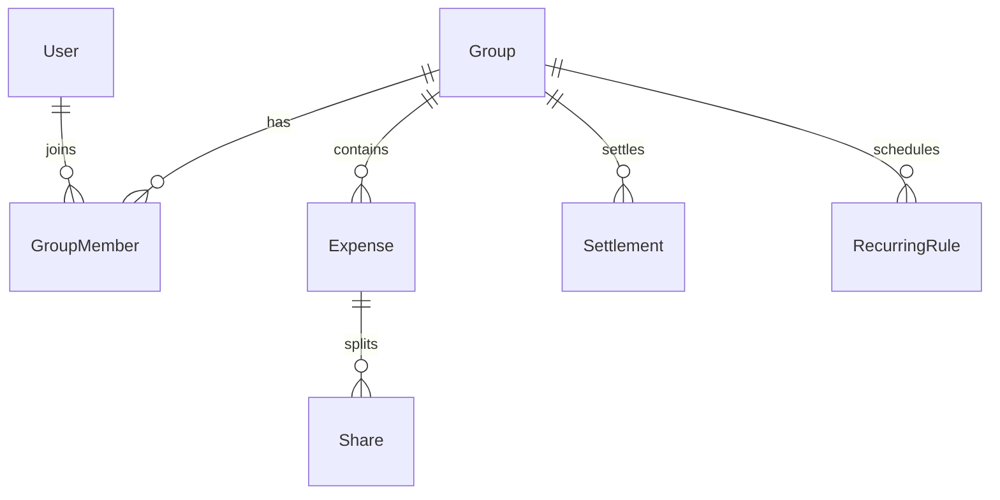

# Expense Split

|                  |                                                                |
| ---------------- | -------------------------------------------------------------- |
| **Slug**         | `expense-split`                                                |
| **Implement in** | `apps/api/` + `apps/web/` on branch `<dev-name>/expense-split` |

## Problem

Groups track shared expenses, balances, settlements, and reports.

## Personas / roles

- admin
- member (user)
- group_admin (staff)

## Suggested entities

- `User`
- `Group`
- `GroupMember`
- `Expense`
- `Share`
- `Settlement`
- `RecurringRule`

## ERD (starter)

## Hard invariant

Shares for an expense must sum exactly to the expense amount (cents).

## Required transaction

Create expense + shares together; settlement creates offsetting ledger rows.

## Must (pass)

- [ ] Groups + membership
- [ ] Expenses with shares
- [ ] Balances endpoint per group
- [ ] Settle up between two members
- [ ] List/filter expenses by date range + payer
- [ ] Soft-delete expenses with audit visibility for group_admin

Plus the shared Must bar in [grading.md](../grading.md).

## Should (distinction)

- [ ] Recurring expenses (rule + generated instances)
- [ ] Simple reports (by category, by member)
- [ ] Categories on expenses
- [ ] Dashboard of groups you owe / are owed

## Stretch (bonus)

- [ ] Currency conversion
- [ ] Bank sync
- [ ] PDF export

## API outline (indicative)

- `CRUD /groups`
- `POST /expenses`
- `GET /groups/:id/balances`
- `POST /settlements`
- `CRUD /recurring`

## FE routes (indicative)

- `/`
- `/groups`
- `/groups/[id]`
- `/groups/[id]/reports`

## Definition of done

- Migrations + seed (≥8 realistic rows across core tables)
- Compose Postgres + root `.env` + `apps/api/.env`
- Next + Query + RTK ownership respected
- `docs/architecture.md` completed
- 5-minute demo script in the PR body (and notes in `docs/architecture.md`)

## Demo script (fill in)

1. Login as each role
2. Happy path for core workflow
3. Show invariant failure (expect 4xx)
4. Show list filters + soft-delete behaviour
