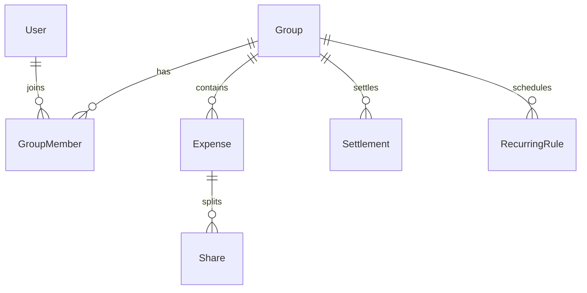

# Expense Split

[← Back to Projects Index](README.md)

|                  |                                                                                             |
| ---------------- | ------------------------------------------------------------------------------------------- |
| **Slug**         | `expense-split`                                                                             |
| **Implement in** | `apps/api/` + `apps/web/` (auth on `apps/api-gateway`) on branch `<dev-name>/expense-split` |

## Problem

Shared costs among roommates, trips, or teams become arguments when nobody agrees on who owes what. Groups need transparent expense logging, fair splits, running balances, and a way to settle up.

**Who uses this system**

| Actor           | Goal                                                   |
| --------------- | ------------------------------------------------------ |
| **Group admin** | Create groups, manage members, oversee expenses        |
| **Member**      | Add shared expenses, view balances, record settlements |
| **Admin**       | Optional platform oversight                            |

**Pain points you are solving**

- Split amounts that do not add up to the expense total.
- No single balances view (“who owes whom”).
- Expenses deleted without any audit for group admins.
- Manual spreadsheets that drift out of date.

**What you are building**

A group expense app: members log expenses with per-person shares that must sum exactly to the total; balances derive from expenses minus settlements; group admins can soft-delete with audit visibility. Reports and recurring expenses add polish.

## Application flow (end-to-end)

```text
1. User creates Group → adds members (group_admin is staff role for a group)
2. Member records Expense with Share rows splitting amount among members
3. Shares must sum exactly to expense total in cents (invariant)
4. Balances endpoint computes who owes whom per group
5. Settlement records payment between two members → updates balances
6. List/filter expenses by date range and payer
7. group_admin soft-deletes expense with audit visibility
```

## Roles in detail

| Domain role     | Gateway role | Purpose                                                   |
| --------------- | ------------ | --------------------------------------------------------- |
| **admin**       | `admin`      | Platform oversight (optional)                             |
| **group_admin** | `staff`      | Create groups, manage members, delete expenses with audit |
| **member**      | `user`       | Add expenses, view balances, settle up                    |

**Locked mapping:** gateway `staff` creates groups and is `GroupMember.role=admin` for that group; gateway `user` joins as `GroupMember.role=member`. In-group admin actions (soft-delete expense) require `GroupMember.role=admin`.

### group_admin / staff

- **Can:** Create groups; invite members; soft-delete expenses; view group reports (Should).
- **Cannot:** Edit expenses they did not create unless you allow admin override.

### member (maps to `user`)

- **Can:** Add expenses with splits; view balances; create settlements; see own groups.
- **Cannot:** Delete others' expenses without group_admin role.
- **Typical screens:** Group detail, add expense form with split calculator, balances summary, settle-up action.

## User journeys

These journeys describe how people actually use the app — in plain language. Read them to understand the experience you are building, then walk through them during implementation and before your demo.

**Technical details** (API paths, status codes, database columns) live in **Backend expectations**, **Enums and state machines**, and **Edge cases**. These journeys explain _what should happen_ from the user's point of view.

### Everyone

#### Signing in to reach a private page _(Must)_

**Who:** Anyone who is not logged in

**Goal:** Private areas require login first.

1. Someone opens a link to a private page (for example the dashboard or their personal list) without being logged in.
2. The app sends them to the login screen instead of showing empty or broken content.
3. After they sign in with a valid account, they land on the page they originally wanted.
4. If they refresh the browser, they stay signed in and the page still loads correctly.

#### Each role sees only their part of the app _(Must)_

**Who:** Regular user vs Group admin (staff)

**Goal:** Users and group admin (staff) accounts must not share the same screens or powers.

1. A regular user signs in and uses the app. Menus and buttons for group admin (staff) work are hidden or disabled.
2. If they manually open a group admin (staff) URL (such as /groups/1/settings), they see an access denied message — not another person's data.
3. When they sign out and sign in as Group admin (staff), those pages open normally and they can create and manage records.

#### When there is nothing to show in the group expense list _(Must)_

**Who:** Anyone browsing a list

**Goal:** The group expense list should feel intentional even when empty or still loading.

1. While the group expense list is loading, the user sees a skeleton or spinner — not a flash of wrong data or a blank white screen.
2. If filters or search return no expenses, a friendly empty state explains that nothing matched and offers to clear filters.
3. Clearing filters brings back the normal list when matching expenses exist.
4. Slow network: loading state stays visible until real data or a genuine empty result arrives.

#### Removing an expense from public view _(Must)_

**Who:** Group admin

**Goal:** Deleted expenses should disappear for everyone except the owner reviewing history.

1. The group admin creates an expense that appears in the group expense list.
2. They delete it using the normal delete action and confirm in a dialog.
3. The expense no longer appears in the group expense list or in search results.
4. Opening an old bookmark to that expense shows a polite “no longer available” message.
5. The owner can still find it in deleted expenses audit view with a deleted badge if the brief includes an audit or trash view (Should).

### Group admin

#### Create a group and invite friends _(Must)_

**Who:** Taylor, group creator (gateway role: `staff`)

**Goal:** Start sharing expenses with the right people.

1. Taylor creates a group with a name and default currency.
2. Taylor invites members by email; they appear in the member list when they join.
3. Only members can see the group's expenses — outsiders cannot.

#### Add an expense with a fair split _(Must)_

**Who:** Any group member

**Goal:** Record who paid and who owes what.

1. Someone adds an expense for $100 and splits it equally among four people ($25 each).
2. After saving, the **Balances** tab shows who owes whom.
3. If the split amounts do not add up to the total, the app refuses to save and explains the mismatch.
4. Uneven splits like $100 ÷ 3 use fair rounding so the cents still total exactly $100.

#### Settle up between members _(Must)_

**Who:** Any group member

**Goal:** Record that a debt was paid offline.

1. The app suggests who should pay whom based on current balances.
2. A member records a settlement payment; owed amounts drop accordingly.
3. After everyone settles, balances show **all clear**.

#### Filter expenses and soft-delete with audit _(Must)_

**Who:** Group admin

**Goal:** Review history and fix mistakes.

1. Members filter expenses by date or who paid.
2. The group admin deletes a mistaken expense; it vanishes from the normal list.
3. The admin can still see deleted expenses in an audit view; balances ignore deleted amounts.

#### Recurring expenses and reports _(Should)_

**Who:** Group members

**Goal:** Optional household-style features.

1. Taylor sets up a monthly recurring expense (rent, subscriptions).
2. Category reports show spending breakdowns for a date range.
3. A dashboard summarizes net balance across all groups.

## What is expected

### Must — required to pass

| Requirement            | What it means for you                  |
| ---------------------- | -------------------------------------- |
| Groups + membership    | Join table with roles optional         |
| Expenses + shares      | Split validation in service            |
| Balances endpoint      | Derived from expenses − settlements    |
| Settle up              | Creates settlement between two members |
| List/filter            | Date range + payer filters             |
| Soft-delete with audit | group_admin sees deleted flag          |
| Shared Must bar        | [grading.md](../grading.md)            |

### Should — distinction

Recurring expenses; category reports; owe/owed dashboard.

### Stretch — bonus

Currency conversion, bank sync, PDF export.

## Frontend expectations

> Shared UI bar for all projects: [Frontend expectations](README.md#frontend-expectations-all-projects) · [frontend.md](../frontend.md)

### Domain screens

| Route                           | Role(s) | UI expectations                                                                                        |
| ------------------------------- | ------- | ------------------------------------------------------------------------------------------------------ |
| `/groups`                       | Member  | List of groups user belongs to; create group (admin/staff)                                             |
| `/groups/[id]`                  | Member  | Expense list; **Add expense** form with split rows (member + amount); running total must equal expense |
| `/groups/[id]/balances`         | Member  | Who owes whom table or simplified debt list                                                            |
| `/groups/[id]/reports` (Should) | Member  | Category/member breakdown charts or tables                                                             |

### UI behaviour

- **Split editor:** Dynamic rows for shares; client-side sum validation before submit; show API error if sum mismatch.
- **Settle up:** Form to pick payer/payee + amount; refresh balances after mutation.
- **Deleted expenses:** Visible to group_admin with strikethrough or audit badge (Should).

## Backend expectations

> Shared API bar for all projects: [Backend expectations](README.md#backend-expectations-all-projects) · [architecture.md](../architecture.md)

### Modules

| Module        | Entity(ies)            | Responsibility                                |
| ------------- | ---------------------- | --------------------------------------------- |
| `groups`      | `Group`, `GroupMember` | CRUD; membership                              |
| `expenses`    | `Expense`, `Share`     | Create with shares; soft-delete               |
| `settlements` | `Settlement`           | Record payment between members                |
| `balances`    | —                      | Computed endpoint (no entity or ledger table) |

### Key endpoints

| Method | Path                      | Role   | Notes                                       |
| ------ | ------------------------- | ------ | ------------------------------------------- |
| `POST` | `/groups/:id/expenses`    | member | Transaction: expense + shares; validate sum |
| `GET`  | `/groups/:id/balances`    | member | Derived balances                            |
| `POST` | `/groups/:id/settlements` | member | Offset between two members                  |
| `GET`  | `/groups/:id/expenses`    | member | Filters: date range, payer                  |

### Service rules

- Shares must sum to expense amount in cents — `400` if not.
- `ExpensesService.create`: insert expense + all shares in one transaction.

### Enums and state machines

No workflow enums — balances derived from expenses minus settlements.

### Database constraints

- `UNIQUE(group_members.groupId, group_members.userId)`
- `CHECK expenses.amountCents > 0`

### Domain seed (minimum)

2 groups, 5 members, 6 expenses with shares, 2 settlements.

Seed wiring: the `staff` demo user (`staff@demo.local`) creates both groups and is `GroupMember.role = admin` in each. The `user` demo user (`user@demo.local`) joins as `GroupMember.role = member`. Add at least one additional member row using a hard-coded UUID to simulate a second member for balance calculations.

### Web routes auth

| Route                 | Auth required | Roles  |
| --------------------- | ------------- | ------ |
| /groups               | Yes           | user   |
| /groups/[id]          | Yes           | member |
| /groups/[id]/balances | Yes           | member |

## Suggested entities

- Auth `User` is on the gateway — use `userId` FKs; do **not** recreate users/auth in `apps/api`
- `Group`
- `GroupMember`
- `Expense`
- `Share`
- `Settlement`
- `RecurringRule`

## ERD (starter)



## Hard invariant

Shares for an expense must sum exactly to the expense amount (cents).

## Required transaction

Create expense + shares together; settlement creates offsetting ledger rows.

## Must (pass)

- [ ] Groups + membership
- [ ] Expenses with shares
- [ ] Balances endpoint per group
- [ ] Settle up between two members
- [ ] List/filter expenses by date range + payer
- [ ] Soft-delete expenses with audit visibility for group_admin

Plus the shared Must bar in [grading.md](../grading.md).

## Should (distinction)

- [ ] Recurring expenses (rule + generated instances)
- [ ] Simple reports (by category, by member)
- [ ] Categories on expenses
- [ ] Dashboard of groups you owe / are owed

## Stretch (bonus)

- [ ] Currency conversion
- [ ] Bank sync
- [ ] PDF export

## API outline (indicative)

- `CRUD /groups`
- `POST /expenses`
- `GET /groups/:id/balances`
- `POST /settlements`
- `CRUD /recurring`

## FE routes (indicative)

- `/`
- `/groups`
- `/groups/[id]`
- `/groups/[id]/reports`

> Shared: [FAQ & edge cases](README.md#faq--read-before-you-ask) · [grading](../grading.md)

## Edge cases and negative scenarios

### Domain — splits and balances

| Scenario                        | Expected API                                                                           | UI hint                    |
| ------------------------------- | -------------------------------------------------------------------------------------- | -------------------------- |
| Shares sum ≠ expense amount     | **400** with message                                                                   | Live sum indicator in form |
| Share with non-member           | **400**                                                                                | Member picker only         |
| Zero or negative expense amount | **400**                                                                                | Validate min 1 cent        |
| Settlement amount > debt        | **400** — settlement cannot exceed outstanding balance between the two members         | —                          |
| Delete expense with settlements | **Soft-delete** only; balances recalc                                                  | Show audit for group_admin |
| Non-member views group          | **403**                                                                                | —                          |
| Empty group expenses            | **200** []; balances all zero                                                          | `EmptyState`               |
| Split rounding ( $100 / 3 )     | **Largest remainder** method in cents; sum of shares must equal expense amount exactly | —                          |
| User in multiple groups         | **Allowed** — scope all queries by `groupId`                                           | —                          |
| Recurring expense duplicate run | **Should** — idempotent by period key — optional                                       | —                          |

### Demo 4xx cases

1. Shares don’t sum to total → **400**
2. Non-member adds expense → **403**

## FAQ — decisions already made

| Question                          | Answer                                                                                  |
| --------------------------------- | --------------------------------------------------------------------------------------- |
| `group_admin` vs gateway `staff`? | Gateway **`staff`** creates groups; optional `GroupMember.role` for admin within group. |
| Currency?                         | **Single currency** per group — no conversion on Must.                                  |
| Who can settle?                   | **Any member** of the group.                                                            |
| Balances stored or computed?      | **Computed** from expenses − settlements is fine for Must.                              |
| Expense payer must be member?     | **Yes.**                                                                                |

## Definition of done

- Domain migrations (`pnpm migration:run:api`) + domain seed (≥8 realistic rows); gateway users via `pnpm seed`
- Compose Postgres + root `.env` + `apps/api-gateway/.env` + `apps/api/.env` + `apps/web/.env.local`
- Next + Query + RTK ownership respected; UI uses `@shared/ui/components` + theme ([frontend.md](../frontend.md))
- `docs/architecture.md` completed
- 5-minute demo script in the PR body (and notes in `docs/architecture.md`)

## Demo script (suggested — adapt for your PR)

1. **Roles (30s):** Group admin creates group → member adds expense.
2. **Happy path (2m):** Split expense → balances → settlement.
3. **Invariant (30s):** Invalid share sum → 4xx.
4. **Lists (1m):** Filter by date range and payer.
