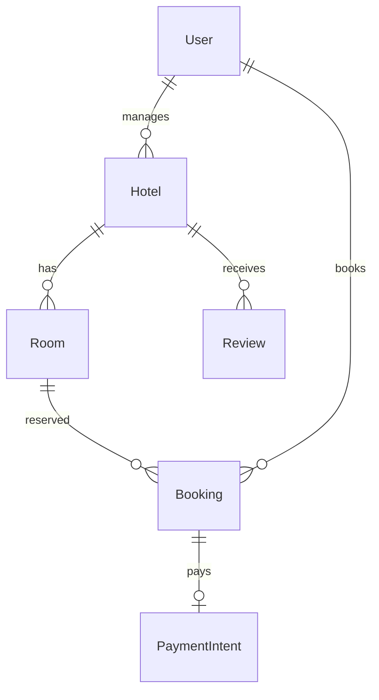

# Hotel Booking Platform

[← Back to Projects Index](README.md)

|                  |                                                                                             |
| ---------------- | ------------------------------------------------------------------------------------------- |
| **Slug**         | `hotel-booking`                                                                             |
| **Implement in** | `apps/api/` + `apps/web/` (auth on `apps/api-gateway`) on branch `<dev-name>/hotel-booking` |

## Problem

Travelers struggle to find available rooms for specific dates; hotel managers need accurate occupancy without overlapping reservations on the same room.

**Who uses this system**

| Actor             | Goal                                                                 |
| ----------------- | -------------------------------------------------------------------- |
| **Hotel manager** | Manage properties and rooms, view bookings and occupancy             |
| **Guest**         | Search by location and dates, book stays, cancel, review after visit |
| **Admin**         | Platform moderation                                                  |

**Pain points you are solving**

- Double bookings on the same room for overlapping dates.
- No availability search before booking.
- Bookings and payment state created inconsistently.
- Stale listings still appearing after removal.

**What you are building**

A hotel booking platform: managers list hotels and rooms; guests search availability by date range and book with conflict checks; booking creation pairs with a mock payment record in one transaction. Reviews and calendar views enhance the guest and manager experience.

## Application flow (end-to-end)

```text
1. Hotel manager (staff) creates Hotel → adds Rooms with capacity/pricing
2. Guest (user) searches hotels by city/q + date range availability
3. Guest selects room → booking checks no overlapping reservations (invariant)
4. Create booking + mock PaymentIntent in one transaction
5. Guest views/cancels bookings; cancel updates status
6. After stay (Should): guest leaves Review
7. Soft-deleted hotels/rooms excluded from search
```

## Roles in detail

| Domain role       | Gateway role | Purpose                              |
| ----------------- | ------------ | ------------------------------------ |
| **admin**         | `admin`      | Platform moderation                  |
| **hotel_manager** | `staff`      | Manage hotels, rooms, view occupancy |
| **guest**         | `user`       | Search, book, cancel, review         |

### hotel_manager (maps to `staff`)

- **Can:** CRUD own hotels and rooms; view bookings for own properties; occupancy dashboard (Should).
- **Cannot:** Book overlapping stays on same room; edit other managers' hotels.
- **Typical screens:** Manager dashboard `/manager`, room CRUD, booking list.

### guest (maps to `user`)

- **Can:** Search availability; create/cancel own bookings; review completed stays (Should).
- **Cannot:** Modify hotel listings; cancel others' bookings.
- **Typical screens:** Hotel search, hotel detail with date picker, my bookings.

## User journeys

These journeys describe how people actually use the app — in plain language. Read them to understand the experience you are building, then walk through them during implementation and before your demo.

**Technical details** (API paths, status codes, database columns) live in **Backend expectations**, **Enums and state machines**, and **Edge cases**. These journeys explain _what should happen_ from the user's point of view.

### Everyone

#### Signing in to reach a private page _(Must)_

**Who:** Anyone who is not logged in

**Goal:** Private areas require login first.

1. Someone opens a link to a private page (for example the dashboard or their personal list) without being logged in.
2. The app sends them to the login screen instead of showing empty or broken content.
3. After they sign in with a valid account, they land on the page they originally wanted.
4. If they refresh the browser, they stay signed in and the page still loads correctly.

#### Each role sees only their part of the app _(Must)_

**Who:** Regular user vs Hotel manager (staff)

**Goal:** Users and hotel manager (staff) accounts must not share the same screens or powers.

1. A regular user signs in and uses the app. Menus and buttons for hotel manager (staff) work are hidden or disabled.
2. If they manually open a hotel manager (staff) URL (such as /manager/rooms), they see an access denied message — not another person's data.
3. When they sign out and sign in as Hotel manager (staff), those pages open normally and they can create and manage records.

#### When there is nothing to show in the hotel search results _(Must)_

**Who:** Anyone browsing a list

**Goal:** The hotel search results should feel intentional even when empty or still loading.

1. While the hotel search results is loading, the user sees a skeleton or spinner — not a flash of wrong data or a blank white screen.
2. If filters or search return no hotels, a friendly empty state explains that nothing matched and offers to clear filters.
3. Clearing filters brings back the normal list when matching hotels exist.
4. Slow network: loading state stays visible until real data or a genuine empty result arrives.

#### Removing a hotel listing from public view _(Must)_

**Who:** Hotel manager (staff)

**Goal:** Deleted hotel listings should disappear for everyone except the owner reviewing history.

1. The hotel manager (staff) creates a hotel listing that appears in public hotel search.
2. They delete it using the normal delete action and confirm in a dialog.
3. The hotel listing no longer appears in public hotel search or in search results.
4. Opening an old bookmark to that hotel listing shows a polite “no longer available” message.
5. The owner can still find it in manager hotel list with a deleted badge if the brief includes an audit or trash view (Should).

### Guest

#### Guest searches and books a room _(Must)_

**Who:** Guest (gateway role: `user`)

**Goal:** Reserve dates without double-booking the same room.

1. The guest searches hotels by city and dates, then picks a room type.
2. They complete booking for at least one night (check-out must be after check-in).
3. Confirmation shows stay dates and total price.
4. The same room cannot be booked twice for overlapping dates.

#### Guest cancels a reservation _(Must)_

**Who:** Guest

**Goal:** Free dates they no longer need.

1. The guest cancels before check-in day.
2. The booking leaves their list and the room becomes available again.
3. Cancelling after check-in has started is not allowed.

### Hotel manager

#### Manager maintains rooms and inventory _(Must)_

**Who:** Hotel manager (gateway role: `staff`)

**Goal:** Keep listings accurate.

1. The manager adds room types, rates, and availability to a hotel.
2. Changes reflect on the public search for that property.

## What is expected

### Must — required to pass

| Requirement                 | What it means for you                                                                                                                                                                 |
| --------------------------- | ------------------------------------------------------------------------------------------------------------------------------------------------------------------------------------- |
| Hotels + rooms              | Manager-owned                                                                                                                                                                         |
| Availability search         | Date-range query excluding overlaps                                                                                                                                                   |
| Booking with conflict check | Service + optional DB exclusion constraint                                                                                                                                            |
| Cancel booking              | Status change on `Booking` (set `status = cancelled`); **`Hotel` is the primary listable resource that must support soft-delete** for grading — `DELETE /hotels/:id` sets `deletedAt` |
| Pagination + filters        | city, q on hotel list                                                                                                                                                                 |
| Shared Must bar             | [grading.md](../grading.md)                                                                                                                                                           |

### Should — distinction

Calendar view; reviews; mock PaymentIntent entity; occupancy dashboard.

### Stretch — bonus

Real Stripe/Razorpay, dynamic pricing, channel manager.

## Frontend expectations

> Shared UI bar for all projects: [Frontend expectations](README.md#frontend-expectations-all-projects) · [frontend.md](../frontend.md)

### Domain screens

| Route                        | Role(s)           | UI expectations                                                          |
| ---------------------------- | ----------------- | ------------------------------------------------------------------------ |
| `/hotels`                    | Guest             | Search: city, date range, guest count; results as cards with price/night |
| `/hotels/[id]`               | Guest             | Room list; availability for selected dates; **Book** per room            |
| `/bookings`                  | Guest             | My bookings with dates, status, cancel button                            |
| `/manager`                   | Manager (`staff`) | Hotels/rooms CRUD; occupancy summary (Should)                            |
| `/manager/calendar` (Should) | Manager           | Read-only grid of booked vs free dates                                   |

### UI behaviour

- **Date picker:** Check-in/check-out required before showing availability.
- **Conflict errors:** Show API message when dates overlap existing booking.
- **Cancel:** Update booking status in list; do not hard-delete from user view without feedback.

## Backend expectations

> Shared API bar for all projects: [Backend expectations](README.md#backend-expectations-all-projects) · [architecture.md](../architecture.md)

### Modules

| Module             | Entity(ies)                | Responsibility                        |
| ------------------ | -------------------------- | ------------------------------------- |
| `hotels`           | `Hotel`, `Room`            | Manager CRUD                          |
| `bookings`         | `Booking`, `PaymentIntent` | Availability check; create + mock pay |
| `reviews` (Should) | `Review`                   | Post-stay only                        |

### Key endpoints

| Method  | Path                   | Role | Notes                                                     |
| ------- | ---------------------- | ---- | --------------------------------------------------------- |
| `GET`   | `/availability`        | all  | Query: roomId or hotelId + date range                     |
| `POST`  | `/bookings`            | user | Transaction: booking + payment intent after overlap check |
| `GET`   | `/hotels`              | all  | Filters: city, q; pagination                              |
| `PATCH` | `/bookings/:id/cancel` | user | Status update                                             |

### Service rules

- Overlap query on `[checkIn, checkOut)` per room before insert.
- PaymentIntent created with mock `paid` status in same transaction.

### Enums and state machines

**Booking.status:** `confirmed`, `cancelled`

### Database constraints

- `CHECK bookings.checkOut > bookings.checkIn`
- `UNIQUE(reviews.bookingId)`
- Exclusion or service-level overlap check on `(roomId, daterange)`

### Domain seed (minimum)

2 hotels, 4 rooms, 5 bookings, 2 reviews.

### Web routes auth

| Route        | Auth required | Roles |
| ------------ | ------------- | ----- |
| /hotels      | No            | All   |
| /hotels/[id] | No            | All   |
| /bookings    | Yes           | user  |
| /manager     | Yes           | staff |

## Suggested entities

- Auth `User` is on the gateway — use `userId` FKs; do **not** recreate users/auth in `apps/api`
- `Hotel`
- `Room`
- `Booking`
- `Review`
- `PaymentIntent`

## ERD (starter)



## Hard invariant

No overlapping bookings for the same room (date-range exclusion).

## Required transaction

Create booking + payment intent (mock status paid) atomically after availability check.

## Must (pass)

- [ ] Hotels + rooms
- [ ] Availability search by date range
- [ ] Create booking with conflict check
- [ ] Cancel booking (set `Booking.status = cancelled`)
- [ ] Soft-delete `Hotel` — `DELETE /hotels/:id` sets `deletedAt`; hidden from public search immediately
- [ ] Pagination + city/q filters

Plus the shared Must bar in [grading.md](../grading.md).

## Should (distinction)

- [ ] Availability calendar view (read-only grid)
- [ ] Reviews after completed stay
- [ ] Mock payments (PaymentIntent entity, no real gateway)
- [ ] Manager dashboard (occupancy)

## Stretch (bonus)

- [ ] Real Stripe/Razorpay
- [ ] Dynamic pricing
- [ ] Channel manager sync

## API outline (indicative)

- `CRUD /hotels`
- `CRUD /rooms`
- `GET /availability`
- `POST /bookings`
- `POST /reviews`

## FE routes (indicative)

- `/`
- `/hotels`
- `/hotels/[id]`
- `/bookings`
- `/manager`

> Shared: [FAQ & edge cases](README.md#faq--read-before-you-ask) · [grading](../grading.md)

## Edge cases and negative scenarios

### Domain — availability and bookings

| Scenario                                | Expected API                                                        | UI hint                         |
| --------------------------------------- | ------------------------------------------------------------------- | ------------------------------- |
| Overlapping booking same room           | **409**                                                             | Show unavailable on date picker |
| checkOut before checkIn                 | **400**                                                             | Date validation in UI           |
| Book room at hotel user doesn’t manage  | **403** for manager routes only                                     | Guests book via public flow     |
| Cancel after check-in date passed       | **400** — cannot cancel after `checkIn` date has started            | —                               |
| Guest cancels another guest’s booking   | **403**                                                             | Own bookings only               |
| Search with invalid date range          | **400**                                                             | —                               |
| Room soft-deleted                       | **404** in search                                                   | —                               |
| Payment fails (mock)                    | **Rollback booking** if payment in same txn                         | —                               |
| Zero-night stay (same day check-in/out) | **400** — minimum **1 night** (`checkOut` must be after `checkIn`)  | —                               |
| Availability across midnight/timezone   | Store **`date` columns in UTC**; compare calendar dates server-side | —                               |

### Demo 4xx cases

1. Overlapping dates → **409**
2. Invalid date range → **400**

## FAQ — decisions already made

| Question                      | Answer                                                                  |
| ----------------------------- | ----------------------------------------------------------------------- |
| Real payment gateway?         | **No** on Must — `PaymentIntent` mock status OK.                        |
| Review before stay completes? | **Should** — block review until checkout date passed.                   |
| One hotel per manager?        | **Optional** — multiple hotels per manager OK.                          |
| Capacity per room?            | **1 booking per room** per date range for Must (no partial room share). |

## Definition of done

- Domain migrations (`pnpm migration:run:api`) + domain seed (≥8 realistic rows); gateway users via `pnpm seed`
- Compose Postgres + root `.env` + `apps/api-gateway/.env` + `apps/api/.env` + `apps/web/.env.local`
- Next + Query + RTK ownership respected; UI uses `@shared/ui/components` + theme ([frontend.md](../frontend.md))
- `docs/architecture.md` completed
- 5-minute demo script in the PR body (and notes in `docs/architecture.md`)

## Demo script (suggested — adapt for your PR)

1. **Roles (30s):** Manager hotel setup → guest search → guest bookings.
2. **Happy path (2m):** Search dates → book → confirm in my bookings.
3. **Invariant (30s):** Overlapping booking attempt → 4xx.
4. **Lists (1m):** City/search filters; cancel booking flow.
