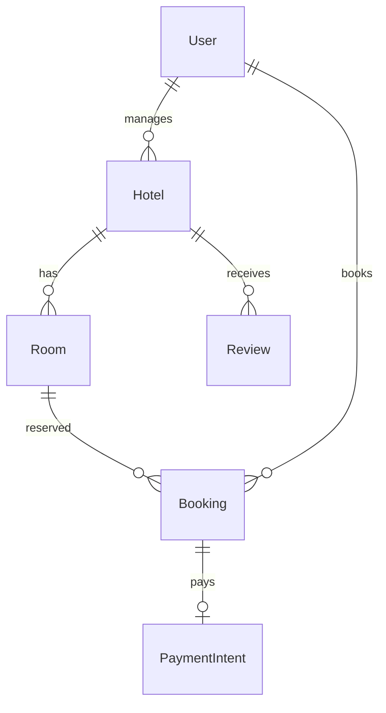

# Hotel Booking Platform

|                  |                                                                |
| ---------------- | -------------------------------------------------------------- |
| **Slug**         | `hotel-booking`                                                |
| **Implement in** | `apps/api/` + `apps/web/` on branch `<dev-name>/hotel-booking` |

## Problem

Travelers search hotels/rooms by date availability, book stays, and leave reviews.

## Personas / roles

- admin
- hotel_manager (staff)
- guest (user)

## Suggested entities

- `User`
- `Hotel`
- `Room`
- `Booking`
- `Review`
- `PaymentIntent`

## ERD (starter)

## Hard invariant

No overlapping bookings for the same room (date-range exclusion).

## Required transaction

Create booking + payment intent (mock status paid) atomically after availability check.

## Must (pass)

- [ ] Hotels + rooms
- [ ] Availability search by date range
- [ ] Create booking with conflict check
- [ ] Cancel booking (soft-delete or status)
- [ ] Pagination + city/q filters

Plus the shared Must bar in [grading.md](../grading.md).

## Should (distinction)

- [ ] Availability calendar view (read-only grid)
- [ ] Reviews after completed stay
- [ ] Mock payments (PaymentIntent entity, no real gateway)
- [ ] Manager dashboard (occupancy)

## Stretch (bonus)

- [ ] Real Stripe/Razorpay
- [ ] Dynamic pricing
- [ ] Channel manager sync

## API outline (indicative)

- `CRUD /hotels`
- `CRUD /rooms`
- `GET /availability`
- `POST /bookings`
- `POST /reviews`

## FE routes (indicative)

- `/`
- `/hotels`
- `/hotels/[id]`
- `/bookings`
- `/manager`

## Definition of done

- Migrations + seed (≥8 realistic rows across core tables)
- Compose Postgres + project `.env`
- Next + Query + RTK ownership respected
- `docs/architecture.md` completed
- 5-minute demo script in the PR body (and notes in `docs/architecture.md`)

## Demo script (fill in)

1. Login as each role
2. Happy path for core workflow
3. Show invariant failure (expect 4xx)
4. Show list filters + soft-delete behaviour
