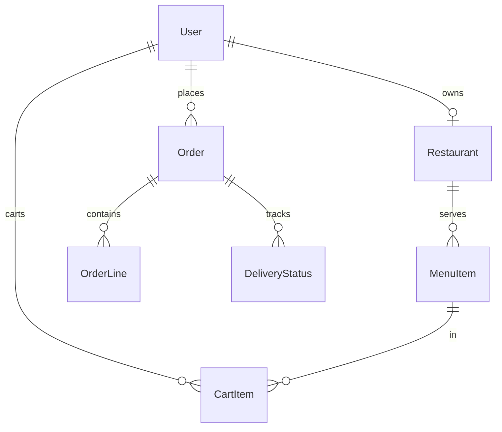

# Food Delivery Platform

[← Back to Projects Index](README.md)

|                  |                                                                                             |
| ---------------- | ------------------------------------------------------------------------------------------- |
| **Slug**         | `food-delivery`                                                                             |
| **Implement in** | `apps/api/` + `apps/web/` (auth on `apps/api-gateway`) on branch `<dev-name>/food-delivery` |

## Problem

Food ordering falls apart when menus, carts, and kitchen status are disconnected. Restaurants need to publish menus and fulfill orders; customers need a simple path from browse to delivery tracking.

**Who uses this system**

| Actor          | Goal                                                         |
| -------------- | ------------------------------------------------------------ |
| **Restaurant** | Manage menu items, receive orders, advance delivery status   |
| **Customer**   | Browse restaurants, build a cart, place orders, track status |
| **Admin**      | Platform oversight and dashboards                            |

**Pain points you are solving**

- Carts mixing items from different restaurants in one checkout.
- Order status jumping backward or skipping steps.
- Menu items removed but still orderable.
- No filterable order history for customers or restaurants.

**What you are building**

A food delivery app: one restaurant per cart; place order creates order lines and clears the cart atomically; status moves one-way along a defined path (placed → preparing → out for delivery → delivered | cancelled). Dashboards and delivery timelines are enhancements.

## Application flow (end-to-end)

```text
1. Restaurant (staff) creates profile → adds MenuItems
2. Customer (user) browses restaurants → adds items to cart (one restaurant only — invariant)
3. Place order → transaction: Order + OrderLines from cart + clear cart; status = placed
4. Restaurant updates status: placed → preparing → out_for_delivery → delivered | cancelled
5. Status transitions one-way along defined path (no backward jumps)
6. Customer tracks order; filters order list by status
7. Soft-deleted menu items hidden from menu
```

## Roles in detail

| Domain role    | Gateway role | Purpose                                            |
| -------------- | ------------ | -------------------------------------------------- |
| **admin**      | `admin`      | Platform oversight, dashboards (Should)            |
| **restaurant** | `staff`      | Manage menu, view/update orders for own restaurant |
| **customer**   | `user`       | Browse, cart, order, track delivery                |

### restaurant (maps to `staff`)

- **Can:** CRUD menu items; view orders for own restaurant; advance order status along allowed path.
- **Cannot:** Mix menu items from other restaurants in cart logic; skip status steps.
- **Typical screens:** Restaurant dashboard, menu editor, order queue with status buttons.

### customer (maps to `user`)

- **Can:** Browse restaurants; build cart from single restaurant; place order; view order history.
- **Cannot:** Change order status; add items from two restaurants to one cart.
- **Typical screens:** Restaurant list, menu, cart, order tracking.

## User journeys

These journeys describe how people actually use the app — in plain language. Read them to understand the experience you are building, then walk through them during implementation and before your demo.

**Technical details** (API paths, status codes, database columns) live in **Backend expectations**, **Enums and state machines**, and **Edge cases**. These journeys explain _what should happen_ from the user's point of view.

### Everyone

#### Signing in to reach a private page _(Must)_

**Who:** Anyone who is not logged in

**Goal:** Private areas require login first.

1. Someone opens a link to a private page (for example the dashboard or their personal list) without being logged in.
2. The app sends them to the login screen instead of showing empty or broken content.
3. After they sign in with a valid account, they land on the page they originally wanted.
4. If they refresh the browser, they stay signed in and the page still loads correctly.

#### Each role sees only their part of the app _(Must)_

**Who:** Regular user vs Restaurant owner (staff)

**Goal:** Users and restaurant owner (staff) accounts must not share the same screens or powers.

1. A regular user signs in and uses the app. Menus and buttons for restaurant owner (staff) work are hidden or disabled.
2. If they manually open a restaurant owner (staff) URL (such as /restaurant/menu), they see an access denied message — not another person's data.
3. When they sign out and sign in as Restaurant owner (staff), those pages open normally and they can create and manage records.

#### When there is nothing to show in the restaurant list _(Must)_

**Who:** Anyone browsing a list

**Goal:** The restaurant list should feel intentional even when empty or still loading.

1. While the restaurant list is loading, the user sees a skeleton or spinner — not a flash of wrong data or a blank white screen.
2. If filters or search return no restaurants, a friendly empty state explains that nothing matched and offers to clear filters.
3. Clearing filters brings back the normal list when matching restaurants exist.
4. Slow network: loading state stays visible until real data or a genuine empty result arrives.

#### Removing a menu item from public view _(Must)_

**Who:** Restaurant owner (staff)

**Goal:** Deleted menu items should disappear for everyone except the owner reviewing history.

1. The restaurant owner (staff) creates a menu item that appears in customer menu.
2. They delete it using the normal delete action and confirm in a dialog.
3. The menu item no longer appears in customer menu or in search results.
4. Opening an old bookmark to that menu item shows a polite “no longer available” message.
5. The owner can still find it in restaurant menu editor with a deleted badge if the brief includes an audit or trash view (Should).

### Customer

#### Customer orders from one restaurant at a time _(Must)_

**Who:** Customer (gateway role: `user`)

**Goal:** Build a cart and place a delivery order.

1. The customer browses a restaurant menu and adds items to the cart.
2. If they switch to a different restaurant, the app warns that the cart will clear — one restaurant per order.
3. They enter delivery details and place the order.
4. They track order status as it moves from placed → preparing → out for delivery → delivered.

### Restaurant owner

#### Restaurant manages menu and orders _(Must)_

**Who:** Restaurant owner (gateway role: `staff`)

**Goal:** Keep the menu live and fulfill incoming orders.

1. The owner adds menu items with prices and availability.
2. Incoming orders appear on the restaurant dashboard.
3. The owner advances order status as the kitchen prepares and dispatches food.

## What is expected

### Must — required to pass

| Requirement            | What it means for you            |
| ---------------------- | -------------------------------- |
| Restaurant + menu CRUD | Owner-scoped                     |
| Single-restaurant cart | Enforced in service              |
| Place order            | Status starts at placed          |
| Status workflow        | One-way path with PATCH endpoint |
| Order list + filter    | By status                        |
| Soft-delete menu items | Hidden from public menu          |
| Shared Must bar        | [grading.md](../grading.md)      |

### Should — distinction

Dashboards; delivery status history; ETA field; cuisine/search filters.

### Stretch — bonus

Live geo tracking, driver app, real payments.

## Frontend expectations

> Shared UI bar for all projects: [Frontend expectations](README.md#frontend-expectations-all-projects) · [frontend.md](../frontend.md)

### Domain screens

| Route                   | Role(s)              | UI expectations                                             |
| ----------------------- | -------------------- | ----------------------------------------------------------- |
| `/restaurants`          | Customer             | List with cuisine/search filter; card per restaurant        |
| `/restaurants/[id]`     | Customer             | Menu items grid; add to cart with qty                       |
| `/cart`                 | Customer             | Items from **one** restaurant; warn if switching restaurant |
| `/orders`               | Customer             | Order history + live status badge                           |
| `/restaurant/dashboard` | Restaurant (`staff`) | Incoming orders queue; buttons to advance status            |

### UI behaviour

- **Status timeline (Should):** Vertical stepper or list of status history on order detail.
- **Restaurant view:** Only orders for own restaurant; status buttons only show valid next step.
- **Single-restaurant cart:** Clear cart or block when adding from different restaurant.

## Backend expectations

> Shared API bar for all projects: [Backend expectations](README.md#backend-expectations-all-projects) · [architecture.md](../architecture.md)

### Modules

| Module        | Entity(ies)                            | Responsibility                |
| ------------- | -------------------------------------- | ----------------------------- |
| `restaurants` | `Restaurant`, `MenuItem`               | Menu CRUD; soft-delete items  |
| `cart`        | `CartItem`                             | Single-restaurant enforcement |
| `orders`      | `Order`, `OrderLine`, `DeliveryStatus` | Place order; status workflow  |

### Key endpoints

| Method  | Path                 | Role       | Notes                                   |
| ------- | -------------------- | ---------- | --------------------------------------- |
| `POST`  | `/orders`            | user       | Transaction: order + lines + clear cart |
| `PATCH` | `/orders/:id/status` | staff      | One-way transition validation           |
| `GET`   | `/orders`            | user/staff | Filter by status                        |

### Service rules

- Cart service rejects items from a second `restaurantId`.
- `OrdersService.advanceStatus`: validate allowed edges in service enum/map.

### Enums and state machines

| From               | To                              |
| ------------------ | ------------------------------- |
| `placed`           | `preparing`, `cancelled`        |
| `preparing`        | `out_for_delivery`, `cancelled` |
| `out_for_delivery` | `delivered`                     |
| `delivered`        | terminal                        |

### Database constraints

- `UNIQUE(cart_items.userId, cart_items.menuItemId)`

### Domain seed (minimum)

2 restaurants, 8 menu items, 3 orders, 6 cart items.

### Web routes auth

| Route                 | Auth required | Roles |
| --------------------- | ------------- | ----- |
| /restaurants          | No            | All   |
| /restaurants/[id]     | No            | All   |
| /cart                 | Yes           | user  |
| /orders               | Yes           | user  |
| /restaurant/dashboard | Yes           | staff |

## Suggested entities

- Auth `User` is on the gateway — use `userId` FKs; do **not** recreate users/auth in `apps/api`
- `Restaurant`
- `MenuItem`
- `CartItem`
- `Order`
- `OrderLine`
- `DeliveryStatus` — one row per status transition on an order (columns: `id`, `orderId` FK, `status` varchar, `createdAt`); acts as an audit log of status changes. The current status is the latest row's `status` value, or store it denormalised on `Order.status` and write a `DeliveryStatus` row on each change (either approach is acceptable).

## ERD (starter)



## Hard invariant

Orders only from one restaurant per cart; status transitions are one-way along a defined path.

## Required transaction

Place order: create Order + lines from cart + clear cart.

## Must (pass)

- [ ] Restaurant + menu CRUD
- [ ] Cart scoped to one restaurant
- [ ] Place order with status placed
- [ ] Status updates (placed → preparing → out_for_delivery → delivered|cancelled)
- [ ] List orders + filter by status
- [ ] Soft-delete menu items

Plus the shared Must bar in [grading.md](../grading.md).

## Should (distinction)

- [ ] Admin + restaurant dashboards
- [ ] Delivery status history timeline
- [ ] Estimated minutes field
- [ ] Search restaurants by cuisine/q

## Stretch (bonus)

- [ ] Live geo tracking / WebSockets
- [ ] Driver app
- [ ] Real payments

## API outline (indicative)

- `CRUD /restaurants`
- `CRUD /menu-items`
- `CRUD /cart`
- `POST /orders`
- `PATCH /orders/:id/status`

## FE routes (indicative)

- `/`
- `/restaurants`
- `/restaurants/[id]`
- `/cart`
- `/orders`
- `/restaurant/dashboard`

> Shared: [FAQ & edge cases](README.md#faq--read-before-you-ask) · [grading](../grading.md)

## Edge cases and negative scenarios

### Domain — cart and order status

| Scenario                                    | Expected API                                                          | UI hint                         |
| ------------------------------------------- | --------------------------------------------------------------------- | ------------------------------- |
| Cart items from two restaurants             | **400** on add; UI clears cart with confirm when switching restaurant | Warn when switching restaurant  |
| Customer sets order status                  | **403**                                                               | Status buttons restaurant-only  |
| Skip status step (placed → delivered)       | **400**                                                               | Enforce path in service         |
| Cancel after delivered                      | **400**                                                               | No cancel terminal states       |
| Order empty menu item (deleted)             | **400** at place order                                                | Refresh menu                    |
| Restaurant updates other restaurant’s order | **403**                                                               | Filter orders by `restaurantId` |
| Negative menu price                         | **400**                                                               | —                               |
| Place order with empty cart                 | **400**                                                               | —                               |
| Status backward (delivered → preparing)     | **400**                                                               | —                               |

### Demo 4xx cases

1. Mixed-restaurant cart → **400**
2. Invalid status skip → **400**

## FAQ — decisions already made

| Question                      | Answer                                                                |
| ----------------------------- | --------------------------------------------------------------------- |
| Delivery driver role?         | **Out of scope** — restaurant advances status; no driver app on Must. |
| Real-time GPS?                | **Stretch** only.                                                     |
| Tips?                         | **Optional** — not in Must.                                           |
| One active cart per customer? | **Yes.**                                                              |

## Definition of done

- Domain migrations (`pnpm migration:run:api`) + domain seed (≥8 realistic rows); gateway users via `pnpm seed`
- Compose Postgres + root `.env` + `apps/api-gateway/.env` + `apps/api/.env` + `apps/web/.env.local`
- Next + Query + RTK ownership respected; UI uses `@shared/ui/components` + theme ([frontend.md](../frontend.md))
- `docs/architecture.md` completed
- 5-minute demo script in the PR body (and notes in `docs/architecture.md`)

## Demo script (suggested — adapt for your PR)

1. **Roles (30s):** Restaurant menu → customer cart → restaurant order queue.
2. **Happy path (2m):** Add to cart → place order → advance statuses → delivered.
3. **Invariant (30s):** Mixed-restaurant cart → blocked.
4. **Lists (1m):** Filter orders by status; soft-delete menu item.
