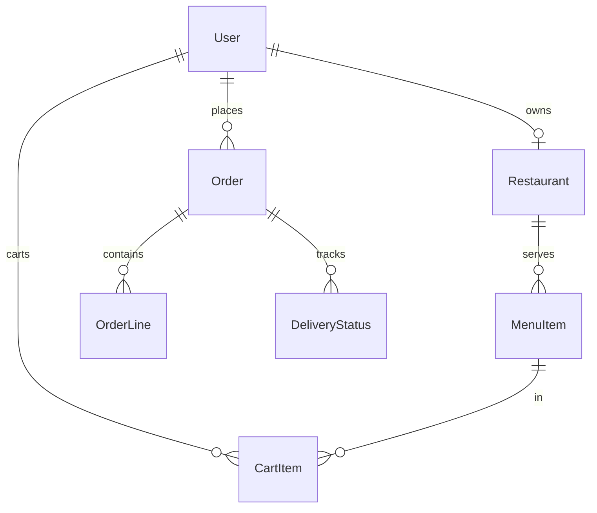

# Food Delivery Platform

|                  |                                                                |
| ---------------- | -------------------------------------------------------------- |
| **Slug**         | `food-delivery`                                                |
| **Implement in** | `apps/api/` + `apps/web/` on branch `<dev-name>/food-delivery` |

## Problem

Restaurants publish menus; customers cart and place orders; status progresses through delivery.

## Personas / roles

- admin
- restaurant (staff)
- customer (user)

## Suggested entities

- `User`
- `Restaurant`
- `MenuItem`
- `CartItem`
- `Order`
- `OrderLine`
- `DeliveryStatus`

## ERD (starter)

## Hard invariant

Orders only from one restaurant per cart; status transitions are one-way along a defined path.

## Required transaction

Place order: create Order + lines from cart + clear cart.

## Must (pass)

- [ ] Restaurant + menu CRUD
- [ ] Cart scoped to one restaurant
- [ ] Place order with status placed
- [ ] Status updates (placed → preparing → out_for_delivery → delivered|cancelled)
- [ ] List orders + filter by status
- [ ] Soft-delete menu items

Plus the shared Must bar in [grading.md](../grading.md).

## Should (distinction)

- [ ] Admin + restaurant dashboards
- [ ] Delivery status history timeline
- [ ] Estimated minutes field
- [ ] Search restaurants by cuisine/q

## Stretch (bonus)

- [ ] Live geo tracking / WebSockets
- [ ] Driver app
- [ ] Real payments

## API outline (indicative)

- `CRUD /restaurants`
- `CRUD /menu-items`
- `CRUD /cart`
- `POST /orders`
- `PATCH /orders/:id/status`

## FE routes (indicative)

- `/`
- `/restaurants`
- `/restaurants/[id]`
- `/cart`
- `/orders`
- `/restaurant/dashboard`

## Definition of done

- Migrations + seed (≥8 realistic rows across core tables)
- Compose Postgres + project `.env`
- Next + Query + RTK ownership respected
- `docs/architecture.md` completed
- 5-minute demo script in the PR body (and notes in `docs/architecture.md`)

## Demo script (fill in)

1. Login as each role
2. Happy path for core workflow
3. Show invariant failure (expect 4xx)
4. Show list filters + soft-delete behaviour
