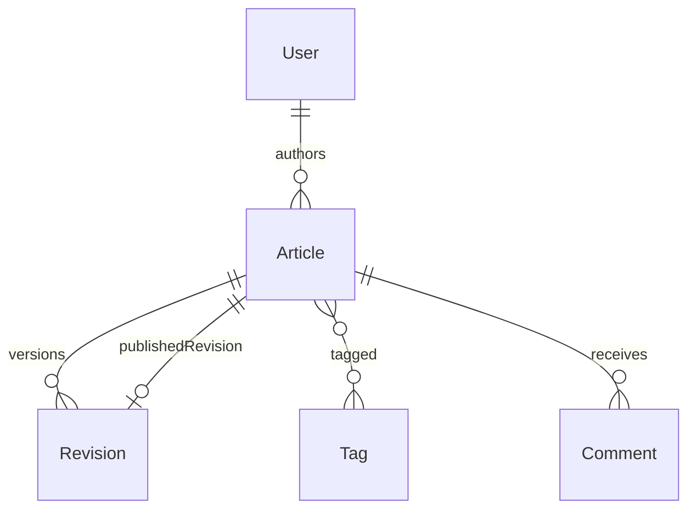

# CMS / Blogging Platform

|                  |                                                                                            |
| ---------------- | ------------------------------------------------------------------------------------------ |
| **Slug**         | `cms-blogging`                                                                             |
| **Implement in** | `apps/api/` + `apps/web/` (auth on `apps/api-gateway`) on branch `<dev-name>/cms-blogging` |

## Problem

Authors draft posts with revisions, tags, comments, and a publish workflow with SEO metadata.

## Personas / roles

- admin
- editor (staff)
- author (user)

## Suggested entities

- Auth `User` is on the gateway — use `userId` FKs; do **not** recreate users/auth in `apps/api`
- `Article`
- `Revision`
- `Tag`
- `ArticleTag`
- `Comment`

## ERD (starter)

## Hard invariant

Public list shows only articles with publishedRevisionId set; publishing sets pointer in a transaction.

## Required transaction

Publish: create/select revision + set article.publishedRevisionId + publishedAt.

## Must (pass)

- [ ] Articles + revisions
- [ ] Publish workflow
- [ ] Tags N:N
- [ ] Comments on published articles
- [ ] Draft vs published lists
- [ ] Soft-delete articles

Plus the shared Must bar in [grading.md](../grading.md).

## Should (distinction)

- [ ] SEO fields (slug, meta title/description, OG image URL)
- [ ] Editor dashboard
- [ ] Markdown body (textarea — not full WYSIWYG required)
- [ ] Search by tag + q

## Stretch (bonus)

- [ ] TipTap/ProseMirror rich editor
- [ ] Scheduled publish
- [ ] CDN image pipeline

## API outline (indicative)

- `CRUD /articles`
- `POST /articles/:id/revisions`
- `POST /articles/:id/publish`
- `CRUD /tags`
- `POST /comments`

## FE routes (indicative)

- `/`
- `/blog`
- `/blog/[slug]`
- `/studio`
- `/studio/[id]`

## Definition of done

- Domain migrations (`pnpm migration:run:api`) + domain seed (≥8 realistic rows); gateway users via `pnpm seed`
- Compose Postgres + root `.env` + `apps/api-gateway/.env` + `apps/api/.env` + `apps/web/.env.local`
- Next + Query + RTK ownership respected; UI uses `@shared/ui/components` + theme ([frontend.md](../frontend.md))
- `docs/architecture.md` completed
- 5-minute demo script in the PR body (and notes in `docs/architecture.md`)

## Demo script (fill in)

1. Login as each role
2. Happy path for core workflow
3. Show invariant failure (expect 4xx)
4. Show list filters + soft-delete behaviour
