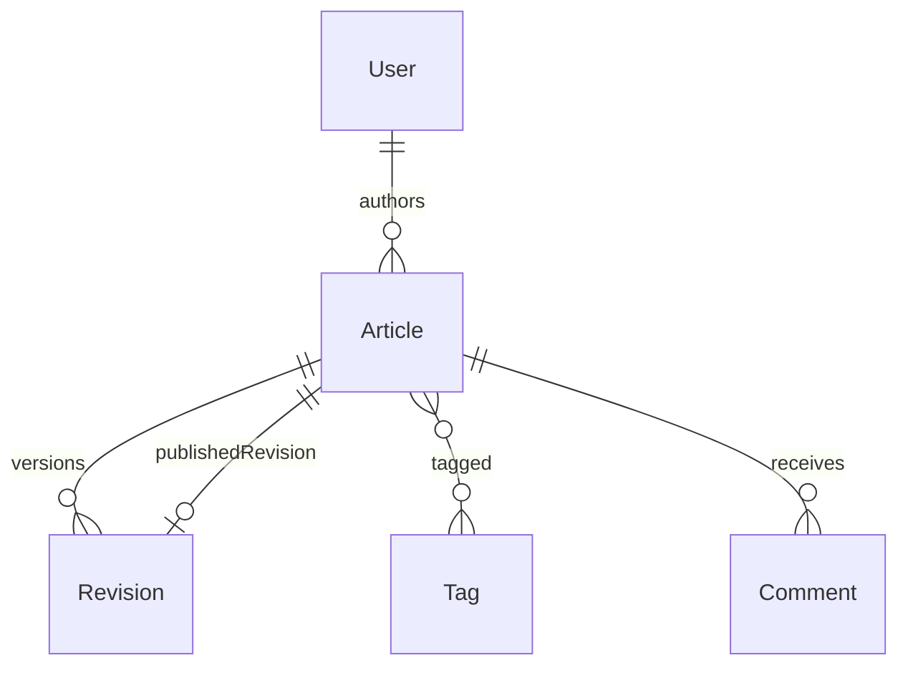

# CMS / Blogging Platform

[← Back to Projects Index](README.md)

|                  |                                                                                            |
| ---------------- | ------------------------------------------------------------------------------------------ |
| **Slug**         | `cms-blogging`                                                                             |
| **Implement in** | `apps/api/` + `apps/web/` (auth on `apps/api-gateway`) on branch `<dev-name>/cms-blogging` |

## Problem

Publishing content safely requires drafts, revisions, and a clear publish step. Authors need to iterate without exposing unfinished work; editors need control over what goes live; readers should only see published articles and comment on them.

**Who uses this system**

| Actor      | Goal                                                  |
| ---------- | ----------------------------------------------------- |
| **Author** | Write drafts and revisions                            |
| **Editor** | Publish, tag, and moderate content                    |
| **Admin**  | Remove abusive content, oversee platform              |
| **Reader** | Browse published articles and comment (authenticated) |

**Pain points you are solving**

- Draft articles leaking to public URLs or listings.
- No version history when content changes.
- Publishing that does not atomically set the live revision pointer.
- Comments on unpublished material.

**What you are building**

A CMS/blog: articles have many revisions; publish sets `publishedRevisionId` in a transaction; public routes list only published articles; tags and comments attach to live content. SEO fields and a studio dashboard are natural extensions.

## Application flow (end-to-end)

```text
1. Author (user) creates Article in draft → writes Revision content
2. Author or editor (staff) adds Tags → saves new revisions
3. Publish action → transaction: set publishedRevisionId + publishedAt
4. Public /blog lists only articles with publishedRevisionId set (invariant)
5. Readers comment on published articles only
6. Draft vs published lists in /studio
7. Soft-deleted articles removed from public blog
```

## Roles in detail

| Domain role | Gateway role | Purpose                                          |
| ----------- | ------------ | ------------------------------------------------ |
| **admin**   | `admin`      | Moderate all content, remove abusive comments    |
| **editor**  | `staff`      | Edit/publish any article; manage tags            |
| **author**  | `user`       | Create drafts and revisions on own articles only |

**Publish rule (locked):** only `staff` (editor) may call `POST /articles/:id/publish`; authors (`user`) create drafts and revisions only.

### editor (maps to `staff`)

- **Can:** View all drafts; publish any article; manage tags; moderate comments.
- **Typical screens:** Editor dashboard `/studio`, publish workflow, tag manager.

### author (maps to `user`)

- **Can:** CRUD own articles and revisions; view draft list; cannot expose unpublished content on public routes.
- **Cannot:** Call `POST /articles/:id/publish` — **403** (staff/editor only).
- **Typical screens:** My drafts, article editor (markdown textarea — Should).

## User journeys

These journeys describe how people actually use the app — in plain language. Read them to understand the experience you are building, then walk through them during implementation and before your demo.

**Technical details** (API paths, status codes, database columns) live in **Backend expectations**, **Enums and state machines**, and **Edge cases**. These journeys explain _what should happen_ from the user's point of view.

### Everyone

#### Signing in to reach a private page _(Must)_

**Who:** Anyone who is not logged in

**Goal:** Private areas require login first.

1. Someone opens a link to a private page (for example the dashboard or their personal list) without being logged in.
2. The app sends them to the login screen instead of showing empty or broken content.
3. After they sign in with a valid account, they land on the page they originally wanted.
4. If they refresh the browser, they stay signed in and the page still loads correctly.

#### Each role sees only their part of the app _(Must)_

**Who:** Regular user vs Editor (staff)

**Goal:** Users and editor (staff) accounts must not share the same screens or powers.

1. A regular user signs in and uses the app. Menus and buttons for editor (staff) work are hidden or disabled.
2. If they manually open a editor (staff) URL (such as /studio), they see an access denied message — not another person's data.
3. When they sign out and sign in as Editor (staff), those pages open normally and they can create and manage records.

#### When there is nothing to show in the blog feed _(Must)_

**Who:** Anyone browsing a list

**Goal:** The blog feed should feel intentional even when empty or still loading.

1. While the blog feed is loading, the user sees a skeleton or spinner — not a flash of wrong data or a blank white screen.
2. If filters or search return no articles, a friendly empty state explains that nothing matched and offers to clear filters.
3. Clearing filters brings back the normal list when matching articles exist.
4. Slow network: loading state stays visible until real data or a genuine empty result arrives.

#### Removing an article from public view _(Must)_

**Who:** Author or editor

**Goal:** Deleted articles should disappear for everyone except the owner reviewing history.

1. The author or editor creates an article that appears in public blog.
2. They delete it using the normal delete action and confirm in a dialog.
3. The article no longer appears in public blog or in search results.
4. Opening an old bookmark to that article shows a polite “no longer available” message.
5. The owner can still find it in studio draft list with a deleted badge if the brief includes an audit or trash view (Should).

### Author

#### Author drafts an article _(Must)_

**Who:** Casey, writer (gateway role: `user`)

**Goal:** Write without exposing unfinished work.

1. Casey creates an article with title and body in the studio.
2. Saving creates a new revision while the public blog still shows nothing.
3. Casey can preview the draft inside the studio.

### Editor

#### Editor publishes to the live blog _(Must)_

**Who:** Robin, editor (gateway role: `staff`)

**Goal:** Control what readers see.

1. Robin selects the latest revision and clicks **Publish**.
2. The article appears on the public blog with the chosen content.
3. Authors cannot publish themselves — only editors can.
4. Unpublished articles return “not found” on public URLs.

#### Tags and editor dashboard _(Should)_

**Who:** Editor

**Goal:** Organize content (optional).

1. Editors manage tags and attach them to articles.
2. The studio separates **Drafts** and **Published** lists.
3. A dashboard shows counts of drafts and published pieces.

### Reader

#### Reader browses and comments _(Must)_

**Who:** Reader (anyone or logged-in user)

**Goal:** Engage with live content only.

1. Readers browse published articles on `/blog` without seeing drafts.
2. Logged-in readers comment on published posts.
3. Comments on unpublished drafts are not allowed.

## What is expected

### Must — required to pass

| Requirement                | What it means for you         |
| -------------------------- | ----------------------------- |
| Articles + revisions       | Version history preserved     |
| Publish workflow           | Pointer to published revision |
| Tags N:N                   | Filter public list by tag     |
| Comments on published only | Guard by publishedRevisionId  |
| Draft vs published lists   | Studio vs blog separation     |
| Soft-delete articles       | Removed from public blog      |
| Shared Must bar            | [grading.md](../grading.md)   |

### Should — distinction

SEO fields; editor dashboard; markdown body; search by tag + q.

### Stretch — bonus

TipTap editor, scheduled publish, CDN pipeline.

## Frontend expectations

> Shared UI bar for all projects: [Frontend expectations](README.md#frontend-expectations-all-projects) · [frontend.md](../frontend.md)

### Domain screens

| Route          | Role(s)        | UI expectations                                                                      |
| -------------- | -------------- | ------------------------------------------------------------------------------------ |
| `/blog`        | Public         | Published articles only; tag filter; search                                          |
| `/blog/[slug]` | Public         | Render published revision body (markdown → HTML or pre); comments section            |
| `/studio`      | Author, editor | Draft vs published tabs; article list with status badge                              |
| `/studio/[id]` | Author, editor | Revision editor (textarea); tag picker; **Publish** (editor or author per your rule) |

### UI behaviour

- **Public vs studio:** Unpublished slugs return 404 on `/blog/[slug]`.
- **Publish:** Confirm dialog; after publish, article appears on `/blog` and leaves draft tab.
- **Comments:** Form at bottom of public article; list threaded or flat.

## Backend expectations

> Shared API bar for all projects: [Backend expectations](README.md#backend-expectations-all-projects) · [architecture.md](../architecture.md)

### Modules

| Module     | Entity(ies)           | Responsibility              |
| ---------- | --------------------- | --------------------------- |
| `articles` | `Article`, `Revision` | Draft CRUD; publish pointer |
| `tags`     | `Tag`, `ArticleTag`   | N:N                         |
| `comments` | `Comment`             | On published articles only  |

### Key endpoints

| Method | Path                      | Role       | Notes                                  |
| ------ | ------------------------- | ---------- | -------------------------------------- |
| `GET`  | `/articles/public`        | public     | `publishedRevisionId IS NOT NULL`      |
| `POST` | `/articles/:id/revisions` | user/staff | New revision row                       |
| `POST` | `/articles/:id/publish`   | staff      | Transaction: set pointer + publishedAt |
| `POST` | `/articles/:id/comments`  | user       | Guard: article must be published       |

### Service rules

- Public queries never return articles without `publishedRevisionId`.
- Publish updates pointer atomically with selected revision.

### Enums and state machines

No status enum — published when `publishedRevisionId IS NOT NULL`.

### Database constraints

- `UNIQUE(articles.slug)`
- `UNIQUE(article_tags.articleId, article_tags.tagId)`

### Domain seed (minimum)

4 articles (2 published), 6 revisions, 3 tags, 4 comments.

### Web routes auth

| Route        | Auth required | Roles         |
| ------------ | ------------- | ------------- |
| /blog        | No            | All           |
| /blog/[slug] | No            | All           |
| /studio      | Yes           | staff/user    |
| /studio/[id] | Yes           | author/editor |

## Suggested entities

- Auth `User` is on the gateway — use `userId` FKs; do **not** recreate users/auth in `apps/api`
- `Article`
- `Revision`
- `Tag`
- `ArticleTag`
- `Comment`

## ERD (starter)



## Hard invariant

Public list shows only articles with `publishedRevisionId` set; publishing sets pointer in a transaction.

**Data model note:** `Article` has a nullable FK column `publishedRevisionId` that points to a `Revision` row. On publish, set `article.publishedRevisionId = revision.id` and `article.publishedAt = now()` in one transaction. A `null` value means the article is a draft. Do **not** use a boolean `published` flag — the pointer is required so the exact published content is preserved even if new revisions are saved later.

## Required transaction

Publish: create/select revision + set article.publishedRevisionId + publishedAt.

## Must (pass)

- [ ] Articles + revisions
- [ ] Publish workflow
- [ ] Tags N:N
- [ ] Comments on published articles
- [ ] Draft vs published lists
- [ ] Soft-delete articles

Plus the shared Must bar in [grading.md](../grading.md).

## Should (distinction)

- [ ] SEO fields (slug, meta title/description, OG image URL)
- [ ] Editor dashboard
- [ ] Markdown body (textarea — not full WYSIWYG required)
- [ ] Search by tag + q

## Stretch (bonus)

- [ ] TipTap/ProseMirror rich editor
- [ ] Scheduled publish
- [ ] CDN image pipeline

## API outline (indicative)

- `CRUD /articles`
- `POST /articles/:id/revisions`
- `POST /articles/:id/publish`
- `CRUD /tags`
- `POST /comments`

## FE routes (indicative)

- `/`
- `/blog`
- `/blog/[slug]`
- `/studio`
- `/studio/[id]`

> Shared: [FAQ & edge cases](README.md#faq--read-before-you-ask) · [grading](../grading.md)

## Edge cases and negative scenarios

### Domain — publish and comments

| Scenario                            | Expected API                                            | UI hint                      |
| ----------------------------------- | ------------------------------------------------------- | ---------------------------- |
| Comment on draft article            | **404/403**                                             | Comments only on published   |
| Public GET draft by slug            | **404**                                                 | —                            |
| Publish without revision            | **400**                                                 | Select/create revision first |
| Author publishes without permission | **403** — publish is staff-only (locked)                | —                            |
| Duplicate slug                      | **409** unique slug                                     | Slugify title in UI          |
| Empty revision body                 | **400**                                                 | —                            |
| Soft-deleted article in /blog       | **404**                                                 | —                            |
| Unauthenticated comment             | **401** or allow anonymous — **require auth** per brief | Login to comment             |
| Editor deletes author’s draft       | **403** unless editor role allows                       | —                            |
| Tag case sensitivity                | **Case-insensitive unique** — store `name` lowercased   | —                            |

### Demo 4xx cases

1. Access unpublished slug → **404**
2. Comment on draft → **404**

## FAQ — decisions already made

| Question                   | Answer                                                                         |
| -------------------------- | ------------------------------------------------------------------------------ |
| Rich text editor required? | **No** — markdown textarea enough for Should.                                  |
| SEO on Must?               | **No** — Should.                                                               |
| Scheduled publish?         | **Stretch** only.                                                              |
| Who can publish?           | **`staff` (editor) only** via `POST /articles/:id/publish`; authors draft only |

## Definition of done

- Domain migrations (`pnpm migration:run:api`) + domain seed (≥8 realistic rows); gateway users via `pnpm seed`
- Compose Postgres + root `.env` + `apps/api-gateway/.env` + `apps/api/.env` + `apps/web/.env.local`
- Next + Query + RTK ownership respected; UI uses `@shared/ui/components` + theme ([frontend.md](../frontend.md))
- `docs/architecture.md` completed
- 5-minute demo script in the PR body (and notes in `docs/architecture.md`)

## Demo script (suggested — adapt for your PR)

1. **Roles (30s):** Author draft studio → editor publish → public blog (logged out).
2. **Happy path (2m):** Create revision → publish → visible on /blog.
3. **Invariant (30s):** Unpublished slug not on public list.
4. **Lists (1m):** Filter by tag; soft-delete article.
