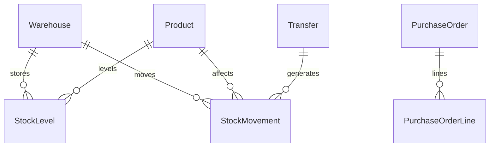

# Inventory & Warehouse Management

|                  |                                                                      |
| ---------------- | -------------------------------------------------------------------- |
| **Slug**         | `inventory-warehouse`                                                |
| **Implement in** | `apps/api/` + `apps/web/` on branch `<dev-name>/inventory-warehouse` |

## Problem

Ops teams track stock across warehouses with transfers, purchase orders, and adjustments.

## Personas / roles

- admin
- warehouse_manager (staff)
- clerk (user)

## Suggested entities

- `User`
- `Warehouse`
- `Product`
- `StockLevel`
- `StockMovement`
- `Transfer`
- `PurchaseOrder`
- `PurchaseOrderLine`

## ERD (starter)

## Hard invariant

No movement may drive StockLevel.quantity below zero.

## Required transaction

Transfer: decrement source + increment destination + two movement rows.

## Must (pass)

- [ ] Warehouses + products + stock levels
- [ ] Inventory adjustments (in/out/adjust)
- [ ] Negative stock blocked
- [ ] List movements with filters (warehouse, SKU, date)
- [ ] Soft-delete products

Plus the shared Must bar in [grading.md](../grading.md).

## Should (distinction)

- [ ] Inter-warehouse transfers
- [ ] Purchase orders (draft → received updates stock)
- [ ] Low-stock report
- [ ] Manager dashboard
- [ ] SKU unique constraint

## Stretch (bonus)

- [ ] Barcode scanning
- [ ] EDI suppliers
- [ ] Cycle count workflows

## API outline (indicative)

- `CRUD /warehouses`
- `CRUD /products`
- `POST /movements`
- `POST /transfers`
- `CRUD /purchase-orders`

## FE routes (indicative)

- `/`
- `/products`
- `/warehouses`
- `/movements`
- `/transfers`
- `/purchase-orders`

## Definition of done

- Migrations + seed (≥8 realistic rows across core tables)
- Compose Postgres + project `.env`
- Next + Query + RTK ownership respected
- `docs/architecture.md` completed
- 5-minute demo script in the PR body (and notes in `docs/architecture.md`)

## Demo script (fill in)

1. Login as each role
2. Happy path for core workflow
3. Show invariant failure (expect 4xx)
4. Show list filters + soft-delete behaviour
