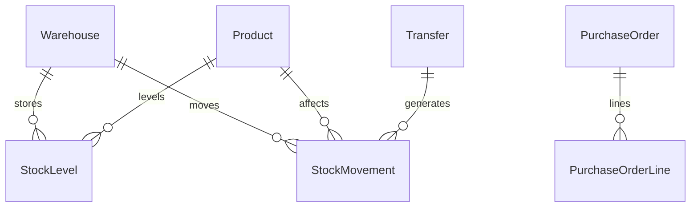

# Inventory & Warehouse Management

[← Back to Projects Index](README.md)

|                  |                                                                                                   |
| ---------------- | ------------------------------------------------------------------------------------------------- |
| **Slug**         | `inventory-warehouse`                                                                             |
| **Implement in** | `apps/api/` + `apps/web/` (auth on `apps/api-gateway`) on branch `<dev-name>/inventory-warehouse` |

## Problem

Warehouse operations fail when stock levels are wrong: teams oversell, transfer stock incorrectly, or cannot trace who moved what. Operations need accurate per-warehouse quantities and movements that never drive inventory negative.

**Who uses this system**

| Actor                 | Goal                                                         |
| --------------------- | ------------------------------------------------------------ |
| **Warehouse manager** | Configure warehouses and products, approve transfers and POs |
| **Clerk**             | Record inbound, outbound, and adjustment movements           |
| **Admin**             | Full visibility and configuration                            |

**Pain points you are solving**

- Stock going below zero after a movement.
- Transfers that update one warehouse but not the other.
- No audit trail of movements by warehouse, SKU, or date.
- Products “deleted” but still appearing in operational lists.

**What you are building**

An inventory system: stock levels per warehouse per product; movements adjust quantities with hard checks against negative stock; transfers decrement source and increment destination atomically. Purchase orders and low-stock reports extend operational value.

## Application flow (end-to-end)

```text
1. warehouse_manager (staff) creates Warehouses and Products (SKU)
2. StockLevel tracks quantity per warehouse per product
3. clerk (user) posts StockMovement adjustments (in/out/adjust)
4. Invariant: quantity never below zero after any movement
5. Transfer (Should): decrement source + increment dest + two movement rows in one transaction
6. Purchase order received (Should) updates stock
7. List movements with filters: warehouse, SKU, date
8. Soft-deleted products excluded from default lists
```

## Roles in detail

| Domain role           | Gateway role | Purpose                                     |
| --------------------- | ------------ | ------------------------------------------- |
| **admin**             | `admin`      | Full visibility, configure warehouses       |
| **warehouse_manager** | `staff`      | Manage warehouses, products, transfers, POs |
| **clerk**             | `user`       | Record movements and adjustments            |

**Locked mapping:** clerk = gateway `user`, warehouse_manager = gateway `staff`. Clerks may post movements to **any** warehouse (no per-clerk assignment table for Must).

### warehouse_manager (maps to `staff`)

- **Can:** CRUD warehouses/products; approve transfers; receive purchase orders; low-stock reports (Should).
- **Typical screens:** Manager dashboard, transfer form, PO list.

### clerk (maps to `user`)

- **Can:** Post inbound/outbound/adjust movements within permission scope; view movement history.
- **Cannot:** Drive stock negative; delete products (unless manager).
- **Typical screens:** Movement entry form, filtered movement list.

## User journeys

These journeys describe how people actually use the app — in plain language. Read them to understand the experience you are building, then walk through them during implementation and before your demo.

**Technical details** (API paths, status codes, database columns) live in **Backend expectations**, **Enums and state machines**, and **Edge cases**. These journeys explain _what should happen_ from the user's point of view.

### Everyone

#### Signing in to reach a private page _(Must)_

**Who:** Anyone who is not logged in

**Goal:** Private areas require login first.

1. Someone opens a link to a private page (for example the dashboard or their personal list) without being logged in.
2. The app sends them to the login screen instead of showing empty or broken content.
3. After they sign in with a valid account, they land on the page they originally wanted.
4. If they refresh the browser, they stay signed in and the page still loads correctly.

#### Each role sees only their part of the app _(Must)_

**Who:** Regular user vs Warehouse manager (staff)

**Goal:** Users and warehouse manager (staff) accounts must not share the same screens or powers.

1. A regular user signs in and uses the app. Menus and buttons for warehouse manager (staff) work are hidden or disabled.
2. If they manually open a warehouse manager (staff) URL (such as /products), they see an access denied message — not another person's data.
3. When they sign out and sign in as Warehouse manager (staff), those pages open normally and they can create and manage records.

#### When there is nothing to show in the product list _(Must)_

**Who:** Anyone browsing a list

**Goal:** The product list should feel intentional even when empty or still loading.

1. While the product list is loading, the user sees a skeleton or spinner — not a flash of wrong data or a blank white screen.
2. If filters or search return no products, a friendly empty state explains that nothing matched and offers to clear filters.
3. Clearing filters brings back the normal list when matching products exist.
4. Slow network: loading state stays visible until real data or a genuine empty result arrives.

#### Removing a product from public view _(Must)_

**Who:** Warehouse manager (staff)

**Goal:** Deleted products should disappear for everyone except the owner reviewing history.

1. The warehouse manager (staff) creates a product that appears in product catalog.
2. They delete it using the normal delete action and confirm in a dialog.
3. The product no longer appears in product catalog or in search results.
4. Opening an old bookmark to that product shows a polite “no longer available” message.
5. The owner can still find it in product admin list with a deleted badge if the brief includes an audit or trash view (Should).

### Warehouse manager

#### Manager sets up warehouses and products _(Must)_

**Who:** Warehouse manager (gateway role: `staff`)

**Goal:** Define what you stock and where.

1. The manager creates warehouses and products with unique SKUs.
2. Initial stock levels are recorded per warehouse.

#### Transfers and low-stock awareness _(Should)_

**Who:** Warehouse manager

**Goal:** Move stock between sites (optional).

1. The manager transfers quantity from one warehouse to another in one action.
2. Low-stock reports highlight SKUs below a threshold.

### Clerk

#### Clerk records stock movements _(Must)_

**Who:** Clerk (gateway role: `user`)

**Goal:** Log goods in, out, and adjustments.

1. The clerk posts an inbound shipment — stock increases.
2. The clerk posts an outbound sale — stock decreases.
3. Stock cannot go below zero; the app rejects movements that would.

## What is expected

### Must — required to pass

| Requirement                    | What it means for you                     |
| ------------------------------ | ----------------------------------------- |
| Warehouses + products + levels | StockLevel per warehouse+product          |
| Adjustments                    | Movement types in/out/adjust              |
| Block negative stock           | Service check + optional CHECK constraint |
| Movement list + filters        | warehouse, SKU, date                      |
| Soft-delete products           | Hidden from default catalog               |
| Shared Must bar                | [grading.md](../grading.md)               |

### Should — distinction

Transfers; purchase orders; low-stock report; manager dashboard; unique SKU.

### Stretch — bonus

Barcode scanning, EDI, cycle counts.

## Frontend expectations

> Shared UI bar for all projects: [Frontend expectations](README.md#frontend-expectations-all-projects) · [frontend.md](../frontend.md)

### Domain screens

| Route                       | Role(s)        | UI expectations                                                                         |
| --------------------------- | -------------- | --------------------------------------------------------------------------------------- |
| `/products`                 | Clerk, manager | SKU list with total stock; filters; low-stock highlight (Should)                        |
| `/warehouses`               | Manager        | Warehouse list + detail with stock levels per product                                   |
| `/movements`                | Clerk          | Movement log table; **New movement** form (type in/out/adjust, qty, warehouse, product) |
| `/transfers` (Should)       | Manager        | Transfer form: from warehouse, to warehouse, product, qty                               |
| `/purchase-orders` (Should) | Manager        | PO list; draft → received updates stock                                                 |

### UI behaviour

- **Negative stock:** Show API error message on movement form submit.
- **Movement types:** Clear labels (Inbound / Outbound / Adjustment).
- **Manager vs clerk:** Clerk sees movement entry; manager sees transfers/POs.

## Backend expectations

> Shared API bar for all projects: [Backend expectations](README.md#backend-expectations-all-projects) · [architecture.md](../architecture.md)

### Modules

| Module               | Entity(ies)             | Responsibility                        |
| -------------------- | ----------------------- | ------------------------------------- |
| `warehouses`         | `Warehouse`             | CRUD                                  |
| `products`           | `Product`, `StockLevel` | SKU; qty per warehouse                |
| `movements`          | `StockMovement`         | Adjust levels with non-negative guard |
| `transfers` (Should) | `Transfer`              | Two-warehouse transaction             |

### Key endpoints

| Method | Path         | Role       | Notes                                       |
| ------ | ------------ | ---------- | ------------------------------------------- |
| `POST` | `/movements` | user/staff | Update StockLevel in transaction            |
| `GET`  | `/movements` | staff      | Filters: warehouseId, sku, dateFrom, dateTo |
| `POST` | `/transfers` | staff      | Decrement source + increment dest           |

### Service rules

- After movement, `StockLevel.quantity >= 0` or throw `400`.
- Transfer uses single transaction with two movement rows.

### Enums and state machines

**StockMovement.type:** `inbound`, `outbound`, `adjustment`

### Database constraints

- `UNIQUE(stock_levels.warehouseId, stock_levels.productId)`
- `UNIQUE(products.sku)`
- `CHECK stock_levels.quantity >= 0`

### Domain seed (minimum)

2 warehouses, 5 products, 6 stock levels, 4 movements, 1 transfer.

### Web routes auth

| Route       | Auth required | Roles          |
| ----------- | ------------- | -------------- |
| /products   | Yes           | staff          |
| /warehouses | Yes           | staff          |
| /movements  | Yes           | staff          |
| /transfers  | Yes           | staff (Should) |

## Suggested entities

- Auth `User` is on the gateway — use `userId` FKs; do **not** recreate users/auth in `apps/api`
- `Warehouse`
- `Product`
- `StockLevel`
- `StockMovement`
- `Transfer`
- `PurchaseOrder`
- `PurchaseOrderLine`

## ERD (starter)



## Hard invariant

No movement may drive StockLevel.quantity below zero.

## Required transaction

Transfer: decrement source + increment destination + two movement rows.

## Must (pass)

- [ ] Warehouses + products + stock levels
- [ ] Inventory adjustments (in/out/adjust)
- [ ] Negative stock blocked
- [ ] List movements with filters (warehouse, SKU, date)
- [ ] Soft-delete products

Plus the shared Must bar in [grading.md](../grading.md).

## Should (distinction)

- [ ] Inter-warehouse transfers
- [ ] Purchase orders (draft → received updates stock)
- [ ] Low-stock report
- [ ] Manager dashboard
- [ ] SKU unique constraint

## Stretch (bonus)

- [ ] Barcode scanning
- [ ] EDI suppliers
- [ ] Cycle count workflows

## API outline (indicative)

- `CRUD /warehouses`
- `CRUD /products`
- `POST /movements`
- `POST /transfers`
- `CRUD /purchase-orders`

## FE routes (indicative)

- `/`
- `/products`
- `/warehouses`
- `/movements`
- `/transfers`
- `/purchase-orders`

> Shared: [FAQ & edge cases](README.md#faq--read-before-you-ask) · [grading](../grading.md)

## Edge cases and negative scenarios

### Domain — stock movements

| Scenario                             | Expected API                             | UI hint                        |
| ------------------------------------ | ---------------------------------------- | ------------------------------ |
| Movement drives qty below zero       | **400**                                  | Show current stock in form     |
| Transfer same warehouse              | **400**                                  | —                              |
| Transfer more than source stock      | **400**                                  | —                              |
| Movement on soft-deleted product     | **404**                                  | —                              |
| Duplicate SKU                        | **409** if unique SKU (Should)           | —                              |
| PO receive twice                     | **400** — PO line already fully received | —                              |
| Clerk accesses manager-only transfer | **403**                                  | Role-gate UI                   |
| Adjustment of 0 quantity             | **400**                                  | —                              |
| List movements huge date range       | Paginate                                 | Default last 30 days filter OK |

### Demo 4xx cases

1. Outbound below zero → **400**
2. Invalid transfer → **400**

## FAQ — decisions already made

| Question                     | Answer                                        |
| ---------------------------- | --------------------------------------------- |
| Negative stock ever allowed? | **Never** on Must.                            |
| Barcode scanning?            | **Stretch** — manual SKU entry OK.            |
| Multi-warehouse same SKU?    | **Yes** — `StockLevel` per warehouse+product. |
| Cost accounting / FIFO?      | **Out of scope** — quantities only.           |

## Definition of done

- Domain migrations (`pnpm migration:run:api`) + domain seed (≥8 realistic rows); gateway users via `pnpm seed`
- Compose Postgres + root `.env` + `apps/api-gateway/.env` + `apps/api/.env` + `apps/web/.env.local`
- Next + Query + RTK ownership respected; UI uses `@shared/ui/components` + theme ([frontend.md](../frontend.md))
- `docs/architecture.md` completed
- 5-minute demo script in the PR body (and notes in `docs/architecture.md`)

## Demo script (suggested — adapt for your PR)

1. **Roles (30s):** Manager setup → clerk movement entry.
2. **Happy path (2m):** Initial stock → adjustment → verify level.
3. **Invariant (30s):** Over-outbound movement → 4xx.
4. **Lists (1m):** Filter movements by warehouse/SKU; soft-delete product.
