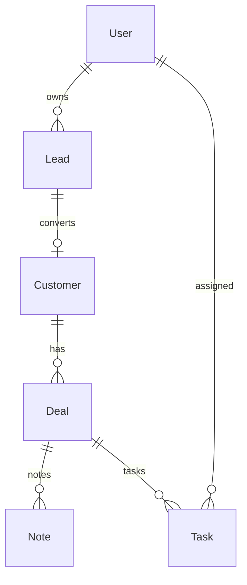

# CRM System

|                  |                                                                                   |
| ---------------- | --------------------------------------------------------------------------------- |
| **Slug**         | `crm`                                                                             |
| **Implement in** | `apps/api/` + `apps/web/` (auth on `apps/api-gateway`) on branch `<dev-name>/crm` |

## Problem

Sales teams manage leads, customers, deals in a pipeline, with notes and tasks.

## Personas / roles

- admin
- sales_lead (staff)
- rep (user)

## Suggested entities

- Auth `User` is on the gateway — use `userId` FKs; do **not** recreate users/auth in `apps/api`
- `Lead`
- `Customer`
- `Deal`
- `Note`
- `Task`

## ERD (starter)

## Hard invariant

Deal stage transitions only along allowed pipeline edges; converting lead creates customer + archives lead.

## Required transaction

Convert lead → create Customer + link + soft-delete/archive Lead.

## Must (pass)

- [ ] Leads CRUD + ownership
- [ ] Customers
- [ ] Deals with pipeline stages
- [ ] Notes + tasks on deals
- [ ] Filters: stage, owner, q
- [ ] Soft-delete deals

Plus the shared Must bar in [grading.md](../grading.md).

## Should (distinction)

- [ ] Pipeline board UI
- [ ] Reporting (deals by stage, won amount)
- [ ] Task due dates + my tasks list
- [ ] Lead → customer conversion

## Stretch (bonus)

- [ ] Email integration
- [ ] Forecasting ML
- [ ] Calendar sync

## API outline (indicative)

- `CRUD /leads`
- `POST /leads/:id/convert`
- `CRUD /customers`
- `CRUD /deals`
- `CRUD /tasks`
- `CRUD /notes`

## FE routes (indicative)

- `/`
- `/leads`
- `/customers`
- `/deals`
- `/pipeline`
- `/tasks`

## Definition of done

- Domain migrations (`pnpm migration:run:api`) + domain seed (≥8 realistic rows); gateway users via `pnpm seed`
- Compose Postgres + root `.env` + `apps/api-gateway/.env` + `apps/api/.env` + `apps/web/.env.local`
- Next + Query + RTK ownership respected; UI uses `@shared/ui/components` + theme ([frontend.md](../frontend.md))
- `docs/architecture.md` completed
- 5-minute demo script in the PR body (and notes in `docs/architecture.md`)

## Demo script (fill in)

1. Login as each role
2. Happy path for core workflow
3. Show invariant failure (expect 4xx)
4. Show list filters + soft-delete behaviour
