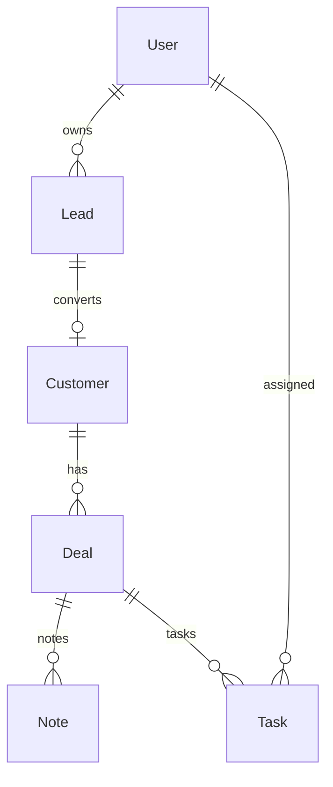

# CRM System

[← Back to Projects Index](README.md)

|                  |                                                                                   |
| ---------------- | --------------------------------------------------------------------------------- |
| **Slug**         | `crm`                                                                             |
| **Implement in** | `apps/api/` + `apps/web/` (auth on `apps/api-gateway`) on branch `<dev-name>/crm` |

## Problem

Sales teams lose deals when leads sit in inboxes, pipeline stages are inconsistent, and follow-ups are forgotten. Reps need owned leads and deals; leads need a structured path to customer conversion.

**Who uses this system**

| Actor          | Goal                                                 |
| -------------- | ---------------------------------------------------- |
| **Sales rep**  | Manage own leads, customers, deals, tasks, and notes |
| **Sales lead** | View team pipeline, reassign work, report by stage   |
| **Admin**      | Reassign ownership, platform oversight               |

**Pain points you are solving**

- Deals jumping to invalid pipeline stages.
- Leads converted without creating a proper customer record.
- No notes or tasks tied to active deals.
- Pipeline lists without filters by stage, owner, or search.

**What you are building**

A CRM: leads convert to customers in one transaction; deals move through allowed stage transitions; notes and tasks attach to deals; soft-deleted deals drop from the default pipeline. A visual pipeline board and reporting differentiate strong submissions.

## Application flow (end-to-end)

```text
1. rep (user) creates Lead assigned to self
2. rep qualifies lead → converts to Customer (transaction: create Customer + archive Lead)
3. rep opens Deal on customer → moves through pipeline stages (allowed edges only)
4. Notes and Tasks attached to deals; tasks may have due dates (Should)
5. Filters: stage, owner, search q on leads/deals
6. Pipeline board UI groups deals by stage (Should)
7. Soft-deleted deals hidden from default pipeline
```

## Roles in detail

| Domain role    | Gateway role | Purpose                                  |
| -------------- | ------------ | ---------------------------------------- |
| **admin**      | `admin`      | View all records, reassign ownership     |
| **sales_lead** | `staff`      | View team pipeline, reassign leads/deals |
| **rep**        | `user`       | Own leads, customers, deals, tasks       |

### sales_lead (maps to `staff`)

- **Can:** View all team deals; reassign owner; reporting by stage (Should).
- **Typical screens:** Pipeline board, team dashboard, won amount report.

### rep (maps to `user`)

- **Can:** CRUD own leads; convert to customer; manage deals, notes, tasks on owned records.
- **Cannot:** Skip invalid stage transitions (e.g. closed → prospecting).
- **Typical screens:** My leads, deal detail, my tasks list (Should).

Deal stage transitions only along allowed pipeline edges — define enum and adjacency map in service.

## User journeys

These journeys describe how people actually use the app — in plain language. Read them to understand the experience you are building, then walk through them during implementation and before your demo.

**Technical details** (API paths, status codes, database columns) live in **Backend expectations**, **Enums and state machines**, and **Edge cases**. These journeys explain _what should happen_ from the user's point of view.

### Everyone

#### Signing in to reach a private page _(Must)_

**Who:** Anyone who is not logged in

**Goal:** Private areas require login first.

1. Someone opens a link to a private page (for example the dashboard or their personal list) without being logged in.
2. The app sends them to the login screen instead of showing empty or broken content.
3. After they sign in with a valid account, they land on the page they originally wanted.
4. If they refresh the browser, they stay signed in and the page still loads correctly.

#### Each role sees only their part of the app _(Must)_

**Who:** Regular user vs Sales lead (staff)

**Goal:** Users and sales lead (staff) accounts must not share the same screens or powers.

1. A regular user signs in and uses the app. Menus and buttons for sales lead (staff) work are hidden or disabled.
2. If they manually open a sales lead (staff) URL (such as /deals), they see an access denied message — not another person's data.
3. When they sign out and sign in as Sales lead (staff), those pages open normally and they can create and manage records.

#### When there is nothing to show in the lead list _(Must)_

**Who:** Anyone browsing a list

**Goal:** The lead list should feel intentional even when empty or still loading.

1. While the lead list is loading, the user sees a skeleton or spinner — not a flash of wrong data or a blank white screen.
2. If filters or search return no leads, a friendly empty state explains that nothing matched and offers to clear filters.
3. Clearing filters brings back the normal list when matching leads exist.
4. Slow network: loading state stays visible until real data or a genuine empty result arrives.

#### Removing a deal from public view _(Must)_

**Who:** Sales rep

**Goal:** Deleted deals should disappear for everyone except the owner reviewing history.

1. The sales rep creates a deal that appears in pipeline view.
2. They delete it using the normal delete action and confirm in a dialog.
3. The deal no longer appears in pipeline view or in search results.
4. Opening an old bookmark to that deal shows a polite “no longer available” message.
5. The owner can still find it in deal list with a deleted badge if the brief includes an audit or trash view (Should).

### Sales rep

#### Rep captures and converts a lead _(Must)_

**Who:** Sales rep (gateway role: `user`)

**Goal:** Turn interest into a customer.

1. The rep creates a lead with contact details.
2. When qualified, they convert the lead to a customer — the lead is archived.
3. Converting the same lead twice is blocked.

#### Rep moves deals through the pipeline _(Must)_

**Who:** Sales rep

**Goal:** Track opportunities to close.

1. The rep creates a deal linked to a customer.
2. The deal moves **lead → qualified → proposal → won** (or **lost** from any open stage).
3. Invalid jumps (for example straight to **won** from **lead**) are rejected.
4. Reps see and edit their own deals; they cannot change another rep's deal unless they are admin.

#### Notes and tasks on deals _(Should)_

**Who:** Sales rep

**Goal:** Stay organized (optional).

1. The rep adds notes and follow-up tasks with due dates on a deal.
2. Overdue tasks show a visual overdue indicator.

## What is expected

### Must — required to pass

| Requirement             | What it means for you                  |
| ----------------------- | -------------------------------------- |
| Leads CRUD + ownership  | rep sees own; lead may filter by owner |
| Customers               | Created via conversion or direct       |
| Deals + pipeline stages | Valid transitions enforced             |
| Notes + tasks on deals  | Nested create on deal detail           |
| Filters                 | stage, owner, q                        |
| Soft-delete deals       | Excluded from default pipeline         |
| Shared Must bar         | [grading.md](../grading.md)            |

### Should — distinction

Pipeline board UI; reporting; task due dates; lead conversion flow polished.

### Stretch — bonus

Email integration, forecasting ML, calendar sync.

## Frontend expectations

> Shared UI bar for all projects: [Frontend expectations](README.md#frontend-expectations-all-projects) · [frontend.md](../frontend.md)

### Domain screens

| Route                | Role(s)   | UI expectations                                              |
| -------------------- | --------- | ------------------------------------------------------------ |
| `/leads`             | Rep       | Owned leads table; filters (owner, q); convert action        |
| `/customers`         | Rep       | Customer list after conversion                               |
| `/deals`             | Rep       | Deal list with stage `Badge`                                 |
| `/pipeline` (Should) | Rep, lead | Kanban or grouped columns by stage                           |
| `/deals/[id]`        | Rep       | Deal detail; notes list; tasks with due dates; stage changer |

### UI behaviour

- **Convert lead:** Button on lead detail → creates customer; lead archived/hidden from active list.
- **Stage change:** Dropdown only shows valid next stages (match API).
- **My tasks (Should):** Sidebar or `/tasks` with due date sorting.

## Backend expectations

> Shared API bar for all projects: [Backend expectations](README.md#backend-expectations-all-projects) · [architecture.md](../architecture.md)

### Modules

| Module      | Entity(ies)            | Responsibility               |
| ----------- | ---------------------- | ---------------------------- |
| `leads`     | `Lead`                 | CRUD; convert                |
| `customers` | `Customer`             | Created from lead            |
| `deals`     | `Deal`, `Note`, `Task` | Pipeline; nested notes/tasks |

### Key endpoints

| Method  | Path                 | Role | Notes                                |
| ------- | -------------------- | ---- | ------------------------------------ |
| `POST`  | `/leads/:id/convert` | user | Transaction: customer + archive lead |
| `PATCH` | `/deals/:id/stage`   | user | Validate pipeline edges              |
| `GET`   | `/deals`             | user | Filters: stage, ownerId, q           |

### Service rules

- `LeadsService.convert`: atomic customer create + lead soft-delete/archive.
- `DealsService.updateStage`: adjacency map for allowed transitions.

### Enums and state machines

| From        | To                  |
| ----------- | ------------------- |
| `lead`      | `qualified`, `lost` |
| `qualified` | `proposal`, `lost`  |
| `proposal`  | `won`, `lost`       |

### Database constraints

- `CHECK deals.stage IN ('lead','qualified','proposal','won','lost')`

### Domain seed (minimum)

4 leads (1 converted), 3 customers, 4 deals, 3 notes, 3 tasks.

### Web routes auth

| Route      | Auth required | Roles         |
| ---------- | ------------- | ------------- |
| /leads     | Yes           | user          |
| /customers | Yes           | user          |
| /deals     | Yes           | user          |
| /pipeline  | Yes           | user (Should) |

## Suggested entities

- Auth `User` is on the gateway — use `userId` FKs; do **not** recreate users/auth in `apps/api`
- `Lead`
- `Customer`
- `Deal`
- `Note`
- `Task`

## ERD (starter)



## Hard invariant

Deal stage transitions only along allowed pipeline edges; converting lead creates customer + archives lead.

## Required transaction

Convert lead → create Customer + link + soft-delete/archive Lead.

## Must (pass)

- [ ] Leads CRUD + ownership
- [ ] Customers
- [ ] Deals with pipeline stages
- [ ] Notes + tasks on deals
- [ ] Filters: stage, owner, q
- [ ] Soft-delete deals

Plus the shared Must bar in [grading.md](../grading.md).

## Should (distinction)

- [ ] Pipeline board UI
- [ ] Reporting (deals by stage, won amount)
- [ ] Task due dates + my tasks list
- [ ] Lead → customer conversion

## Stretch (bonus)

- [ ] Email integration
- [ ] Forecasting ML
- [ ] Calendar sync

## API outline (indicative)

- `CRUD /leads`
- `POST /leads/:id/convert`
- `CRUD /customers`
- `CRUD /deals`
- `CRUD /tasks`
- `CRUD /notes`

## FE routes (indicative)

- `/`
- `/leads`
- `/customers`
- `/deals`
- `/pipeline`
- `/tasks`

> Shared: [FAQ & edge cases](README.md#faq--read-before-you-ask) · [grading](../grading.md)

## Edge cases and negative scenarios

### Domain — pipeline and conversion

| Scenario                       | Expected API                                              | UI hint                                        |
| ------------------------------ | --------------------------------------------------------- | ---------------------------------------------- |
| Invalid deal stage jump        | **400**                                                   | Pipeline dropdown limited                      |
| Convert already converted lead | **400/409**                                               | Hide convert if archived                       |
| Rep edits another rep’s deal   | **403** unless `ownerId` matches JWT or caller is `admin` | `staff` sales_lead can reassign owner (Should) |
| Note on soft-deleted deal      | **404**                                                   | —                                              |
| Task due date in past          | **Allowed** — show overdue badge                          | —                                              |
| Empty pipeline stage           | **200** []                                                | —                                              |
| Deal with no customer          | **400** on create — link customer                         | —                                              |
| Duplicate lead email           | **Allowed for Must** — no unique index required           | —                                              |

### Demo 4xx cases

1. Invalid stage transition → **400**
2. Convert lead twice → **409**

## FAQ — decisions already made

| Question                                   | Answer                                                     |
| ------------------------------------------ | ---------------------------------------------------------- |
| Default pipeline stages?                   | **`lead` → `qualified` → `proposal` → `won`                | `lost`** — see the enums and constraints above state machine |
| Lead vs customer both exist after convert? | Lead **archived/soft-deleted**; customer is active record. |
| sales_lead vs staff?                       | Gateway **`staff`** = sales_lead capabilities.             |
| Email integration?                         | **Stretch** only.                                          |

## Definition of done

- Domain migrations (`pnpm migration:run:api`) + domain seed (≥8 realistic rows); gateway users via `pnpm seed`
- Compose Postgres + root `.env` + `apps/api-gateway/.env` + `apps/api/.env` + `apps/web/.env.local`
- Next + Query + RTK ownership respected; UI uses `@shared/ui/components` + theme ([frontend.md](../frontend.md))
- `docs/architecture.md` completed
- 5-minute demo script in the PR body (and notes in `docs/architecture.md`)

## Demo script (suggested — adapt for your PR)

1. **Roles (30s):** Rep leads list → lead pipeline view.
2. **Happy path (2m):** Create lead → convert → deal to won.
3. **Invariant (30s):** Invalid stage transition → 4xx.
4. **Lists (1m):** Filter deals by stage/owner.
