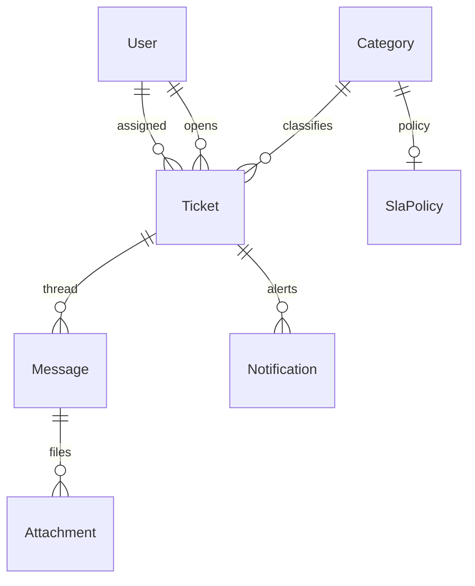

# Support Desk

|                  |                                                                                            |
| ---------------- | ------------------------------------------------------------------------------------------ |
| **Slug**         | `support-desk`                                                                             |
| **Implement in** | `apps/api/` + `apps/web/` (auth on `apps/api-gateway`) on branch `<dev-name>/support-desk` |

## Problem

Customers open tickets; agents converse, assign, meet SLAs, and attach files.

## Personas / roles

- admin
- agent (staff)
- customer (user)

## Suggested entities

- Auth `User` is on the gateway — use `userId` FKs; do **not** recreate users/auth in `apps/api`
- `Category`
- `Ticket`
- `Message`
- `Attachment`
- `SlaPolicy`
- `Notification`

## ERD (starter)

## Hard invariant

Status transitions constrained; first response SLA deadline computed on create (even if enforcement is soft).

## Required transaction

Create ticket + first message (+ optional attachment metadata) atomically.

## Must (pass)

- [ ] Categories + tickets
- [ ] Threaded messages
- [ ] Agent assign/reassign
- [ ] Status workflow (open/pending/resolved/closed)
- [ ] Filters: status, category, assignee
- [ ] Soft-delete tickets (admin audit)

Plus the shared Must bar in [grading.md](../grading.md).

## Should (distinction)

- [ ] SLA policy fields + breach flag on list
- [ ] Attachments as URL or local upload stub
- [ ] In-app notifications table (poll or refetch)
- [ ] Agent inbox dashboard

## Stretch (bonus)

- [ ] Email/webhook notifications
- [ ] Realtime agent presence
- [ ] Macro replies / AI assist

## API outline (indicative)

- `CRUD /tickets`
- `POST /tickets/:id/messages`
- `PATCH /tickets/:id/assign`
- `CRUD /categories`
- `GET /notifications`

## FE routes (indicative)

- `/`
- `/tickets`
- `/tickets/[id]`
- `/agent`
- `/admin/categories`

## Definition of done

- Domain migrations (`pnpm migration:run:api`) + domain seed (≥8 realistic rows); gateway users via `pnpm seed`
- Compose Postgres + root `.env` + `apps/api-gateway/.env` + `apps/api/.env` + `apps/web/.env.local`
- Next + Query + RTK ownership respected
- `docs/architecture.md` completed
- 5-minute demo script in the PR body (and notes in `docs/architecture.md`)

## Demo script (fill in)

1. Login as each role
2. Happy path for core workflow
3. Show invariant failure (expect 4xx)
4. Show list filters + soft-delete behaviour
