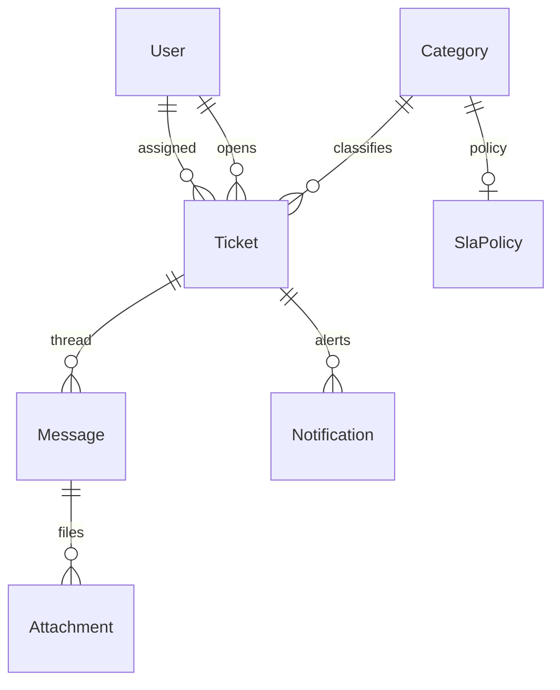

# Support Desk

[← Back to Projects Index](README.md)

|                  |                                                                                            |
| ---------------- | ------------------------------------------------------------------------------------------ |
| **Slug**         | `support-desk`                                                                             |
| **Implement in** | `apps/api/` + `apps/web/` (auth on `apps/api-gateway`) on branch `<dev-name>/support-desk` |

## Problem

Customer support breaks down when tickets are lost, unassigned, or resolved without a clear thread. Customers need to open issues and follow replies; agents need assignment, status workflow, and SLA visibility.

**Who uses this system**

| Actor        | Goal                                             |
| ------------ | ------------------------------------------------ |
| **Customer** | Open tickets, reply on own threads               |
| **Agent**    | Assign, respond, resolve, and close tickets      |
| **Admin**    | Manage categories, SLA policies, audit deletions |

**Pain points you are solving**

- Tickets created without an initial message.
- Status changes that skip required steps.
- No filters by status, category, or assignee for agent inbox.
- SLA deadlines never computed or surfaced.

**What you are building**

A support desk: ticket + first message created atomically; threaded conversation on detail; agents assign and advance status (open → pending → resolved → closed); categories link to SLA policies. Attachments and breach flags on lists are Should-tier features.

## Application flow (end-to-end)

```text
1. Customer (user) opens Ticket in Category → first Message created in same transaction
2. SLA deadline computed on create from Category's SlaPolicy (even if enforcement is soft)
3. Agent (staff) views inbox → assigns self or reassigns ticket
4. Status workflow: open → pending → resolved → closed (constrained transitions)
5. Threaded Messages on ticket detail; attachments as URL/metadata (Should)
6. Filters: status, category, assignee
7. Admin soft-deletes tickets with audit trail
```

## Roles in detail

| Domain role  | Gateway role | Purpose                                         |
| ------------ | ------------ | ----------------------------------------------- |
| **admin**    | `admin`      | Manage categories, SLA policies, delete tickets |
| **agent**    | `staff`      | Assign, reply, change status, view all tickets  |
| **customer** | `user`       | Open tickets, reply on own tickets only         |

### agent (maps to `staff`)

- **Can:** View all tickets; assign/reassign; reply; advance status; see SLA breach flags (Should).
- **Typical screens:** Agent inbox `/agent`, ticket detail with reply form, assign dropdown.

### customer (maps to `user`)

- **Can:** Create ticket with initial message; view/reply on own tickets; upload attachment metadata (Should).
- **Cannot:** Assign tickets; close others' tickets; change SLA fields.
- **Typical screens:** My tickets list, ticket detail thread.

## User journeys

These journeys describe how people actually use the app — in plain language. Read them to understand the experience you are building, then walk through them during implementation and before your demo.

**Technical details** (API paths, status codes, database columns) live in **Backend expectations**, **Enums and state machines**, and **Edge cases**. These journeys explain _what should happen_ from the user's point of view.

### Everyone

#### Signing in to reach a private page _(Must)_

**Who:** Anyone who is not logged in

**Goal:** Private areas require login first.

1. Someone opens a link to a private page (for example the dashboard or their personal list) without being logged in.
2. The app sends them to the login screen instead of showing empty or broken content.
3. After they sign in with a valid account, they land on the page they originally wanted.
4. If they refresh the browser, they stay signed in and the page still loads correctly.

#### Each role sees only their part of the app _(Must)_

**Who:** Regular user vs Support agent (staff)

**Goal:** Users and support agent (staff) accounts must not share the same screens or powers.

1. A regular user signs in and uses the app. Menus and buttons for support agent (staff) work are hidden or disabled.
2. If they manually open a support agent (staff) URL (such as /agent), they see an access denied message — not another person's data.
3. When they sign out and sign in as Support agent (staff), those pages open normally and they can create and manage records.

#### When there is nothing to show in the ticket list _(Must)_

**Who:** Anyone browsing a list

**Goal:** The ticket list should feel intentional even when empty or still loading.

1. While the ticket list is loading, the user sees a skeleton or spinner — not a flash of wrong data or a blank white screen.
2. If filters or search return no tickets, a friendly empty state explains that nothing matched and offers to clear filters.
3. Clearing filters brings back the normal list when matching tickets exist.
4. Slow network: loading state stays visible until real data or a genuine empty result arrives.

#### Removing a ticket from public view _(Must)_

**Who:** Support agent (staff)

**Goal:** Deleted tickets should disappear for everyone except the owner reviewing history.

1. The support agent (staff) creates a ticket that appears in customer ticket list.
2. They delete it using the normal delete action and confirm in a dialog.
3. The ticket no longer appears in customer ticket list or in search results.
4. Opening an old bookmark to that ticket shows a polite “no longer available” message.
5. The owner can still find it in agent queue with a deleted badge if the brief includes an audit or trash view (Should).

### Customer

#### Customer opens a support ticket _(Must)_

**Who:** Customer (gateway role: `user`)

**Goal:** Get help on a problem.

1. The customer picks a category, writes a subject and first message, and submits.
2. The ticket appears in **My tickets** with status **open**.
3. They can reply in the thread until the ticket is closed.

### Support agent

#### Agent works the queue _(Must)_

**Who:** Support agent (gateway role: `staff`)

**Goal:** Resolve issues with clear status flow.

1. The agent sees all tickets, assigns one to themselves, and replies.
2. Status moves **open → pending → resolved → closed** along allowed paths.
3. Customers cannot post new messages on **closed** tickets.
4. Agents may close a ticket even if the customer never replied.

## What is expected

### Must — required to pass

| Requirement          | What it means for you        |
| -------------------- | ---------------------------- |
| Categories + tickets | Category FK on ticket        |
| Threaded messages    | Chronological on detail      |
| Assign/reassign      | Agent-only PATCH             |
| Status workflow      | open/pending/resolved/closed |
| Filters              | status, category, assignee   |
| Soft-delete          | Admin audit visibility       |
| Shared Must bar      | [grading.md](../grading.md)  |

### Should — distinction

SLA policy + breach flag; attachments; in-app notifications; agent dashboard.

### Stretch — bonus

Email/webhook notifications, realtime presence, macro replies.

## Frontend expectations

> Shared UI bar for all projects: [Frontend expectations](README.md#frontend-expectations-all-projects) · [frontend.md](../frontend.md)

### Domain screens

| Route               | Role(s)         | UI expectations                                                           |
| ------------------- | --------------- | ------------------------------------------------------------------------- |
| `/tickets`          | Customer        | My tickets list with status, category; create ticket form                 |
| `/tickets/[id]`     | Customer, agent | Subject, status badge, message thread (chat-style or stacked), reply box  |
| `/agent`            | Agent (`staff`) | Inbox: all tickets; filters (status, category, assignee); assign dropdown |
| `/admin/categories` | Admin           | Category + SLA policy CRUD (Should)                                       |

### UI behaviour

- **Create ticket:** Subject + body creates ticket + first message in one submit.
- **Agent actions:** Assign to self; status buttons along workflow.
- **SLA breach (Should):** Highlight overdue rows in agent inbox (`Badge` danger).

## Backend expectations

> Shared API bar for all projects: [Backend expectations](README.md#backend-expectations-all-projects) · [architecture.md](../architecture.md)

### Modules

| Module                   | Entity(ies)             | Responsibility                     |
| ------------------------ | ----------------------- | ---------------------------------- |
| `tickets`                | `Ticket`, `Message`     | Create with first message; thread  |
| `categories`             | `Category`, `SlaPolicy` | Classification + SLA deadline calc |
| `notifications` (Should) | `Notification`          | In-app alerts                      |

### Key endpoints

| Method  | Path                  | Role        | Notes                               |
| ------- | --------------------- | ----------- | ----------------------------------- |
| `POST`  | `/tickets`            | user        | Transaction: ticket + first message |
| `PATCH` | `/tickets/:id/assign` | staff       | Set assigneeId                      |
| `PATCH` | `/tickets/:id/status` | staff/agent | Constrained transitions             |
| `GET`   | `/tickets`            | user/staff  | Filters; customers see own only     |

### Service rules

- On create: compute `firstResponseDueAt` from category SLA (store even if enforcement is soft).
- Customer can only read/write own tickets.

### Enums and state machines

| From       | To                                                                  |
| ---------- | ------------------------------------------------------------------- |
| `open`     | `pending`                                                           |
| `pending`  | `open`, `resolved`                                                  |
| `resolved` | `closed`, `open`                                                    |
| `closed`   | _(terminal — no further transitions; customer messages return 400)_ |

> Agents may not jump directly from `open` to `resolved` or `closed` — the ticket must pass through `pending` first.

### Database constraints

- `CHECK tickets.status IN ('open','pending','resolved','closed')`

### Domain seed (minimum)

3 categories, 5 tickets, 8 messages, mixed statuses.

### Web routes auth

| Route             | Auth required | Roles       |
| ----------------- | ------------- | ----------- |
| /tickets          | Yes           | user/staff  |
| /tickets/[id]     | Yes           | owner/agent |
| /agent            | Yes           | staff       |
| /admin/categories | Yes           | admin       |

## Suggested entities

- Auth `User` is on the gateway — use `userId` FKs; do **not** recreate users/auth in `apps/api`
- `Category`
- `Ticket`
- `Message`
- `Attachment`
- `SlaPolicy`
- `Notification`

## ERD (starter)



## Hard invariant

Status transitions constrained; first response SLA deadline computed on create (even if enforcement is soft).

## Required transaction

Create ticket + first message (+ optional attachment metadata) atomically.

## Must (pass)

- [ ] Categories + tickets
- [ ] Threaded messages
- [ ] Agent assign/reassign
- [ ] Status workflow (open/pending/resolved/closed)
- [ ] Filters: status, category, assignee
- [ ] Soft-delete tickets (admin audit)

Plus the shared Must bar in [grading.md](../grading.md).

## Should (distinction)

- [ ] SLA policy fields + breach flag on list
- [ ] Attachments as URL or local upload stub
- [ ] In-app notifications table (poll or refetch)
- [ ] Agent inbox dashboard

## Stretch (bonus)

- [ ] Email/webhook notifications
- [ ] Realtime agent presence
- [ ] Macro replies / AI assist

## API outline (indicative)

- `CRUD /tickets`
- `POST /tickets/:id/messages`
- `PATCH /tickets/:id/assign`
- `CRUD /categories`
- `GET /notifications`

## FE routes (indicative)

- `/`
- `/tickets`
- `/tickets/[id]`
- `/agent`
- `/admin/categories`

> Shared: [FAQ & edge cases](README.md#faq--read-before-you-ask) · [grading](../grading.md)

## Edge cases and negative scenarios

### Domain — tickets and SLA

| Scenario                       | Expected API                                                       | UI hint               |
| ------------------------------ | ------------------------------------------------------------------ | --------------------- |
| Customer views other ticket    | **404**                                                            | —                     |
| Customer assigns ticket        | **403**                                                            | —                     |
| Agent closes without reply     | **Allowed** — agent may set status `closed` without customer reply | —                     |
| Message on closed ticket       | **400** — customer cannot post on `closed` tickets                 | —                     |
| Invalid status transition      | **400**                                                            | —                     |
| Create ticket empty body       | **400**                                                            | Require first message |
| SLA breach without agent reply | **Should:** flag only — no auto-close required                     | Badge in inbox        |
| Category deleted with tickets  | **400** — block delete while tickets reference category            | —                     |
| Duplicate ticket ids in list   | N/A — UUID                                                         | —                     |

### Demo 4xx cases

1. Customer opens another user’s ticket → **404**
2. Empty ticket create → **400**

## FAQ — decisions already made

| Question                           | Answer                                                       |
| ---------------------------------- | ------------------------------------------------------------ |
| Email notifications?               | **Stretch** — in-app optional Should.                        |
| SLA enforcement auto-escalate?     | **No** — computing deadline + breach flag enough for Should. |
| Attachments storage?               | **URL string** or local path metadata — no S3 required.      |
| Can customer reopen closed ticket? | **Optional** — if no, **400** on message to closed.          |

## Definition of done

- Domain migrations (`pnpm migration:run:api`) + domain seed (≥8 realistic rows); gateway users via `pnpm seed`
- Compose Postgres + root `.env` + `apps/api-gateway/.env` + `apps/api/.env` + `apps/web/.env.local`
- Next + Query + RTK ownership respected; UI uses `@shared/ui/components` + theme ([frontend.md](../frontend.md))
- `docs/architecture.md` completed
- 5-minute demo script in the PR body (and notes in `docs/architecture.md`)

## Demo script (suggested — adapt for your PR)

1. **Roles (30s):** Customer ticket list → agent inbox.
2. **Happy path (2m):** Open ticket → agent assigns → resolves → closes.
3. **Invariant (30s):** Invalid status jump → 4xx (if enforced).
4. **Lists (1m):** Filter by status/category/assignee.
