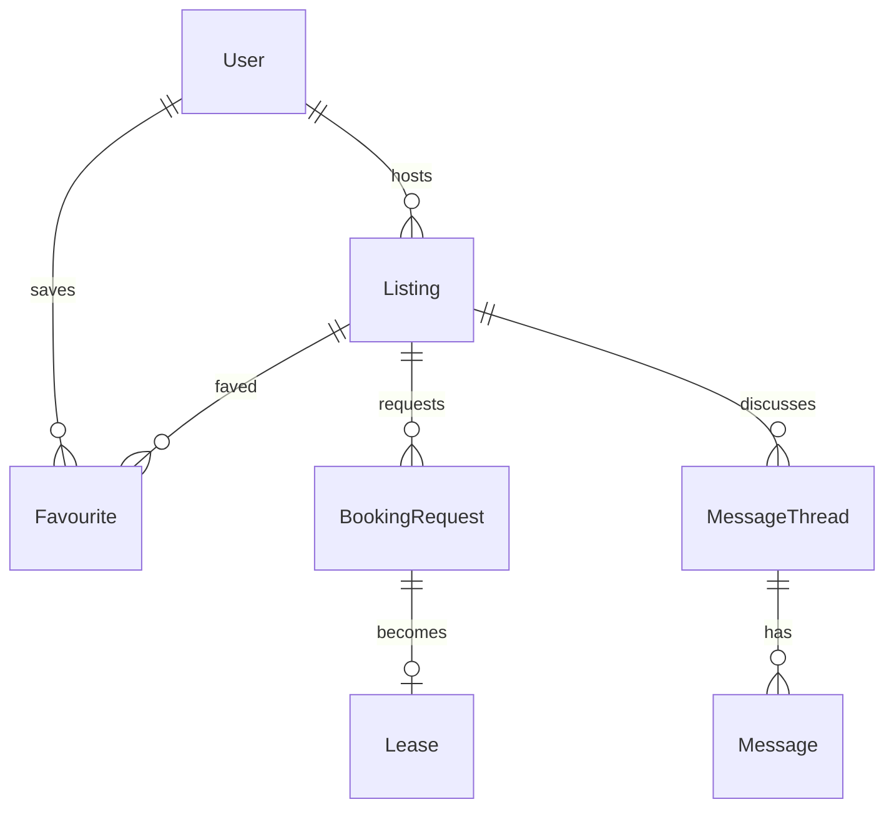

# Property Rental Platform

[← Back to Projects Index](README.md)

|                  |                                                                                               |
| ---------------- | --------------------------------------------------------------------------------------------- |
| **Slug**         | `property-rental`                                                                             |
| **Implement in** | `apps/api/` + `apps/web/` (auth on `apps/api-gateway`) on branch `<dev-name>/property-rental` |

## Problem

Short-term rental booking is risky when date conflicts are manual and communication between host and renter is scattered. Hosts need listings and approval control; renters need search, favourites, and clear booking state.

**Who uses this system**

| Actor      | Goal                                                               |
| ---------- | ------------------------------------------------------------------ |
| **Host**   | List properties, approve or reject booking requests, manage leases |
| **Renter** | Search, save favourites, request stays, view trips                 |
| **Admin**  | Moderate listings, resolve disputes                                |

**Pain points you are solving**

- Overlapping approved bookings on the same property.
- Pending requests left in limbo when one booking is approved.
- No search filters (city, price, bedrooms).
- Listings removed but still discoverable.

**What you are building**

A rental platform: hosts own listings; renters submit date-range requests; approval creates a lease and rejects conflicting pending requests in one transaction. Messaging and host/renter dashboards improve the end-to-end journey.

## Application flow (end-to-end)

```text
1. Host (staff) creates Listing (city, price, bedrooms, availability)
2. Renter (user) searches with filters → favourites listings
3. Renter submits BookingRequest with date range
4. Overlap check rejects conflicting approved bookings/leases (invariant)
5. Host approves request → transaction: create Lease + reject conflicting pending requests
6. Messaging thread between host and renter (Should)
7. Soft-deleted listings hidden from search
```

## Roles in detail

| Domain role | Gateway role | Purpose                                                     |
| ----------- | ------------ | ----------------------------------------------------------- |
| **admin**   | `admin`      | Moderate listings, resolve disputes                         |
| **host**    | `staff`      | CRUD own listings, approve/reject requests, message renters |
| **renter**  | `user`       | Search, favourite, request bookings, view trips             |

### host (maps to `staff`)

- **Can:** CRUD own listings; approve/reject booking requests; view lease details; host dashboard (Should).
- **Cannot:** Approve overlapping bookings on same listing.
- **Typical screens:** Host dashboard `/host`, listing editor, request inbox.

### renter (maps to `user`)

- **Can:** Search/filter listings; save favourites; submit booking requests; view my trips/leases.
- **Cannot:** Edit listing details; approve own requests.
- **Typical screens:** Listing search, favourites, trips `/trips`, message thread (Should).

## User journeys

These journeys describe how people actually use the app — in plain language. Read them to understand the experience you are building, then walk through them during implementation and before your demo.

**Technical details** (API paths, status codes, database columns) live in **Backend expectations**, **Enums and state machines**, and **Edge cases**. These journeys explain _what should happen_ from the user's point of view.

### Everyone

#### Signing in to reach a private page _(Must)_

**Who:** Anyone who is not logged in

**Goal:** Private areas require login first.

1. Someone opens a link to a private page (for example the dashboard or their personal list) without being logged in.
2. The app sends them to the login screen instead of showing empty or broken content.
3. After they sign in with a valid account, they land on the page they originally wanted.
4. If they refresh the browser, they stay signed in and the page still loads correctly.

#### Each role sees only their part of the app _(Must)_

**Who:** Regular user vs Host (staff)

**Goal:** Users and host (staff) accounts must not share the same screens or powers.

1. A regular user signs in and uses the app. Menus and buttons for host (staff) work are hidden or disabled.
2. If they manually open a host (staff) URL (such as /host/listings), they see an access denied message — not another person's data.
3. When they sign out and sign in as Host (staff), those pages open normally and they can create and manage records.

#### When there is nothing to show in the listing search _(Must)_

**Who:** Anyone browsing a list

**Goal:** The listing search should feel intentional even when empty or still loading.

1. While the listing search is loading, the user sees a skeleton or spinner — not a flash of wrong data or a blank white screen.
2. If filters or search return no listings, a friendly empty state explains that nothing matched and offers to clear filters.
3. Clearing filters brings back the normal list when matching listings exist.
4. Slow network: loading state stays visible until real data or a genuine empty result arrives.

#### Removing a listing from public view _(Must)_

**Who:** Host (staff)

**Goal:** Deleted listings should disappear for everyone except the owner reviewing history.

1. The host (staff) creates a listing that appears in public listings.
2. They delete it using the normal delete action and confirm in a dialog.
3. The listing no longer appears in public listings or in search results.
4. Opening an old bookmark to that listing shows a polite “no longer available” message.
5. The owner can still find it in host listing manager with a deleted badge if the brief includes an audit or trash view (Should).

### Host

#### Host lists a property _(Must)_

**Who:** Host (gateway role: `staff`)

**Goal:** Publish places guests can request.

1. The host creates a listing with title, city, nightly price, and description.
2. It appears in public search for that city.

#### Host approves and creates a lease _(Must)_

**Who:** Host

**Goal:** Confirm one guest when dates are free.

1. The host reviews pending requests and approves one.
2. Other conflicting pending requests for those dates are rejected automatically.
3. The guest sees a confirmed lease on **My trips**.

### Guest

#### Guest requests dates _(Must)_

**Who:** Guest (gateway role: `user`)

**Goal:** Book stays without overlapping conflicts.

1. The guest picks check-in and check-out dates and submits a booking request.
2. Overlapping requests for the same listing are rejected.
3. The guest cannot request two overlapping trips for themselves.

#### Favourites _(Should)_

**Who:** Guest

**Goal:** Save listings to revisit (optional).

1. The guest hearts a listing and finds it later under **Favourites**.

## What is expected

### Must — required to pass

| Requirement          | What it means for you            |
| -------------------- | -------------------------------- |
| Listings CRUD        | Host-owned                       |
| Booking requests     | pending/approved/rejected        |
| Date overlap check   | Service-level range intersection |
| Search filters       | city, price, bedrooms            |
| Soft-delete listings | Hidden from search               |
| Shared Must bar      | [grading.md](../grading.md)      |

### Should — distinction

Lease entity; messaging; host dashboard; renter my-trips view.

### Stretch — bonus

E-sign documents, Stripe rent, map search.

## Frontend expectations

> Shared UI bar for all projects: [Frontend expectations](README.md#frontend-expectations-all-projects) · [frontend.md](../frontend.md)

### Domain screens

| Route            | Role(s)        | UI expectations                                                                 |
| ---------------- | -------------- | ------------------------------------------------------------------------------- |
| `/listings`      | Renter         | Search with city, price, bedrooms filters; card grid                            |
| `/listings/[id]` | Renter         | Photos placeholder, details, date picker, **Request booking**, favourite toggle |
| `/favourites`    | Renter         | Saved listings list                                                             |
| `/trips`         | Renter         | Booking requests + approved leases with dates/status                            |
| `/host`          | Host (`staff`) | Own listings CRUD; incoming requests with approve/reject                        |

### UI behaviour

- **Approve:** Host sees pending requests; approve triggers lease creation (show success + reject others in UI copy).
- **Messaging (Should):** Thread UI between host and renter on listing/trip detail.
- **Overlap errors:** Show clear message when requested dates conflict.

## Backend expectations

> Shared API bar for all projects: [Backend expectations](README.md#backend-expectations-all-projects) · [architecture.md](../architecture.md)

### Modules

| Module              | Entity(ies)                | Responsibility               |
| ------------------- | -------------------------- | ---------------------------- |
| `listings`          | `Listing`, `Favourite`     | Host CRUD; renter favourites |
| `booking-requests`  | `BookingRequest`, `Lease`  | Request/approve workflow     |
| `messages` (Should) | `MessageThread`, `Message` | Host–renter chat             |

### Key endpoints

| Method | Path                            | Role  | Notes                                 |
| ------ | ------------------------------- | ----- | ------------------------------------- |
| `POST` | `/booking-requests`             | user  | Date overlap check on create          |
| `POST` | `/booking-requests/:id/approve` | staff | Transaction: lease + reject conflicts |
| `GET`  | `/listings`                     | all   | Filters: city, minPrice, maxBedrooms  |

### Service rules

- Approve: range intersection query against approved bookings/leases on same listing.
- Reject other pending requests for overlapping dates in same transaction.

### Enums and state machines

**BookingRequest.status:** `pending`, `approved`, `rejected`

### Database constraints

- `UNIQUE(favourites.userId, favourites.listingId)`
- `UNIQUE(leases.bookingRequestId)`

### Domain seed (minimum)

4 listings, 3 booking requests, 2 leases, 2 favourites.

### Web routes auth

| Route          | Auth required | Roles |
| -------------- | ------------- | ----- |
| /listings      | No            | All   |
| /listings/[id] | No            | All   |
| /favourites    | Yes           | user  |
| /trips         | Yes           | user  |
| /host          | Yes           | staff |

## Suggested entities

- Auth `User` is on the gateway — use `userId` FKs; do **not** recreate users/auth in `apps/api`
- `Listing`
- `Favourite`
- `BookingRequest`
- `Lease`
- `MessageThread`
- `Message`

## ERD (starter)



## Hard invariant

Overlapping approved bookings/leases on a listing are rejected.

## Required transaction

Approve booking request → create Lease + reject conflicting pending requests.

## Must (pass)

- [ ] Listings CRUD (host-owned)
- [ ] Booking requests (pending/approved/rejected)
- [ ] Date overlap check
- [ ] Search filters (city, price, bedrooms)
- [ ] Soft-delete listings

Plus the shared Must bar in [grading.md](../grading.md).

## Should (distinction)

- [ ] Favourites (unique user + listing; toggle heart on listing card)
- [ ] Lease entity after approval (start/end, rent)
- [ ] Messaging thread between host and renter
- [ ] Host dashboard
- [ ] Renter my-trips view

## Stretch (bonus)

- [ ] Document e-sign
- [ ] Stripe rent collection
- [ ] Map search

## API outline (indicative)

- `CRUD /listings`
- `POST /favourites`
- `POST /booking-requests`
- `POST /booking-requests/:id/approve`
- `CRUD /messages`

## FE routes (indicative)

- `/`
- `/listings`
- `/listings/[id]`
- `/favourites`
- `/trips`
- `/host`

> Shared: [FAQ & edge cases](README.md#faq--read-before-you-ask) · [grading](../grading.md)

## Edge cases and negative scenarios

### Domain — bookings and leases

| Scenario                              | Expected API                                               | UI hint                |
| ------------------------------------- | ---------------------------------------------------------- | ---------------------- |
| Overlapping approved requests         | **409** on approve second                                  | Calendar shows blocked |
| Renter requests overlapping own trips | **400** — overlapping dates for same renter on any listing | —                      |
| Host approves own request as renter   | **403**                                                    | —                      |
| Approve when listing soft-deleted     | **404**                                                    | —                      |
| Message thread cross-listing leak     | **403** — thread scoped to listing/booking                 | —                      |
| Favourite own listing                 | **400** optional block                                     | —                      |
| End date before start date            | **400**                                                    | —                      |
| Lease without approval step           | **Must use** approve → lease flow                          | —                      |

### Demo 4xx cases

1. Approve conflicting booking → **409**
2. Invalid date range → **400**

## FAQ — decisions already made

| Question                      | Answer                                                     |
| ----------------------------- | ---------------------------------------------------------- |
| Instant book vs approval?     | **Approval flow** per brief — pending → approved/rejected. |
| Payment/deposit?              | **Out of scope** for Must.                                 |
| Map search?                   | **Stretch** — city text filter enough.                     |
| Multiple properties per host? | **Yes.**                                                   |

## Definition of done

- Domain migrations (`pnpm migration:run:api`) + domain seed (≥8 realistic rows); gateway users via `pnpm seed`
- Compose Postgres + root `.env` + `apps/api-gateway/.env` + `apps/api/.env` + `apps/web/.env.local`
- Next + Query + RTK ownership respected; UI uses `@shared/ui/components` + theme ([frontend.md](../frontend.md))
- `docs/architecture.md` completed
- 5-minute demo script in the PR body (and notes in `docs/architecture.md`)

## Demo script (suggested — adapt for your PR)

1. **Roles (30s):** Host listings → renter search/favourites.
2. **Happy path (2m):** Request booking → host approves → lease visible on trips.
3. **Invariant (30s):** Overlapping approve attempt → rejected.
4. **Lists (1m):** Search filters; soft-delete listing.
