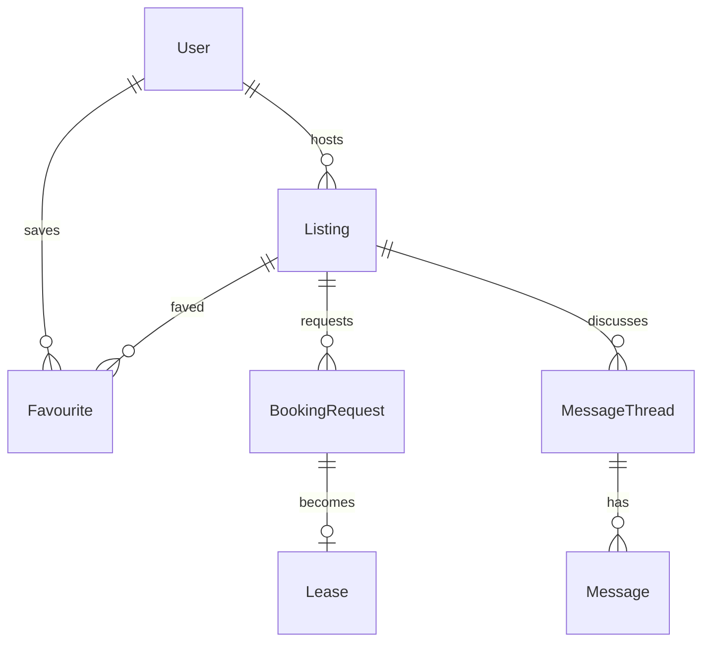

# Property Rental Platform

|                  |                                                                  |
| ---------------- | ---------------------------------------------------------------- |
| **Slug**         | `property-rental`                                                |
| **Implement in** | `apps/api/` + `apps/web/` on branch `<dev-name>/property-rental` |

## Problem

Hosts list properties; renters favourite, request bookings, and manage leases with messaging.

## Personas / roles

- admin
- host (staff)
- renter (user)

## Suggested entities

- `User`
- `Listing`
- `Favourite`
- `BookingRequest`
- `Lease`
- `MessageThread`
- `Message`

## ERD (starter)

## Hard invariant

Overlapping approved bookings/leases on a listing are rejected.

## Required transaction

Approve booking request → create Lease + reject conflicting pending requests.

## Must (pass)

- [ ] Listings CRUD (host-owned)
- [ ] Favourites
- [ ] Booking requests (pending/approved/rejected)
- [ ] Date overlap check
- [ ] Search filters (city, price, bedrooms)
- [ ] Soft-delete listings

Plus the shared Must bar in [grading.md](../grading.md).

## Should (distinction)

- [ ] Lease entity after approval (start/end, rent)
- [ ] Messaging thread between host and renter
- [ ] Host dashboard
- [ ] Renter my-trips view

## Stretch (bonus)

- [ ] Document e-sign
- [ ] Stripe rent collection
- [ ] Map search

## API outline (indicative)

- `CRUD /listings`
- `POST /favourites`
- `POST /booking-requests`
- `POST /booking-requests/:id/approve`
- `CRUD /messages`

## FE routes (indicative)

- `/`
- `/listings`
- `/listings/[id]`
- `/favourites`
- `/trips`
- `/host`

## Definition of done

- Migrations + seed (≥8 realistic rows across core tables)
- Compose Postgres + project `.env`
- Next + Query + RTK ownership respected
- `docs/architecture.md` completed
- 5-minute demo script in the PR body (and notes in `docs/architecture.md`)

## Demo script (fill in)

1. Login as each role
2. Happy path for core workflow
3. Show invariant failure (expect 4xx)
4. Show list filters + soft-delete behaviour
