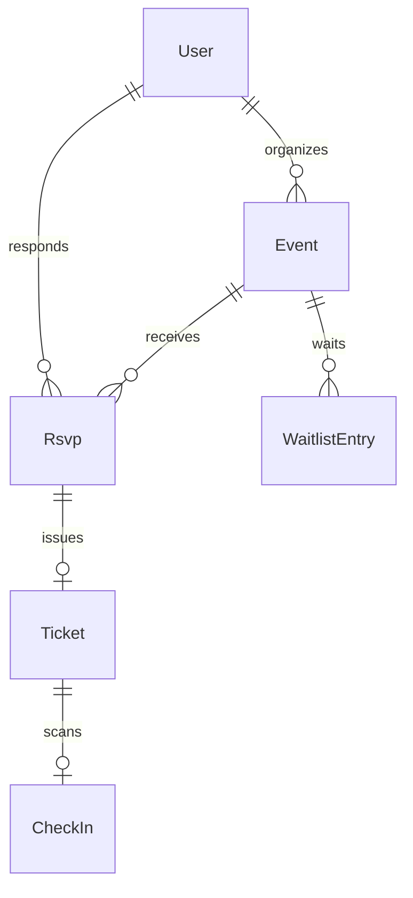

# Event Management Platform

|                  |                                                                   |
| ---------------- | ----------------------------------------------------------------- |
| **Slug**         | `event-management`                                                |
| **Implement in** | `apps/api/` + `apps/web/` on branch `<dev-name>/event-management` |

## Problem

Organizers publish events with capacity, RSVPs/tickets, waitlists, check-in, and analytics.

## Personas / roles

- admin
- organizer (staff)
- attendee (user)

## Suggested entities

- `User`
- `Event`
- `Rsvp`
- `Ticket`
- `WaitlistEntry`
- `CheckIn`

## ERD (starter)

## Hard invariant

Capacity enforced; when full, new interest goes to waitlist; cancel promotes waitlist in a transaction.

## Required transaction

Cancel RSVP → promote first waitlist entry → issue ticket.

## Must (pass)

- [ ] Events CRUD
- [ ] RSVP yes/no/maybe with capacity
- [ ] Waitlist when full
- [ ] Ticket record on yes RSVP
- [ ] Filters: date range, q
- [ ] Soft-delete events

Plus the shared Must bar in [grading.md](../grading.md).

## Should (distinction)

- [ ] QR payload string on ticket (render as text/QR lib optional)
- [ ] Check-in endpoint marking ticket used
- [ ] Organizer analytics (counts by status)
- [ ] Attendee my-events

## Stretch (bonus)

- [ ] Hardware scanner app
- [ ] Paid ticketing gateway
- [ ] Seat maps

## API outline (indicative)

- `CRUD /events`
- `POST /events/:id/rsvp`
- `POST /tickets/:id/check-in`
- `GET /events/:id/analytics`

## FE routes (indicative)

- `/`
- `/events`
- `/events/[id]`
- `/tickets`
- `/organizer`

## Definition of done

- Migrations + seed (≥8 realistic rows across core tables)
- Compose Postgres + root `.env` + `apps/api/.env`
- Next + Query + RTK ownership respected
- `docs/architecture.md` completed
- 5-minute demo script in the PR body (and notes in `docs/architecture.md`)

## Demo script (fill in)

1. Login as each role
2. Happy path for core workflow
3. Show invariant failure (expect 4xx)
4. Show list filters + soft-delete behaviour
