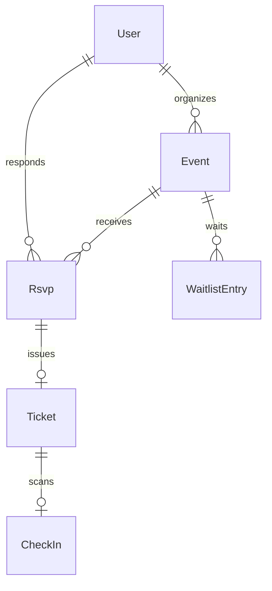

# Event Management Platform

[← Back to Projects Index](README.md)

|                  |                                                                                                |
| ---------------- | ---------------------------------------------------------------------------------------------- |
| **Slug**         | `event-management`                                                                             |
| **Implement in** | `apps/api/` + `apps/web/` (auth on `apps/api-gateway`) on branch `<dev-name>/event-management` |

## Problem

Event organizers cap attendance but struggle with RSVPs, waitlists, and no-shows. Attendees need simple RSVP and ticket access; organizers need capacity enforcement and check-in.

**Who uses this system**

| Actor         | Goal                                                               |
| ------------- | ------------------------------------------------------------------ |
| **Organizer** | Create events, manage capacity, view analytics, check in attendees |
| **Attendee**  | Discover events, RSVP, receive tickets, cancel when needed         |
| **Admin**     | Platform oversight                                                 |

**Pain points you are solving**

- RSVPs exceeding venue capacity.
- Waitlisted users never promoted when someone cancels.
- Tickets issued without a linked RSVP record.
- Cancelled events still appearing in public lists.

**What you are building**

An events app: RSVP yes/no/maybe with capacity limits; waitlist when full; cancel promotes the next waitlist entry and issues a ticket in one transaction. QR check-in and organizer analytics are Should-tier enhancements.

## Application flow (end-to-end)

```text
1. Organizer (staff) creates Event with capacity limit
2. Attendee (user) browses events → RSVPs yes/no/maybe
3. yes RSVP within capacity → Ticket issued
4. When full → new yes interest goes to Waitlist (invariant)
5. Cancel RSVP → transaction: promote first waitlist → issue ticket
6. Check-in marks ticket used (Should)
7. Organizer analytics: counts by RSVP status (Should)
8. Soft-deleted events hidden from public list
```

## Roles in detail

| Domain role   | Gateway role | Purpose                                   |
| ------------- | ------------ | ----------------------------------------- |
| **admin**     | `admin`      | Platform oversight                        |
| **organizer** | `staff`      | CRUD own events, view analytics, check-in |
| **attendee**  | `user`       | RSVP, view tickets, cancel RSVP           |

### organizer (maps to `staff`)

- **Can:** CRUD events; view attendee list; check-in tickets; analytics dashboard.
- **Cannot:** Exceed capacity without waitlist path.
- **Typical screens:** Organizer dashboard `/organizer`, event editor, check-in view.

### attendee (maps to `user`)

- **Can:** RSVP to events; view my tickets; cancel RSVP (triggering waitlist promotion).
- **Cannot:** Edit event details; check-in without organizer role.
- **Typical screens:** Event list, event detail + RSVP, my tickets.

## User journeys

These journeys describe how people actually use the app — in plain language. Read them to understand the experience you are building, then walk through them during implementation and before your demo.

**Technical details** (API paths, status codes, database columns) live in **Backend expectations**, **Enums and state machines**, and **Edge cases**. These journeys explain _what should happen_ from the user's point of view.

### Everyone

#### Signing in to reach a private page _(Must)_

**Who:** Anyone who is not logged in

**Goal:** Private areas require login first.

1. Someone opens a link to a private page (for example the dashboard or their personal list) without being logged in.
2. The app sends them to the login screen instead of showing empty or broken content.
3. After they sign in with a valid account, they land on the page they originally wanted.
4. If they refresh the browser, they stay signed in and the page still loads correctly.

#### Each role sees only their part of the app _(Must)_

**Who:** Regular user vs Organizer (staff)

**Goal:** Users and organizer (staff) accounts must not share the same screens or powers.

1. A regular user signs in and uses the app. Menus and buttons for organizer (staff) work are hidden or disabled.
2. If they manually open a organizer (staff) URL (such as /organizer), they see an access denied message — not another person's data.
3. When they sign out and sign in as Organizer (staff), those pages open normally and they can create and manage records.

#### When there is nothing to show in the event list _(Must)_

**Who:** Anyone browsing a list

**Goal:** The event list should feel intentional even when empty or still loading.

1. While the event list is loading, the user sees a skeleton or spinner — not a flash of wrong data or a blank white screen.
2. If filters or search return no events, a friendly empty state explains that nothing matched and offers to clear filters.
3. Clearing filters brings back the normal list when matching events exist.
4. Slow network: loading state stays visible until real data or a genuine empty result arrives.

#### Removing an event from public view _(Must)_

**Who:** Organizer (staff)

**Goal:** Deleted events should disappear for everyone except the owner reviewing history.

1. The organizer (staff) creates an event that appears in public events calendar.
2. They delete it using the normal delete action and confirm in a dialog.
3. The event no longer appears in public events calendar or in search results.
4. Opening an old bookmark to that event shows a polite “no longer available” message.
5. The owner can still find it in organizer event list with a deleted badge if the brief includes an audit or trash view (Should).

### Organizer

#### Organizer creates an event with capacity _(Must)_

**Who:** Organizer (gateway role: `staff`)

**Goal:** Set up something people can RSVP to.

1. The organizer creates an event with date, location, and maximum attendees.
2. It appears on the public events page.

#### Check-in and analytics _(Should)_

**Who:** Organizer

**Goal:** Run the event day (optional).

1. The organizer scans or enters ticket codes to mark attendees checked in.
2. A dashboard shows RSVP breakdown and check-in counts.

### Attendee

#### Attendee RSVPs yes, no, or maybe _(Must)_

**Who:** Attendee (gateway role: `user`)

**Goal:** Respond without overfilling the room.

1. The attendee opens the event and chooses **Yes**, **No**, or **Maybe**.
2. **Yes** when space remains issues a ticket; **Maybe** and **No** do not take a seat.
3. When the event is full, new **Yes** responses join a waitlist instead.
4. RSVPing to a past event is not allowed.

#### Cancellation promotes the waitlist _(Must)_

**Who:** Attendee who had a ticket

**Goal:** Give freed seats to the next person waiting.

1. Someone with a confirmed ticket cancels.
2. The first person on the waitlist is promoted and receives a ticket automatically.

## What is expected

### Must — required to pass

| Requirement        | What it means for you       |
| ------------------ | --------------------------- |
| Events CRUD        | Organizer-owned             |
| RSVP with capacity | yes/no/maybe; ticket on yes |
| Waitlist when full | Automatic routing           |
| Ticket on yes RSVP | Linked to RSVP row          |
| Filters            | date range, q               |
| Soft-delete events | Hidden from catalog         |
| Shared Must bar    | [grading.md](../grading.md) |

### Should — distinction

QR payload on ticket; check-in endpoint; organizer analytics; attendee my-events.

### Stretch — bonus

Hardware scanner app, paid ticketing, seat maps.

## Frontend expectations

> Shared UI bar for all projects: [Frontend expectations](README.md#frontend-expectations-all-projects) · [frontend.md](../frontend.md)

### Domain screens

| Route                          | Role(s)             | UI expectations                                                  |
| ------------------------------ | ------------------- | ---------------------------------------------------------------- |
| `/events`                      | Attendee            | Upcoming events list; date + search filters; capacity indicator  |
| `/events/[id]`                 | Attendee            | Event detail; RSVP yes/no/maybe; show waitlist message when full |
| `/tickets`                     | Attendee            | My tickets with QR/text code (Should)                            |
| `/organizer`                   | Organizer (`staff`) | Own events CRUD; attendee count / analytics (Should)             |
| `/organizer/check-in` (Should) | Organizer           | Scan/enter ticket id; mark used                                  |

### UI behaviour

- **RSVP yes when full:** UI explains waitlist placement instead of ticket.
- **Cancel RSVP:** Button on ticket/event detail; show promotion feedback for waitlist (optional toast).
- **Capacity display:** "12 / 50 spots" on event detail.

## Backend expectations

> Shared API bar for all projects: [Backend expectations](README.md#backend-expectations-all-projects) · [architecture.md](../architecture.md)

### Modules

| Module               | Entity(ies)                       | Responsibility                 |
| -------------------- | --------------------------------- | ------------------------------ |
| `events`             | `Event`                           | Organizer CRUD; capacity       |
| `rsvps`              | `Rsvp`, `Ticket`, `WaitlistEntry` | RSVP + waitlist + ticket issue |
| `check-ins` (Should) | `CheckIn`                         | Mark ticket used               |

### Key endpoints

| Method   | Path                    | Role  | Notes                                  |
| -------- | ----------------------- | ----- | -------------------------------------- |
| `POST`   | `/events/:id/rsvp`      | user  | Route to waitlist if at capacity       |
| `DELETE` | `/rsvps/:id`            | user  | Transaction: cancel + promote waitlist |
| `POST`   | `/tickets/:id/check-in` | staff | Idempotent used flag                   |

### Service rules

- Count yes-RSVPs + tickets against `event.capacity`.
- Cancel: promote first waitlist entry and issue ticket atomically.

### Enums and state machines

**Rsvp.response:** `yes`, `no`, `maybe`

### Database constraints

- `UNIQUE(rsvps.eventId, rsvps.userId)`
- `UNIQUE(tickets.code)`

### Domain seed (minimum)

3 events, 6 rsvps, 4 tickets, 2 waitlist entries.

### Web routes auth

| Route        | Auth required | Roles |
| ------------ | ------------- | ----- |
| /events      | No            | All   |
| /events/[id] | No            | All   |
| /tickets     | Yes           | user  |
| /organizer   | Yes           | staff |

## Suggested entities

- Auth `User` is on the gateway — use `userId` FKs; do **not** recreate users/auth in `apps/api`
- `Event`
- `Rsvp`
- `Ticket` — minimum columns for Must: `id` (uuid), `rsvpId` FK (1:1 with Rsvp), `eventId` FK, `userId` FK, `code` (unique string — use UUID or short random string), `usedAt` (nullable timestamptz for check-in). One ticket per confirmed yes-RSVP.
- `WaitlistEntry`
- `CheckIn`

## ERD (starter)



## Hard invariant

Capacity enforced; when full, new interest goes to waitlist; cancel promotes waitlist in a transaction.

## Required transaction

Cancel RSVP → promote first waitlist entry → issue ticket.

## Must (pass)

- [ ] Events CRUD
- [ ] RSVP yes/no/maybe with capacity
- [ ] Waitlist when full
- [ ] Ticket record on yes RSVP
- [ ] Filters: date range, q
- [ ] Soft-delete events

Plus the shared Must bar in [grading.md](../grading.md).

## Should (distinction)

- [ ] QR payload string on ticket (render as text/QR lib optional)
- [ ] Check-in endpoint marking ticket used
- [ ] Organizer analytics (counts by status)
- [ ] Attendee my-events

## Stretch (bonus)

- [ ] Hardware scanner app
- [ ] Paid ticketing gateway
- [ ] Seat maps

## API outline (indicative)

- `CRUD /events`
- `POST /events/:id/rsvp`
- `POST /tickets/:id/check-in`
- `GET /events/:id/analytics`

## FE routes (indicative)

- `/`
- `/events`
- `/events/[id]`
- `/tickets`
- `/organizer`

> Shared: [FAQ & edge cases](README.md#faq--read-before-you-ask) · [grading](../grading.md)

## Edge cases and negative scenarios

### Domain — capacity and waitlist

| Scenario                               | Expected API                                | UI hint              |
| -------------------------------------- | ------------------------------------------- | -------------------- |
| RSVP yes when at capacity              | **Waitlist** entry — not ticket             | UI explains waitlist |
| Duplicate RSVP same event              | **409** one per user per event              | —                    |
| Cancel when not on RSVP                | **404**                                     | —                    |
| Check-in ticket already used           | **409** (Should)                            | —                    |
| Organizer RSVPs to own event           | **Allowed** — same rules as any attendee    | —                    |
| Event in the past — new RSVP           | **400** optional                            | —                    |
| Maybe RSVP counts toward capacity?     | **No** — only confirmed `yes` tickets count | —                    |
| Promote waitlist when multiple cancels | **FIFO** — first waitlist in transaction    | —                    |
| Soft-deleted event public page         | **404**                                     | —                    |

### Demo 4xx cases

1. Full event → waitlist path
2. Double RSVP → **409**

## FAQ — decisions already made

| Question                    | Answer                                               |
| --------------------------- | ---------------------------------------------------- |
| Paid tickets?               | **Stretch** — free RSVP + ticket record for Must.    |
| QR code library required?   | **No** — string payload on ticket enough for Should. |
| maybe/no RSVP needs ticket? | **No** — ticket on `yes` only.                       |

## Definition of done

- Domain migrations (`pnpm migration:run:api`) + domain seed (≥8 realistic rows); gateway users via `pnpm seed`
- Compose Postgres + root `.env` + `apps/api-gateway/.env` + `apps/api/.env` + `apps/web/.env.local`
- Next + Query + RTK ownership respected; UI uses `@shared/ui/components` + theme ([frontend.md](../frontend.md))
- `docs/architecture.md` completed
- 5-minute demo script in the PR body (and notes in `docs/architecture.md`)

## Demo script (suggested — adapt for your PR)

1. **Roles (30s):** Organizer event editor → attendee event list.
2. **Happy path (2m):** RSVP yes → ticket issued → show on my tickets.
3. **Invariant (30s):** Full event → waitlist; cancel → promotion.
4. **Lists (1m):** Filter events by date; soft-delete event.
