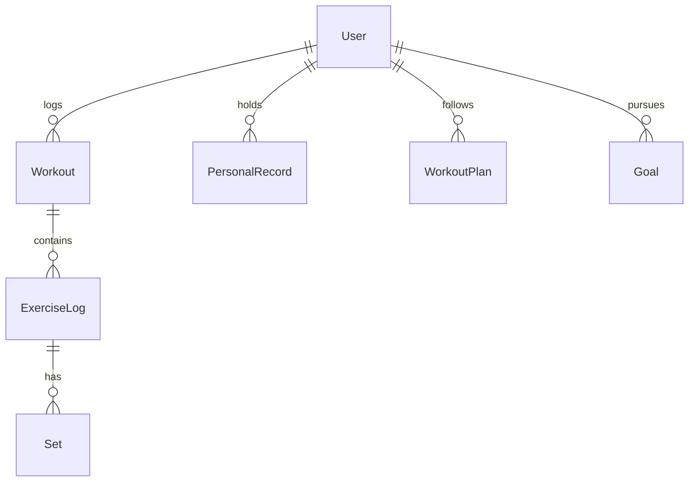

# Fitness Tracker

[← Back to Projects Index](README.md)

|                  |                                                                                               |
| ---------------- | --------------------------------------------------------------------------------------------- |
| **Slug**         | `fitness-tracker`                                                                             |
| **Implement in** | `apps/api/` + `apps/web/` (auth on `apps/api-gateway`) on branch `<dev-name>/fitness-tracker` |

## Problem

Athletes track workouts in notebooks or apps that do not connect effort to personal records or goals. Users need structured workout logging; coaches optionally need read access to athlete progress.

**Who uses this system**

| Actor       | Goal                                                       |
| ----------- | ---------------------------------------------------------- |
| **Athlete** | Log workouts with exercises and sets, view PRs and history |
| **Coach**   | View assigned athletes' progress, assign plans (optional)  |
| **Admin**   | Platform administration                                    |

**Pain points you are solving**

- PRs not updating when a set beats a previous best.
- Users editing each other's workout logs.
- History lists without date or exercise filters.
- Workout saves that leave orphaned exercise/set rows.

**What you are building**

A fitness logger: nested workout → exercise logs → sets saved in one transaction; personal records update when a set exceeds prior best for the same exercise; users own their data. Plans, goals, and charts extend the product.

## Application flow (end-to-end)

```text
1. Athlete (user) logs Workout with nested ExerciseLogs and Sets
2. On save → transaction: create workout tree + update PersonalRecord if set beats prior best
3. History list with date + exercise filters
4. Coach (staff) views assigned athletes' workouts (Should — read-only)
5. Workout plans and goals track progress over time (Should)
6. Soft-deleted workouts excluded from history default view
7. Admin platform oversight (optional)
```

## Roles in detail

| Domain role | Gateway role | Purpose                                        |
| ----------- | ------------ | ---------------------------------------------- |
| **admin**   | `admin`      | Platform administration                        |
| **coach**   | `staff`      | View athletes' progress, assign plans (Should) |
| **athlete** | `user`       | Log workouts, view PRs, goals, plans           |

### coach (maps to `staff`)

- **Can:** Read workouts/PRs for linked athletes; create workout plans (Should).
- **Cannot:** Edit athlete's workout logs unless you explicitly allow.
- **Typical screens:** Athlete roster, read-only workout history.

### athlete (maps to `user`)

- **Can:** CRUD own workouts; view PR table; manage goals and plans (Should).
- **Cannot:** Edit other users' workouts.
- **Typical screens:** Workout logger `/workouts/new`, history, PRs `/prs`, goals.

Ownership: users only edit own workouts — enforce `workout.userId === currentUser.id`.

## User journeys

These journeys describe how people actually use the app — in plain language. Read them to understand the experience you are building, then walk through them during implementation and before your demo.

**Technical details** (API paths, status codes, database columns) live in **Backend expectations**, **Enums and state machines**, and **Edge cases**. These journeys explain _what should happen_ from the user's point of view.

### Everyone

#### Signing in to reach a private page _(Must)_

**Who:** Anyone who is not logged in

**Goal:** Private areas require login first.

1. Someone opens a link to a private page (for example the dashboard or their personal list) without being logged in.
2. The app sends them to the login screen instead of showing empty or broken content.
3. After they sign in with a valid account, they land on the page they originally wanted.
4. If they refresh the browser, they stay signed in and the page still loads correctly.

#### Each role sees only their part of the app _(Must)_

**Who:** Regular user vs Coach (staff)

**Goal:** Users and coach (staff) accounts must not share the same screens or powers.

1. A regular user signs in and uses the app. Menus and buttons for coach (staff) work are hidden or disabled.
2. If they manually open a coach (staff) URL (such as /coach), they see an access denied message — not another person's data.
3. When they sign out and sign in as Coach (staff), those pages open normally and they can create and manage records.

#### When there is nothing to show in the workout history _(Must)_

**Who:** Anyone browsing a list

**Goal:** The workout history should feel intentional even when empty or still loading.

1. While the workout history is loading, the user sees a skeleton or spinner — not a flash of wrong data or a blank white screen.
2. If filters or search return no workouts, a friendly empty state explains that nothing matched and offers to clear filters.
3. Clearing filters brings back the normal list when matching workouts exist.
4. Slow network: loading state stays visible until real data or a genuine empty result arrives.

#### Removing a workout from public view _(Must)_

**Who:** Athlete (user)

**Goal:** Deleted workouts should disappear for everyone except the owner reviewing history.

1. The athlete (user) creates a workout that appears in workout history.
2. They delete it using the normal delete action and confirm in a dialog.
3. The workout no longer appears in workout history or in search results.
4. Opening an old bookmark to that workout shows a polite “no longer available” message.
5. The owner can still find it in workout log with a deleted badge if the brief includes an audit or trash view (Should).

### Athlete

#### Athlete logs a workout _(Must)_

**Who:** Athlete (gateway role: `user`)

**Goal:** Record exercises and sets.

1. The athlete starts a new workout, adds exercises, and enters reps and weight for each set.
2. Weights are stored in kilograms.
3. Saving requires at least one exercise — empty workouts are rejected.
4. Personal records update when they beat a previous best.

#### Athlete reviews history _(Must)_

**Who:** Athlete

**Goal:** See past sessions.

1. The history list shows previous workouts with date and summary.
2. They can filter by exercise or date range.

#### Athlete cannot edit someone else's workout _(Must)_

**Who:** Athlete

**Goal:** Keep data private per user.

1. One athlete cannot open or change another athlete's workout log.

### Coach

#### Coach views client progress _(Should)_

**Who:** Coach (gateway role: `staff`)

**Goal:** Read-only oversight (optional).

1. The coach sees assigned athletes' workout history and PR table.
2. The coach cannot edit the athlete's logs unless the brief's Should features say otherwise.

## What is expected

### Must — required to pass

| Requirement          | What it means for you             |
| -------------------- | --------------------------------- |
| Workout logger       | Nested exercises/sets in one POST |
| History + filters    | Date range, exercise name         |
| Personal records     | Updated when set beats prior      |
| Ownership            | Own workouts only                 |
| Soft-delete workouts | Hidden from default history       |
| Shared Must bar      | [grading.md](../grading.md)       |

### Should — distinction

Workout plans; goals; progress charts; coach read access; summary dashboard.

### Stretch — bonus

Wearable import, social feed, AI plan generation.

## Frontend expectations

> Shared UI bar for all projects: [Frontend expectations](README.md#frontend-expectations-all-projects) · [frontend.md](../frontend.md)

### Domain screens

| Route             | Role(s)        | UI expectations                                                         |
| ----------------- | -------------- | ----------------------------------------------------------------------- |
| `/workouts`       | Athlete        | History table with date, title, exercise count; filters in RTK          |
| `/workouts/new`   | Athlete        | Nested form: workout → exercises → sets (reps, weight); add/remove rows |
| `/prs`            | Athlete        | Personal records table by exercise                                      |
| `/plans` (Should) | Athlete, coach | Workout plan templates                                                  |
| `/goals` (Should) | Athlete        | Goal list with progress bar                                             |

### UI behaviour

- **Logger UX:** Dynamic add set/exercise rows; submit entire workout in one save.
- **Coach view (Should):** Read-only athlete workout history — no edit buttons.
- **PR highlight:** Toast or badge when new PR set on save.

## Backend expectations

> Shared API bar for all projects: [Backend expectations](README.md#backend-expectations-all-projects) · [architecture.md](../architecture.md)

### Modules

| Module                    | Entity(ies)                     | Responsibility              |
| ------------------------- | ------------------------------- | --------------------------- |
| `workouts`                | `Workout`, `ExerciseLog`, `Set` | Nested create; soft-delete  |
| `personal-records`        | `PersonalRecord`                | Updated on save when beaten |
| `plans`, `goals` (Should) | `WorkoutPlan`, `Goal`           | Templates and targets       |

### Key endpoints

| Method         | Path            | Role | Notes                                  |
| -------------- | --------------- | ---- | -------------------------------------- |
| `POST`         | `/workouts`     | user | Transaction: workout tree + PR updates |
| `GET`          | `/workouts`     | user | Filters: dateFrom, exercise; own only  |
| `PATCH/DELETE` | `/workouts/:id` | user | Ownership guard                        |

### Service rules

- All mutations: `workout.userId === currentUser.id` (coach read-only via separate GET if implemented).
- PR update inside same transaction as workout save.

### Enums and state machines

No status enums.

### Database constraints

- `UNIQUE(personal_records.userId, personal_records.exerciseName)`

### Domain seed (minimum)

3 workouts, 6 exercise logs, 12 sets, 4 PRs, 2 goals.

### Web routes auth

| Route         | Auth required | Roles         |
| ------------- | ------------- | ------------- |
| /workouts     | Yes           | user          |
| /workouts/new | Yes           | user          |
| /prs          | Yes           | user          |
| /goals        | Yes           | user (Should) |

## Suggested entities

- Auth `User` is on the gateway — use `userId` FKs; do **not** recreate users/auth in `apps/api`
- `Workout`
- `ExerciseLog`
- `Set`
- `PersonalRecord`
- `WorkoutPlan`
- `Goal`

## ERD (starter)



## Hard invariant

Saving a workout updates personal records when a set beats prior best (same exercise).

## Required transaction

Create Workout + ExerciseLogs + Sets + maybe update PersonalRecord in one transaction.

## Must (pass)

- [ ] Workout logger with nested exercises/sets
- [ ] History list with date + exercise filters
- [ ] Personal records table
- [ ] Ownership: users only edit own workouts (coach read optional)
- [ ] Soft-delete workouts

Plus the shared Must bar in [grading.md](../grading.md).

## Should (distinction)

- [ ] Workout plans (template days)
- [ ] Goals (target weight/reps/date)
- [ ] Progress charts (simple SVG or chart lib)
- [ ] Coach can view assigned athletes
- [ ] Dashboard summary

## Stretch (bonus)

- [ ] Wearable import
- [ ] Social feed
- [ ] AI plan generation

## API outline (indicative)

- `POST /workouts`
- `GET /workouts`
- `GET /prs`
- `CRUD /plans`
- `CRUD /goals`

## FE routes (indicative)

- `/`
- `/workouts`
- `/workouts/new`
- `/prs`
- `/plans`
- `/goals`

> Shared: [FAQ & edge cases](README.md#faq--read-before-you-ask) · [grading](../grading.md)

## Edge cases and negative scenarios

### Domain — workouts and PRs

| Scenario                        | Expected API                                 | UI hint |
| ------------------------------- | -------------------------------------------- | ------- |
| Edit another user’s workout     | **403/404**                                  | —       |
| Workout with 0 exercises        | **400** — at least one exercise log required | —       |
| Set with negative weight/reps   | **400**                                      | —       |
| PR tie (same weight as before)  | **No update** — only update on **beat**      | —       |
| Coach edits athlete log         | **403** on Must — read-only coach            | —       |
| Soft-deleted workout in history | **Excluded** default list                    | —       |
| Duplicate PR row same exercise  | **Upsert** one PR per exercise per user      | —       |

### Demo 4xx cases

1. Edit someone else’s workout → **403**
2. Invalid set values → **400**

## FAQ — decisions already made

| Question                    | Answer                                                        |
| --------------------------- | ------------------------------------------------------------- |
| Coach assignment model?     | **Should** — optional link table; not required Must.          |
| Units (kg vs lb)?           | **Kilograms only** in DB (`weightKg`); no per-set unit column |
| Rest timer / social feed?   | **Stretch**.                                                  |
| Workout templates vs plans? | **Should:** `WorkoutPlan` — static template OK.               |

## Definition of done

- Domain migrations (`pnpm migration:run:api`) + domain seed (≥8 realistic rows); gateway users via `pnpm seed`
- Compose Postgres + root `.env` + `apps/api-gateway/.env` + `apps/api/.env` + `apps/web/.env.local`
- Next + Query + RTK ownership respected; UI uses `@shared/ui/components` + theme ([frontend.md](../frontend.md))
- `docs/architecture.md` completed
- 5-minute demo script in the PR body (and notes in `docs/architecture.md`)

## Demo script (suggested — adapt for your PR)

1. **Roles (30s):** Athlete workout log → coach read-only view (if built).
2. **Happy path (2m):** Log workout → PR table updates.
3. **Invariant (30s):** Edit another user's workout → blocked.
4. **Lists (1m):** Filter history by exercise/date.
