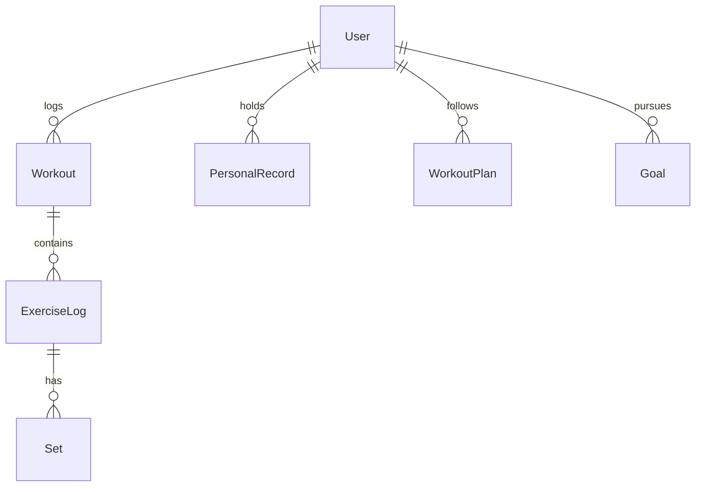

# Fitness Tracker

|                  |                                                                  |
| ---------------- | ---------------------------------------------------------------- |
| **Slug**         | `fitness-tracker`                                                |
| **Implement in** | `apps/api/` + `apps/web/` on branch `<dev-name>/fitness-tracker` |

## Problem

Users log workouts, track personal records, follow plans, and chase goals with progress charts.

## Personas / roles

- admin
- coach (staff)
- athlete (user)

## Suggested entities

- `User`
- `Workout`
- `ExerciseLog`
- `Set`
- `PersonalRecord`
- `WorkoutPlan`
- `Goal`

## ERD (starter)

## Hard invariant

Saving a workout updates personal records when a set beats prior best (same exercise).

## Required transaction

Create Workout + ExerciseLogs + Sets + maybe update PersonalRecord in one transaction.

## Must (pass)

- [ ] Workout logger with nested exercises/sets
- [ ] History list with date + exercise filters
- [ ] Personal records table
- [ ] Ownership: users only edit own workouts (coach read optional)
- [ ] Soft-delete workouts

Plus the shared Must bar in [grading.md](../grading.md).

## Should (distinction)

- [ ] Workout plans (template days)
- [ ] Goals (target weight/reps/date)
- [ ] Progress charts (simple SVG or chart lib)
- [ ] Coach can view assigned athletes
- [ ] Dashboard summary

## Stretch (bonus)

- [ ] Wearable import
- [ ] Social feed
- [ ] AI plan generation

## API outline (indicative)

- `POST /workouts`
- `GET /workouts`
- `GET /prs`
- `CRUD /plans`
- `CRUD /goals`

## FE routes (indicative)

- `/`
- `/workouts`
- `/workouts/new`
- `/prs`
- `/plans`
- `/goals`

## Definition of done

- Migrations + seed (≥8 realistic rows across core tables)
- Compose Postgres + root `.env` + `apps/api/.env`
- Next + Query + RTK ownership respected
- `docs/architecture.md` completed
- 5-minute demo script in the PR body (and notes in `docs/architecture.md`)

## Demo script (fill in)

1. Login as each role
2. Happy path for core workflow
3. Show invariant failure (expect 4xx)
4. Show list filters + soft-delete behaviour
