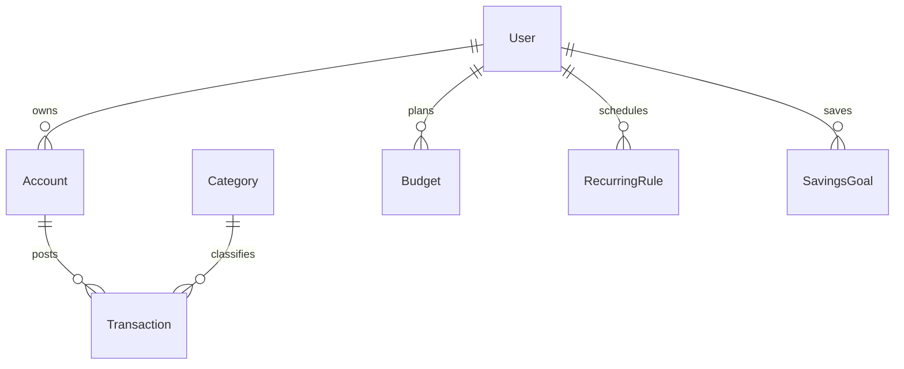

# Finance Tracker

[← Back to Projects Index](README.md)

|                  |                                                                                               |
| ---------------- | --------------------------------------------------------------------------------------------- |
| **Slug**         | `finance-tracker`                                                                             |
| **Implement in** | `apps/api/` + `apps/web/` (auth on `apps/api-gateway`) on branch `<dev-name>/finance-tracker` |

## Problem

Personal finance tools fail when account balances drift from transactions, budgets are not tied to real spending, or income/expense signs are inconsistent.

**Who uses this system**

| Actor       | Goal                                                          |
| ----------- | ------------------------------------------------------------- |
| **Owner**   | Manage accounts, categories, transactions, budgets, and goals |
| **Advisor** | Read-only view of linked clients' finances (optional)         |
| **Admin**   | Platform administration                                       |

**Pain points you are solving**

- Posting a transaction without updating account balance atomically.
- Expense amounts recorded with the wrong sign for their type.
- Budget views that do not reflect month/category filters.
- Deleted transactions still affecting totals.

**What you are building**

A finance tracker: accounts and categorized transactions; posting updates balance in a transaction; budgets show spent vs limit by category and month. Recurring rules, savings goals, and analytics dashboards add depth.

## Application flow (end-to-end)

```text
1. Owner (user) creates Accounts and Categories
2. Owner posts Transactions (income/expense) → transaction updates account.balance
3. Invariant: amount sign matches type (income positive, expense negative — define convention)
4. Budgets per category/month show spent vs limit
5. Recurring rules generate transaction batches (Should)
6. Advisor (staff) read-only access to linked owners (Should)
7. Analytics dashboard: spend by category (Should)
8. Soft-deleted transactions excluded from totals default view
```

## Roles in detail

| Domain role | Gateway role | Purpose                                    |
| ----------- | ------------ | ------------------------------------------ |
| **admin**   | `admin`      | Platform admin (optional)                  |
| **advisor** | `staff`      | Read-only view of client accounts (Should) |
| **owner**   | `user`       | Full CRUD on own financial data            |

### advisor (maps to `staff`)

- **Can:** View linked owners' accounts, transactions, budgets (read-only).
- **Cannot:** Post transactions on behalf of owner unless you add explicit delegate permission.
- **Typical screens:** Client list, read-only analytics.

### owner (maps to `user`)

- **Can:** CRUD accounts, categories, transactions, budgets, goals; run analytics on own data.
- **Cannot:** See other owners' accounts.
- **Typical screens:** Accounts, transactions ledger, budgets, goals, analytics.

## User journeys

These journeys describe how people actually use the app — in plain language. Read them to understand the experience you are building, then walk through them during implementation and before your demo.

**Technical details** (API paths, status codes, database columns) live in **Backend expectations**, **Enums and state machines**, and **Edge cases**. These journeys explain _what should happen_ from the user's point of view.

### Everyone

#### Signing in to reach a private page _(Must)_

**Who:** Anyone who is not logged in

**Goal:** Private areas require login first.

1. Someone opens a link to a private page (for example the dashboard or their personal list) without being logged in.
2. The app sends them to the login screen instead of showing empty or broken content.
3. After they sign in with a valid account, they land on the page they originally wanted.
4. If they refresh the browser, they stay signed in and the page still loads correctly.

#### Each role sees only their part of the app _(Must)_

**Who:** Regular user vs Advisor (staff)

**Goal:** Users and advisor (staff) accounts must not share the same screens or powers.

1. A regular user signs in and uses the app. Menus and buttons for advisor (staff) work are hidden or disabled.
2. If they manually open a advisor (staff) URL (such as /advisor/clients), they see an access denied message — not another person's data.
3. When they sign out and sign in as Advisor (staff), those pages open normally and they can create and manage records.

#### When there is nothing to show in the transaction list _(Must)_

**Who:** Anyone browsing a list

**Goal:** The transaction list should feel intentional even when empty or still loading.

1. While the transaction list is loading, the user sees a skeleton or spinner — not a flash of wrong data or a blank white screen.
2. If filters or search return no transactions, a friendly empty state explains that nothing matched and offers to clear filters.
3. Clearing filters brings back the normal list when matching transactions exist.
4. Slow network: loading state stays visible until real data or a genuine empty result arrives.

#### Removing a transaction from public view _(Must)_

**Who:** Account owner (user)

**Goal:** Deleted transactions should disappear for everyone except the owner reviewing history.

1. The account owner (user) creates a transaction that appears in account history.
2. They delete it using the normal delete action and confirm in a dialog.
3. The transaction no longer appears in account history or in search results.
4. Opening an old bookmark to that transaction shows a polite “no longer available” message.
5. The owner can still find it in transaction register with a deleted badge if the brief includes an audit or trash view (Should).

### Account owner

#### User tracks accounts and transactions _(Must)_

**Who:** Account owner (gateway role: `user`)

**Goal:** Know where money goes.

1. The user creates accounts (checking, savings) and categories.
2. They log income and expenses with amount, date, and category.
3. Running balance updates on each account.

#### Budgets and reports _(Should)_

**Who:** Account owner

**Goal:** Plan spending (optional).

1. Monthly budgets show progress bars against category limits.
2. Reports summarize spending by category for a date range.

### Advisor

#### Advisor read-only view _(Should)_

**Who:** Financial advisor (gateway role: `staff`)

**Goal:** See linked clients (optional).

1. The advisor opens a client's dashboard in read-only mode — no edits.

## What is expected

### Must — required to pass

| Requirement              | What it means for you             |
| ------------------------ | --------------------------------- |
| Accounts + categories    | Owner-scoped                      |
| Transactions CRUD        | With balance consistency          |
| Filters                  | Month, account, category          |
| Budgets                  | Spent vs limit per category/month |
| Soft-delete transactions | Excluded from default totals      |
| Shared Must bar          | [grading.md](../grading.md)       |

### Should — distinction

Recurring transactions; savings goals; analytics dashboard; advisor read-only; double-entry transfers.

### Stretch — bonus

Bank CSV import, Plaid sync, investment portfolios.

## Frontend expectations

> Shared UI bar for all projects: [Frontend expectations](README.md#frontend-expectations-all-projects) · [frontend.md](../frontend.md)

### Domain screens

| Route                 | Role(s)        | UI expectations                                                        |
| --------------------- | -------------- | ---------------------------------------------------------------------- |
| `/accounts`           | Owner          | Account list with current balance; create/edit account                 |
| `/transactions`       | Owner          | Ledger table; filters (month, account, category); add transaction form |
| `/budgets`            | Owner          | Category/month grid: limit vs spent with progress bar                  |
| `/analytics` (Should) | Owner, advisor | Spend-by-category chart or table                                       |
| `/goals` (Should)     | Owner          | Savings goal list with % progress                                      |

### UI behaviour

- **Amount entry:** Clear income vs expense toggle or signed amount with validation message from API.
- **Budget bar:** Visual over-budget state (e.g. red progress when spent > limit).
- **Advisor (Should):** Read-only — no create buttons when viewing client data.

## Backend expectations

> Shared API bar for all projects: [Backend expectations](README.md#backend-expectations-all-projects) · [architecture.md](../architecture.md)

### Modules

| Module                        | Entity(ies)                    | Responsibility                   |
| ----------------------------- | ------------------------------ | -------------------------------- |
| `accounts`                    | `Account`                      | Owner CRUD; balance field        |
| `transactions`                | `Transaction`, `Category`      | Post with balance update         |
| `budgets`                     | `Budget`                       | Spent computed from transactions |
| `recurring`, `goals` (Should) | `RecurringRule`, `SavingsGoal` | Scheduled posts; goal progress   |

### Key endpoints

| Method | Path                  | Role       | Notes                                        |
| ------ | --------------------- | ---------- | -------------------------------------------- |
| `POST` | `/transactions`       | user       | Transaction: insert + update account.balance |
| `GET`  | `/transactions`       | user       | Filters: month, accountId, categoryId        |
| `GET`  | `/budgets`            | user       | Include spent calculation per row            |
| `GET`  | `/analytics` (Should) | user/staff | Aggregates by category                       |

### Service rules

- Validate amount sign vs `type` enum in service.
- Balance update and transaction insert in one DB transaction.

### Enums and state machines

**Category.type:** `income`, `expense`

### Database constraints

- `UNIQUE(budgets.userId, budgets.categoryId, budgets.month)`

### Domain seed (minimum)

2 accounts, 4 categories, 8 transactions, 2 budgets.

### Web routes auth

| Route         | Auth required | Roles         |
| ------------- | ------------- | ------------- |
| /accounts     | Yes           | user          |
| /transactions | Yes           | user          |
| /budgets      | Yes           | user          |
| /analytics    | Yes           | user (Should) |

## Suggested entities

- Auth `User` is on the gateway — use `userId` FKs; do **not** recreate users/auth in `apps/api`
- `Account`
- `Category`
- `Transaction`
- `Budget`
- `RecurringRule`
- `SavingsGoal`

## ERD (starter)



## Hard invariant

Transaction amount sign matches type (income/expense); account balance derived or updated consistently in a transaction.

## Required transaction

Post transaction + update `account.balance` in one DB transaction (insert `Transaction` row + update `Account.balance`).

**Also required:** Soft-deleting a transaction must recalculate `account.balance` in the same transaction (reverse the amount). This is a Must-tier requirement — a deleted transaction must not silently leave the balance wrong.

## Must (pass)

- [ ] Accounts + categories
- [ ] Transactions CRUD
- [ ] Month filter + account/category filters
- [ ] Budgets per category/month with spent vs limit
- [ ] Soft-delete transactions (soft-delete must also reverse the amount from `account.balance` in the same DB transaction)

Plus the shared Must bar in [grading.md](../grading.md).

## Should (distinction)

- [ ] Recurring transactions
- [ ] Savings goals with progress
- [ ] Analytics dashboard (spend by category)
- [ ] Advisor read-only access to linked owners (optional invite)
- [ ] Transfer between accounts as double-entry pair

## Stretch (bonus)

- [ ] Bank CSV import
- [ ] Plaid sync
- [ ] Investment portfolios

## API outline (indicative)

- `CRUD /accounts`
- `CRUD /transactions`
- `CRUD /budgets`
- `CRUD /recurring`
- `CRUD /goals`
- `GET /analytics`

## FE routes (indicative)

- `/`
- `/accounts`
- `/transactions`
- `/budgets`
- `/goals`
- `/analytics`

> Shared: [FAQ & edge cases](README.md#faq--read-before-you-ask) · [grading](../grading.md)

## Edge cases and negative scenarios

### Domain — transactions and budgets

| Scenario                            | Expected API                                                 | UI hint               |
| ----------------------------------- | ------------------------------------------------------------ | --------------------- |
| Expense with wrong sign             | **400**                                                      | Income/expense toggle |
| Transaction exceeds account balance | **Allowed for Must** — no overdraft block required           | —                     |
| Delete transaction                  | **Soft-delete** + **recalc balance** in txn                  | —                     |
| Transfer between own accounts       | **Should:** double-entry pair                                | —                     |
| Budget month with no transactions   | **200** spent=0                                              | —                     |
| Advisor writes transaction          | **403**                                                      | Read-only advisor     |
| Category delete with transactions   | **400** — block delete while transactions reference category | —                     |
| Future-dated transaction            | **Allowed** — no date cap                                    | —                     |
| Duplicate recurring spawn same day  | **Should** idempotency key                                   | —                     |

### Demo 4xx cases

1. Wrong sign/type → **400**
2. Advisor POST transaction → **403** (Should)

## FAQ — decisions already made

| Question                    | Answer                                                    |
| --------------------------- | --------------------------------------------------------- |
| Balance stored or computed? | **Stored** on account updated in txn (brief requirement). |
| Multi-currency?             | **No** on Must.                                           |
| Bank sync / Plaid?          | **Stretch** only.                                         |
| Joint accounts?             | **Out of scope** — single owner per account.              |

## Definition of done

- Domain migrations (`pnpm migration:run:api`) + domain seed (≥8 realistic rows); gateway users via `pnpm seed`
- Compose Postgres + root `.env` + `apps/api-gateway/.env` + `apps/api/.env` + `apps/web/.env.local`
- Next + Query + RTK ownership respected; UI uses `@shared/ui/components` + theme ([frontend.md](../frontend.md))
- `docs/architecture.md` completed
- 5-minute demo script in the PR body (and notes in `docs/architecture.md`)

## Demo script (suggested — adapt for your PR)

1. **Roles (30s):** Owner accounts → advisor read-only (if built).
2. **Happy path (2m):** Post transactions → budget spent updates.
3. **Invariant (30s):** Wrong sign for expense type → 4xx.
4. **Lists (1m):** Filter by month/account/category.
