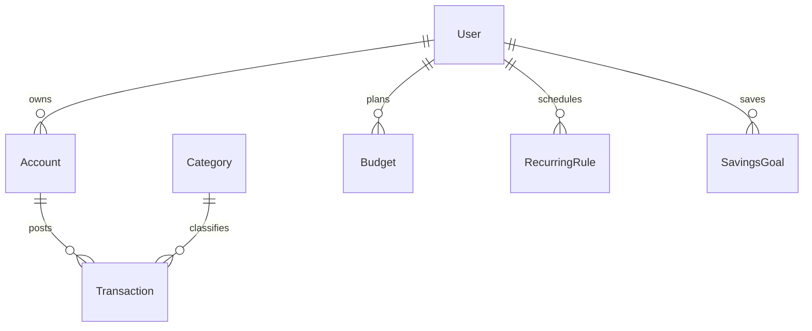

# Finance Tracker

|                  |                                                                                               |
| ---------------- | --------------------------------------------------------------------------------------------- |
| **Slug**         | `finance-tracker`                                                                             |
| **Implement in** | `apps/api/` + `apps/web/` (auth on `apps/api-gateway`) on branch `<dev-name>/finance-tracker` |

## Problem

Users track accounts, budgets, transactions (including recurring), savings goals, and analytics.

## Personas / roles

- admin
- advisor (staff)
- owner (user)

## Suggested entities

- Auth `User` is on the gateway — use `userId` FKs; do **not** recreate users/auth in `apps/api`
- `Account`
- `Category`
- `Transaction`
- `Budget`
- `RecurringRule`
- `SavingsGoal`

## ERD (starter)

## Hard invariant

Transaction amount sign matches type (income/expense); account balance derived or updated consistently in a transaction.

## Required transaction

Post transaction + update account.balance; generating from recurring creates transaction batch.

## Must (pass)

- [ ] Accounts + categories
- [ ] Transactions CRUD
- [ ] Month filter + account/category filters
- [ ] Budgets per category/month with spent vs limit
- [ ] Soft-delete transactions

Plus the shared Must bar in [grading.md](../grading.md).

## Should (distinction)

- [ ] Recurring transactions
- [ ] Savings goals with progress
- [ ] Analytics dashboard (spend by category)
- [ ] Advisor read-only access to linked owners (optional invite)
- [ ] Transfer between accounts as double-entry pair

## Stretch (bonus)

- [ ] Bank CSV import
- [ ] Plaid sync
- [ ] Investment portfolios

## API outline (indicative)

- `CRUD /accounts`
- `CRUD /transactions`
- `CRUD /budgets`
- `CRUD /recurring`
- `CRUD /goals`
- `GET /analytics`

## FE routes (indicative)

- `/`
- `/accounts`
- `/transactions`
- `/budgets`
- `/goals`
- `/analytics`

## Definition of done

- Domain migrations (`pnpm migration:run:api`) + domain seed (≥8 realistic rows); gateway users via `pnpm seed`
- Compose Postgres + root `.env` + `apps/api-gateway/.env` + `apps/api/.env` + `apps/web/.env.local`
- Next + Query + RTK ownership respected; UI uses `@shared/ui/components` + theme ([frontend.md](../frontend.md))
- `docs/architecture.md` completed
- 5-minute demo script in the PR body (and notes in `docs/architecture.md`)

## Demo script (fill in)

1. Login as each role
2. Happy path for core workflow
3. Show invariant failure (expect 4xx)
4. Show list filters + soft-delete behaviour
