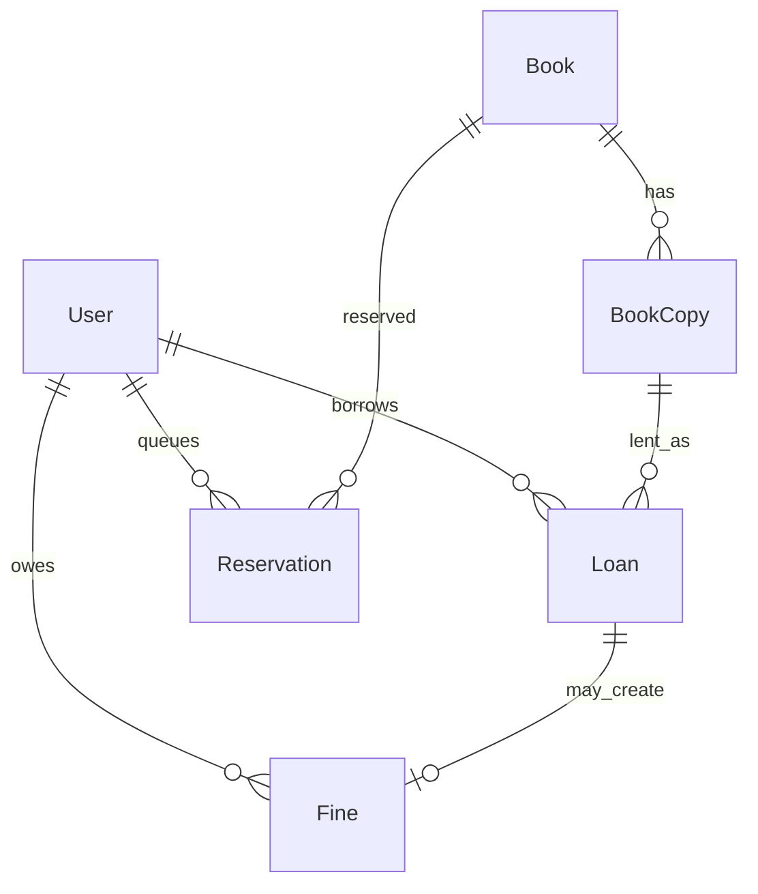

# Library Management

[← Back to Projects Index](README.md)

|                  |                                                                                                  |
| ---------------- | ------------------------------------------------------------------------------------------------ |
| **Slug**         | `library-management`                                                                             |
| **Implement in** | `apps/api/` + `apps/web/` (auth on `apps/api-gateway`) on branch `<dev-name>/library-management` |

## Problem

Libraries manage physical copies, not just titles — checkout must respect copy availability, loan limits, due dates, and reservations when every copy is on loan.

**Who uses this system**

| Actor         | Goal                                                            |
| ------------- | --------------------------------------------------------------- |
| **Librarian** | Catalog books and copies, checkout/return, manage overdue items |
| **Member**    | Search catalog, borrow, reserve, view loans and fines           |
| **Admin**     | Configure loan limits, suspend members                          |

**Pain points you are solving**

- Two members issued the same physical copy.
- Members exceeding maximum active loans.
- Reservations for titles they already have on loan.
- Returns that free a copy but forget overdue fines.

**What you are building**

A library system: books have multiple copies; checkout ties a member to one available copy atomically; return closes the loan and frees the copy (creating a fine if overdue). Reservations queue when no copy is free; catalog search supports title, author, and ISBN filters.

## Application flow (end-to-end)

```text
1. Librarian (staff) catalogs Books → adds physical BookCopies per title
2. Member (user) searches catalog (title, author/ISBN) → filters available-only
3. Checkout → transaction: create Loan + set copy status on_loan
4. Invariant: one active loan per copy; member active-loan limit (e.g. 5)
5. Return → transaction: close loan + free copy + create Fine if overdue (Should)
6. Reservation when no copy available; cancel reservation; promote on return (Should)
7. Admin adjusts loan limits / suspends members (Should)
8. Soft-deleted books/copies hidden from catalog
```

## Roles in detail

| Domain role   | Gateway role | Purpose                                      |
| ------------- | ------------ | -------------------------------------------- |
| **admin**     | `admin`      | Configure loan limits, suspend members       |
| **librarian** | `staff`      | Catalog CRUD, checkout/return, overdue queue |
| **member**    | `user`       | Search, borrow, reserve, view loans/fines    |

### admin

- **Can:** Adjust global loan limits; suspend member accounts; view all loans/fines.
- **Typical screens:** Settings for loan limit, member suspension list.

### librarian (maps to `staff`)

- **Can:** CRUD books and copies; checkout/return for members; view overdue queue; mark fines paid (Should).
- **Cannot:** Checkout copy already on loan; exceed member loan limit.
- **Typical screens:** Catalog admin, checkout desk, `/librarian/overdue`.

### member (maps to `user`)

- **Can:** Search catalog; view own loans/reservations/fines; request reservations when unavailable.
- **Cannot:** Checkout without available copy; reserve title already on active loan.
- **Typical screens:** `/books`, `/my/loans`, `/my/reservations`.

## User journeys

These journeys describe how people actually use the app — in plain language. Read them to understand the experience you are building, then walk through them during implementation and before your demo.

**Technical details** (API paths, status codes, database columns) live in **Backend expectations**, **Enums and state machines**, and **Edge cases**. These journeys explain _what should happen_ from the user's point of view.

### Everyone

#### Signing in to reach a private page _(Must)_

**Who:** Anyone who is not logged in

**Goal:** Private areas require login first.

1. Someone opens a link to a private page (for example the dashboard or their personal list) without being logged in.
2. The app sends them to the login screen instead of showing empty or broken content.
3. After they sign in with a valid account, they land on the page they originally wanted.
4. If they refresh the browser, they stay signed in and the page still loads correctly.

#### Each role sees only their part of the app _(Must)_

**Who:** Regular user vs Librarian (staff)

**Goal:** Users and librarian (staff) accounts must not share the same screens or powers.

1. A regular user signs in and uses the app. Menus and buttons for librarian (staff) work are hidden or disabled.
2. If they manually open a librarian (staff) URL (such as /librarian), they see an access denied message — not another person's data.
3. When they sign out and sign in as Librarian (staff), those pages open normally and they can create and manage records.

#### When there is nothing to show in the book catalog _(Must)_

**Who:** Anyone browsing a list

**Goal:** The book catalog should feel intentional even when empty or still loading.

1. While the book catalog is loading, the user sees a skeleton or spinner — not a flash of wrong data or a blank white screen.
2. If filters or search return no books, a friendly empty state explains that nothing matched and offers to clear filters.
3. Clearing filters brings back the normal list when matching books exist.
4. Slow network: loading state stays visible until real data or a genuine empty result arrives.

#### Removing a book record from public view _(Must)_

**Who:** Librarian (staff)

**Goal:** Deleted book records should disappear for everyone except the owner reviewing history.

1. The librarian (staff) creates a book record that appears in public catalog.
2. They delete it using the normal delete action and confirm in a dialog.
3. The book record no longer appears in public catalog or in search results.
4. Opening an old bookmark to that book record shows a polite “no longer available” message.
5. The owner can still find it in librarian catalog with a deleted badge if the brief includes an audit or trash view (Should).

### Librarian

#### Librarian manages the catalog _(Must)_

**Who:** Librarian (gateway role: `staff`)

**Goal:** Keep titles and copies accurate.

1. The librarian adds books with title, author, and ISBN.
2. They register physical copies and mark availability.

#### Librarian handles overdue and fines _(Should)_

**Who:** Librarian

**Goal:** Follow up on late returns.

1. The overdue list shows who is late and by how many days.
2. Marking a fine paid clears the member's balance.

### Member

#### Member searches and borrows _(Must)_

**Who:** Library member (gateway role: `user`)

**Goal:** Find and check out available copies.

1. The member searches by title, author, or ISBN and filters to available copies only.
2. They check out a copy when one is free.
3. If no copy is available, checkout is blocked but **Reserve** may be offered.

#### Member reserves and returns _(Must)_

**Who:** Library member

**Goal:** Queue for popular books and bring them back.

1. When all copies are out, the member joins the reservation queue.
2. When a copy is returned, the first person in queue can pick it up (Should).
3. Returning a book on time clears the loan; overdue items may accrue fines (Should: $0.50 per day).

## What is expected

### Must — required to pass

| Requirement       | What it means for you                          |
| ----------------- | ---------------------------------------------- |
| Auth with 3 roles | Different librarian vs member vs admin screens |
| Catalog + copies  | Librarian CRUD; soft-delete                    |
| Checkout/return   | Copy availability enforced                     |
| Paginated search  | title, author/ISBN; available-only filter      |
| Reservations      | Create/cancel when no copy free                |
| Shared Must bar   | [grading.md](../grading.md)                    |

### Should — distinction

Overdue fines; member dashboard; librarian overdue queue; reservation promotion; admin loan limits.

### Stretch — bonus

Multi-branch transfers, email reminders, barcode scan UX.

## Frontend expectations

> Shared UI bar for all projects: [Frontend expectations](README.md#frontend-expectations-all-projects) · [frontend.md](../frontend.md)

### Domain screens

| Route                         | Role(s)             | UI expectations                                                                      |
| ----------------------------- | ------------------- | ------------------------------------------------------------------------------------ |
| `/books`                      | Member              | Catalog search (title, author, ISBN); available-only filter; pagination              |
| `/books/[id]`                 | Member              | Title detail; copy availability count; **Reserve** or redirect to checkout desk flow |
| `/my/loans`                   | Member              | Active loans with due dates; overdue highlighted                                     |
| `/my/reservations`            | Member              | Queue position or status                                                             |
| `/librarian`                  | Librarian (`staff`) | Catalog CRUD; checkout/return form (member id + copy barcode/id)                     |
| `/librarian/overdue` (Should) | Librarian           | Overdue loans; fine amount; mark paid                                                |

### UI behaviour

- **Checkout (staff):** Librarian selects member + available copy; member UI is read-only for checkout.
- **Loan limit:** Show friendly error when member at max active loans.
- **Return:** Librarian return action shows fine created if overdue (Should).

## Backend expectations

> Shared API bar for all projects: [Backend expectations](README.md#backend-expectations-all-projects) · [architecture.md](../architecture.md)

### Modules

| Module           | Entity(ies)        | Responsibility                |
| ---------------- | ------------------ | ----------------------------- |
| `books`          | `Book`, `BookCopy` | Catalog + copies; soft-delete |
| `loans`          | `Loan`             | Checkout/return transactions  |
| `reservations`   | `Reservation`      | Queue when no copy free       |
| `fines` (Should) | `Fine`             | Overdue charges; mark paid    |

### Key endpoints

| Method | Path                | Role  | Notes                                                |
| ------ | ------------------- | ----- | ---------------------------------------------------- |
| `POST` | `/loans/checkout`   | staff | Transaction: loan + copy on_loan; check member limit |
| `POST` | `/loans/:id/return` | staff | Transaction: close loan + free copy + optional fine  |
| `GET`  | `/books`            | all   | Filters: q, author, availableOnly                    |
| `POST` | `/reservations`     | user  | Block if already on loan for title                   |

### Service rules

- One active loan per copy; member active loan count ≤ configured limit.
- Return and fine creation in single transaction when overdue.

### Enums and state machines

**BookCopy.status:** `available`, `on_loan`, `lost`

**Reservation.status:** `active`, `fulfilled`, `cancelled`

### Database constraints

- `UNIQUE(book_copies.barcode)`
- Partial unique: one active loan per copy (`returnedAt IS NULL`)
- `UNIQUE(fines.loanId)`

### Domain seed (minimum)

4 books, 8 copies, 5 loans (3 active), 2 reservations, 1 fine.

### Web routes auth

| Route              | Auth required | Roles |
| ------------------ | ------------- | ----- |
| /books             | No            | All   |
| /books/[id]        | No            | All   |
| /my/loans          | Yes           | user  |
| /my/reservations   | Yes           | user  |
| /librarian/overdue | Yes           | staff |

## Suggested entities

- Auth `User` is on the gateway — use `userId` FKs; do **not** recreate users/auth in `apps/api`
- `Book`
- `BookCopy`
- `Loan`
- `Reservation`
- `Fine`

## ERD (starter)



## Hard invariant

A copy can have at most one active loan; members cannot exceed a configurable active-loan limit (e.g. 5); cannot reserve a title they already have on active loan.

## Required transaction

Checkout: create `Loan` + set copy status to `on_loan` atomically.

Return: close loan + set copy status to `available` + create `Fine` if overdue + promote first active `Reservation` for that book (issue notification or mark reservation `fulfilled`) — all in one transaction.

## Must (pass)

- [ ] Auth with admin / librarian / member roles
- [ ] Book catalog + copies (librarian CRUD); soft-delete books/copies
- [ ] Checkout / return workflow with copy availability enforced
- [ ] Paginated catalog search (title, author/ISBN) + filter available-only
- [ ] Reservations when no copy is available; cancel reservation; **promote the first active reservation when a copy is returned** (this is part of the return transaction — see Required transaction)

Plus the shared Must bar in [grading.md](../grading.md).

## Should (distinction)

- [ ] Overdue fines with amount based on days late
- [ ] Member dashboard: active loans, reservations, outstanding fines
- [ ] Librarian overdue queue + mark fine paid
- [ ] Admin can adjust loan limits / suspend members

## Stretch (bonus)

- [ ] Multi-branch locations and transfers
- [ ] Email/SMS due-date reminders
- [ ] Barcode / QR scan UX for checkout

## API outline (indicative)

- `CRUD /books`
- `CRUD /books/:id/copies`
- `POST /loans/checkout`
- `POST /loans/:id/return`
- `CRUD /reservations`
- `GET /fines` · `PATCH /fines/:id/pay`

## FE routes (indicative)

- `/`
- `/books`
- `/books/[id]`
- `/my/loans`
- `/my/reservations`
- `/librarian/overdue`
- `/login`

> Shared: [FAQ & edge cases](README.md#faq--read-before-you-ask) · [grading](../grading.md)

## Edge cases and negative scenarios

### Domain — loans and copies

| Scenario                                | Expected API                                                        | UI hint                      |
| --------------------------------------- | ------------------------------------------------------------------- | ---------------------------- |
| Checkout copy already on loan           | **409**                                                             | Copy marked unavailable      |
| Member exceeds loan limit (e.g. 5)      | **400**                                                             | Show count on member profile |
| Reserve title already on loan to member | **400**                                                             | —                            |
| Return copy not on loan                 | **400**                                                             | —                            |
| Fine on return when overdue (Should)    | Create fine in same txn                                             | Show fine amount             |
| Member checkout own copy (self-service) | **Optional** — Must allows librarian checkout; self checkout Should | —                            |
| Soft-deleted book still on loan         | **404** in catalog; active loans remain until return                | —                            |
| Promote reservation on return (Should)  | **FIFO** — first reservation in queue gets copy when returned       | —                            |
| ISBN duplicate                          | **Allowed for Must** — no unique constraint on ISBN                 | —                            |
| Search availableOnly when 0 copies      | **200** []                                                          | —                            |

### Demo 4xx cases

1. Double checkout same copy → **409**
2. Exceed loan limit → **400**
3. Reserve while already borrowed → **400**

## FAQ — decisions already made

| Question                         | Answer                                                                       |
| -------------------------------- | ---------------------------------------------------------------------------- |
| Self-checkout vs librarian-only? | **Must:** librarian (staff) checkout endpoint; member browse/reserve.        |
| Loan limit default?              | **5** active loans — configurable by admin (Should).                         |
| Fine calculation?                | **Should:** **$0.50 per calendar day** overdue (`ceil` days late × 50 cents) |
| eBooks vs physical copies?       | **Physical copies** only — `BookCopy` entities.                              |
| Multi-branch?                    | **Stretch** — single library for Must.                                       |

## Definition of done

- Domain migrations (`pnpm migration:run:api`) + domain seed (≥8 realistic rows); gateway users via `pnpm seed`
- Compose Postgres + root `.env` + `apps/api-gateway/.env` + `apps/api/.env` + `apps/web/.env.local`
- Next + Query + RTK ownership respected; UI uses `@shared/ui/components` + theme ([frontend.md](../frontend.md))
- `docs/architecture.md` completed
- 5-minute demo script in the PR body (and notes in `docs/architecture.md`)

## Demo script (suggested — adapt for your PR)

1. **Roles (30s):** Librarian catalog → member search → admin settings (if built).
2. **Happy path (2m):** Checkout copy → member sees active loan → return → copy available.
3. **Invariant (30s):** Double checkout same copy or exceed loan limit → 4xx.
4. **Lists (1m):** Search by title/ISBN; available-only filter; soft-delete book.
