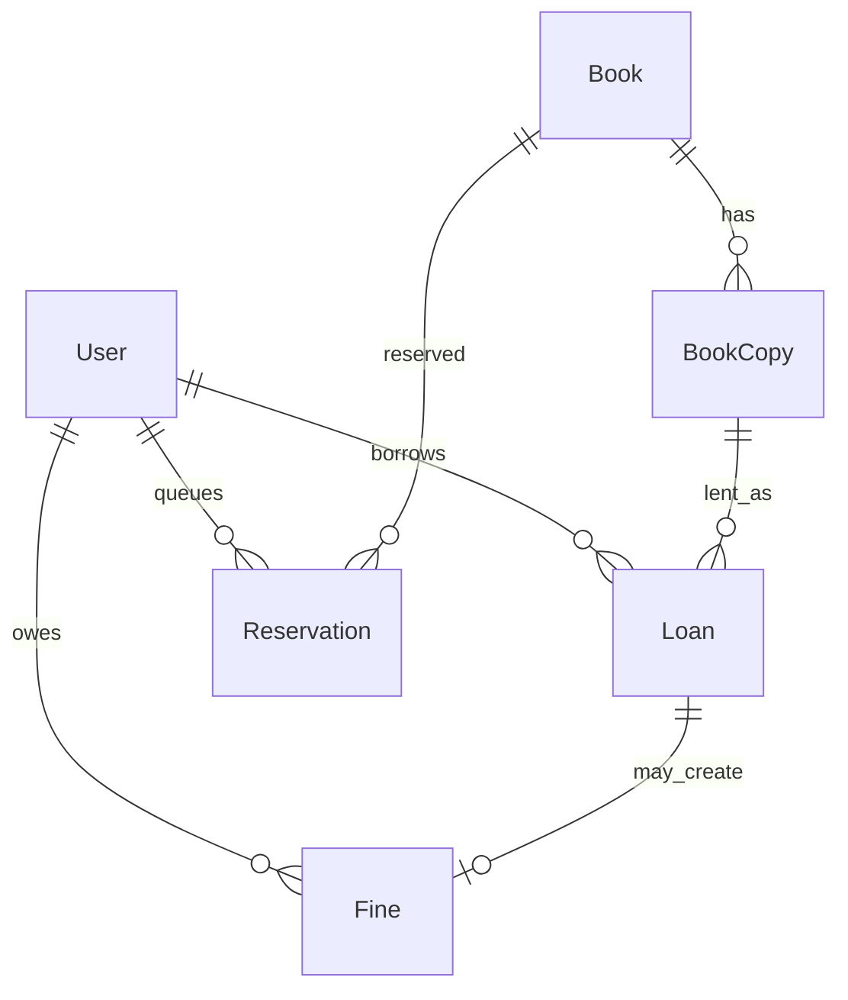

# Library Management

|                  |                                                                                                  |
| ---------------- | ------------------------------------------------------------------------------------------------ |
| **Slug**         | `library-management`                                                                             |
| **Implement in** | `apps/api/` + `apps/web/` (auth on `apps/api-gateway`) on branch `<dev-name>/library-management` |

## Problem

A campus/public library catalogs titles and physical copies, lets members borrow and reserve books, tracks due dates and fines, and gives librarians tools to manage inventory and overdue loans.

## Personas / roles

- admin
- librarian (staff)
- member (user)

## Suggested entities

- Auth `User` is on the gateway — use `userId` FKs; do **not** recreate users/auth in `apps/api`
- `Book`
- `BookCopy`
- `Loan`
- `Reservation`
- `Fine`

## ERD (starter)

## Hard invariant

A copy can have at most one active loan; members cannot exceed a configurable active-loan limit (e.g. 5); cannot reserve a title they already have on active loan.

## Required transaction

Checkout: create `Loan` + set copy status to `on_loan` atomically. Return: close loan + free copy + create `Fine` if overdue — all in one transaction.

## Must (pass)

- [ ] Auth with admin / librarian / member roles
- [ ] Book catalog + copies (librarian CRUD); soft-delete books/copies
- [ ] Checkout / return workflow with copy availability enforced
- [ ] Paginated catalog search (title, author/ISBN) + filter available-only
- [ ] Reservations when no copy is available; cancel reservation

Plus the shared Must bar in [grading.md](../grading.md).

## Should (distinction)

- [ ] Overdue fines with amount based on days late
- [ ] Member dashboard: active loans, reservations, outstanding fines
- [ ] Librarian overdue queue + mark fine paid
- [ ] Promote next reservation when a copy is returned
- [ ] Admin can adjust loan limits / suspend members

## Stretch (bonus)

- [ ] Multi-branch locations and transfers
- [ ] Email/SMS due-date reminders
- [ ] Barcode / QR scan UX for checkout

## API outline (indicative)

- `CRUD /books`
- `CRUD /books/:id/copies`
- `POST /loans/checkout`
- `POST /loans/:id/return`
- `CRUD /reservations`
- `GET /fines` · `PATCH /fines/:id/pay`

## FE routes (indicative)

- `/`
- `/books`
- `/books/[id]`
- `/my/loans`
- `/my/reservations`
- `/librarian/overdue`
- `/login`

## Definition of done

- Domain migrations (`pnpm migration:run:api`) + domain seed (≥8 realistic rows); gateway users via `pnpm seed`
- Compose Postgres + root `.env` + `apps/api-gateway/.env` + `apps/api/.env` + `apps/web/.env.local`
- Next + Query + RTK ownership respected; UI uses `@shared/ui/components` + theme ([frontend.md](../frontend.md))
- `docs/architecture.md` completed
- 5-minute demo script in the PR body (and notes in `docs/architecture.md`)

## Demo script (fill in)

1. Login as each role
2. Happy path for core workflow
3. Show invariant failure (expect 4xx)
4. Show list filters + soft-delete behaviour
