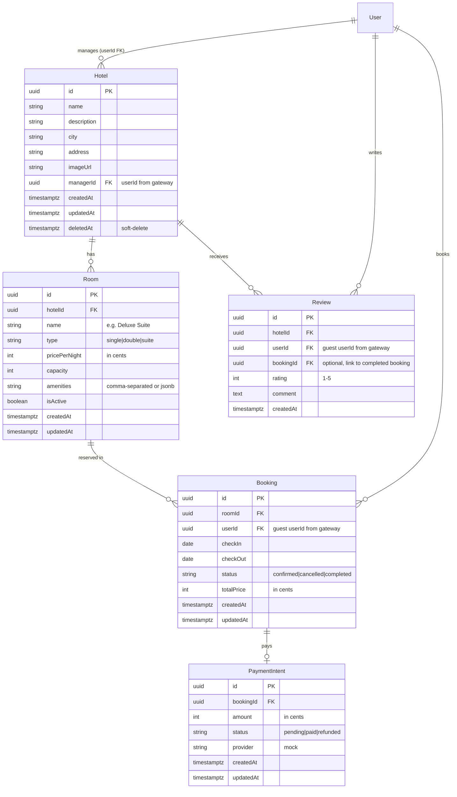

# Hotel Booking Platform — Implementation Plan

> **Project slug:** `hotel-booking`
> **Branch:** `<dev-name>/hotel-booking`
> **Roles:** `admin`, `staff` (hotel_manager), `user` (guest)

---

## Table of Contents

1. [Rules for AI Assistants](#rules-for-ai-assistants)
2. [Architecture Overview](#architecture-overview)
3. [ERD & Entity Design](#erd--entity-design)
4. [Day-by-Day Plan](#day-by-day-plan)
5. [Grading Checklist](#grading-checklist)
6. [Demo Script](#demo-script)

---

## Rules for AI Assistants

> [!CAUTION]
> **Every AI assistant (Antigravity, Gemini, or any other) MUST follow these rules without exception.**

### 🔴 Architecture Rules (Non-Negotiable)

| #   | Rule                                                                                                                                        | Consequence of Violation |
| --- | ------------------------------------------------------------------------------------------------------------------------------------------- | ------------------------ |
| 1   | **Domain CRUD lives in `apps/api/src/modules/`** only. Never in Next.js, never in the gateway.                                              | Fails stack rule #1      |
| 2   | **Auth stays on `apps/api-gateway`** — do NOT recreate users/auth in `apps/api`. Store `userId` as FK.                                      | Fails core requirement   |
| 3   | **Browser → `/api` on `:3000`** (Next rewrites to gateway `:3001` → proxy to api `:3002`). Never call `:3002` from UI.                      | Fails stack rule #3      |
| 4   | **Cookie JWT** via httpOnly `access_token` from gateway. Never `localStorage`.                                                              | Fails stack rule #2      |
| 5   | **`synchronize: false`** always. All schema changes via TypeORM migrations only.                                                            | Fails stack rule #6      |
| 6   | **Responses:** `{ data: T }` envelope via `@shared/http/interceptors`. Errors: `{ statusCode, error, message }` via `@shared/http/filters`. | Fails stack rule #9      |
| 7   | **ValidationPipe** with `whitelist: true` + `forbidNonWhitelisted: true` on domain API.                                                     | Fails stack rule #7      |

### 🟡 Frontend Rules

| #   | Rule                                                                                                                                                                                                                 |
| --- | -------------------------------------------------------------------------------------------------------------------------------------------------------------------------------------------------------------------- |
| 8   | **TanStack Query** for all server data (lists, details, mutations). Never put Nest entity arrays in Redux.                                                                                                           |
| 9   | **Redux Toolkit** for drafts, filters, UI selections only.                                                                                                                                                           |
| 10  | Use **`@shared/ui/components`** (`Button`, `Form`, `Field`, `TextInput`, `Select`, `Table`, `Card`, `Page`, `PageHeader`, `LoadingState`, `EmptyState`, `Alert`, `Badge`, `Dialog`, `Skeleton`) — no one-off markup. |
| 11  | Use **semantic theme tokens** (`bg-background`, `text-primary`, `bg-primary`, etc.) — no hex colors in pages.                                                                                                        |
| 12  | **Empty ≠ Loading ≠ Error** — always handle all three states with `LoadingState`, `EmptyState`, and `Alert`/`StatusMessage`.                                                                                         |
| 13  | Import UI: `from '@shared/ui/components'`. Import API client: `from '@shared/api-client'`. Local: `from '@/components/...'` or `from '@/lib/...'`.                                                                   |

### 🟢 Code Convention Rules

| #   | Rule                                                                                                                                                          |
| --- | ------------------------------------------------------------------------------------------------------------------------------------------------------------- |
| 14  | Entity files: `*.entity.ts` under `apps/api/src/modules/<domain>/`.                                                                                           |
| 15  | Each module folder: `index.ts` barrel, `*.module.ts`, `*.controller.ts`, `*.service.ts`, `*.entity.ts`, DTOs in `dto/` subfolder.                             |
| 16  | Imports: prefer folder subpaths (`@shared/http/filters`, `@shared/http/auth`, `@shared/env/api`).                                                             |
| 17  | Auth guards: import from `./common/auth` (which re-exports `@shared/http/auth`). Use `@Public()` for anonymous routes, `@Roles('admin')` for role-restricted. |
| 18  | Soft-delete: add `deletedAt` column (`DeleteDateColumn`) on the primary listable resource (`Hotel`). Use TypeORM's `.softDelete()` / `.softRemove()`.         |
| 19  | Pagination: use `take`/`skip` pattern with `page` + `limit` query params. Return `{ data, meta: { total, page, limit, totalPages } }`.                        |
| 20  | **Never auto-approve** `pnpm install`, `migration:run`, `seed`, `docker:db`, or any command that mutates state — always ask the user.                         |

### 🔵 File Path Reference

```
apps/api/src/modules/          ← ALL domain modules go here
  hotels/
    dto/
      create-hotel.dto.ts
      update-hotel.dto.ts
      hotel-query.dto.ts
    hotel.entity.ts
    hotels.controller.ts
    hotels.service.ts
    hotels.module.ts
    index.ts
  rooms/
    dto/
      create-room.dto.ts
      update-room.dto.ts
    room.entity.ts
    rooms.controller.ts
    rooms.service.ts
    rooms.module.ts
    index.ts
  bookings/
    dto/
      create-booking.dto.ts
      booking-query.dto.ts
    booking.entity.ts
    bookings.controller.ts
    bookings.service.ts
    bookings.module.ts
    index.ts
  reviews/
    dto/
      create-review.dto.ts
    review.entity.ts
    reviews.controller.ts
    reviews.service.ts
    reviews.module.ts
    index.ts
  payments/
    payment-intent.entity.ts
    payments.module.ts
    payments.service.ts
    index.ts

apps/api/src/database/migrations/  ← domain migrations

apps/web/app/                      ← Next.js pages
  (auth)/login/page.tsx            ← existing
  (auth)/register/page.tsx         ← existing
  hotels/page.tsx                  ← hotel list
  hotels/[id]/page.tsx             ← hotel detail + rooms + booking
  bookings/page.tsx                ← user bookings
  manager/page.tsx                 ← manager dashboard
  layout.tsx                       ← existing root layout

apps/web/lib/
  api.ts                           ← extend with domain API functions
  store/index.ts                   ← extend with hotel filter slices
  hooks/                           ← TanStack Query hooks
    use-hotels.ts
    use-rooms.ts
    use-bookings.ts
    use-reviews.ts
```

---

## Architecture Overview

```
Browser → web :3000
            /api/*  (Next rewrite)
              ↓
         gateway :3001   cookie JWT, /auth/*
              ↓
         api :3002       hotel domain modules
              ↓
         Postgres :5434
```

### Ownership

| Layer              | Owns                                                                         | Does NOT Own                            |
| ------------------ | ---------------------------------------------------------------------------- | --------------------------------------- |
| `apps/web`         | Pages, layout, forms, TanStack Query hooks, RTK filter slices                | CRUD APIs, entity logic                 |
| `apps/api-gateway` | Login/register/logout cookies, CORS, proxy to `:3002`                        | Domain tables, hotel/room/booking logic |
| `apps/api`         | Hotel, Room, Booking, Review, PaymentIntent entities + services + migrations | Browser cookies, user auth              |
| Postgres           | Data, constraints, unique indexes, exclusion constraints                     | —                                       |

---

## ERD & Entity Design



### Hard Invariant

> **No overlapping bookings for the same room.**

Implementation:

1. **Service-level check:** Before inserting a booking, query for any existing `confirmed` booking on the same `roomId` where `[checkIn, checkOut)` overlaps `[newCheckIn, newCheckOut)`.
2. **DB constraint (bonus):** PostgreSQL exclusion constraint using `daterange` and `btree_gist` extension on the `bookings` table.

```sql
-- In migration (stretch — service check is the Must)
CREATE EXTENSION IF NOT EXISTS btree_gist;
ALTER TABLE bookings ADD CONSTRAINT no_overlapping_bookings
  EXCLUDE USING gist (
    room_id WITH =,
    daterange(check_in, check_out, '[)') WITH &&
  )
  WHERE (status != 'cancelled');
```

### Required Transaction

> **Create booking + payment intent atomically after availability check.**

```typescript
// In BookingsService.create()
await this.dataSource.transaction(async (manager) => {
  // 1. Check availability (SELECT ... FOR UPDATE on Room)
  // 2. Insert Booking
  // 3. Insert PaymentIntent (status: 'paid' — mock)
  // 4. Return both
});
```

---

## Day-by-Day Plan

### Day 1 — ERD, Nest Modules, Migrations, Seed

**Goal:** All entities created, migrations running, seed data present.

#### Tasks

| #    | Task                                | File(s)                                                  | Notes                                         |
| ---- | ----------------------------------- | -------------------------------------------------------- | --------------------------------------------- |
| 1.1  | Create `Hotel` entity               | `apps/api/src/modules/hotels/hotel.entity.ts`            | `@DeleteDateColumn` for soft-delete           |
| 1.2  | Create `Room` entity                | `apps/api/src/modules/rooms/room.entity.ts`              | `ManyToOne` → Hotel                           |
| 1.3  | Create `Booking` entity             | `apps/api/src/modules/bookings/booking.entity.ts`        | `ManyToOne` → Room, userId FK                 |
| 1.4  | Create `Review` entity              | `apps/api/src/modules/reviews/review.entity.ts`          | `ManyToOne` → Hotel, userId FK                |
| 1.5  | Create `PaymentIntent` entity       | `apps/api/src/modules/payments/payment-intent.entity.ts` | `OneToOne` → Booking                          |
| 1.6  | Create Nest modules (5)             | `*.module.ts` + `index.ts` barrels                       | Register `TypeOrmModule.forFeature([Entity])` |
| 1.7  | Register all modules in `AppModule` | `apps/api/src/app.module.ts`                             | Import all 5 domain modules                   |
| 1.8  | Generate migration                  | `pnpm migration:generate -- -n CreateHotelDomain`        | Review the SQL before running                 |
| 1.9  | Run migration                       | `pnpm migration:run:api`                                 | Verify tables in Postgres                     |
| 1.10 | Create seed script                  | `apps/api/src/database/seeds/hotel-seed.ts`              | ≥8 realistic rows across entities             |
| 1.11 | Verify gateway auth works           | Test login/register/me via Swagger/curl                  | Seed users already: admin, user, staff        |

> [!IMPORTANT]
> **Seed users live on the gateway** (`pnpm seed`). Domain seed is a separate script for hotels/rooms/bookings.

#### Seed Data Plan (≥8 realistic rows)

| Entity         | Count | Example                                                                                       |
| -------------- | ----- | --------------------------------------------------------------------------------------------- |
| Hotels         | 3     | "The Grand Residency" (Mumbai), "Coastal Breeze Resort" (Goa), "Mountain View Lodge" (Shimla) |
| Rooms          | 6     | 2 per hotel (Standard Double, Deluxe Suite)                                                   |
| Bookings       | 4     | Mix of confirmed, completed, cancelled                                                        |
| Reviews        | 3     | On completed bookings                                                                         |
| PaymentIntents | 4     | One per booking                                                                               |

---

### Day 2 — Domain CRUD, Invariants, Filters

**Goal:** All API endpoints working with proper validation, the booking overlap invariant, and list filters.

#### Tasks

| #    | Task                             | File(s)                                                                | Notes                                                           |
| ---- | -------------------------------- | ---------------------------------------------------------------------- | --------------------------------------------------------------- |
| 2.1  | Hotels CRUD controller + service | `hotels.controller.ts`, `hotels.service.ts`                            | `@Roles('admin', 'staff')` for CUD, `@Public()` for list/detail |
| 2.2  | Hotels DTOs                      | `dto/create-hotel.dto.ts`, `update-hotel.dto.ts`, `hotel-query.dto.ts` | `class-validator` decorators                                    |
| 2.3  | Hotel list: pagination + filters | `hotels.service.ts`                                                    | `?page=1&limit=10&city=Mumbai&q=grand`                          |
| 2.4  | Hotel soft-delete                | `hotels.service.ts`                                                    | `softDelete()` + `withDeleted` for admin                        |
| 2.5  | Rooms CRUD controller + service  | `rooms.controller.ts`, `rooms.service.ts`                              | Nested under hotel: `POST /hotels/:hotelId/rooms`               |
| 2.6  | Rooms DTOs                       | `dto/create-room.dto.ts`, `update-room.dto.ts`                         | Price in cents                                                  |
| 2.7  | Availability endpoint            | `GET /availability?hotelId=&checkIn=&checkOut=`                        | Returns rooms not booked in range                               |
| 2.8  | Create booking + invariant       | `bookings.service.ts`                                                  | Transaction: check overlap → insert booking → insert payment    |
| 2.9  | Booking DTOs                     | `dto/create-booking.dto.ts`, `booking-query.dto.ts`                    | `IsDateString` validators                                       |
| 2.10 | Cancel booking                   | `PATCH /bookings/:id/cancel`                                           | Status change to `cancelled`, no delete                         |
| 2.11 | Reviews CRUD                     | `reviews.controller.ts`, `reviews.service.ts`                          | Only after completed stay (should)                              |

#### API Endpoints Summary

```
# Hotels
GET    /hotels              @Public  — paginated list, ?city=&q=&page=&limit=
GET    /hotels/:id          @Public  — detail with rooms
POST   /hotels              @Roles('admin','staff') — create
PATCH  /hotels/:id          @Roles('admin','staff') — update
DELETE /hotels/:id          @Roles('admin','staff') — soft-delete

# Rooms (nested under hotel)
GET    /hotels/:hotelId/rooms           @Public
POST   /hotels/:hotelId/rooms           @Roles('admin','staff')
PATCH  /rooms/:id                       @Roles('admin','staff')
DELETE /rooms/:id                       @Roles('admin','staff')

# Availability
GET    /availability?hotelId=&checkIn=&checkOut=  @Public

# Bookings
GET    /bookings             — user's own bookings (or all for admin)
POST   /bookings             — create (auth required) — TRANSACTION
PATCH  /bookings/:id/cancel  — cancel (owner or admin)
GET    /bookings/:id         — detail

# Reviews
GET    /hotels/:hotelId/reviews     @Public
POST   /reviews                     — auth required (should: only after completed stay)

# Payments (internal, created in transaction)
GET    /bookings/:id/payment        — payment status for a booking
```

---

### Day 3 — Next.js List, Create, Detail Pages

**Goal:** Core UI pages working with TanStack Query.

#### Tasks

| #   | Task                           | File(s)                                     | Notes                                                                                                                                                     |
| --- | ------------------------------ | ------------------------------------------- | --------------------------------------------------------------------------------------------------------------------------------------------------------- |
| 3.1 | Create API functions           | `apps/web/lib/api.ts`                       | `getHotels()`, `getHotel()`, `getRooms()`, `checkAvailability()`, `createBooking()`, `getBookings()`, `cancelBooking()`, `getReviews()`, `createReview()` |
| 3.2 | Create TanStack Query hooks    | `apps/web/lib/hooks/use-hotels.ts`, etc.    | `useQuery`, `useMutation` with proper keys                                                                                                                |
| 3.3 | Hotels list page               | `apps/web/app/hotels/page.tsx`              | `Page`, `PageHeader`, `Table`, `LoadingState`, `EmptyState`                                                                                               |
| 3.4 | Hotel detail page              | `apps/web/app/hotels/[id]/page.tsx`         | Show hotel info, rooms, availability checker, reviews                                                                                                     |
| 3.5 | Booking form (on hotel detail) | Component in `apps/web/components/hotels/`  | Date pickers, room selector, `Form`, `Field`, `Button`                                                                                                    |
| 3.6 | Bookings list page             | `apps/web/app/bookings/page.tsx`            | User's bookings with cancel action                                                                                                                        |
| 3.7 | Home page update               | `apps/web/app/page.tsx`                     | Featured hotels, search, CTA                                                                                                                              |
| 3.8 | Navigation/layout update       | `apps/web/components/auth/shell-header.tsx` | Add Hotels, Bookings, Manager nav links                                                                                                                   |

#### Component Architecture

```
apps/web/components/
  hotels/
    hotel-card.tsx          ← Card with image, name, city, rating
    hotel-list.tsx          ← Grid of hotel cards
    room-card.tsx           ← Room type, price, capacity
    availability-checker.tsx ← Date inputs + available rooms result
    booking-form.tsx        ← Form to create a booking
    review-list.tsx         ← Reviews for a hotel
    review-form.tsx         ← Form to create a review
  bookings/
    booking-card.tsx        ← Booking status, dates, cancel button
    booking-list.tsx        ← List of bookings
  manager/
    occupancy-dashboard.tsx ← Occupancy stats (should)
```

---

### Day 4 — RTK Drafts/Filters + Roles in UI

**Goal:** Filter UX polished, role-based UI visibility.

#### Tasks

| #   | Task                       | File(s)                                                 | Notes                                                                                 |
| --- | -------------------------- | ------------------------------------------------------- | ------------------------------------------------------------------------------------- |
| 4.1 | Hotel filter slice         | `apps/web/lib/store/hotel-filters-slice.ts`             | `cityDraft`, `searchDraft`, `appliedCity`, `appliedSearch`                            |
| 4.2 | Booking filter slice       | `apps/web/lib/store/booking-filters-slice.ts`           | `statusFilter` (confirmed/cancelled/completed/all)                                    |
| 4.3 | Register slices in store   | `apps/web/lib/store/index.ts`                           | Add new reducers                                                                      |
| 4.4 | Wire filters to hotel list | `apps/web/app/hotels/page.tsx`                          | Debounced search, city select                                                         |
| 4.5 | Role-based visibility      | Across all pages                                        | Admin: see all bookings, manage hotels. Staff: manage own hotels. User: book, review. |
| 4.6 | Protected routes           | `apps/web/components/auth/`                             | Redirect unauthenticated users from `/bookings`, `/manager`                           |
| 4.7 | Admin hotel management     | `apps/web/app/hotels/page.tsx` or dedicated create page | Create/Edit hotel form for admin/staff                                                |

---

### Day 5 — Should Features + Polish

**Goal:** Distinction-level features.

#### Tasks

| #   | Task                         | File(s)                                                | Notes                                                          |
| --- | ---------------------------- | ------------------------------------------------------ | -------------------------------------------------------------- |
| 5.1 | Availability calendar view   | `apps/web/components/hotels/availability-calendar.tsx` | Read-only grid showing room availability per day               |
| 5.2 | Reviews after completed stay | `reviews.service.ts`                                   | Enforce booking status = `completed` before allowing review    |
| 5.3 | Mock payments                | `PaymentIntent` entity already exists                  | Show payment status on booking detail                          |
| 5.4 | Manager dashboard            | `apps/web/app/manager/page.tsx`                        | Occupancy rates, revenue summary, recent bookings              |
| 5.5 | UI polish                    | All pages                                              | Animations, hover effects, loading skeletons, error boundaries |
| 5.6 | Form validation UX           | All forms                                              | Inline error messages, field-level validation                  |

---

### Day 6 — Buffer, Stretch, Demo, Docs

**Goal:** Everything clean, documented, demo-ready.

#### Tasks

| #   | Task                           | File(s)                 | Notes                                                                                     |
| --- | ------------------------------ | ----------------------- | ----------------------------------------------------------------------------------------- |
| 6.1 | Fill `docs/architecture.md`    | `docs/architecture.md`  | Domain notes section + demo script                                                        |
| 6.2 | `pnpm typecheck` pass          | —                       | Fix all TS errors                                                                         |
| 6.3 | `pnpm lint` pass               | —                       | Fix all lint errors                                                                       |
| 6.4 | `pnpm test` pass               | —                       | Existing + new tests                                                                      |
| 6.5 | End-to-end smoke test          | `pnpm doctor` or manual | `docker:db` → `migration:run` → `seed` → `migration:run:api` → `domain seed` → `pnpm dev` |
| 6.6 | Demo script walkthrough        | —                       | Practice the 5-min demo                                                                   |
| 6.7 | (Stretch) Dynamic pricing      | —                       | Price multiplier based on demand                                                          |
| 6.8 | (Stretch) Real Stripe/Razorpay | —                       | Replace mock PaymentIntent                                                                |

---

## Grading Checklist

### Must (Required to Pass) ✅

| #   | Requirement                                                                                 | How We Satisfy It                                                                      |
| --- | ------------------------------------------------------------------------------------------- | -------------------------------------------------------------------------------------- |
| M1  | Auth on gateway: register/login/logout, cookie JWT, ≥2 roles used meaningfully              | Gateway already has auth. We use `admin`, `staff`, `user` roles. Staff manages hotels. |
| M2  | Domain model (≥2 related entities) with migrations + seed                                   | Hotel → Room → Booking → Review → PaymentIntent (5 related entities)                   |
| M3  | List endpoint: pagination + ≥2 filters + soft-delete on main list resource                  | `GET /hotels?page=&limit=&city=&q=` + Hotel has `deletedAt`                            |
| M4  | One hard domain invariant in a service (+ DB constraint when possible)                      | No overlapping bookings — service check + exclusion constraint                         |
| M5  | One multi-entity write in a transaction                                                     | Create booking + payment intent atomically                                             |
| M6  | Next: layout + list + create/detail using `@shared/ui/components` (empty ≠ loading ≠ error) | Hotels list, hotel detail, booking form, bookings list — all using shared UI           |
| M7  | Query for server data; RTK for drafts/filters only                                          | TanStack Query for all API calls; RTK for filter drafts only                           |
| M8  | `pnpm docker:db` works; gateway + api share `DATABASE_URL` and `JWT_SECRET`                 | Same Postgres, matching env vars                                                       |
| M9  | `docs/architecture.md` filled (ownership + domain notes)                                    | Fill in Day 6                                                                          |
| M10 | Demo script in the PR (≤5 minutes)                                                          | Prepared in Day 6                                                                      |

### Should (Distinction) ⭐

| #   | Feature                                     | Status                      |
| --- | ------------------------------------------- | --------------------------- |
| S1  | Availability calendar view (read-only grid) | Day 5                       |
| S2  | Reviews after completed stay                | Day 5                       |
| S3  | Mock payments (PaymentIntent entity)        | Day 2 (entity) + Day 5 (UI) |
| S4  | Manager dashboard (occupancy)               | Day 5                       |

### Stretch (Bonus) 🚀

| #   | Feature              | Status        |
| --- | -------------------- | ------------- |
| X1  | Real Stripe/Razorpay | Day 6 if time |
| X2  | Dynamic pricing      | Day 6 if time |
| X3  | Channel manager sync | Unlikely      |

---

## Demo Script

> [!NOTE]
> This is the template — fill with real screenshots/recordings before the PR.

### 1. Login as each role (~1 min)

- Login as `admin@demo.local` / `password123` → show admin nav
- Login as `staff@demo.local` / `password123` → show manager nav
- Login as `user@demo.local` / `password123` → show guest nav

### 2. Happy path — core workflow (~2 min)

- **As staff:** Create a hotel → add rooms → view on list
- **As user:** Browse hotels → filter by city → check availability → book a room → see booking in "My Bookings"
- **As admin:** View all bookings → see manager dashboard

### 3. Invariant failure — expect 4xx (~1 min)

- **As user:** Try to book a room that's already booked for the same dates → expect `409 Conflict` with clear error message
- Show the overlap check is working

### 4. List filters + soft-delete (~1 min)

- **Hotel list:** Filter by city, search by name, paginate
- **As admin:** Soft-delete a hotel → hotel disappears from public list → admin can still see it with `?withDeleted=true`
- **Cancel a booking** → status changes to `cancelled`, booking still visible

---

## Common Pitfalls & Anti-Patterns

> [!WARNING]
> Avoid these mistakes — they are common and will cost grading points.

| ❌ Don't                                   | ✅ Do Instead                                                                       |
| ------------------------------------------ | ----------------------------------------------------------------------------------- |
| Import entities from gateway in `apps/api` | Use `userId` (string UUID) as FK — never import `User` entity                       |
| Call `:3002` directly from the browser     | Always use `/api/...` which Next rewrites to `:3001` → proxy to `:3002`             |
| Put server entity arrays in Redux          | Use TanStack Query for server state; RTK only for drafts/filters                    |
| Use `synchronize: true`                    | Generate and run migrations                                                         |
| Create one-off button styles               | Use `<Button>` from `@shared/ui/components`                                         |
| Invent hex colors in pages                 | Use semantic tokens: `bg-background`, `text-primary`, `bg-primary`                  |
| Skip empty/loading/error states            | Always render `LoadingState` → `EmptyState` → content (or `Alert` for errors)       |
| Use `localStorage` for auth                | Cookie JWT — httpOnly `access_token` from gateway                                   |
| Add user CRUD to domain API                | Users are gateway-only. Domain API gets `userId` from JWT.                          |
| Skip `class-validator` on DTOs             | Every DTO must have decorators: `@IsString()`, `@IsUUID()`, `@IsDateString()`, etc. |
