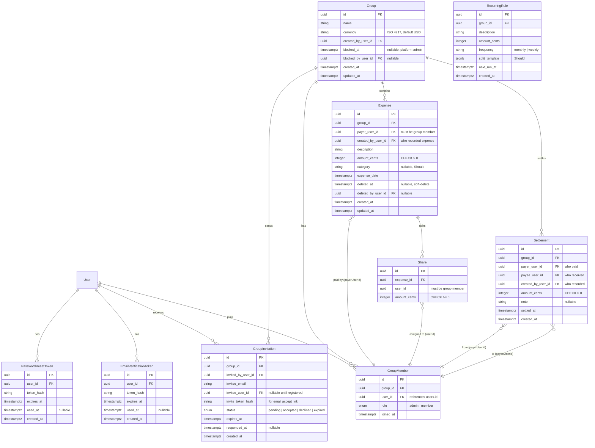

# Spec: Splitter App (Expense Split)

> Source of truth: [`docs/projects/06-expense-split.md`](../docs/projects/06-expense-split.md)  
> Status: **Reviewed — assumptions confirmed, ready for implementation**

---

## Assumptions

1. This is a **web application** (Next.js on `:3000`), not native mobile.
2. **`apps/api-gateway/` is out of scope** — do not modify any files under `apps/api-gateway/`.
3. **All backend development lives in `apps/api/`** — authentication (register/login/logout), users, and every Splitter domain module (groups, expenses, settlements, balances, invitations) are implemented **only** in `apps/api`.
4. **Database is PostgreSQL** (`:5434` via Docker Compose) with **TypeORM** migrations in `apps/api` (including the `users` table and domain seed).
5. **Single currency per group** — no conversion for Must-tier features.
6. **Balances are computed** at read time from expenses − settlements (no ledger/balance table for Must).
7. User role **`staff`** maps to group creator / `GroupMember.role = admin`; role **`user`** joins as `GroupMember.role = member`.
8. **Member onboarding includes email lookup and invite flow** — group admin searches for a user by email, sends an invite email via SMTP, and the invitee accepts via link or in-app action to join the group.
9. **SMTP email delivery is required** in `apps/api` for all transactional mail: group invite emails, post-registration email verification, forgot-password / reset-password links, and resend-verification. Use a dedicated `MailModule` (Nodemailer over SMTP); credentials and sender come from environment variables — never hardcoded.
10. **New accounts require email verification** before full app access — unverified users may register and receive a verification email, but login to private routes (e.g. `/groups`) is blocked until verified (or they complete verification via emailed link).
11. **Forgot password uses email reset links** — time-limited single-use tokens sent via SMTP; reset link lands on a web page that posts the new password to the API.
12. **Expenses are editable by group admin only** (`GroupMember.role = admin`) — members cannot edit expenses they did not create; admins may PATCH any non-deleted expense (amount, payer, shares) with the same share-sum invariant enforced in a transaction.
13. **Platform admin (`admin` role) can access any Splitter screen and API** — bypasses group-membership checks for read access (list/view all groups, expenses, balances). Platform admin has **one write action only**: block or unblock any group. All other mutations (expenses, invites, settlements, member removal) remain group-admin or member scoped.
14. **Only in-group admin (`GroupMember.role = admin`) may remove a member** — regular members and platform admin cannot remove group members. Member removal is not blocked by unsettled balance (group admin may remove regardless).
15. **Categories and recurring expenses** are Should-tier — implement after Must is complete.
16. **Expense list pagination defaults to 10 items per page.**
17. **Blocked groups are read-only for members** — members can still view expenses, balances, and settlement history; mutations (add expense, settle, invite, remove member) return 403.
18. Modern browsers only; responsive mobile-friendly UI.

→ Correct any assumption above before implementation proceeds.

---

## Objective

Build **Splitter**, a group expense-sharing application where members log shared costs, split them fairly among group members, view running balances, and record offline settlements.

### Target users

| Actor          | App role (`apps/api`) | In-group role               | Goal                                                                     |
| -------------- | --------------------- | --------------------------- | ------------------------------------------------------------------------ |
| Group admin    | `staff`               | `GroupMember.role = admin`  | Create groups, invite members by email, edit/delete expenses, view audit |
| Member         | `user`                | `GroupMember.role = member` | Add expenses, view balances, settle up                                   |
| Platform admin | `admin`               | — (bypasses membership)     | View any Splitter screen; **block/unblock groups** (only platform write) |

### Core user stories (Must)

1. As a **new user**, I can register and receive a verification email; I must verify before accessing private Splitter routes.
2. As an **unverified user**, I can request a resend of the verification email.
3. As a **user who forgot my password**, I can request a reset link by email and set a new password via the link.
4. As a **staff user**, I can create a group with a name and default currency, and invite members by email (invite email sent via SMTP).
5. As an **invited user**, I receive an invite email with an accept link and can join the group (in-app accept also supported when logged in).
6. As a **member**, I can add an expense with per-person shares that **sum exactly** to the expense total (in cents).
7. As a **member**, I can view who owes whom in a group via a balances endpoint/screen.
8. As a **member**, I can record a settlement between two members to reduce owed amounts.
9. As a **member**, I can list/filter expenses by date range and payer.
10. As a **group admin**, I can edit any non-deleted expense (amount, payer, shares); share sum invariant is re-validated on save.
11. As a **group admin**, I can soft-delete an expense; it disappears from normal lists but remains visible in an audit view; balances ignore deleted expenses.
12. As an **unauthenticated user**, I am redirected to login before accessing private routes.
13. As a **member**, I only see data for groups I belong to; unauthorized access returns 403.
14. As a **platform admin**, I can view any group, expense list, and balance screen without being a group member.
15. As a **platform admin**, I can block or unblock any group; blocked groups reject member mutations (add expense, settle, invite) with a clear error while **members retain read-only access** to expenses and balances.
16. As a **group admin**, I can remove a member from the group; regular members cannot remove anyone.

### Success criteria (Must pass)

- [ ] `pnpm docker:db` + env files configured; `pnpm migration:run:api` + domain seed in `apps/api` succeed
- [ ] Auth (register/login/logout) works via `apps/api` endpoints
- [ ] **SMTP mail:** verification, forgot-password, reset-password, and group-invite emails send successfully (or log to local mail catcher in dev)
- [ ] Register → verification email → verify link → login to private routes
- [ ] Forgot password → reset email → set new password → login
- [ ] Email lookup + invite flow: search user by email, send invite email, accept invite
- [ ] Group admin can PATCH expenses; non-admin edit attempts return 403
- [ ] Platform admin can access all Splitter screens/APIs without group membership (read-only except block/unblock group)
- [ ] Platform admin can block/unblock any group; blocked groups prevent new expenses/settlements/invites but **allow read** of expenses and balances
- [ ] Only in-group admin can remove members (not platform admin, not regular members)
- [ ] Domain seed: ≥2 groups, 5 members, 6 expenses with shares, 2 settlements
- [ ] Shares invariant enforced in service **and** validated client-side (400 on mismatch)
- [ ] Expense + shares created in a **single DB transaction**
- [ ] Balances derived correctly from non-deleted expenses minus settlements
- [ ] Soft-delete on expenses with audit visibility for group admin
- [ ] Frontend routes: `/groups`, `/groups/[id]`, `/groups/[id]/balances` using `@shared/ui/components`
- [ ] TanStack Query for server data; RTK for drafts/filters only
- [ ] Empty ≠ loading ≠ error on all list screens
- [ ] `docs/architecture.md` domain notes + demo script filled
- [ ] Shared Must bar in [`docs/grading.md`](../docs/grading.md) satisfied

### Should (distinction)

- [ ] Recurring expenses (`RecurringRule` + generated instances)
- [ ] Category reports (`/groups/[id]/reports`)
- [ ] Categories on expenses
- [ ] Dashboard: net owe/owed across all groups

### Stretch (bonus)

- Currency conversion, bank sync, PDF export

---

## Tech Stack

| Layer                 | Technology                                  | Version (verified)                                                 |
| --------------------- | ------------------------------------------- | ------------------------------------------------------------------ |
| Monorepo              | pnpm workspaces + Turbo                     | pnpm 10.18.1                                                       |
| Runtime               | Node.js                                     | ≥20                                                                |
| Backend (all)         | NestJS + TypeORM + PostgreSQL in `apps/api` | Nest 11, TypeORM 0.3.21 — auth + Splitter modules                  |
| Backend (gateway)     | NestJS + cookie JWT + proxy                 | **Out of scope — do not modify**                                   |
| Frontend              | Next.js 15 (App Router) + React 19          | next 15.2.4                                                        |
| Server state          | TanStack Query 5                            | `@tanstack/react-query`                                            |
| Client drafts/filters | Redux Toolkit 2                             | `@reduxjs/toolkit`                                                 |
| HTTP client           | Axios via `@shared/api-client`              | withCredentials                                                    |
| Validation (API)      | class-validator + class-transformer         | Global ValidationPipe                                              |
| Email (transactional) | Nodemailer + SMTP in `apps/api`             | `@nestjs-modules/mailer` or direct `nodemailer` — TBD at implement |
| UI                    | `@shared/ui/components` + Tailwind 4 theme  | No new UI library                                                  |
| Testing               | Jest + Testing Library                      | Root `jest.config.cjs`                                             |

---

## Commands

```bash
# Infrastructure
pnpm docker:db              # Start Postgres (:5434)
pnpm doctor                 # Smoke-check all hops

# Development
pnpm dev:api                # Backend :3002 (auth + Splitter)
pnpm dev:web                # Frontend :3000

# Database (apps/api only — do not run gateway migrations/seeds)
pnpm migration:run:api      # Users + Splitter tables
pnpm migration:generate     # Generate new apps/api migration
pnpm seed:api               # Demo users + domain seed (to be added in apps/api)

# Quality
pnpm lint
pnpm typecheck
pnpm test
pnpm build

# Teardown
pnpm docker:down
```

### Environment files required

| File                  | Purpose                                                                                  |
| --------------------- | ---------------------------------------------------------------------------------------- |
| `.env` (repo root)    | Postgres for Docker Compose                                                              |
| `apps/api/.env`       | API port, DATABASE_URL, JWT_SECRET, CORS_ORIGIN, **SMTP_***, **APP_PUBLIC_URL**          |
| `apps/web/.env.local` | API base URL pointing at `apps/api` (may require Next rewrite update in `apps/web` only) |

Copy from respective `.env.example` / `.env.local.example` files. Do **not** modify `apps/api-gateway/.env`.

#### SMTP & app URL environment variables (`apps/api/.env`)

| Variable                           | Purpose                                 | Example (local dev)            |
| ---------------------------------- | --------------------------------------- | ------------------------------ |
| `SMTP_HOST`                        | SMTP server hostname                    | `localhost` (Mailpit/Mailhog)  |
| `SMTP_PORT`                        | SMTP port                               | `1025`                         |
| `SMTP_USER`                        | SMTP auth user (optional for local)     | —                              |
| `SMTP_PASS`                        | SMTP auth password (optional for local) | —                              |
| `SMTP_SECURE`                      | TLS (`true` for 465)                    | `false`                        |
| `SMTP_FROM`                        | From address shown to recipients        | `Splitter <noreply@localhost>` |
| `APP_PUBLIC_URL`                   | Base URL for links in emails (web app)  | `http://localhost:3000`        |
| `EMAIL_VERIFICATION_EXPIRES_HOURS` | Verification token TTL                  | `24`                           |
| `PASSWORD_RESET_EXPIRES_HOURS`     | Reset token TTL                         | `1`                            |
| `GROUP_INVITE_EXPIRES_DAYS`        | Invite link TTL                         | `7`                            |

**Local development:** use [Mailpit](https://github.com/axllent/mailpit) or Mailhog on port 1025 to capture outbound mail without sending real email. Seed/demo users may be pre-verified to simplify manual testing.

---

## Project Structure

```text
apps/
  api-gateway/          # OUT OF SCOPE — do not modify
  api/                  # ALL backend work (auth + Splitter + mail)
    src/modules/
      auth/             # Register, login, logout, verify, forgot/reset password
      mail/             # SMTP MailService + templates (Nodemailer)
      users/            # User entity, email lookup
      groups/           # Group, GroupMember, invitations
      expenses/         # Expense, Share
      settlements/      # Settlement
      balances/         # Computed endpoint (no entity)
    src/database/
      migrations/       # Users + Splitter tables
      seed.ts           # Demo users + domain seed
  web/                  # Next.js UI
    app/
      (auth)/           # login, register (exists)
      groups/           # NEW: list, detail, balances, reports (Should)
    components/         # App-specific (auth shell, providers)
    lib/                # api client, store, api-base-url

libs/
  ui/                   # Shared components + theme — USE THESE
  api-client/           # Axios client, auth/health APIs — EXTEND for domain
  http/                 # Guards, filters, interceptors, swagger
  shared-types/         # Zod schemas — EXTEND for domain types
  env/                  # Validated env loaders per app

docs/
  projects/06-expense-split.md   # Product brief
  architecture.md                # Fill domain notes + demo script
specs/
  SPEC.md                        # This file
```

### Module ownership

| Concern                              | Owner                          |
| ------------------------------------ | ------------------------------ |
| User registration/login/logout       | `apps/api`                     |
| Email verification & password reset  | `apps/api` (auth + mail)       |
| Transactional SMTP mail              | `apps/api` (`MailModule`)      |
| User entity + email lookup           | `apps/api`                     |
| Group/expense/settlement/invite CRUD | `apps/api`                     |
| Balance computation                  | `apps/api` (service, no table) |
| Pages and forms                      | `apps/web`                     |
| Shared UI primitives                 | `libs/ui`                      |
| `apps/api-gateway`                   | **Untouched**                  |

---

## Code Style

Follow existing monorepo conventions:

```typescript
// Entity naming: *.entity.ts under module folder
@Entity({ name: 'expenses' })
export class Expense {
  @PrimaryGeneratedColumn('uuid')
  id!: string;

  @Column({ name: 'amount_cents', type: 'integer' })
  amountCents!: number;

  @Column({ name: 'deleted_at', type: 'timestamptz', nullable: true })
  deletedAt!: Date | null;
}

// DTOs with class-validator
export class CreateExpenseDto {
  @IsInt()
  @Min(1)
  amountCents!: number;

  @IsArray()
  @ValidateNested({ each: true })
  @Type(() => CreateShareDto)
  shares!: CreateShareDto[];
}

// Service: business logic + transactions
async create(groupId: string, dto: CreateExpenseDto, userId: string) {
  // 1. Verify membership
  // 2. Validate shares sum === amountCents
  // 3. Transaction: insert expense + shares
}

// Controller: thin, delegates to service
@Post()
@Roles('user', 'staff')
async create(@Param('id') groupId: string, @Body() dto: CreateExpenseDto) { ... }

// Frontend: Query for server data
const { data, isLoading, error } = useQuery({
  queryKey: ['groups', groupId, 'expenses', filters],
  queryFn: () => expensesApi.list(groupId, filters),
});

// Frontend: RTK for filter drafts only
const filterDraft = useAppSelector((s) => s.ui.filterDraft);
```

**Conventions:**

- snake_case column names in DB; camelCase in TypeScript
- Money stored as **integer cents** (`integer` / `bigint`) — never float
- API responses wrapped in `{ data: T }` envelope
- Errors: `{ statusCode, error, message, details? }`
- Imports: `@shared/ui/components`, `@shared/http/auth`, folder subpaths
- Nest barrels: `index.ts` per module folder

---

## Testing Strategy

| Level        | Framework           | Location                    | Scope                                                               |
| ------------ | ------------------- | --------------------------- | ------------------------------------------------------------------- |
| Unit         | Jest                | `apps/api/src/**/*.spec.ts` | Share sum validation, balance algorithm, largest-remainder rounding |
| Unit         | Jest                | `apps/web/lib/**/*.spec.ts` | API client helpers, filter utils                                    |
| Integration  | Jest + Nest Testing | Module spec files           | Controller + service with mocked repos                              |
| E2E (manual) | Demo script         | PR body                     | Register → group → expense → balances → settle                      |

**Must test:**

- Shares sum ≠ expense amount → 400
- Non-member access → 403
- Settlement amount > outstanding debt → 400
- Soft-delete recalculates balances (deleted expenses excluded)
- Expense + shares atomic transaction
- Non-admin expense edit → 403
- Invite accept creates GroupMember; duplicate invite rejected
- Register sends verification email (mock MailService in test)
- Invalid reset/verification token → 400
- Forgot-password returns 200 even for unknown email (no enumeration)
- `$100 / 3` split uses largest-remainder; sum equals exactly 10000 cents

**Run:** `pnpm test` (root) or `pnpm test:api` / `pnpm test:gateway`

No strict coverage gate documented; aim for invariant and authorization paths.

---

## Boundaries

### Always do

- Run `pnpm typecheck` and `pnpm test` before committing
- Use TypeORM migrations (`synchronize: false`)
- Store money as integer cents
- Validate share sums in service layer (not just frontend)
- Use DB transactions for multi-entity writes
- Scope all queries by `groupId` + verify membership
- Use `@shared/ui/components` for UI (Button, Form, Table, EmptyState, LoadingState, etc.)
- Keep TanStack Query for server state; RTK for drafts/filters only
- Return consistent error shapes via `AllExceptionsFilter`
- Soft-delete expenses (set `deletedAt`), never hard-delete with existing settlements
- Send transactional email only through `MailService` — never call SMTP directly from controllers
- Use time-limited, single-use tokens for verification and password reset (store hashed token in DB)
- Never log SMTP passwords or raw reset/verification tokens

### Ask first

- Adding new npm dependencies
- Modifying shared libs (`libs/ui`, `libs/http`) beyond Splitter-specific exports
- Database schema changes after initial migration is merged
- Any changes under `apps/api-gateway/`

### Never do

- Commit secrets (`.env` files with real credentials)
- Store JWT in localStorage
- Modify any file under `apps/api-gateway/`
- Use floating-point for monetary values
- Store derived balances in DB (Must tier)
- Hard-delete expenses that affect balance history
- Log or return raw verification/reset tokens in API responses (tokens travel by email only)
- Send email without configured SMTP in production (fail loudly or queue — no silent drop)

---

## Phase 1 — Repository Analysis

### Existing (ready to use)

| Area                   | Status | Details                                                           |
| ---------------------- | ------ | ----------------------------------------------------------------- |
| Monorepo tooling       | ✅     | pnpm + Turbo, shared libs                                         |
| PostgreSQL + Docker    | ✅     | `pnpm docker:db`, port 5434                                       |
| API scaffold           | ✅     | NestJS, TypeORM, JWT guards scaffold, ValidationPipe, Swagger     |
| Auth module (apps/api) | ⚠️     | JWT strategy exists; register/login/logout + User entity to build |
| Frontend scaffold      | ✅     | Next 15, auth pages, AuthProvider, middleware                     |
| API client             | ✅     | Axios + auth/health APIs, error handling                          |
| UI kit                 | ✅     | Button, Form, Table, Dialog, EmptyState, LoadingState, Page, etc. |
| State ownership        | ✅     | Query + RTK pattern documented                                    |
| Env validation         | ✅     | `@shared/env/gateway`, `@shared/env/api`                          |

### Missing (to build)

| Area                       | Status | Details                                                                        |
| -------------------------- | ------ | ------------------------------------------------------------------------------ |
| Mail / SMTP module         | ❌     | Nodemailer MailService, templates, env config                                  |
| Auth tokens (verify/reset) | ❌     | DB entities + auth endpoints                                                   |
| Domain entities            | ❌     | Group, GroupMember, GroupInvitation, Expense, Share, Settlement                |
| Domain migrations          | ❌     | Only `.gitkeep` in `apps/api/src/database/migrations/`                         |
| Domain seed                | ❌     | Demo users + 2 groups, 5 members, 6 expenses, 2 settlements                    |
| Domain modules             | ❌     | auth, users, groups, invitations, expenses, settlements, balances              |
| Domain API client          | ❌     | Extend `@shared/api-client` or `apps/web/lib/api.ts`                           |
| Domain types               | ❌     | Zod schemas in `@shared/types`                                                 |
| Frontend routes            | ❌     | `/groups`, `/groups/[id]`, `/groups/[id]/balances`                             |
| Route protection           | ⚠️     | Middleware only guards login/register redirect; need auth guard on `/groups/*` |
| `docs/architecture.md`     | ⚠️     | Domain notes + demo script placeholders only                                   |

### Dependency checklist

**Backend — present:** NestJS 11, TypeORM, pg, class-validator, passport-jwt, @nestjs/swagger  
**Backend — add for mail:** `nodemailer` (+ types); optionally `@nestjs-modules/mailer`  
**Frontend — all present:** Next 15, React 19, TanStack Query, RTK, Tailwind 4, @shared/ui  
**Infrastructure — configured:** Docker Postgres, env examples, migration scripts  
**Local mail catcher (dev):** Mailpit/Mailhog recommended — not a repo dependency

---

## Phase 2 — Database Design

### ERD



> **Note:** `User` table lives in `apps/api` (`users`). All FKs reference it directly.

### Table definitions

#### `groups`

| Column             | Type         | Constraints                                 |
| ------------------ | ------------ | ------------------------------------------- |
| id                 | uuid         | PK, default gen_random_uuid()               |
| name               | varchar(255) | NOT NULL                                    |
| currency           | varchar(3)   | NOT NULL, default 'USD'                     |
| created_by_user_id | uuid         | NOT NULL, FK → users(id)                    |
| blocked_at         | timestamptz  | NULL — set when platform admin blocks group |
| blocked_by_user_id | uuid         | NULL, FK → users(id)                        |
| created_at         | timestamptz  | NOT NULL, default now()                     |
| updated_at         | timestamptz  | NOT NULL, default now()                     |

**Indexes:** `idx_groups_created_by_user_id`, `idx_groups_blocked_at` (partial: WHERE blocked_at IS NOT NULL)

#### `group_members`

| Column    | Type        | Constraints                                |
| --------- | ----------- | ------------------------------------------ |
| id        | uuid        | PK                                         |
| group_id  | uuid        | FK → groups(id) ON DELETE CASCADE          |
| user_id   | uuid        | NOT NULL, FK → users(id) ON DELETE CASCADE |
| role      | varchar(20) | NOT NULL, CHECK IN ('admin', 'member')     |
| joined_at | timestamptz | NOT NULL, default now()                    |

**Unique:** `(group_id, user_id)`  
**Indexes:** `idx_group_members_user_id`, `idx_group_members_group_id`

#### `expenses`

| Column             | Type         | Constraints                                         |
| ------------------ | ------------ | --------------------------------------------------- |
| id                 | uuid         | PK                                                  |
| group_id           | uuid         | FK → groups(id) ON DELETE CASCADE                   |
| payer_user_id      | uuid         | NOT NULL, FK → users(id)                            |
| created_by_user_id | uuid         | NOT NULL, FK → users(id) — who recorded the expense |
| description        | varchar(500) | NOT NULL                                            |
| amount_cents       | integer      | NOT NULL, CHECK (amount_cents > 0)                  |
| category           | varchar(100) | NULL (Should)                                       |
| expense_date       | timestamptz  | NOT NULL                                            |
| deleted_at         | timestamptz  | NULL                                                |
| deleted_by_user_id | uuid         | NULL, FK → users(id)                                |
| created_at         | timestamptz  | NOT NULL                                            |
| updated_at         | timestamptz  | NOT NULL                                            |

**Indexes:** `idx_expenses_group_id`, `idx_expenses_payer_user_id`, `idx_expenses_expense_date`, `idx_expenses_created_by_user_id`, `idx_expenses_group_active_date` (partial composite: `(group_id, expense_date DESC) WHERE deleted_at IS NULL`)

#### `shares`

| Column       | Type    | Constraints                         |
| ------------ | ------- | ----------------------------------- |
| id           | uuid    | PK                                  |
| expense_id   | uuid    | FK → expenses(id) ON DELETE CASCADE |
| user_id      | uuid    | NOT NULL, FK → users(id)            |
| amount_cents | integer | NOT NULL, CHECK (amount_cents >= 0) |

**Unique:** `(expense_id, user_id)` — one share row per member per expense  
**Indexes:** `idx_shares_expense_id`, `idx_shares_user_id`

#### `settlements`

| Column             | Type         | Constraints                                            |
| ------------------ | ------------ | ------------------------------------------------------ |
| id                 | uuid         | PK                                                     |
| group_id           | uuid         | FK → groups(id) ON DELETE CASCADE                      |
| payer_user_id      | uuid         | NOT NULL, FK → users(id) (debtor who paid)             |
| payee_user_id      | uuid         | NOT NULL, FK → users(id) (creditor who received)       |
| created_by_user_id | uuid         | NOT NULL, FK → users(id) — who recorded the settlement |
| amount_cents       | integer      | NOT NULL, CHECK (amount_cents > 0)                     |
| note               | varchar(500) | NULL                                                   |
| settled_at         | timestamptz  | NOT NULL                                               |
| created_at         | timestamptz  | NOT NULL                                               |

**Check:** `payer_user_id != payee_user_id`  
**Indexes:** `idx_settlements_group_id`

#### `group_invitations`

| Column             | Type         | Constraints                                                       |
| ------------------ | ------------ | ----------------------------------------------------------------- |
| id                 | uuid         | PK                                                                |
| group_id           | uuid         | FK → groups(id) ON DELETE CASCADE                                 |
| invited_by_user_id | uuid         | FK → users(id)                                                    |
| invitee_email      | varchar(255) | NOT NULL                                                          |
| invitee_user_id    | uuid         | FK → users(id), NULL until user exists                            |
| invite_token_hash  | varchar(255) | NOT NULL — raw token sent in email, hashed at rest                |
| status             | varchar(20)  | NOT NULL, CHECK IN ('pending', 'accepted', 'declined', 'expired') |
| expires_at         | timestamptz  | NOT NULL                                                          |
| responded_at       | timestamptz  | NULL — set when accepted or declined                              |
| created_at         | timestamptz  | NOT NULL                                                          |

**Unique:** `(group_id, invitee_email)` WHERE status = 'pending' (partial unique)  
**Indexes:** `idx_group_invitations_invitee_email`, `idx_group_invitations_invitee_user_id`

#### `users` (apps/api)

| Column            | Type         | Constraints                                                   |
| ----------------- | ------------ | ------------------------------------------------------------- |
| id                | uuid         | PK                                                            |
| email             | varchar(255) | UNIQUE, NOT NULL                                              |
| password_hash     | varchar      | NOT NULL                                                      |
| name              | varchar(255) | NOT NULL                                                      |
| role              | varchar(20)  | NOT NULL, CHECK IN ('admin', 'user', 'staff'), default 'user' |
| email_verified_at | timestamptz  | NULL until verified                                           |
| created_at        | timestamptz  | NOT NULL                                                      |
| updated_at        | timestamptz  | NOT NULL                                                      |

#### `email_verification_tokens`

| Column     | Type         | Constraints                      |
| ---------- | ------------ | -------------------------------- |
| id         | uuid         | PK                               |
| user_id    | uuid         | FK → users(id) ON DELETE CASCADE |
| token_hash | varchar(255) | NOT NULL                         |
| expires_at | timestamptz  | NOT NULL                         |
| used_at    | timestamptz  | NULL                             |
| created_at | timestamptz  | NOT NULL                         |

**Indexes:** `idx_email_verification_tokens_user_id`, `idx_email_verification_tokens_token_hash`

#### `password_reset_tokens`

| Column     | Type         | Constraints                      |
| ---------- | ------------ | -------------------------------- |
| id         | uuid         | PK                               |
| user_id    | uuid         | FK → users(id) ON DELETE CASCADE |
| token_hash | varchar(255) | NOT NULL                         |
| expires_at | timestamptz  | NOT NULL                         |
| used_at    | timestamptz  | NULL                             |
| created_at | timestamptz  | NOT NULL                         |

**Indexes:** `idx_password_reset_tokens_user_id`, `idx_password_reset_tokens_token_hash`

#### `recurring_rules` (Should)

Deferred until Must is complete. Schema stub included for planning.

### Balance computation algorithm

For a group, for each member `m`:

```
paid[m]     = SUM(expense.amount_cents WHERE payer = m AND deleted_at IS NULL)
owed[m]     = SUM(share.amount_cents WHERE user = m AND expense NOT deleted)
received[m] = SUM(settlement.amount_cents WHERE payee = m)
paid_out[m] = SUM(settlement.amount_cents WHERE payer = m)

net[m] = paid[m] - owed[m] + received[m] - paid_out[m]
```

- Positive `net[m]` → member is owed money overall
- Negative `net[m]` → member owes money overall

**Simplified debts:** Greedy pairing — repeatedly match max creditor with max debtor until all nets zero (standard Splitwise-style simplification).

### Split rounding (largest remainder)

When splitting equally among N members for amount `A` cents:

1. Base share = `floor(A / N)`
2. Remainder = `A - (base * N)`
3. Assign `base + 1` to the first `remainder` members (deterministic order by userId)

### Migration & seed strategy

1. **Migration 1:** Create all Must tables + constraints + indexes
2. **Seed script** (`apps/api/src/database/seed.ts`):
   - Use hard-coded UUIDs for reproducibility
   - `staff@demo.local` creates 2 groups as admin
   - `user@demo.local` joins as member
   - 1+ additional member via hard-coded UUID (simulated second user)
   - 6 expenses with shares, 2 settlements
3. Run: `pnpm migration:run:api && pnpm seed:api` (all seed data in `apps/api`)

### Schema review

> Reviewed against Must user stories, SMTP/auth flows, and [`docs/projects/06-expense-split.md`](../docs/projects/06-expense-split.md).

#### Verdict

**The schema is sufficient for Must-tier Splitter.** Ten tables cover auth, invites, groups, expenses, splits, settlements, and computed balances. No additional Must tables are required.

Incorporate the **column additions, FK constraints, and indexes** below in Migration 1 to avoid rework.

#### Must-tier coverage

| Requirement                       | Tables / columns                                       | Status |
| --------------------------------- | ------------------------------------------------------ | ------ |
| Auth (register/login/logout)      | `users`                                                | ✅     |
| Email verification                | `users.email_verified_at`, `email_verification_tokens` | ✅     |
| Forgot / reset password           | `password_reset_tokens`                                | ✅     |
| Groups + single currency          | `groups`                                               | ✅     |
| Membership + in-group roles       | `group_members`                                        | ✅     |
| Email invites (SMTP)              | `group_invitations`                                    | ✅     |
| Expenses + soft-delete audit      | `expenses` (`deleted_at`, `deleted_by_user_id`)        | ✅     |
| Per-person splits + sum invariant | `shares`                                               | ✅     |
| Settlements                       | `settlements`                                          | ✅     |
| Computed balances (no ledger)     | — (service-layer)                                      | ✅     |
| List/filter by date + payer       | `expense_date`, `payer_user_id`, composite index       | ✅     |
| Platform admin block group        | `groups.blocked_at`, `groups.blocked_by_user_id`       | ✅     |
| Expense edit by group admin       | existing `expenses` + `shares` (PATCH replaces shares) | ✅     |

#### Migration 1 additions (recommended — same tables)

| Table               | Column                             | Type                     | Why                               |
| ------------------- | ---------------------------------- | ------------------------ | --------------------------------- |
| `expenses`          | `created_by_user_id`               | uuid NOT NULL FK → users | Payer ≠ recorder; display + audit |
| `settlements`       | `created_by_user_id`               | uuid NOT NULL FK → users | Who clicked "Settle up"           |
| `group_invitations` | `responded_at`                     | timestamptz NULL         | When invite accepted/declined     |
| `groups`            | `blocked_at`, `blocked_by_user_id` | timestamptz/uuid NULL FK | Platform admin group block        |

#### FK constraints (apply in Migration 1)

All `user_id` / `*_user_id` columns should FK → `users(id)` unless noted:

| Table               | Columns                                                     |
| ------------------- | ----------------------------------------------------------- |
| `groups`            | `created_by_user_id`                                        |
| `group_members`     | `user_id`                                                   |
| `expenses`          | `payer_user_id`, `created_by_user_id`, `deleted_by_user_id` |
| `shares`            | `user_id`                                                   |
| `settlements`       | `payer_user_id`, `payee_user_id`, `created_by_user_id`      |
| `group_invitations` | `invited_by_user_id`, `invitee_user_id`                     |

Use `ON DELETE RESTRICT` for financial FKs (expenses, shares, settlements) and `ON DELETE CASCADE` for token/invite cleanup tables.

#### Indexes (apply in Migration 1)

```sql
-- Expense list: group + date filter on active expenses only
CREATE INDEX idx_expenses_group_active_date
  ON expenses (group_id, expense_date DESC)
  WHERE deleted_at IS NULL;

-- Pending invites for logged-in user
CREATE INDEX idx_group_invitations_pending_email
  ON group_invitations (invitee_email)
  WHERE status = 'pending';
```

Store `users.email` and `group_invitations.invitee_email` **lowercase** in the service layer.

#### Tables intentionally omitted (Must)

| Considered                | Verdict                                                   |
| ------------------------- | --------------------------------------------------------- |
| `balances` / ledger table | ❌ Computed from expenses − settlements                   |
| `notifications`           | ❌ SMTP covers Must; add later for in-app                 |
| `activity_events`         | ❌ Derive from expenses + settlements for Must            |
| `expense_audit_log`       | ❌ Soft-delete + `deleted_by_user_id` sufficient for Must |
| `mail_outbox`             | ❌ Optional dev/debug only                                |
| `user_sessions`           | ❌ Not needed unless refresh-token auth is added          |
| Separate `payments` table | ❌ `settlements` is enough                                |

#### Should-tier schema (defer to Migration 2+)

**Recurring expenses** — expand beyond ERD stub:

| Addition                                   | Purpose                          |
| ------------------------------------------ | -------------------------------- |
| `recurring_rules.payer_user_id`            | Who pays generated expenses      |
| `recurring_rules.is_active`                | Pause/resume rule                |
| `recurring_rules.last_run_at`              | Track last generation            |
| `expenses.recurring_rule_id` (nullable FK) | Link generated expense to rule   |
| Unique `(recurring_rule_id, period_start)` | Idempotent generation per period |

**Category reports** — `expenses.category` varchar (already nullable) is enough for simple Should reports. Add a normalized `categories` table only if admin-managed per-group categories are needed:

```text
categories (id, group_id, name)
expenses.category_id  FK → categories(id)   -- replaces varchar
```

**Cross-group dashboard** — no new table; computed across groups for the current user.

#### API note (no schema change)

Add `GET /invites/me` to list pending invites for the logged-in user (query by `invitee_user_id` or normalized `invitee_email`). Existing `group_invitations` columns support this.

---

## Phase 3–4 — Backend API Design

### Module structure

```text
apps/api/src/modules/
  mail/
    mail.module.ts
    mail.service.ts       # Nodemailer transport; sendTemplate(type, to, context)
    templates/            # verify-email, reset-password, group-invite (HTML + text)
  auth/                   # register, login, logout, verify, forgot/reset password
  users/
    user.entity.ts
    users.module.ts
    users.service.ts    # email lookup
  groups/
    group.entity.ts
    group-member.entity.ts
    group-invitation.entity.ts
    groups.module.ts
    groups.controller.ts
    groups.service.ts
    dto/
  expenses/
    expense.entity.ts
    share.entity.ts
    expenses.module.ts
    expenses.controller.ts
    expenses.service.ts
    dto/
  settlements/
    settlement.entity.ts
    settlements.module.ts
    settlements.controller.ts
    settlements.service.ts
    dto/
  balances/
    balances.module.ts
    balances.controller.ts
    balances.service.ts   # pure computation, no entity
```

Register all modules in `app.module.ts`.

### Mail module (SMTP)

Central **`MailService`** in `apps/api` — all outbound email goes through this service.

| Mail type               | Trigger                          | Recipient           | Link in email                             |
| ----------------------- | -------------------------------- | ------------------- | ----------------------------------------- |
| **Email verification**  | `POST /auth/register`            | New user            | `{APP_PUBLIC_URL}/verify-email?token=…`   |
| **Resend verification** | `POST /auth/resend-verification` | Unverified user     | Same verification link                    |
| **Password reset**      | `POST /auth/forgot-password`     | User matching email | `{APP_PUBLIC_URL}/reset-password?token=…` |
| **Group invite**        | `POST /groups/:id/invites`       | Invitee email       | `{APP_PUBLIC_URL}/invites/accept?token=…` |

**Implementation notes:**

- Generate cryptographically random tokens (e.g. 32 bytes hex); store **SHA-256 hash** in DB; raw token only in email URL.
- Invalidate previous unused tokens of the same type when issuing a new one (verification / reset).
- `MailService` methods: `sendVerificationEmail`, `sendPasswordResetEmail`, `sendGroupInviteEmail`.
- Unit tests mock `MailService`; integration tests may use Nodemailer test account or stub transport.
- On SMTP failure: log error + return **503** or **500** with generic message (do not leak SMTP details).

**Register flow:**

1. Create user with `email_verified_at = NULL`
2. Create verification token + send email
3. Return **201** with message to check email (optionally auto-login with limited JWT that cannot access `/groups` until verified)

**Login rule:** Reject login with **403** `Email not verified` if `email_verified_at` is null (except platform admin seed users may be pre-verified in seed).

**Forgot password:** Always return **200** with generic message ("If that email exists, we sent a link") to avoid email enumeration.

### API endpoints

#### Auth & account (mail-related)

| Method | Path                        | Auth   | Description                                    |
| ------ | --------------------------- | ------ | ---------------------------------------------- |
| POST   | `/auth/register`            | public | Register; send verification email              |
| POST   | `/auth/login`               | public | Login; block if email unverified               |
| POST   | `/auth/logout`              | user   | Logout                                         |
| GET    | `/auth/me`                  | user   | Current user (includes `emailVerified`)        |
| POST   | `/auth/verify-email`        | public | Body: `{ token }` — marks email verified       |
| POST   | `/auth/resend-verification` | public | Body: `{ email }` — resend if unverified       |
| POST   | `/auth/forgot-password`     | public | Body: `{ email }` — send reset email           |
| POST   | `/auth/reset-password`      | public | Body: `{ token, password }` — set new password |

#### Groups

| Method | Path                          | Auth               | Description                                                      |
| ------ | ----------------------------- | ------------------ | ---------------------------------------------------------------- |
| POST   | `/groups`                     | staff              | Create group; creator becomes admin member                       |
| GET    | `/groups`                     | user, staff, admin | List groups (member's groups; platform `admin` sees all)         |
| GET    | `/groups/:id`                 | member             | Group detail + member list                                       |
| GET    | `/users/lookup?email=`        | admin (group)      | Search registered user by email for invite                       |
| POST   | `/groups/:id/invites`         | admin              | Send invite by email (creates pending invitation + SMTP email)   |
| GET    | `/groups/:id/invites`         | admin              | List pending invitations                                         |
| POST   | `/invites/accept`             | public / user      | Body: `{ token }` — accept via email link token                  |
| POST   | `/invites/:id/accept`         | invitee            | Accept invitation in-app → creates GroupMember                   |
| POST   | `/invites/:id/decline`        | invitee            | Decline invitation                                               |
| DELETE | `/groups/:id/members/:userId` | group admin        | Remove member — in-group admin only (not platform admin)         |
| POST   | `/groups/:id/block`           | platform admin     | Block group — sets `blocked_at`; rejects future member mutations |
| POST   | `/groups/:id/unblock`         | platform admin     | Unblock group — clears `blocked_at`                              |

#### Expenses

| Method | Path                              | Auth   | Description                                                                                                    |
| ------ | --------------------------------- | ------ | -------------------------------------------------------------------------------------------------------------- |
| POST   | `/groups/:id/expenses`            | member | Create expense + shares (transaction)                                                                          |
| GET    | `/groups/:id/expenses`            | member | List with filters (`from`, `to`, `payerUserId`, default `limit=10`); **allowed on blocked groups** (read-only) |
| GET    | `/groups/:id/expenses/:expenseId` | member | Expense detail with shares                                                                                     |
| PATCH  | `/groups/:id/expenses/:expenseId` | admin  | Edit expense + replace shares (transaction)                                                                    |
| DELETE | `/groups/:id/expenses/:expenseId` | admin  | Soft-delete (set deletedAt)                                                                                    |
| GET    | `/groups/:id/expenses/deleted`    | admin  | Audit list of soft-deleted expenses                                                                            |

#### Balances

| Method | Path                   | Auth   | Description                                                      |
| ------ | ---------------------- | ------ | ---------------------------------------------------------------- |
| GET    | `/groups/:id/balances` | member | Computed net balances; **allowed on blocked groups** (read-only) |

#### Settlements

| Method | Path                      | Auth   | Description                                                   |
| ------ | ------------------------- | ------ | ------------------------------------------------------------- |
| POST   | `/groups/:id/settlements` | member | Record payment between two members                            |
| GET    | `/groups/:id/settlements` | member | Settlement history; **allowed on blocked groups** (read-only) |

### Key DTOs

**CreateExpenseDto:**

- `description: string` (required)
- `amountCents: number` (required, min 1)
- `payerUserId: uuid` (required, must be member)
- `expenseDate: ISO date` (required)
- `category?: string` (Should)
- `shares: { userId: uuid, amountCents: number }[]` (required, min 1)

**CreateSettlementDto:**

- `payerUserId: uuid` (who is paying off debt)
- `payeeUserId: uuid` (who receives)
- `amountCents: number` (min 1)
- `note?: string`
- `settledAt?: ISO date` (default now)

### Authorization rules

| Action                                  | Requirement                                          |
| --------------------------------------- | ---------------------------------------------------- |
| Create group                            | App role `staff`                                     |
| View group data                         | Group member **or** platform `admin`                 |
| List all groups                         | Platform `admin` only                                |
| Block / unblock group                   | Platform `admin` only                                |
| View expenses/balances on blocked group | Group member or platform admin (read-only)           |
| Add expense                             | Group member; blocked group → 403                    |
| Edit expense                            | `GroupMember.role = admin` only                      |
| Soft-delete expense                     | `GroupMember.role = admin`                           |
| View deleted audit                      | `GroupMember.role = admin` or platform `admin`       |
| Create settlement                       | Group member; blocked group → 403                    |
| Send invite                             | `GroupMember.role = admin`; blocked group → 403      |
| Remove member                           | `GroupMember.role = admin` only (not platform admin) |
| Accept/decline invite                   | Invitee (matching email or userId)                   |
| Verify email / reset password           | Public (token-based)                                 |
| Resend verification / forgot password   | Public                                               |
| Email user lookup                       | Group admin (for invite flow)                        |

`@Roles('user', 'staff', 'admin')` on controllers; membership checked in service unless caller is platform `admin`.

### Error scenarios

| Scenario                                    | Status | Message                                |
| ------------------------------------------- | ------ | -------------------------------------- |
| Shares sum ≠ amount                         | 400    | Share amounts must equal expense total |
| Non-member action                           | 403    | Not a member of this group             |
| Mutation on blocked group                   | 403    | This group has been blocked            |
| Zero/negative amount                        | 400    | Amount must be at least 1 cent         |
| Share for non-member                        | 400    | User is not a group member             |
| Settlement > debt                           | 400    | Settlement exceeds outstanding balance |
| Expense not found / deleted                 | 404    | Expense not available                  |
| Login with unverified email                 | 403    | Please verify your email               |
| Invalid/expired verification or reset token | 400    | Invalid or expired token               |
| SMTP send failure                           | 503    | Unable to send email — try again later |
| Unauthorized                                | 401    | Standard JWT error                     |

---

## Phase 5–6 — Frontend UI Design

### Auth & account screens

| Route              | Status    | Key UI                                                       |
| ------------------ | --------- | ------------------------------------------------------------ |
| `/login`           | ✅ Exists | Link to forgot password                                      |
| `/register`        | ✅ Exists | Success state: "Check your email to verify"                  |
| `/verify-email`    | NEW       | Reads `?token=` from URL; calls API; success/error Alert     |
| `/forgot-password` | NEW       | Email form; generic success message                          |
| `/reset-password`  | NEW       | Reads `?token=`; new password + confirm; submit to API       |
| `/invites/accept`  | NEW       | Reads invite `?token=`; login redirect if needed; accept CTA |

### Domain screens (Must)

| Route                   | Component       | Key UI                                                                                                  |
| ----------------------- | --------------- | ------------------------------------------------------------------------------------------------------- |
| `/groups`               | GroupsListPage  | Card/table of user's groups; "Create group" button (staff only); EmptyState when none                   |
| `/groups/[id]`          | GroupDetailPage | Tabbed or sectioned: expense list + inline add form; filters (date range, payer); soft-delete for admin |
| `/groups/[id]/balances` | BalancesPage    | Who owes whom table; "Settle up" dialog; "All clear" empty state                                        |

### Should screens

| Route                  | Component                                  |
| ---------------------- | ------------------------------------------ |
| `/groups/[id]/reports` | ReportsPage — category/member breakdown    |
| `/` or `/dashboard`    | DashboardPage — net owe/owed across groups |

### UI patterns

- **Split editor:** Dynamic rows (member select + amount input); live sum indicator showing `total / expenseAmount`; red highlight on mismatch; disable submit until valid
- **Settle up:** Dialog with payer/payee selects pre-filled from suggested debts; amount input capped at outstanding debt
- **Deleted expenses:** Strikethrough + "Deleted" badge in admin audit view; hidden from normal list
- **Email verification:** Post-register banner; `/verify-email` handles link click; resend button on login error when unverified
- **Forgot password:** `/forgot-password` → check email message; `/reset-password?token=` form
- **Invite flow:** Admin enters email → SMTP invite sent → invitee opens email link (`/invites/accept?token=`) or accepts in-app when logged in
- **Edit expense:** Admin-only edit action on expense row; opens same split editor pre-filled
- **Role-based UI:** Hide create-group, edit, delete, and invite buttons for non-staff/non-admin; platform `admin` sees all groups, read-only domain actions, plus block/unblock control
- **Blocked group:** Show banner on group detail; disable add expense, settle, and invite when blocked
- **Loading:** Skeleton rows or `LoadingState` while Query fetches
- **Empty:** `EmptyState` with contextual message and CTA

### Route protection

Extend middleware or use layout-level auth check:

- Unauthenticated → redirect to `/login?returnUrl=...`
- Unverified users → redirect to verify pending page or show resend CTA (block `/groups/*`)
- `/groups/*` requires authenticated, **verified** user with role `user`, `staff`, or `admin`

### State management

| Data                                         | Owner                              |
| -------------------------------------------- | ---------------------------------- |
| Groups list, expenses, balances, settlements | TanStack Query                     |
| Expense form draft (split rows)              | RTK slice or local component state |
| Filter drafts (date range, payer)            | RTK `ui` slice (extend existing)   |
| Auth user                                    | AuthProvider context               |

---

## Phase 7–10 — Integration, Validation, Testing, E2E

### End-to-end flow

```text
Register (apps/api) → verification email (SMTP)
      ↓
Verify email via link → Login
      ↓
Create Group (staff → POST /groups)
      ↓
Invite Members (admin → POST /groups/:id/invites → invite email → accept link)
      ↓
Create Expense (member → POST /groups/:id/expenses)
      ↓
… (balances, settle, edit, soft-delete as before)
      ↓
Forgot password → reset email → /reset-password → login
```

### Implementation phases (ordered)

| Phase | Deliverable                                                 | Verify                        |
| ----- | ----------------------------------------------------------- | ----------------------------- |
| 1     | MailModule + SMTP env + User entity + auth tokens migration | Mailpit receives test mail    |
| 2     | Auth: register, verify, resend, forgot/reset password       | E2E verify + reset flows      |
| 3     | Auth seed (pre-verified demo users) + login guard           | `pnpm seed:api`, login works  |
| 4     | Groups module (CRUD + invites with SMTP)                    | Invite email + accept link    |
| 5     | Expenses module (create + edit + list + soft-delete)        | Share sum invariant test      |
| 6     | Balances service + endpoint                                 | Unit test with seed data      |
| 7     | Settlements module                                          | Debt cap validation test      |
| 8     | API client + shared types + auth/mail frontend pages        | Typecheck                     |
| 9     | `/groups` list page                                         | Empty/loading/error states    |
| 10    | `/groups/[id]` detail + add expense                         | Split editor validation       |
| 11    | `/groups/[id]/balances` + settle up                         | Full happy path               |
| 12    | Filters, audit view, role-based UI                          | Demo script                   |
| 13    | Should features (if time)                                   | Reports, recurring, dashboard |
| 14    | Fill `docs/architecture.md`, PR demo script                 | Review                        |

---

## Open Questions

1. **Should-tier priority:** Which Should feature first if time is limited — recurring, reports, or dashboard?
2. **Frontend API routing:** Point Next rewrites at `apps/api` (`:3002`) directly, or keep `/api` proxy path with a web-only config change (without touching gateway)?
3. **Production SMTP provider:** Gmail SMTP, SendGrid, AWS SES, or other — configure via env only at deploy time.

### Resolved decisions

| Topic                 | Decision                                                                                                |
| --------------------- | ------------------------------------------------------------------------------------------------------- |
| Remove member         | **In-group admin only** — not platform admin, not regular members; no balance-based removal block       |
| Pagination            | **10 items per page** (expense list default)                                                            |
| Platform admin writes | **Block/unblock group only** — all other actions read-only                                              |
| Blocked group access  | **Members retain read-only access** to expenses, balances, and settlement history; mutations return 403 |

---

## References

- Product brief: [`docs/projects/06-expense-split.md`](../docs/projects/06-expense-split.md)
- Architecture: [`docs/architecture.md`](../docs/architecture.md)
- Frontend guide: [`docs/frontend.md`](../docs/frontend.md)
- Grading rubric: [`docs/grading.md`](../docs/grading.md)
- Stack rules: [`docs/stack.md`](../docs/stack.md)
